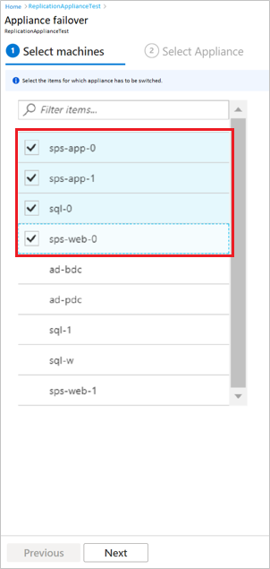

# Switch replication appliance

>[!NOTE]
> The information in this article applies to Azure Site Recovery - Preview.

You need to [create and deploy an on-premises replication appliance](deploy-vmware-azure-replication-appliance-preview.md) when you use [Azure Site Recovery](site-recovery-overview.md) for disaster recovery of VMware VMs and physical servers to Azure.

For detailed information about replication appliance, see [the architecture](vmware-azure-architecture-preview.md).

You create multiple replication appliances based on the capacity your organization needs.

This article provides information about how you can switch between replication appliances when a replication appliance fails.

## Failover/switch a replication appliance

You can switch replication appliance in multiple scenarios:

You want to switch appliance in case your current replication appliance has failed.

or  you want to switch the replication appliance due to some internal Org level requirements.

As an example, here is the scenario where replication appliance 1 (RP1) has failed and you want to move the protected workloads to replication appliance 2 (RP2), which is in healthy state.

or workloads under RA1 are to be moved to RA2 for any org level management requirement.

Follow these steps.

1. Go to **Site Recovery infrastructure** blade and select **ASR replication appliance**.

The list of available appliances and their health is displayed. You find RA2 is healthy and you need to  failover/switch  the workloads from RA1 to RA2.

2. Select the replication appliance (RA1) and select  **Switch appliance**.

  << writer's comment - the screenshot reads as **Appliance failover** any changes in the UI or UI text here? >>

3. Under  **Select machines**- select the applications/machines from the list which you want to failover to another replication appliance (RA2). Select **Next**.

  

4. Under **Select appliance** page, for each of the selected appliances (in earlier page), select the replication appliance.  

  << writer's comment - Here the screen displays the other tab as **Select machine** in previous screen, it was **machines** >>

  

  >[!NOTE]
  > In case of a failover, You will be prompted to select the account credentials for all the selected machines, as the previous appliance has failed.

5. Select **Switch application**.

  Once the resync is complete, the replication status turns healthy for the VMs that are moved to a new appliance.

## Next steps
Set up disaster recovery of [VMware VMs](vmware-azure-tutorial.md) to Azure.
