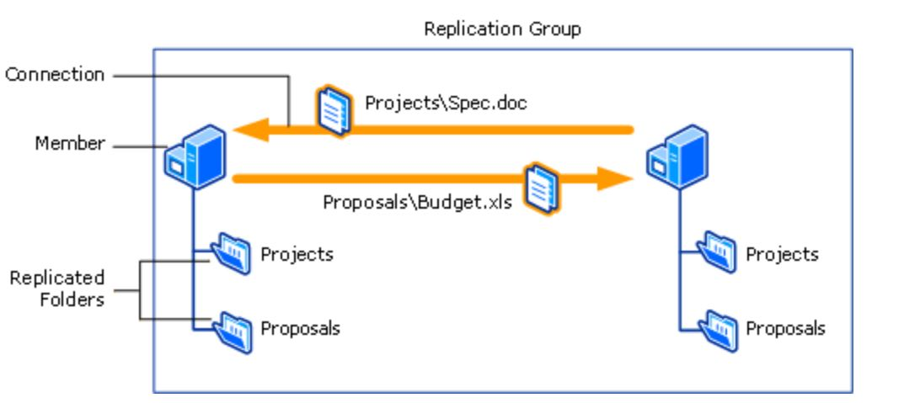
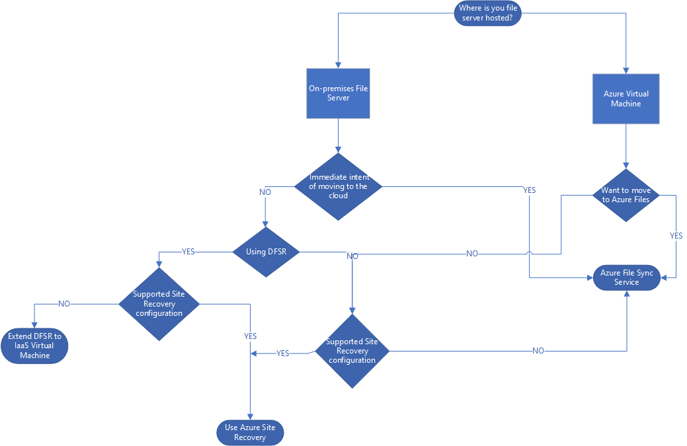

# Protect a file server by using Azure Site Recovery 

[Azure Site Recovery](site-recovery-overview.md) contributes to your business continuity and disaster recovery (BCDR) strategy by keeping your business apps up and running during planned and unplanned outages. Site Recovery manages and orchestrates disaster recovery of on-premises machines and Azure virtual machines (VMs). Disaster recovery includes replication, failover, and recovery of various workloads.

This article describes how to protect a file server by using Site Recovery and makes other recommendations to suit various environments. 

- [Replicate Azure IaaS file server machines](#disaster-recovery-recommendation-for-azure-iaas-virtual-machines)
- [Replicate an on-premises file server by using Site Recovery](#replicate-an-on-premises-file-server-by-using-site-recovery)

## File server architecture
The aim of an open distributed file-sharing system is to provide an environment where a group of geographically distributed users can collaborate to work efficiently on files and be guaranteed that their integrity requirements are enforced. A typical on-premises file server ecosystem that supports a high number of concurrent users and a large number of content items uses Distributed File System Replication (DFSR) for replication scheduling and bandwidth throttling. 

DFSR uses a compression algorithm known as Remote Differential Compression (RDC) that can be used to efficiently update files over a limited-bandwidth network. It detects insertions, removals, and rearrangements of data in files. DFSR is enabled to replicate only the changed file blocks when files are updated. There are also file server environments, where daily backups are taken in non-peak timings, which cater to disaster needs. DFSR isn't implemented.

The following diagram illustrates the file server environment with DFSR implemented.
        

In the previous diagram, multiple file servers called members actively participate in replicating files across a replication group. The contents in the replicated folder are available to all the clients that send requests to either of the members, even if a member goes offline.

## Disaster recovery recommendations for file servers

* **Replicate a file server by using Site Recovery**: File servers can be replicated to Azure by using Site Recovery. When one or more on-premises file servers are inaccessible, the recovery VMs can be brought up in Azure. The VMs can then serve requests from clients, on-premises, provided there is site-to-site VPN connectivity and Active Directory is configured in Azure. You can use this method in the case of a DFSR-configured environment or a simple file server environment with no DFSR. 

* **Extend DFSR to an Azure IaaS VM**: In a clustered file server environment with DFSR implemented, you can extend the on-premises DFSR to Azure. An Azure VM is then enabled to perform the file server role. 

    * After the dependencies of site-to-site VPN connectivity and Active Directory are handled and DFSR is in place, when one or more on-premises file servers are inaccessible, clients can connect to the Azure VM, which serves the requests.

    * You can use this approach if your VMs have configurations that aren't supported by Site Recovery. An example is a shared cluster disk, which is sometimes commonly used in file server environments. DFSR also works well in low-bandwidth environments with medium churn rate. You need to consider the additional cost of having an Azure VM up and running all the time. 

* **Use Azure File Sync to replicate your files**: If you plan to use the cloud or already use an Azure VM, you can use Azure File Sync. Azure File Sync offers syncing of fully managed file shares in the cloud that are accessible via the industry-standard [Server Message Block](/windows/win32/fileio/microsoft-smb-protocol-and-cifs-protocol-overview) (SMB) protocol. Azure file shares can then be mounted concurrently by cloud or on-premises deployments of Windows, Linux, and macOS. 

The following diagram helps you determine what strategy to use for your file server environment.

### Factors to consider in your decisions about disaster recovery to Azure

|Environment  |Recommendation  |Points to consider |
|---------|---------|---------|
|File server environment with or without DFSR|   [Use Site Recovery for replication](#replicate-an-on-premises-file-server-by-using-site-recovery)   |    Site Recovery doesn't support shared disk clusters or network attached storage (NAS). If your environment uses these configurations, use any of the other approaches, as appropriate.   Site Recovery doesn't support SMB 3.0. The replicated VM incorporates changes only when changes made to the files are updated in the original location of the files.   Site Recovery offers a near-synchronous data replication process, and hence in  the event of an unplanned failover scenario, there could be potential  data loss, and might create  USN mismatch issues.
|File server environment with DFSR     |  [Extend DFSR to an Azure IaaS virtual machine](#extend-dfsr-to-an-azure-iaas-virtual-machine)  |    DFSR works well in extremely bandwidth-crunched environments. This approach requires an Azure VM that is up and running all the time. You need to account for the cost of the VM in your planning.         |
|Azure IaaS VM     |     File Sync    |     If you use File Sync in a disaster recovery scenario, during failover you must take manual actions to make sure that the file shares are accessible to the client machine in a transparent way. File Sync requires port 445 to be open from the client machine.     |

### Site Recovery support
Because Site Recovery replication is application agnostic, these recommendations are expected to hold true for the following scenarios.

| Source  |To a secondary site  |To Azure
|---------|---------|---------|
|Azure|  -|Yes|
|Hyper-V|  Yes  |Yes
|VMware  |Yes|  Yes
|Physical server|  Yes  |Yes
 

> [!IMPORTANT]
> Before you continue with any of the following three approaches, make sure that these dependencies are taken care of.

**Site-to-site connectivity**: A direct connection between the on-premises site and the Azure network must be established to allow communication between servers. Use a secure site-to-site VPN connection to an Azure virtual network that is used as the disaster recovery site. For more information, see [Establish a site-to-site VPN connection between an on-premises site and an Azure virtual network](../vpn-gateway/tutorial-site-to-site-portal.md).

**Active Directory**: DFSR depends on Active Directory. This means that the Active Directory forest with local domain controllers is extended to the disaster recovery site in Azure. Even if you aren't using DFSR, if the intended users need to be granted access or verified for access, you must take these steps. For more information, see [Extend on-premises Active Directory to Azure](./site-recovery-active-directory.md).

## Disaster recovery recommendation for Azure IaaS virtual machines

If you're configuring and managing disaster recovery of file servers hosted on Azure IaaS VMs, you can choose between two options, based on whether you want to move to [Azure Files](../storage/files/storage-files-introduction.md):

* [Use File Sync](#use-file-sync-to-replicate-files-hosted-on-an-iaas-virtual-machine)
* [Use Site Recovery](#replicate-an-iaas-file-server-virtual-machine-by-using-site-recovery)

## Use File Sync to replicate files hosted on an IaaS virtual machine

Azure Files can be used to completely replace or supplement traditional on-premises file servers or NAS devices. Azure file shares also can be replicated with File Sync to Windows servers, either on-premises or in the cloud, for performance and distributed caching of the data where it's used. The following steps describe the disaster recovery recommendation for Azure VMs that perform the same functionality as traditional file servers:
* Protect machines by using Site Recovery. Follow the steps in [Replicate an Azure VM to another Azure region](azure-to-azure-quickstart.md).
* Use File Sync to replicate files from the VM that acts as the file server to the cloud.
* Use the Site Recovery [recovery plan](site-recovery-create-recovery-plans.md) feature to add scripts to [mount the Azure file share](../storage/files/storage-how-to-use-files-windows.md) and access the share in your virtual machine.

The following steps briefly describe how to use File Sync:

1. [Create a storage account in Azure](../storage/common/storage-account-create.md?toc=/azure/storage/files/toc.json). If you chose read-access geo-redundant storage for your storage accounts, you get read access to your data from the secondary region in case of a disaster. For more information, see [Disaster recovery and storage account failover](../storage/common/storage-disaster-recovery-guidance.md?toc=%2fazure%2fstorage%2ffiless%2ftoc.json).
2. [Create a file share](../storage/files/storage-how-to-create-file-share.md).
3. [Start File Sync](../storage/file-sync/file-sync-deployment-guide.md) on your Azure file server.
4. Create a sync group. Endpoints within a sync group are kept in sync with each other. A sync group must contain at least one cloud endpoint, which represents an Azure file share. A sync group also must contain one server endpoint, which represents a path on a Windows server.
5. Your files are now kept in sync across your Azure file share and your on-premises server.
6. In the event of a disaster in your on-premises environment, perform a failover by using a [recovery plan](site-recovery-create-recovery-plans.md). Add the script to [mount the Azure file share](../storage/files/storage-how-to-use-files-windows.md) and access the share in your virtual machine.

### Replicate an IaaS file server virtual machine by using Site Recovery

If you have on-premises clients that access the IaaS file server virtual machine, take all the following steps. Otherwise, skip to step 3.

1. Establish a site-to-site VPN connection between the on-premises site and the Azure network.
2. Extend on-premises Active Directory.
3. [Set up disaster recovery](azure-to-azure-tutorial-enable-replication.md) for the IaaS file server machine to a secondary region.

For more information on disaster recovery to a secondary region, see [this article](./azure-to-azure-architecture.md).

## Replicate an on-premises file server by using Site Recovery

The following steps describe replication for a VMware VM. For steps to replicate a Hyper-V VM, see [this tutorial](./hyper-v-azure-tutorial.md).

1. [Prepare Azure resources](tutorial-prepare-azure.md) for replication of on-premises machines.
2. Establish a site-to-site VPN connection between the on-premises site and the Azure network. 
3. Extend on-premises Active Directory.
4. [Prepare on-premises VMware servers](./vmware-azure-tutorial-prepare-on-premises.md).
5. [Set up disaster recovery](./vmware-azure-tutorial.md) to Azure for on-premises VMs.

## Extend DFSR to an Azure IaaS virtual machine

1. Establish a site-to-site VPN connection between the on-premises site and the Azure network. 
2. Extend on-premises Active Directory.
3. [Create and provision a file server VM](../virtual-machines/windows/quick-create-portal.md?toc=%2Fazure%2Fvirtual-machines%2Fwindows%2Ftoc.json) on the Azure virtual network.
Make sure that the virtual machine is added to the same Azure virtual network, which has cross-connectivity with the on-premises environment. 
4. Install and [configure DFSR](https://techcommunity.microsoft.com/t5/storage-at-microsoft/dfs-replication-initial-sync-in-windows-server-2012-r2-attack-of/ba-p/424877) on Windows Server.
5. [Implement a DFS namespace](/windows-server/storage/dfs-namespaces/deploying-dfs-namespaces).
6. With the DFS namespace implemented, failover of shared folders from production to disaster recovery sites can be done by updating the DFS namespace folder targets. After these DFS namespace changes replicate via Active Directory, users are connected to the appropriate folder targets transparently.

## Use File Sync to replicate your on-premises files
You can use File Sync to replicate files to the cloud. In the event of a disaster and the unavailability of your on-premises file server, you can mount the desired file locations from the cloud and continue to service requests from client machines.
To integrate File Sync with Site Recovery:

* Protect the file server machines by using Site Recovery. Follow the steps in [this tutorial](./vmware-azure-tutorial.md).
* Use File Sync to replicate files from the machine that serves as a file server to the cloud.
* Use the recovery plan feature in Site Recovery to add scripts to mount the Azure file share on the failed-over file server VM in Azure.

Follow these steps to use File Sync:

1. [Create a storage account in Azure](../storage/common/storage-account-create.md?toc=/azure/storage/files/toc.json). If you chose read-access geo-redundant storage (recommended) for your storage accounts, you have read access to your data from the secondary region in case of a disaster. For more information, see [Disaster recovery and storage account failover](../storage/common/storage-disaster-recovery-guidance.md?toc=%2fazure%2fstorage%2ffiless%2ftoc.json)..
2. [Create a file share](../storage/files/storage-how-to-create-file-share.md).
3. [Deploy File Sync](../storage/file-sync/file-sync-deployment-guide.md) in your on-premises file server.
4. Create a sync group. Endpoints within a sync group are kept in sync with each other. A sync group must contain at least one cloud endpoint, which represents an Azure file share. The sync group also must contain one server endpoint, which represents a path on the on-premises Windows server.
5. Your files are now kept in sync across your Azure file share and your on-premises server.
6. In the event of a disaster in your on-premises environment, perform a failover by using a [recovery plan](site-recovery-create-recovery-plans.md). Add the script to mount the Azure file share and access the share in your virtual machine.

> [!NOTE]
> Make sure that port 445 is open. Azure Files uses the SMB protocol. SMB communicates over TCP port 445. Check to see if your firewall isn't blocking TCP port 445 from a client machine.

## Do a test failover

1. Go to the Azure portal, and select your Recovery Service vault.
2. Select the recovery plan created for the file server environment.
3. Select **Test Failover**.
4. Select the recovery point and the Azure virtual network to start the test failover process.
5. After the secondary environment is up, perform your validations.
6. After the validations are finished, select **Cleanup test failover** on the recovery plan, and the test failover environment is cleaned.

For more information on how to perform a test failover, see [Test failover to Site Recovery](site-recovery-test-failover-to-azure.md).

For guidance on doing test failover for Active Directory and DNS, see [Test failover considerations for Active Directory and DNS](site-recovery-active-directory.md).

## Do a failover

1. Go to the Azure portal, and select your Recovery Services vault.
2. Select the recovery plan created for the file server environment.
3. Select **Failover**.
4. Select the recovery point to start the failover process.

For more information on how to perform a failover, see [Failover in Site Recovery](site-recovery-failover.md).