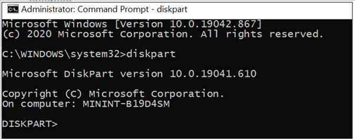
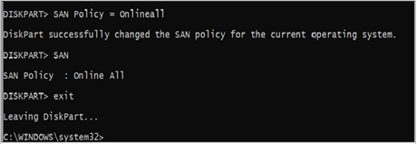
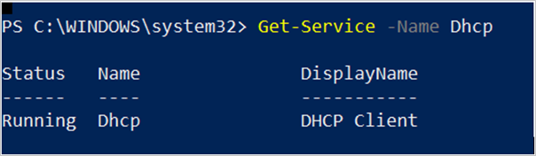
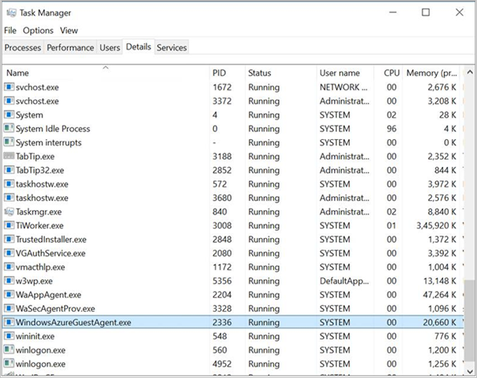

# Prepare on-premises disks for Azure through hydration

Some on-premises virtual machines (VMs) require configuration changes before they can start and connect in Azure. Azure Site Recovery can make these changes through the *hydration* process during test, planned, or unplanned failover. Hydration applies only to eligible Hyper-V-to-Azure and VMware-to-Azure protected machines and supported operating system versions. Other replication paths that are already prepared for Azure don't use a temporary hydration VM.

Whether hydration is required depends on the selected recovery point and the source and target VM configuration. If an unsupported operating system isn't prepared before failover, the recovered VM might not boot or have network connectivity.

## How hydration works

1. Site Recovery resolves the selected recovery point and prepares target copies of the disks represented in that recovery point. Depending on the replication method, this preparation can include copying and validating virtual hard disks and creating managed disks. A disk added after the selected recovery point isn't included when you fail over to that older point.
1. Site Recovery creates a temporary helper VM and attaches the prepared source disks as data disks. For Windows, the source OS disk is normally attached. For Linux, all protected disks in the selected recovery point are normally attached.
1. Site Recovery runs the required operating system preparation on the attached disks.
1. Site Recovery detaches the prepared disks and attempts to remove the temporary resources.
1. Site Recovery creates the final recovered VM by using the prepared disks. The helper VM is temporary and is never converted into the recovered VM.

To host the helper VM, Site Recovery can create a network interface, virtual network, subnet, and network security group in your subscription. If Azure Policy prevents creation of these network resources, Site Recovery attempts to use the target virtual network and subnet configured for replication. The virtual network must allow outbound access to the Storage service tag for the target region. For more information, see [Available service tags](../virtual-network/service-tags-overview.md#available-service-tags).

Temporary helper VMs and temporary image disks use platform-managed encryption and don't support customer-managed keys (CMKs). This limitation applies only to temporary hydration artifacts. Validated Disk Encryption Set and CMK settings remain applicable to the final recovery disks.

For helper VM size requirements and selection behavior, see [Troubleshoot hydration](#troubleshoot-hydration).

## Changes performed during the hydration process

The preparation script executes the following changes based on the OS type of the source VM to be migrated. You can also use this section as a guide to manually prepare the VMs for failover for operating systems versions not supported for hydration.

# [Windows servers](#tab/windows)

1. **Discover and prepare the Windows OS volume**.

   Before performing relevant configuration changes, the preparation script will validate if the correct OS disk was selected for failover. The preparation script will look through all the attached volumes visible to the system and look for the SYSTEM registry hive file path to find the source OS volume.

   The following actions are performed in this step:
   - Mounts each partition on the OS disk attached to the temporary VM.

   - Looks for \Windows\System32\Config\System registry files after mounting the partition.
   - If the files aren't found, the partition is unmounted, and the search continues for the correct partition.
   - If the files aren't present on any of the partitions, it could indicate that an incorrect OS disk was selected, or the OS disk is corrupted. Azure Site Recovery will fail the failover process with an appropriate error.

   >[!NOTE]
   >This step isn't relevant if you’re manually preparing the servers for failover.

1. **Make boot and connectivity related changes**.

   After the source OS volume files are detected, the preparation script will load the SYSTEM registry hive into the registry editor of the temporary Azure VM and perform the following changes to ensure VM boot up and connectivity. You need to configure these settings manually if the OS version isn't supported for hydration.

   1. **Validate the presence of the required drivers**.

      Ensure if the required drivers are installed and are set to load at **boot start**. These Windows drivers allow the server to communicate with the hardware and other connected devices.

      - IntelIde.sys
      - Atapi
      - Storflt
      - Storvsc
      - VMbus

   1. **Set storage area network (SAN) policy to Online All**.

      This ensures that the Windows volumes in the Azure VM use the same drive letter assignments as the on-premises VM. By default, Azure VMs are assigned drive D: to use as temporary storage. This drive assignment causes all other attached storage drive assignments to increment by one letter. To prevent this automatic assignment, and to ensure that Azure assigns the next free drive letter to its temporary volume, set the storage area network (SAN) policy to Online All.

      To manually configure this setting:

      - On the on-premises server, open the command prompt with elevated privileges and enter **diskpart**.

        

      - Enter SAN. If the drive letter of the guest operating system isn't maintained, Offline All or Offline Shared is returned.

      - At the DISKPART prompt, enter SAN Policy=OnlineAll. This setting ensures that disks are brought online, and that you can read and write to both disks.

        

1. **Set the DHCP start type**.

   The preparation script will also set the DHCP service start type as Automatic. This will enable the migrated VM to obtain an IP address and establish connectivity post-failover. Make sure the DHCP service is configured, and the status is running.

    

   To edit the DHCP startup settings manually, run the following example in Windows PowerShell:

   ```powershell
   Get-Service -Name Dhcp
   Where-Object StartType -ne Automatic
   Set-Service -StartupType Automatic
   ```

1. **Disable VMware Tools**.

   Make “VMware Tools” service start-type to disabled if it exists as they aren't required for the VM in Azure.

   >[!NOTE]
   >To connect to Windows Server 2003 VMs, Hyper-V Integration Services must be installed on the Azure VM. Windows Server 2003 machines don't have this installed by default. See this [article](/azure/migrate/prepare-windows-server-2003-migration?view=migrate-classic&preserve-view=true) to install and prepare for failover.

1. **Install the Windows Azure Guest Agent**.

[!INCLUDE [end-of-support-notes-windows-server-2008-2012.md](./includes/end-of-support-notes-windows-server-2008-2012.md)]

   Azure Site Recovery will attempt to install the Microsoft Azure Virtual Machine Agent (VM Agent), a secure, lightweight process that manages virtual machine (VM) interaction with the Azure Fabric Controller. The VM Agent has a primary role in enabling and executing Azure virtual machine extensions that enable post-deployment configuration of VM, such as installing and configuring software. Azure Site Recovery automatically installs the Windows VM agent on Windows Server 2008 R2 and higher versions.

   The Windows VM agent can be manually installed with a Windows installer package. To manually install the Windows VM Agent, [download the VM Agent installer](https://go.microsoft.com/fwlink/?LinkID=394789). You can also search for a specific version in the [GitHub Windows IaaS VM Agent releases](https://github.com/Azure/WindowsVMAgent/releases). The VM Agent is supported on Windows Server 2008 (64 bit) and later.

   To check if the Azure VM Agent was successfully installed, open Task Manager, select the **Details** tab, and look for the process name *WindowsAzureGuestAgent.exe*. The presence of this process indicates that the VM agent is installed. You can also use [PowerShell to detect the VM agent.](/azure/virtual-machines/extensions/agent-windows#powershell)

   

   After the aforementioned changes are performed, the system partition will be unloaded. The VM is now ready for failover.
    [Learn more about the changes for Windows servers.](/azure/virtual-machines/windows/prepare-for-upload-vhd-image)

# [Linux servers](#tab/linux)

1. **Discover and mount Linux OS partitions**.

   Before performing relevant configuration changes, the preparation script will validate if the correct OS disk was selected for failover. The script will collect information on all partitions, their UUIDs, and mount points. The script will look through all these visible partitions to locate the /boot and /root partitions.

   The following actions are performed in this step:

   - Discover /root partition:
     - Mount each visible partition and look for etc/fstab.
      - If the fstab files aren't found, the partition is unmounted, and the search continues for the correct partition.
      - If the fstab files are found, read the fstab content to identify the root device and mount it as the base mount point.
   - Discover /boot and other system partitions:
     - Use fstab content to determine if /boot is a separate partition. If it’s a separate partition, then obtain the boot partition device name from the fstab content or look for the partition, which has the boot flag.
     - The script will proceed to discover and mount /boot, and other necessary partitions on “/mnt/azure_sms_root” to build the root filesystem tree required for chroot jail. Other necessary partitions include: /boot/grub/menu.lst, /boot/grub/grub.conf, /boot/grub2/grub.cfg, /boot/grub/grub.cfg, /boot/efi (for UEFI boot), /var, /lib, /etc, /usr, and others.

1. **Discover OS Version**.

   Once the root partition is discovered, the script will use the following files to determine the Linux Operating System distribution and version.

   - RHEL: etc/redhat-release
   - OL: etc/oracle-release
   - SLES: etc/SuSE-release
   - Ubuntu: etc/lsb-release
   - Debian: etc/debian_version

1. **Install Hyper-V Linux Integration Services and regenerate kernel image**.

   The next step is to inspect the kernel image and rebuild the Linux init image so, that it contains the necessary Hyper-V drivers (**hv_vmbus, hv_storvsc, hv_netvsc**) on the initial ramdisk. Rebuilding the init image ensures that the VM will boot in Azure.

   Azure runs on the Hyper-V hypervisor. So, Linux requires certain kernel modules to run in Azure. To prepare your Linux image, you need to rebuild the initrd so that at least the hv_vmbus and hv_storvsc kernel modules are available on the initial ramdisk. The mechanism for rebuilding the initrd or initramfs image may vary depending on the distribution. Consult your distribution's documentation or support for the proper procedure. Here's one example for rebuilding the initrd by using the mkinitrd utility:

   1. Find the list of kernels installed on the system (/lib/modules).
   1. For each module, inspect if the Hyper-V drivers are already included.
   1. If any of these drivers are missing, add the required drivers and regenerate the image for the corresponding kernel version.

      >[!NOTE]
      >This step may not apply to Ubuntu and Debian VMs as the Hyper-V drivers are built in by default. [Learn more about the changes.](/azure/virtual-machines/linux/create-upload-generic#install-kernel-modules-without-hyper-v)

      An illustrative example for rebuilding initrd:

      - Back up the existing initrd image.

       ```bash
        cd /boot
        sudo cp initrd-`uname -r`.img  initrd-`uname -r`.img.bak
       ```

      - Rebuild the initrd with the hv_vmbus and hv_storvsc kernel modules:

       ```bash
          sudo mkinitrd --preload=hv_storvsc --preload=hv_vmbus -v -f initrd-`uname -r`.img `uname -r`
       ```
   Most new versions of Linux distributions have this included by default. If not included, install manually for all versions except those called out, using the aforementioned steps.

1. **Enable Azure Serial Console logging**.

   The script will then make changes to enable Azure Serial Console logging. Enabling console logging helps with troubleshooting issues on the Azure VM. Learn more about Azure Serial Console for Linux [Azure Serial Console for Linux - Virtual Machines | Microsoft Docs](/troubleshoot/azure/virtual-machines/serial-console-linux).

   Modify the kernel boot line in GRUB or GRUB2 to include the following parameters, so that all console messages are sent to the first serial port. These messages can assist Azure support with debugging any issues.

   ```config
    console=ttyS0,115200n8 earlyprintk=ttyS0,115200 rootdelay=300
   ```

   We also recommend removing the following parameters if they exist.

   ```config
   rhgb quiet crashkernel=auto
   ```
    [Refer to this article](/azure/virtual-machines/linux/create-upload-generic#general-linux-system-requirements) for specific changes.

1. **Network changes for connectivity**.

   Based on the OS Version, the script will perform the required network changes for connectivity to the migrated VM. The changes include:

   1. Move (or remove) the udev rules to avoid generating static rules for the Ethernet interface. These rules cause problems when you clone a virtual machine in Azure.

      An illustrative example for RedHat servers:

      ```bash
         sudo ln -s /dev/null /etc/udev/rules.d/75-persistent-net-generator.rules
         sudo rm -f /etc/udev/rules.d/70-persistent-net.rules
      ```

   1. Remove Network Manager if necessary. Network Manager can interfere with the Azure Linux agent for a few OS versions. It's recommended to make these changes for servers running RedHat and Ubuntu distributions.

   1. Uninstall this package by running the following command:

      An illustrative example for RedHat servers:

      ```bash
         sudo rpm -e --nodeps NetworkManager
      ```

   1. Backup existing NIC settings and create eth0 NIC configuration file with DHCP settings. To do this, the script will create or edit the /etc/sysconfig/network-scripts/ifcfg-eth0 file, and add the following text:

      An illustrative example for RedHat servers:

      ```config
         DEVICE=eth0
         ONBOOT=yes
         BOOTPROTO=dhcp
         TYPE=Ethernet
         USERCTL=no
         PEERDNS=yes
         IPV6INIT=no
         PERSISTENT_DHCLIENT=yes
         NM_CONTROLLED=yes
      ```

   1. Reset etc/sysconfig/network file as follows:

      An illustrative example for RedHat servers:

      ```config
         NETWORKING=yes
         HOSTNAME=localhost.localdomain
      ```

1. **Fstab validation**.

    Azure Site Recovery will validate the entries of the fstab file and replace fstab entries with persistent volume identifiers, UUIDs wherever needed. This ensures the drive/partition name remains constant no matter the system it's attached to.

   - If the device name is a standard device name (say /dev/sdb1), then:
     - If it’s a root or boot partition, then it's replaced with UUID.
     - If the partition coexists with either the root or boot partition as standard partitions on the same disk, then it's replaced with UUID.
   - If the device name is UUID/LABEL/LV, then no changes will be done.
   - If it’s a network device (nfs, cifs, smbfs, and etc), then the script will comment the entry. To access it, you can uncomment the same and reboot your Azure VM.

1. **Install the Linux Azure Guest Agent**.

    Azure Site Recovery will attempt to install the Microsoft Azure Linux Agent (waagent), a secure, lightweight process that manages Linux & FreeBSD provisioning, and VM interaction with the Azure Fabric Controller.  [Learn more](/azure/virtual-machines/extensions/agent-linux) about the functionality enabled for Linux and FreeBSD IaaS deployments via the Linux agent.

    Review the list of [required packages](/azure/virtual-machines/extensions/agent-linux#requirements) to install Linux VM agent. Azure Site Recovery installs the Linux VM agent automatically for RHEL 9.x, 8.x/7.x/6.x, Ubuntu 14.04/16.04/18.04/19.04/19.10/20.04, SUSE 15 SP0/15 SP1/12, Debian 9/8/7, and Oracle 7/6 when using the agentless method of VMware failover. Follow these instructions to [install the Linux Agent manually](/azure/virtual-machines/extensions/agent-linux#installation) for other OS versions.

    You can use the command to verify the service status of the Azure Linux Agent to make sure it's running. The service name might be **walinuxagent** or **waagent**.
    Once the hydration changes are done, the script will unmount all the partitions mounted, deactivate volume groups, and then flush the devices.

   ```bash
      sudo vgchange -an <vg-name>
      sudo lockdev –flushbufs <disk-device-name>
   ```

   [Learn more on the changes for Linux servers.](/azure/virtual-machines/linux/create-upload-generic)

---

## Cleanup and validation

Site Recovery automatically attempts to detach the protected disks and remove service-created helper resources, such as the helper VM, network interface, helper OS disk, and temporary network resources that are no longer in use. Cleanup is best effort. A failed or canceled operation can leave temporary resources or target disks in the subscription, and the Site Recovery job records cleanup problems.

Helper-resource cleanup is separate from **Cleanup test failover**. After you validate a test failover, you must run **Cleanup test failover** to delete the customer-visible test VM and test environment.

Some hydration problems appear as warnings instead of stopping failover. Similarly, the final VM can be created while the job records a boot or post-provisioning warning. Before you commit a failover:

- Review all warnings and errors in the Site Recovery job.
- Verify the final VM's size, zone, availability configuration, and other placement settings. For retryable provisioning failures, Site Recovery can retry without an unsupported or overconstraining placement setting.
- Verify the VM power state, boot diagnostics, serial console, network connectivity, licensing, and workload-specific registration before commit.

## Troubleshoot hydration

### Helper VM size selection

Site Recovery first evaluates the configured final VM size for use by the temporary helper VM. The helper size can differ from the final recovered VM size. A suitable helper size must:

- Use a compatible x64 architecture, support generation 1, and be available to the subscription in the target region and zone.
- Have at least two active cores and 2 GiB of memory when a fallback size is selected.
- Support the number of source disks attached during hydration. The helper VM's own OS and resource disks don't count toward this data-disk limit. Hydration of more than 64 attached source disks isn't supported.
- Support Premium storage when required by the attached source disks.

Site Recovery doesn't select retired or unsupported VM families. These families include older A, D, F, G, L, and H families, confidential-computing families, and selected specialized or retired high-memory and accelerator sizes. These categories can change as Azure VM families retire. Site Recovery considers basic sizes only as a last-resort fallback.

If the configured final size isn't suitable, Site Recovery searches compatible sizes in the same family first, prioritizing sufficient disk capacity and then core count. It then searches the broader eligible pool. If no compatible helper size is available, the job returns `SkuNotAvailableForHydrationVM`.

For troubleshooting steps, see [Troubleshoot errors when failing over VMware VM or physical machine to Azure](site-recovery-failover-to-azure-troubleshoot.md#hydration-vm-size-and-allocation-failures).
