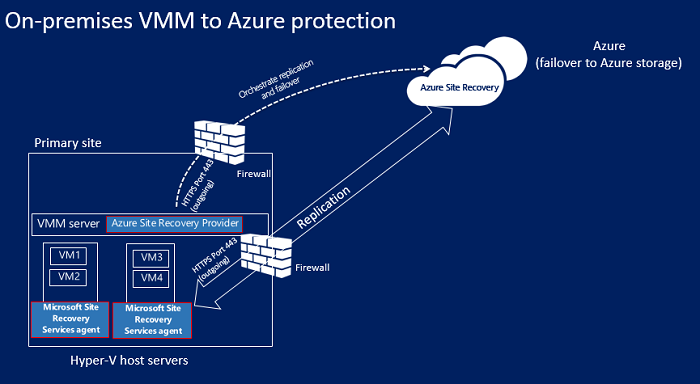
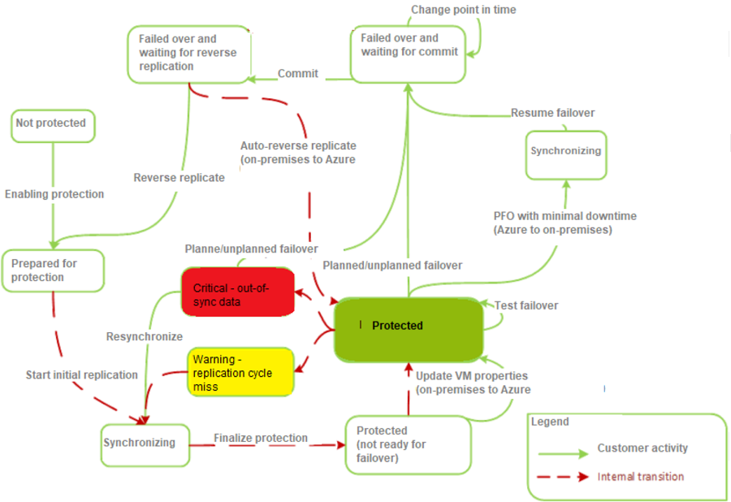
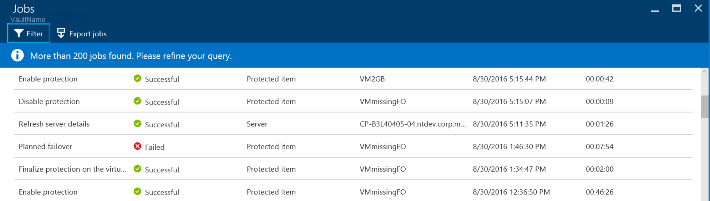
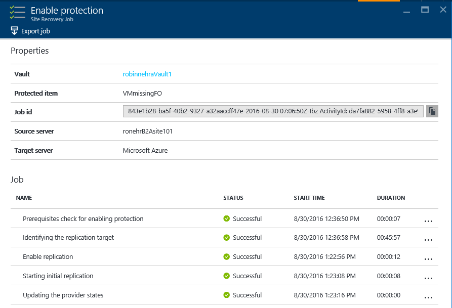

# Hyper-V to Azure disaster recovery architecture

This article describes the architecture and processes used when you replicate, fail over, and recover Hyper-V virtual machines (VMs) between on-premises Hyper-V hosts and Azure, using the [Azure Site Recovery](site-recovery-overview.md) service.

Hyper-V hosts can optionally be managed in System Center Virtual Machine Manager (VMM) private clouds.

## Architectural components - Hyper-V without VMM

The following table and graphic provide a high-level view of the components used for Hyper-V replication to Azure, when Hyper-V hosts aren't managed by VMM.

**Component** | **Requirement** | **Details**
--- | --- | ---
**Azure** | An Azure subscription, Azure storage account, and Azure network. | Replicated data from on-premises VM workloads is stored in the storage account. Azure VMs are created with the replicated workload data when failover from your on-premises site occurs.   The Azure VMs connect to the Azure virtual network when they're created.
**Hyper-V** | During Site Recovery deployment, you gather Hyper-V hosts and clusters into Hyper-V sites. You install the Azure Site Recovery Provider and Recovery Services agent on each standalone Hyper-V host, or on each Hyper-V cluster node. | The Provider orchestrates replication with Site Recovery over the internet. The Recovery Services agent handles data replication.   Communications from both the Provider and the agent are secure and encrypted. Replicated data in Azure storage is also encrypted.
**Hyper-V VMs** | One or more VMs running on Hyper-V. | Nothing needs to be explicitly installed on VMs.

**Hyper-V to Azure architecture (without VMM)**

## Architectural components - Hyper-V with VMM

The following table and graphic provide a high-level view of the components used for Hyper-V replication to Azure, when Hyper-V hosts are managed in VMM clouds.

**Component** | **Requirement** | **Details**
--- | --- | ---
**Azure** | An Azure subscription, Azure storage account, and Azure network. | Replicated data from on-premises VM workloads is stored in the storage account. Azure VMs are created with the replicated data when failover from your on-premises site occurs.   The Azure VMs connect to the Azure virtual network when they're created.
**VMM server** | The VMM server has one or more clouds containing Hyper-V hosts. | You install the Site Recovery Provider on the VMM server, to orchestrate replication with Site Recovery, and register the server in the Recovery Services vault.
**Hyper-V host** | One or more Hyper-V hosts/clusters managed by VMM. |  You install the Recovery Services agent on each Hyper-V host or cluster node.
**Hyper-V VMs** | One or VMs running on a Hyper-V host server. | Nothing needs to explicitly installed on VMs.
**Networking** | Logical and VM networks set up on the VMM server. The VM network should be linked to a logical network that's associated with the cloud. | VM networks are mapped to Azure virtual networks. When Azure VMs are created after failover, they are added to the Azure network that's mapped to the VM network.

**Hyper-V to Azure architecture (with VMM)**

## Replication process

**Replication and recovery process**

### Enable protection

1. After you enable protection for a Hyper-V VM, in the Azure portal or on-premises, the **Enable protection** starts.
2. The job checks that the machine complies with prerequisites, before invoking the [CreateReplicationRelationship](https://msdn.microsoft.com/library/hh850036.aspx), to set up replication with the settings you've configured.
3. The job starts initial replication by invoking the [StartReplication](https://msdn.microsoft.com/library/hh850303.aspx) method, to initialize a full VM replication, and send the VM's virtual disks to Azure.
4. You can monitor the job in the **Jobs** tab.
        
        

### Initial data replication

1. When initial replication is triggered, a [Hyper-V VM snapshot](https://technet.microsoft.com/library/dd560637.aspx) snapshot is taken.
2. Virtual hard disks on the VM are replicated one by one, until they're all copied to Azure. This might take a while, depending on the VM size, and network bandwidth. [Learn how](https://support.microsoft.com/kb/3056159) to increase network bandwidth.
3. If disk changes occur while initial replication is in progress, the Hyper-V Replica Replication Tracker tracks the changes as Hyper-V replication logs (.hrl). These log files are located in the same folder as the disks. Each disk has an associated .hrl file that's sent to secondary storage. The snapshot and log files consume disk resources while initial replication is in progress.
4. When the initial replication finishes, the VM snapshot is deleted.
5. Delta disk changes in the log are synchronized and merged to the parent disk.

### Finalize protection process

1. After the initial replication finishes, the **Finalize protection on the virtual machine** job runs. It configures network and other post-replication settings, so that the VM is protected.
2. At this stage you can check the VM settings to make sure that it's ready for failover. You can run a disaster recovery drill (test failover) for the VM, to check that it fails over as expected. 

## Delta replication

1. After the initial replication, delta replication begins, in accordance with the replication policy.
2. The Hyper-V Replica Replication Tracker tracks changes to a virtual hard disk as .hrl files. Each disk that's configured for replication has an associated .hrl file.
3. The log is sent to the customer's storage account. When a log is in transit to Azure, the changes in the primary disk are tracked in another log file, in the same folder.
4. During initial and delta replication, you can monitor the VM in the Azure portal.

### Resynchronization process

1. If delta replication fails, and a full replication would be costly in terms of bandwidth or time, then a VM is marked for resynchronization.
    - For example, if the .hrl files reach 50% of the disk size, then the VM will be marked for resynchronization.
    -  By default resynchronization is scheduled to run automatically outside office hours.
1.  Resynchronization sends delta data only.
    - It minimizes the amount of data sent by computing checksums of the source and target VMs.
    - It uses a fixed-block chunking algorithm where source and target files are divided into fixed chunks.
    - Checksums for each chunk are generated. These are compared to determine which blocks from the source need to be applied to the target.
2. After resynchronization finishes, normal delta replication should resume.
3. If you don't want to wait for default resynchronization outside hours, you can resynchronize a VM manually. For example, if an outage occurs. To do this, in the Azure portal, select the VM > **Resynchronize**.

    

### Retry process

If a replication error occurs, there's a built-in retry. Retry is classified as described in the table.

**Category** | **Details**
--- | ---
**Non-recoverable errors** | No retry is attempted. VM status will be **Critical**, and administrator intervention is required.   Examples of these errors include a broken VHD chain, an invalid state for the replica VM, network authentication errors, authorization errors, and VM not found errors (for standalone Hyper-V servers.
**Recoverable errors** | Retries occur every replication interval, using an exponential back-off that increases the retry interval from the start of the first attempt by 1, 2, 4, 8, and 10 minutes. If an error persists, retry every 30 minutes. Examples of these include network errors, low disk  errors, and low memory conditions.

## Failover and failback process

1. You can run a planned or unplanned failover from on-premises Hyper-V VMs to Azure. If you run a planned failover, then source VMs are shut down to ensure no data loss. Run an unplanned failover if your primary site isn't accessible.
2. You can fail over a single machine, or create recovery plans, to orchestrate failover of multiple machines.
3. You run a failover. After the first stage of failover completes, you should be able to see the created replica VMs in Azure. You can assign a public IP address to the VM if required.
4. You then commit the failover, to start accessing the workload from the replica Azure VM.

After your on-premises infrastructure is up and running again, you can fail back. Failback occurs in three stages:

1. Kick off a planned failover from Azure to the on-premises site:
    - **Minimize downtime**: If you use this option Site Recovery synchronizes data before failover. It checks for changed data blocks and downloads them to the on-premises site, while the Azure VM keeps running, minimizing downtime. When you manually specify that the failover should complete, the Azure VM is shut down, any final delta changes are copied, and the failover starts.
    - **Full download**: With this option data is synchronized during failover. This option downloads the entire disk. It's faster because no checksums are calculated, but there's more downtime. Use this option if you've been running the replica Azure VMs for some time, or if the on-premises VM was deleted.
    - **Create VM**: You can select to fail back to the same VM or to an alternate VM. You can specify that Site Recovery should create the VM if it doesn't already exist.

2. After initial synchronization finishes, you select to complete the failover. After it completes, you can log onto the on-premises VM to check everything's working as expected. In the Azure portal, you can see that the Azure VMs have been stopped.
3.  Then, you commit the failover to finish up, and start accessing the workload from the on-premises VM again.
4. After workloads have failed back, you enable reverse replication, so that the on-premises VMs replicate to Azure again.

## Next steps

Follow [this tutorial](tutorial-prepare-azure.md) to get started with Hyper-V to Azure replication.

