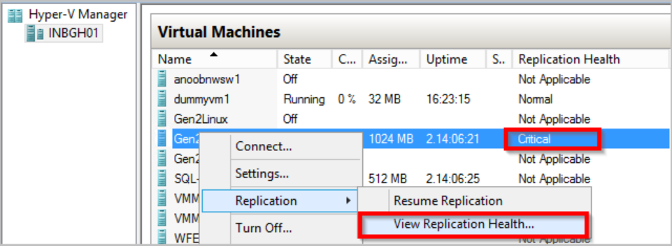
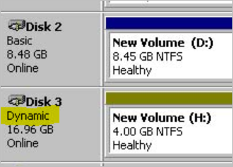
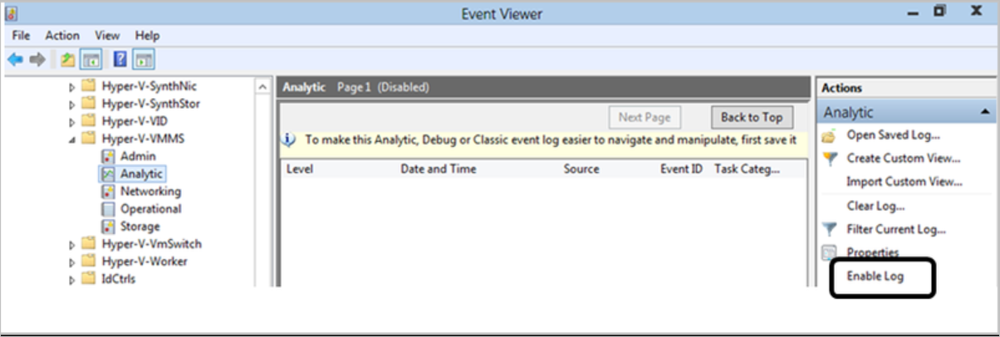

# Troubleshoot Hyper-V to Azure replication and failover

This article describes common issues that you might come across when replicating on-premises Hyper-V VMs to Azure, using [Azure Site Recovery](site-recovery-overview.md).

## Enable protection issues

If you experience issues when you enable protection for Hyper-V VMs, check the following recommendations:

1. Check that your Hyper-V hosts and VMs meet all [requirements and prerequisites](hyper-v-azure-support-matrix.md).
2. If Hyper-V servers are located in System Center Virtual Machine Manager (VMM) clouds, verify that you've prepared the [VMM server](hyper-v-prepare-on-premises-tutorial.md#prepare-vmm-optional).
3. Check that the Hyper-V Virtual Machine Management service is running on Hyper-V hosts.
4. Check for issues that appear in the Hyper-V-VMMS\Admin sign in to the VM. This log is located in **Applications and Services Logs** > **Microsoft** > **Windows**.
5. On the guest VM, verify that WMI is enabled and accessible.
  - [Learn about](https://blogs.technet.microsoft.com/askperf/2007/06/22/basic-wmi-testing/) basic WMI testing.
  - [Troubleshoot](https://aka.ms/WMiTshooting) WMI.
  - [Troubleshoot ](https://technet.microsoft.com/library/ff406382.aspx#H22) problems with WMI scripts and services.
6. On the guest VM, ensure that the latest version of Integration Services is running.
    - [Check](https://docs.microsoft.com/windows-server/virtualization/hyper-v/manage/manage-hyper-v-integration-services) that you have the latest version.
    - [Keep](https://docs.microsoft.com/windows-server/virtualization/hyper-v/manage/manage-hyper-v-integration-services#keep-integration-services-up-to-date) Integration Services up-to-date.
    
## Replication issues

Troubleshoot issues with initial and ongoing replication as follows:

1. Make sure you're running the [latest version](https://social.technet.microsoft.com/wiki/contents/articles/38544.azure-site-recovery-service-updates.aspx) of Site Recovery services.
2. Verify whether replication is paused:
  - Check the VM health status in the Hyper-V Manager console.
  - If it's critical, right-click the VM > **Replication** > **View Replication Health**.
  - If replication is paused, click **Resume Replication**.
3. Check that required services are running. If they aren't, restart them.
    - If you're replicating Hyper-V without VMM, check that these services are running on the Hyper-V host:
        - Virtual Machine Management service
        - Microsoft Azure Recovery Services Agent service
        - Microsoft Azure Site Recovery service
        - WMI Provider Host service
    - If you're replicating with VMM in the environment, check that these services are running:
        - On the Hyper-V host, check that the Virtual Machine Management service, the Microsoft Azure Recovery Services Agent, and the WMI Provider Host service are running.
        - On the VMM server, ensure that the System Center Virtual Machine Manager Service is running.
4. Check connectivity between the Hyper-V server and Azure. To check connectivity, open Task Manager on the Hyper V host. On the **Performance** tab, click **Open Resource Monitor**. On the **Network** tab > **Process with Network Activity**, check whether cbengine.exe is actively sending large volumes (Mbs) of data.
5. Check if the Hyper-V hosts can connect to the Azure storage blob URL. To check if the hosts can connect, select and check **cbengine.exe**. View **TCP Connections** to verify connectivity from the host to the Azure storage blob.
6. Check performance issues, as described below.
    
### Performance issues

Network bandwidth limitations can impact replication. Troubleshoot issues as follows:

1. [Check](https://support.microsoft.com/help/3056159/how-to-manage-on-premises-to-azure-protection-network-bandwidth-usage) if there are bandwidth or throttling constraints in your environment.
2. Run the [Deployment Planner profiler](hyper-v-deployment-planner-run.md).
3. After running the profiler, follow the [bandwidth](hyper-v-deployment-planner-analyze-report.md#recommendations-with-available-bandwidth-as-input) and [storage](hyper-v-deployment-planner-analyze-report.md#vm-storage-placement-recommendation) recommendations.
4. Check [data churn limitations](hyper-v-deployment-planner-analyze-report.md#azure-site-recovery-limits). If you see high data churn on a VM, do the following:
  - Check if your VM is marked for resynchronization.
  - Follow [these steps](https://blogs.technet.microsoft.com/virtualization/2014/02/02/hyper-v-replica-debugging-why-are-very-large-log-files-generated/) to investigate the source of the churn.
  - Churn can occur when the HRL log files exceed 50% of the available disk space. If this is the issue, provision more storage space for all VMs on which the issue occurs.
  - Check that replication isn't paused. If it is, it continues writing the changes to the hrl file, which can contribute to its increased size.
 

## Critical replication state issues

1. To check replication health, connect to the on-premises Hyper-V Manager console, select the VM, and verify health.

    
    

2. Click **View Replication Health** to see the details:

    - If replication is paused, right-click the VM > **Replication** > **Resume replication**.
    - If a VM on a Hyper-V host configured in Site Recovery migrates to a different Hyper-V host in the same cluster, or to a standalone machine, replication for the VM isn't impacted. Just check that the new Hyper-V host meets all prerequisites, and is configured in Site Recovery.

## App-consistent snapshot issues

An app-consistent snapshot is a point-in-time snapshot of the application data inside the VM. Volume Shadow Copy Service (VSS) ensures that apps on the VM are in a consistent state when the snapshot is taken.  This section details some common issues you might experience.

### VSS failing inside the VM

1. Check that the latest version of Integration services is installed and running.  Check if an update is available by running the following command from an elevated PowerShell prompt on the Hyper-V host: **get-vm  | select Name, State, IntegrationServicesState**.
2. Check that VSS services are running and healthy:
    - To check the services, sign in to the guest VM. Then open an admin command prompt, and run the following commands to check whether all the VSS writers are healthy.
        - **Vssadmin list writers**
        - **Vssadmin list shadows**
        - **Vssadmin list providers**
    - Check the output. If writers are in a failed state, do the following:
        - Check the application event log on the VM for VSS operation errors.
    - Try restarting these services associated with the failed writer:
        - Volume Shadow Copy
         - Azure Site Recovery VSS Provider
    - After you do this, wait for a couple of hours to see if app-consistent snapshots are generated successfully.
    - As a last resort try rebooting the VM. This might resolve services that are in unresponsive state.
3. Check you don't have dynamic disks in the VM. THis isn't supported for app-consistent snapshots. You can check in Disk Management (diskmgmt.msc).

    
    
4. Check that you don't have an iSCSI disk attached to the VM. This isn't supported.
5. Check that the Backup service is enabled. Verify that it is enabled in **Hyper-V settings** > **Integration Services**.
6. Make sure there are no conflicts with apps taking VSS snapshots. If multiple apps are trying to take VSS snapshots at the same time conflicts can occur. For example, if a Backup app is taking VSS snapshots when Site Recovery is scheduled by your replication policy to take a snapshot.   
7. Check if the VM is experiencing a high churn rate:
    - You can measure the daily data change rate for the guest VMs, using performance counters on Hyper-V host. To measure the data change rate, enable the following counter. Aggregrate a sample of this value across the VM disks for 5-15 minutes, to get the VM churn.
        - Category: “Hyper-V Virtual Storage Device”
        - Counter: “Write Bytes / Sec” 
        - This data churn rate will increase or remain at a high level, depending on how busy the VM or its apps are.
        - The average source disk data churn is 2 MB/s for standard storage for Site Recovery. [Learn more](hyper-v-deployment-planner-analyze-report.md#azure-site-recovery-limits)
    - In addition you can [verify storage scalability targets](https://docs.microsoft.com/azure/storage/common/storage-scalability-targets#scalability-targets-for-a-storage-account).
8. Run the [Deployment Planner](hyper-v-deployment-planner-run.md).
9. Review the recommendations for [network](hyper-v-deployment-planner-analyze-report.md#recommendations-with-available-bandwidth-as-input) and [storage](hyper-v-deployment-planner-analyze-report.md#recommendations-with-available-bandwidth-as-input).

### VSS failing inside the Hyper-V Host

1. Check event logs for VSS errors and recommendations:
    - On the Hyper-V host server, open the Hyper-V Admin event log in **Event Viewer** > **Applications and Services Logs** > **Microsoft** > **Windows** > **Hyper-V** > **Admin**.
    - Verify whether there are any events that indicate app-consistent snapshot failures.
    - A typical error is: "Hyper-V failed to generate VSS snapshot set for virtual machine 'XYZ': The writer experienced a non-transient error. Restarting the VSS service might resolve issues if the service is unresponsive."

2. To generate VSS snapshots for the VM, check that Hyper-V Integration Services are installed on the VM, and that the Backup (VSS) Integration Service is enabled.
    - Ensure that the Integration Services VSS service/daemons are running on the guest, and are in an **OK** state.
    - You can check this from an elevated PowerShell session on the Hyper-V host with command **et-VMIntegrationService -VMName<VMName>-Name VSS** You can also get this information by logging into the guest VM. [Learn more](https://docs.microsoft.com/windows-server/virtualization/hyper-v/manage/manage-hyper-v-integration-services).
    - Ensure that the Backup/VSS integration Services on the VM are running and in healthy state. If not, restart these services, and the Hyper-V Volume Shadow Copy requestor service on the Hyper-V host server.

### Common errors

**Error code** | **Message** | **Details**
--- | --- | ---
**0x800700EA** | "Hyper-V failed to generate VSS snapshot set for virtual machine: More data is available. (0x800700EA). VSS snapshot set generation can fail if backup operation is in progress.   Replication operation for virtual machine failed: More data is available." | Check if your VM has dynamic disk enabled. This isn't supported.
**0x80070032** | "Hyper-V Volume Shadow Copy Requestor failed to connect to virtual machine <./VMname> because the version does not match the version expected by Hyper-V | Check if the latest Windows updates are installed.   [Upgrade](https://docs.microsoft.com/windows-server/virtualization/hyper-v/manage/manage-hyper-v-integration-services#keep-integration-services-up-to-date) to the latest version of Integration Services.

## Collect replication logs

All Hyper-V replication event are logged in the Hyper-V-VMMS\Admin log, located in **Applications and Services Logs** > **Microsoft** > **Windows**. In addition, you can enable an Analytic log for the Hyper-V Virtual Machine Management Service, as follows:

1. Make the Analytic and Debug logs viewable in the Event Viewer. To make the logs available, in the Event Viewer, click **View** > **Show Analytic and Debug Logs.**. The Analytic log appears under **Hyper-V-VMMS**.
2. In the **Actions** pane, click **Enable Log**. 

    
    
3. After it's enabled, it appears in **Performance Monitor**, as an **Event Trace Session** under **Data Collector Sets**. 
4. To view the collected information, stop the tracing session by disabling the log. Then save the log, and open it again in Event Viewer, or use other tools to convert it as required.

### Event log locations

**Event log** | **Details** |
--- | ---
**Applications and Service Logs/Microsoft/VirtualMachineManager/Server/Admin** (VMM server) | Logs to troubleshoot VMM issues.
**Applications and Service Logs/MicrosoftAzureRecoveryServices/Replication** (Hyper-V host) | Logs to troubleshoot Microsoft Azure Recovery Services Agent issues. 
**Applications and Service Logs/Microsoft/Azure Site Recovery/Provider/Operational** (Hyper-V host)| Logs to troubleshoot Microsoft Azure Site Recovery Service issues.
**Applications and Service Logs/Microsoft/Windows/Hyper-V-VMMS/Admin** (Hyper-V host) | Logs to troubleshoot Hyper-V VM management issues.

### Log collection for advanced troubleshooting

These tools can help with advanced troubleshooting:

-	For VMM, perform Site Recovery log collection using the [Support Diagnostics Platform (SDP) tool](http://social.technet.microsoft.com/wiki/contents/articles/28198.asr-data-collection-and-analysis-using-the-vmm-support-diagnostics-platform-sdp-tool.aspx).
-	For Hyper-V without VMM, [download this tool](https://dcupload.microsoft.com/tools/win7files/DIAG_ASRHyperV_global.DiagCab), and run it on the Hyper-V host to collect the logs.

