# Analyze the Azure Site Recovery Deployment Planner report
This article discusses the sheets contained in the Excel report generated by Azure Site Recovery Deployment Planner for a Hyper-V to Azure scenario.

## On-premises summary
The on-premises summary worksheet provides an overview of the profiled Hyper-V environment.

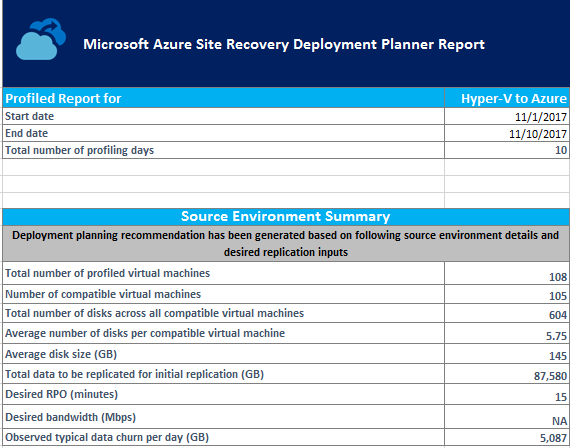

**Start date** and **End date**: The start and end dates of the profiling data considered for report generation. By default, the start date is the date when profiling starts, and the end date is the date when profiling stops. This information can be the "StartDate" and "EndDate" values if the report is generated with these parameters.

**Total number of profiling days**: The total number of days of profiling between the start and end dates for which the report is generated.

**Number of compatible virtual machines**: The total number of compatible VMs for which the required network bandwidth, required number of storage accounts, and Azure cores are calculated.

**Total number of disks across all compatible virtual machines**: The total number of disks across all compatible VMs.

**Average number of disks per compatible virtual machine**: The average number of disks calculated across all compatible VMs.

**Average disk size (GB)**: The average disk size calculated across all compatible VMs.

**Desired RPO (minutes)**: Either the default recovery point objective or the value passed for the "DesiredRPO" parameter at the time of report generation to estimate required bandwidth.

**Desired bandwidth (Mbps)**: The value that you passed for the "Bandwidth" parameter at the time of report generation to estimate achievable recovery point objective (RPO).

**Observed typical data churn per day (GB)**: The average data churn observed across all profiling days.

## Recommendations 
The recommendations sheet of the Hyper-V to Azure report has the following details as per the selected desired RPO:

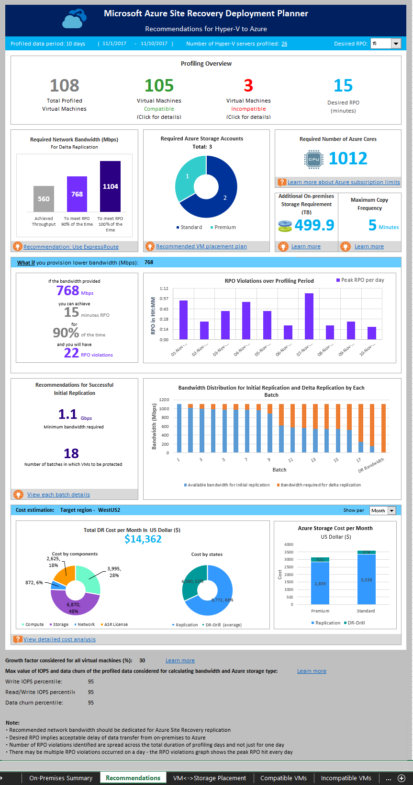

### Profile data

**Profiled data period**: The period during which the profiling was run. By default, the tool includes all profiled data in the calculation. If you used the StartDate and EndDate option in report generation, it generates the report for the specific period. 

**Number of Hyper-V servers profiled**: The number of Hyper-V servers whose VMs' report is generated. Select the number to view the name of the Hyper-V servers. The On-premises Storage Requirement sheet opens to show all the servers along with their storage requirements. 

**Desired RPO**: The recovery point objective for your deployment. By default, the required network bandwidth is calculated for RPO values of 15, 30, and 60 minutes. Based on the selection, the affected values are updated on the sheet. If you used the DesiredRPOinMin parameter while generating the report, that value is shown in the Desired RPO result.

### Profiling overview
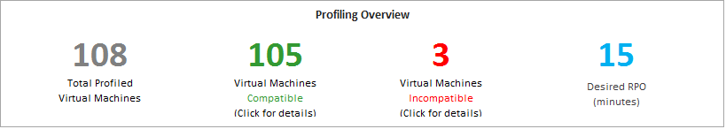

**Total Profiled Virtual Machines**: The total number of VMs whose profiled data is available. If the VMListFile has names of any VMs that weren't profiled, those VMs aren't considered in the report generation and are excluded from the total profiled VMs count.

**Compatible Virtual Machines**: The number of VMs that can be protected to Azure by using Azure Site Recovery. It's the total number of compatible VMs for which the required network bandwidth, number of storage accounts, and number of Azure cores are calculated. The details of every compatible VM are available in the "Compatible VMs" section.

**Incompatible Virtual Machines**: The number of profiled VMs that are incompatible for protection with Site Recovery. The reasons for incompatibility are noted in the "Incompatible VMs" section. If the VMListFile has names of any VMs that weren't profiled, those VMs are excluded from the incompatible VMs count. These VMs are listed as "Data not found" at the end of the "Incompatible VMs" section.

**Desired RPO**: Your desired recovery point objective, in minutes. The report is generated for three RPO values: 15 (default), 30, and 60 minutes. The bandwidth recommendation in the report is changed based on your selection in the **Desired RPO** drop-down list on the upper right of the sheet. If you generated the report by using the -DesiredRPO parameter with a custom value, this custom value shows as the default in the **Desired RPO** drop-down list.

### Required network bandwidth (Mbps)
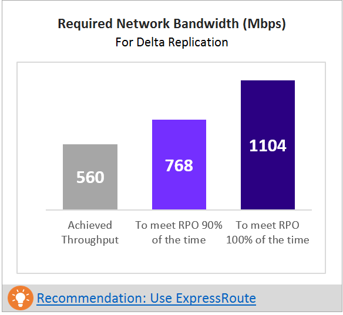

**To meet RPO 100% of the time**: The recommended bandwidth in Mbps to be allocated to meet your desired RPO 100 percent of the time. This amount of bandwidth must be dedicated for steady-state delta replication of all your compatible VMs to avoid any RPO violations.

**To meet RPO 90% of the time**: Perhaps because of broadband pricing or another reason you can't set the bandwidth needed to meet your desired RPO 100 percent of the time. If this is the case, you can use a lower bandwidth setting that can meet your desired RPO 90 percent of the time. To understand the implications of setting this lower bandwidth, the report provides a what-if analysis on the number and duration of RPO violations to expect.

**Achieved Throughput**: The throughput from the server on which you run the GetThroughput command to the Azure region where the storage account is located. This throughput number indicates the estimated level that you can achieve when you protect the compatible VMs by using Site Recovery. The Hyper-V server storage and network characteristics must remain the same as that of the server from which you run the tool.

For all enterprise Site Recovery deployments, we recommend that you use [ExpressRoute](https://aka.ms/expressroute).

### Required storage accounts
The following chart shows the total number of storage accounts (standard and premium) that are required to protect all the compatible VMs. To learn which storage account to use for each VM, see the "VM-storage placement" section.

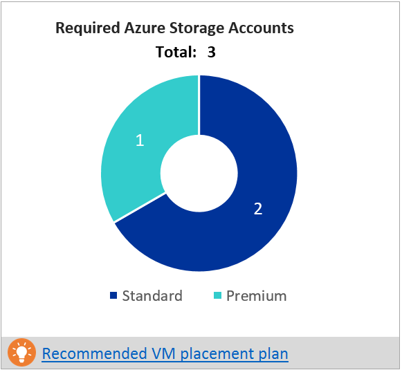

### Required number of Azure cores
This result is the total number of cores to be set up before failover or test failover of all the compatible VMs. If too few cores are available in the subscription, Site Recovery fails to create VMs at the time of test failover or failover.

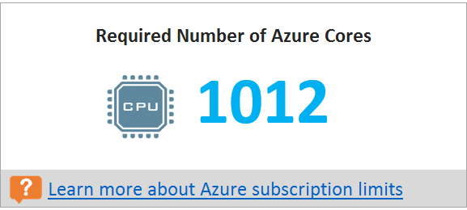

### Additional on-premises storage requirement

The total free storage required on Hyper-V servers for successful initial replication and delta replication to ensure that the VM replication doesn't cause any undesirable downtime for your production applications. More information on each volume requirement is available in [on-premises storage requirement](#on-premises-storage-requirement). 

To understand why free space is required for the replication, see the [On-premises storage requirement](#why-do-i-need-free-space-on-the-hyper-v-server-for-the-replication) section.

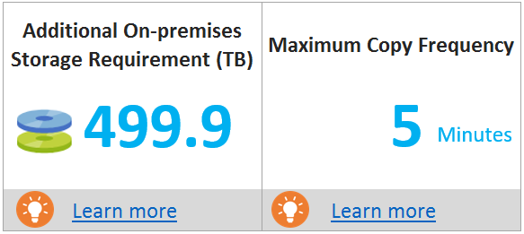

### Maximum copy frequency
The recommended maximum copy frequency must be set for the replication to achieve the desired RPO. Default is five minutes. You can set the copy frequency to 30 seconds to achieve better RPO.

### What-if analysis
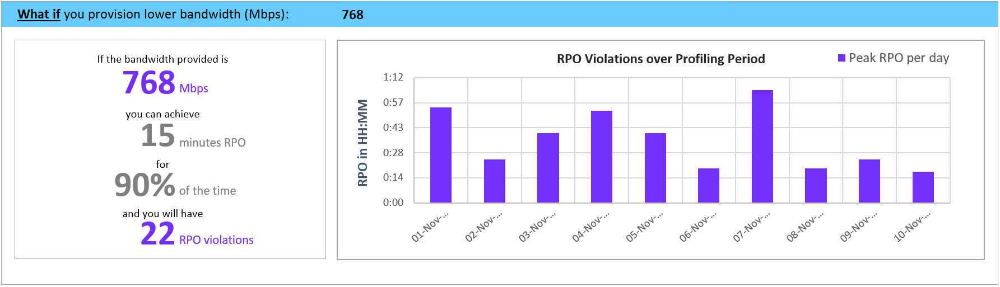
This analysis outlines how many violations might occur during the profiling period when you set a lower bandwidth for the desired RPO to be met only 90 percent of the time. One or more RPO violations can occur on any given day. The graph shows the peak RPO of the day. Based on this analysis, you can decide if the number of RPO violations across all days and peak RPO hit per day is acceptable with the specified lower bandwidth. If it's acceptable, you can allocate the lower bandwidth for replication. If it's unacceptable, allocate higher bandwidth as suggested to meet the desired RPO 100 percent of the time. 

### Recommendation for successful initial replication
This section discusses the number of batches in which the VMs are to be protected and the minimum bandwidth required to finish initial replication (IR) successfully. 

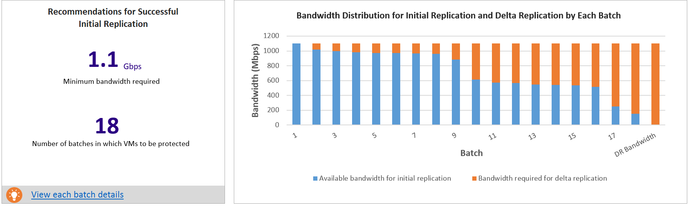

VMs must be protected in the given batch order. Each batch has a specific list of VMs. Batch 1 VMs must be protected before Batch 2 VMs. Batch 2 VMs must be protected before Batch 3 VMs, and so on. After initial replication of the Batch 1 VMs is finished, you can enable replication for Batch 2 VMs. Similarly, after initial replication of Batch 2 VMs is finished, you can enable replication for Batch 3 VMs, and so on. 

If the batch order isn't followed, sufficient bandwidth for initial replication might not be available for the VMs that are protected later. The result is that either VMs never finish initial replication or a few protected VMs might go into resync mode. IR batching for the selected RPO sheet has the detailed information about which VMs should be included in each batch.

The graph here shows the bandwidth distribution for initial replication and delta replication across batches in the given batch order. When you protect the first batch of VMs, full bandwidth is available for initial replication. After initial replication is finished for the first batch, part of the bandwidth is required for delta replication. The remaining bandwidth is available for initial replication of the second batch of VMs. 

The Batch 2 bar shows the required delta replication bandwidth for Batch 1 VMs and the bandwidth available for initial replication for Batch 2 VMs. Similarly, the Batch 3 bar shows the bandwidth required for delta replication for previous batches (Batch 1 and Batch 2 VMs) and the bandwidth available for initial replication for Batch 3, and so on. After initial replication of all the batches is finished, the last bar shows the bandwidth required for delta replication for all the protected VMs.

**Why do I need initial replication batching?**
The completion time of the initial replication is based on the VM disk size, used disk space, and available network throughput. The detail is available in IR batching for a selected RPO sheet.

### Cost estimation
The graph shows the summary view of the estimated total disaster recovery (DR) cost to Azure of your chosen target region and the currency that you specified for report generation.

The summary helps you to understand the cost that you need to pay for storage, compute, network, and licensing when you protect all your compatible VMs to Azure by using Site Recovery. The cost is calculated for compatible VMs and not on all the profiled VMs. 
 
You can view the cost either monthly or yearly. Learn more about [supported target regions](./hyper-v-deployment-planner-cost-estimation.md#supported-target-regions) and [supported currencies](./hyper-v-deployment-planner-cost-estimation.md#supported-currencies).

**Cost by components**: The total DR cost is divided into four components: compute, storage, network, and Site Recovery license cost. The cost is calculated based on the consumption that is incurred during replication and at DR drill time. Compute, storage (premium and standard), the ExpressRoute/VPN that is configured between the on-premises site and Azure, and the Site Recovery license are used for the calculations.

**Cost by states**: The total disaster recovery cost is categorized based on two different states: replication and DR drill. 

**Replication cost**: The cost that is incurred during replication. It covers the cost of storage, network, and the Site Recovery license. 

**DR-Drill cost**: The cost that is incurred during test failovers. Site Recovery spins up VMs during test failover. The DR drill cost covers the running VMs' compute and storage cost. 

**Azure Storage Cost per Month/Year**: The bar chart shows the total storage cost that is incurred for premium and standard storage for replication and DR drill. You can view detailed cost analysis per VM in the [Cost Estimation](hyper-v-deployment-planner-cost-estimation.md) sheet.

### Growth factor and percentile values used
This section at the bottom of the sheet shows the percentile value used for all the performance counters of the profiled VMs (default is 95th percentile). It also shows the growth factor (default is 30 percent) that's used in all the calculations.

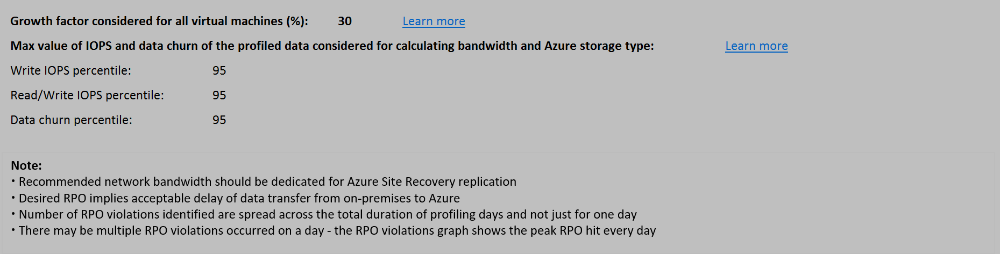

## Recommendations with available bandwidth as input

You might have a situation where you know that you can't set a bandwidth of more than x Mbps for Site Recovery replication. You can use the tool to input available bandwidth (by using the -Bandwidth parameter during report generation) and get the achievable RPO in minutes. With this achievable RPO value, you can decide whether you need to provision additional bandwidth or you're satisfied with a disaster recovery solution with this RPO.

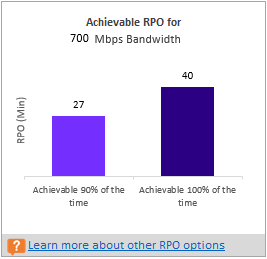

## VM-storage placement recommendation 
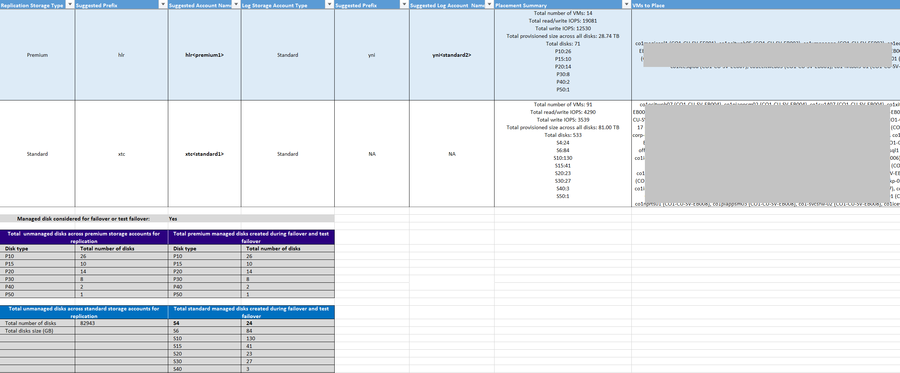

**Disk Storage Type**: Either a standard or premium storage account, which is used to replicate all the corresponding VMs mentioned in the **VMs to Place** column.

**Suggested Prefix**: The suggested three-character prefix that can be used for naming the storage account. You can use your own prefix, but the tool's suggestion follows the [partition naming convention for storage accounts](/en-in/azure/storage/blobs/storage-performance-checklist).

**Suggested Account Name**: The storage-account name after you include the suggested prefix. Replace the name within the angle brackets (< and >) with your custom input.

**Log Storage Account**: All the replication logs are stored in a standard storage account. For VMs that replicate to a premium storage account, set up an additional standard storage account for log storage. A single standard log-storage account can be used by multiple premium replication storage accounts. VMs that are replicated to standard storage accounts use the same storage account for logs.

**Suggested Log Account Name**: Your storage log account name after you include the suggested prefix. Replace the name within the angle brackets (< and >) with your custom input.

**Placement Summary**: A summary of the total VMs' load on the storage account at the time of replication and test failover or failover. The summary includes the:

* Total number of VMs mapped to the storage account. 
* Total read/write IOPS across all VMs being placed in this storage account.
* Total write (replication) IOPS.
* Total setup size across all disks.
* Total number of disks.

**VMs to Place**: A list of all the VMs that should be placed on the given storage account for optimal performance and use.

## Compatible VMs
The Excel report generated by Site Recovery Deployment Planner provides all compatible VMs' details in the "Compatible VMs" sheet.

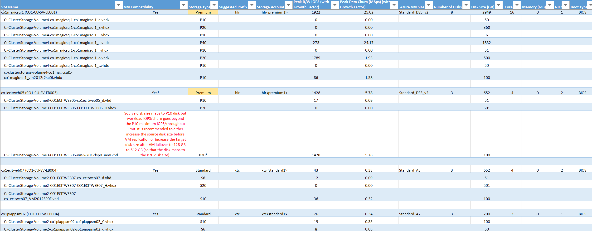

**VM Name**: The VM name that's used in the VMListFile when a report is generated. This column also lists the disks (VHDs) that are attached to the VMs. The names include the Hyper-V host names where the VMs were placed when the tool discovered them during the profiling period.

**VM Compatibility**: Values are **Yes** and **Yes**\*. **Yes**\* is for instances in which the VM is a fit for [premium SSDs](../virtual-machines/disks-types.md). Here, the profiled high churn or IOPS disk fits in higher premium disk size than the size mapped to the disk. The storage account decides which premium storage disk type to map a disk to, based on its size: 
* <128 GB is a P10.
* 128 GB to 256 GB is a P15.
* 256 GB to 512 GB is a P20.
* 512 GB to 1,024 GB is a P30.
* 1,025 GB to 2,048 GB is a P40.
* 2,049 GB to 4,095 GB is a P50.

For example, if the workload characteristics of a disk put it in the P20 or P30 category, but the size maps it down to a lower premium storage disk type, the tool marks that VM as **Yes**\*. The tool also recommends that you either change the source disk size to fit into the recommended premium storage disk type or change the target disk type post-failover.

**Storage Type**: Standard or premium.

**Suggested Prefix**: The three-character storage-account prefix.

**Storage Account**: The name that uses the suggested storage-account prefix.

**Peak R/W IOPS (with Growth Factor)**: The peak workload read/write IOPS on the disk (default is 95th percentile) along with the future growth factor (default is 30 percent). The total read/write IOPS of a VM isn't always the sum of the VM's individual disks' read/write IOPS. The peak read/write IOPS of the VM are the peak of the sum of its individual disks' read/write IOPS during every minute of the profiling period.

**Peak Data Churn in MB/s (with Growth Factor)**: The peak churn rate on the disk (default is 95th percentile) along with the future growth factor (default is 30 percent). The total data churn of the VM isn't always the sum of the VM's individual disks' data churn. The peak data churn of the VM is the peak of the sum of its individual disks' churn during every minute of the profiling period.

**Azure VM Size**: The ideal mapped Azure Cloud Services VM size for this on-premises VM. The mapping is based on the on-premises VM's memory, number of disks/cores/NICs, and read/write IOPS. The recommendation is always the lowest Azure VM size that matches all the on-premises VM characteristics.

**Number of Disks**: The total number of virtual machine disks (VHDs) on the VM.

**Disk Size (GB)**: The total size of all disks of the VM. The tool also shows the disk size for the individual disks in the VM.

**Cores**: The number of CPU cores on the VM.

**Memory (MB)**: The RAM on the VM.

**NICs**: The number of NICs on the VM.

**Boot Type**: The boot type of the VM. It can be either BIOS or EFI.

## Incompatible VMs
The Excel report generated by the Site Recovery Deployment Planner provides all incompatible VMs' details in the "Incompatible VMs" sheet.

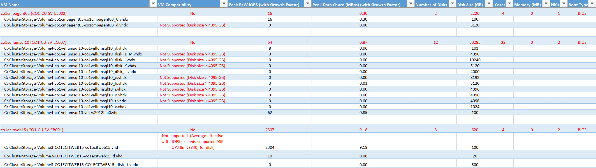

**VM Name**: The VM name that's used in the VMListFile when a report is generated. This column also lists the disks (VHDs) that are attached to the VMs. The names include the Hyper-V host names where the VMs were placed when the tool discovered them during the profiling period.

**VM Compatibility**: Indicates why the given VM is incompatible for use with Site Recovery. The reasons are described for each incompatible disk of the VM and, based on published [storage limits](/en-in/azure/storage/common/scalability-targets-standard-account), can be any of the following:

* Disk size is greater than 4,095 GB. Azure Storage currently doesn't support data disk sizes greater than 4,095 GB.

* OS disk is greater than 2,047 GB for generation 1 (BIOS boot type) VM. Site Recovery doesn't support OS disk size greater than 2,047 GB for generation 1 VMs.

* OS disk is greater than 300 GB for generation 2 (EFI boot type) VM. Site Recovery doesn't support OS disk size greater than 300 GB for generation 2 VMs.

* A VM name isn't supported with any of the following characters: “” [] `. The tool can't get profiled data for VMs that have any of these characters in their names. 

* A VHD is shared by two or more VMs. Azure doesn't support VMs with a shared VHD.

* A VM with Virtual Fiber Channel isn't supported. Site Recovery doesn't support VMs with Virtual Fiber Channel.

* A Hyper-V cluster doesn't contain a replication broker. Site Recovery doesn't support a VM in a Hyper-V cluster if the Hyper-V Replica Broker isn't configured for the cluster.

* A VM isn't highly available. Site Recovery doesn't support a VM of a Hyper-V cluster node whose VHDs are stored on the local disk instead of on the cluster disk. 

* Total VM size (replication + test failover) exceeds the supported premium storage-account size limit (35 TB). This incompatibility usually occurs when a single disk in the VM has a performance characteristic that exceeds the maximum supported Azure or Site Recovery limits for standard storage. Such an instance pushes the VM into the premium storage zone. However, the maximum supported size of a premium storage account is 35 TB. A single protected VM can't be protected across multiple storage accounts. 

    When a test failover executes on a protected VM and if an unmanaged disk is configured for test failover, it runs in the same storage account where replication is progressing. In this instance, the additional same amount of storage space is required as that of replication. It ensures replication to progress and test failover to succeed in parallel. When a managed disk is configured for test failover, no additional space needs to be accounted for with the test failover VM.

* Source IOPS exceeds the supported storage IOPS limit of 7,500 per disk.

* Source IOPS exceeds the supported storage IOPS limit of 80,000 per VM.

* Source VM average data churn exceeds the supported Site Recovery data churn limit of 20 MB/s for average I/O size.

* Source VM average effective write IOPS exceeds the supported Site Recovery IOPS limit of 840.

* Calculated snapshot storage exceeds the supported snapshot storage limit of 10 TB.

**Peak R/W IOPS (with Growth Factor)**: The peak workload IOPS on the disk (default is 95th percentile) along with the future growth factor (default is 30 percent). The total read/write IOPS of the VM isn't always the sum of the VM's individual disks' read/write IOPS. The peak read/write IOPS of the VM is the peak of the sum of its individual disks' read/write IOPS during every minute of the profiling period.

**Peak Data Churn (MB/s) (with Growth Factor)**: The peak churn rate on the disk (default is 95th percentile) along with the future growth factor (default is 30 percent). Note that the total data churn of the VM isn't always the sum of the VM's individual disks' data churn. The peak data churn of the VM is the peak of the sum of its individual disks' churn during every minute of the profiling period.

**Number of Disks**: The total number of VHDs on the VM.

**Disk Size (GB)**: The total setup size of all disks of the VM. The tool also shows the disk size for the individual disks in the VM.

**Cores**: The number of CPU cores on the VM.

**Memory (MB)**: The amount of RAM on the VM.

**NICs**: The number of NICs on the VM.

**Boot Type**: The boot type of the VM. It can be either BIOS or EFI.

## Azure Site Recovery limits
The following table provides the Site Recovery limits. These limits are based on tests, but they can't cover all possible application I/O combinations. Actual results can vary based on your application I/O mix. For best results, even after deployment planning, perform extensive application testing by issuing a test failover to get the true performance picture of the application.
 
**Replication storage target** | **Source VM average I/O size** |**Source VM average data churn** | **Total source VM data churn per day**
---|---|---|---
Standard storage | 8 KB	| 2 MB/s per VM | 168 GB per VM
Premium storage | 8 KB	| 5 MB/s per VM | 421 GB per VM
Premium storage | 16 KB or higher| 20 MB/s per VM |	1684 GB per VM

These limits are average numbers assuming a 30 percent I/O overlap. Site Recovery is capable of handling higher throughput based on overlap ratio, larger write sizes, and actual workload I/O behavior. The preceding numbers assume a typical backlog of approximately five minutes. That is, after data is uploaded, it's processed and a recovery point is created within five minutes.

## On-premises storage requirement

The worksheet provides the total free storage space requirement for each volume of the Hyper-V servers (where VHDs reside) for successful initial replication and delta replication. Before you enable replication, add required storage space on the volumes to ensure that the replication doesn't cause any undesirable downtime of your production applications. 

  Site Recovery Deployment Planner identifies the optimal storage space requirement based on the VHD's size and the network bandwidth used for replication.

### Why do I need free space on the Hyper-V server for the replication?
* When you enable replication of a VM, Site Recovery takes a snapshot of each VHD of the VM for initial replication. While initial replication is going on, new changes are written to the disks by the application. Site Recovery tracks these delta changes in the log files, which require additional storage space. Until initial replication is finished, the log files are stored locally. 

    If sufficient space isn't available for the log files and snapshot (AVHDX), replication goes into resynchronization mode and replication is never finished. In the worst case, you need 100 percent additional free space of the VHD size for initial replication.
* After initial replication is finished, delta replication starts. Site Recovery tracks these delta changes in the log files, which are stored on the volume where the VHDs of the VM reside. These log files get replicated to Azure at a configured copy frequency. Based on the available network bandwidth, the log files take some time to get replicated to Azure. 

    If sufficient free space isn't available to store the log files, replication is paused. Then the replication status of the VM goes into "resynchronization required."
* If network bandwidth isn't enough to push the log files into Azure, the log files get piled up on the volume. In a worst-case scenario, when the log files' size is increased to 50 percent of the VHD size, the replication of the VM goes into "resynchronization required." In the worst case, you need 50 percent additional free space of the VHD size for delta replication.

**Hyper-V host**: The list of profiled Hyper-V servers. If a server is part of a Hyper-V cluster, all the cluster nodes are grouped together.

**Volume (VHD path)**: Each volume of a Hyper-V host where VHDs/VHDXs are present. 

**Free space available (GB)**: The free space available on the volume.

**Total storage space required on the volume (GB)**: The total free storage space required on the volume for successful initial replication and delta replication. 

**Total additional storage to be provisioned on the volume for successful replication (GB)**: It recommends the total additional space that must be provisioned on the volume for successful initial replication and delta replication.

## Initial replication batching 

### Why do I need initial replication batching?
If all the VMs are protected at the same time, the free storage requirement is much higher. If enough storage isn't available, the replication of the VMs goes into resynchronization mode. Also, the network bandwidth requirement is much higher to finish initial replication of all VMs together successfully. 

### Initial replication batching for a selected RPO
This worksheet provides the detail view of each batch for IR. For each RPO, a separate IR batching sheet is created. 

After you followed the on-premises storage requirement recommendation for each volume, the main information that you need to replicate is the list of VMs that can be protected in parallel. These VMs are grouped together in a batch, and there can be multiple batches. Protect the VMs in the given batch order. First protect Batch 1 VMs. After initial replication is finished, protect Batch 2 VMs, and so on. You can get the list of batches and corresponding VMs from this sheet. 

### Each batch provides the following information 
**Hyper-V host**: The Hyper-V host of the VM to be protected.

**Virtual Machine**: The VM to be protected. 

**Comments**: If any action is required for a specific volume of a VM, the comment is provided here. For example, if sufficient free space isn't available on a volume, the comment says, "Add additional storage to protect this VM."

**Volume (VHD path)**: The volume name where the VM's VHDs reside. 

**Free space available on the volume (GB)**: The free disk space available on the volume for the VM. While calculating available free space on the volumes, it considers the disk space used for delta replication by the VMs of the previous batches whose VHDs are on the same volume. 

For example, VM1, VM2, and VM3 reside on a volume, say, E:\VHDpath. Before replication, free space on the volume is 500 GB. VM1 is part of Batch 1, VM2 is part of Batch 2, and VM3 is part of Batch3. For VM1, the free space available is 500 GB. For VM2, the free space available is 500 – disk space required for delta replication for VM1. If VM1 requires 300 GB space for delta replication, the free space available for VM2 is 500 GB – 300 GB = 200 GB. Similarly, VM2 requires 300 GB for delta replication. The free space available for VM3 is 200 GB - 300 GB = -100 GB.

**Storage required on the volume for initial replication (GB)**: The free storage space required on the volume for the VM for initial replication.

**Storage required on the volume for delta replication (GB)**: The free storage space required on the volume for the VM for delta replication.

**Additional storage required based on deficit to avoid replication failure (GB)**: The additional storage space required on the volume for the VM. It's the max of initial replication and delta replication storage space requirement minus the free space available on the volume.

**Minimum bandwidth required for initial replication (Mbps)**: The minimum bandwidth required for initial replication for the VM.

**Minimum bandwidth required for delta replication (Mbps)**: The minimum bandwidth required for delta replication for the VM.

### Network utilization details for each batch 
Each batch table provides a summary of network utilization of the batch.

**Bandwidth available for batch**: The bandwidth available for the batch after considering the previous batch's delta replication bandwidth.

**Approximate bandwidth available for initial replication of batch**: The bandwidth available for initial replication of the VMs of the batch. 

**Approximate bandwidth consumed for delta replication of batch**: The bandwidth needed for delta replication of the VMs of the batch. 

**Estimated initial replication time for batch (HH:MM)**: The estimated initial replication time in Hours:Minutes.

## Next steps
Learn more about [cost estimation](hyper-v-deployment-planner-cost-estimation.md).