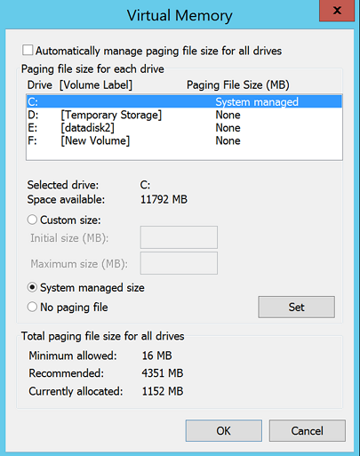

# Exclude disks from replication
This article describes how to exclude disks from replication. This exclusion can optimize the consumed replication bandwidth or optimize the target-side resources that such disks utilize.

## Supported scenarios

**Feature** | **VMware to Azure** | **Hyper-V to Azure** | **Azure to Azure**| **Hyper-V to Hyper-V** 
--|--|--|--|--
Exclude disk | Yes | Yes | No | No

## Why exclude disks from replication?
Excluding disks from replication is often necessary because:

- The data that's churned on the excluded disk is not important or doesn’t need to be replicated.

- You want to save storage and network resources by not replicating this churn.

## What are the typical scenarios?
You can identify specific examples of data churn that are great candidates for exclusion. Examples might include writes to a paging file (pagefile.sys) and writes to the tempdb file of Microsoft SQL Server. Depending on the workload and the storage subsystem, the paging file can register a significant amount of churn. However, replicating this data from the primary site to Azure would be resource intensive. Thus, you can use the following steps to optimize replication of a virtual machine with a single virtual disk that has both the operating system and the paging file:

1. Split the single virtual disk into two virtual disks. One virtual disk has the operating system, and the other has the paging file.
2. Exclude the paging file disk from replication.

Similarly, you can use the following steps to optimize a disk that has both the Microsoft SQL Server tempdb file and the system database file:

1. Keep the system database and tempdb on two different disks.
2. Exclude the tempdb disk from replication.

## How to Exclude disks
Follow the [Enable replication](site-recovery-hyper-v-site-to-azure.md) workflow to protect a virtual machine from the Azure Site Recovery portal. In the fourth step of the workflow, use the **DISK TO REPLICATE** column to exclude disks from replication. By default, all disks are selected for replication. Clear the check box of disks that you want to exclude from replication, and then complete the steps to enable replication.

>[!NOTE]
>
> * You can exclude only basic disks from replication. You can't exclude operating system disks. We recommend that you do not exclude dynamic disks. Azure Site Recovery cannot identify which virtual hard disk (VHD) is basic or dynamic in the guest virtual machine.  If all dependent dynamic volume disks are not excluded, the protected dynamic disk becomes a failed disk on a failover virtual machine, and the data on that disk is not accessible.
> * After you enable replication, you can't add or remove disks for replication. If you want to add or exclude a disk, you need to disable protection for the virtual machine and then enable it again.
> * If you exclude a disk that's needed for an application to operate, after failover to Azure you need to create the disk manually in Azure so that the replicated application can run. Alternatively, you can integrate Azure automation into a recovery plan to create the disk during failover of the machine.
> * Disks that you create manually in Azure will not be failed back. For example, if you fail over three disks and create two disks directly in Azure Virtual Machines, only three disks that were failed over will be failed back from Azure to Hyper-V. You can't include disks that were created manually in failback or in reverse replication from Hyper-V to Azure.

## End-to-end scenarios of exclude disks
Let's consider two scenarios to understand the exclude disk feature:

- SQL Server tempdb disk
- Paging file (pagefile.sys) disk

## Example 1: Exclude the SQL Server tempdb disk
Let's consider a SQL Server virtual machine that has a tempdb that can be excluded.

The name of the virtual disk is SalesDB.

Disks on the source virtual machine are as follows:

**Disk name** | **Guest operating system disk#** | **Drive letter** | **Data type on the disk**
--- | --- | --- | ---
DB-Disk0-OS | DISK0 | C:\ | Operating system disk
DB-Disk1| Disk1 | D:\ | SQL system database and User Database1
DB-Disk2 (Excluded the disk from protection) | Disk2 | E:\ | Temp files
DB-Disk3 (Excluded the disk from protection) | Disk3 | F:\ | SQL tempdb database (folder path(F:\MSSQL\Data\)    Write down the folder path before failover.
DB-Disk4 | Disk4 |G:\ |User Database2

Because data churn on two disks of the virtual machine is temporary, while you protect the SalesDB virtual machine, exclude Disk2 and Disk3 from replication. Azure Site Recovery will not replicate those disks. On failover, those disks will not be present on the failover virtual machine on Azure.

Disks on the Azure virtual machine after failover are as follows:

**Guest operating system disk#** | **Drive letter** | **Data type on the disk**
--- | --- | ---
DISK0 |	C:\ | Operating system disk
Disk1 |	E:\ | Temporary storage   Azure adds this disk and assigns the first available drive letter.
Disk2 | D:\ | SQL system database and User Database1
Disk3 | G:\ | User Database2

Because Disk2 and Disk3 were excluded from the SalesDB virtual machine, E: is the first drive letter from the available list. Azure assigns E: to the temporary storage volume. For all the replicated disks, the drive letters remain the same.

Disk3, which was the SQL tempdb disk (tempdb folder path F:\MSSQL\Data\), was excluded from replication. The disk is not available on the failover virtual machine. As a result, the SQL service is in a stopped state, and it needs the F:\MSSQL\Data path.

There are two ways to create this path:

- Add a new disk and assign tempdb folder path.
- Use an existing temporary storage disk for the tempdb folder path.

### Add a new disk:

1. Write down the paths of SQL tempdb.mdf and tempdb.ldf before failover.
2. From the Azure portal, add a new disk to the failover virtual machine with the same or more size as that of the source SQL tempdb disk (Disk3).
3. Sign in to the Azure virtual machine. From the disk management (diskmgmt.msc) console, initialize, and format the newly added disk.
4. Assign the same drive letter that was used by the SQL tempdb disk (F:).
5. Create a tempdb folder on the F: volume (F:\MSSQL\Data).
6. Start the SQL service from the service console.

### Use an existing temporary storage disk for the SQL tempdb folder path:

1. Open a command prompt.
2. Run SQL Server in recovery mode from the command prompt.

		Net start MSSQLSERVER /f / T3608

3. Run the following sqlcmd to change the tempdb path to the new path.

		sqlcmd -A -S SalesDB		**Use your SQL DBname**
		USE master;		
		GO		
		ALTER DATABASE tempdb		
		MODIFY FILE (NAME = tempdev, FILENAME = 'E:\MSSQL\tempdata\tempdb.mdf');
		GO		
		ALTER DATABASE tempdb		
		MODIFY FILE (NAME = templog, FILENAME = 'E:\MSSQL\tempdata\templog.ldf');		
		GO

4. Stop the Microsoft SQL Server service.

		Net stop MSSQLSERVER
5. Start the Microsoft SQL Server service.

		Net start MSSQLSERVER

Refer to the following Azure guideline for temporary storage disk:

* [Using SSDs in Azure VMs to store SQL Server TempDB and Buffer Pool Extensions](https://blogs.technet.microsoft.com/dataplatforminsider/2014/09/25/using-ssds-in-azure-vms-to-store-sql-server-tempdb-and-buffer-pool-extensions/)
* [Performance best practices for SQL Server in Azure Virtual Machines](https://docs.microsoft.com/azure/virtual-machines/windows/sql/virtual-machines-windows-sql-performance)

## Failback (from Azure to an on-premises host)
Now let's understand the disks that are replicated when you fail over from Azure to your on-premises Hyper-V host. Disks that you create manually in Azure will not be replicated. For example, if you fail over three disks and create two directly in Azure Virtual Machines, only three disks that were failed over will be failed back. You can't include disks that were created manually in failback or in reprotect from on-premises to Azure. It also does not replicate the temporary storage disk to on-premises hosts.

### Failback to original location recovery

In the previous example, the Azure virtual machine disk configuration is as follows:

**Guest operating system disk#** | **Drive letter** | **Data type on the disk**
--- | --- | ---
DISK0 | C:\ | Operating system disk
Disk1 |	E:\ | Temporary storage   Azure adds this disk and assigns the first available drive letter.
Disk2 |	D:\ | SQL system database and User Database1
Disk3 |	G:\ | User Database2

When failback is to the original location, the failback virtual machine disk configuration remains the same as that of original virtual machine disk configuration for Hyper-V. Disks that were excluded from Hyper-V site to Azure are available on the failback virtual machine.

After planned failover from Azure to on-premises Hyper-V, disks on the Hyper-V virtual machine (original location) are as follows:

**Disk Name** | **Guest operating system disk#** | **Drive letter** | **Data type on the disk**
--- | --- | --- | ---
DB-Disk0-OS | DISK0 |	C:\ | Operating system disk
DB-Disk1 | Disk1 | D:\ | SQL system database and User Database1
DB-Disk2 (Excluded disk) | Disk2 | E:\ | Temp files
DB-Disk3 (Excluded disk) | Disk3 | F:\ | SQL tempdb database (folder path(F:\MSSQL\Data\)
DB-Disk4 | Disk4 | G:\ | User Database2

## Example 2: Exclude the paging file (pagefile.sys) disk

Let's consider a virtual machine that has a paging file disk that can be excluded.
There are two cases.

### Case 1: The paging file is configured on the D: drive
Here's the disk configuration:

**Disk name** | **Guest operating system disk#** | **Drive letter** | **Data type on the disk**
--- | --- | --- | ---
DB-Disk0-OS | DISK0 | C:\ | Operating system disk
DB-Disk1 (Excluded the disk from the protection) | Disk1 | D:\ | pagefile.sys
DB-Disk2 | Disk2 | E:\ | User data 1
DB-Disk3 | Disk3 | F:\ | User data 2

Here are the paging file settings on the source virtual machine:

After failover of the virtual machine from Hyper-V to Azure, disks on the Azure virtual machine are as follows:

**Disk name** | **Guest operating system disk#** | **Drive letter** | **Data type on the disk**
--- | --- | --- | ---
DB-Disk0-OS | DISK0 | C:\ | Operating system disk
DB-Disk1 | Disk1 | D:\ | Temporary storage   pagefile.sys
DB-Disk2 | Disk2 | E:\ | User data 1
DB-Disk3 | Disk3 | F:\ | User data 2

Because Disk1 (D:) was excluded, D: is the first drive letter from the available list. Azure assigns D: to the temporary storage volume. Because D: is available on the Azure virtual machine, the paging file setting of the virtual machine remains the same.

Here are the paging file settings on the Azure virtual machine:

### Case 2: The paging file is configured on another drive (other than D: drive)

Here's the source virtual machine disk configuration:

**Disk name** | **Guest operating system disk#** | **Drive letter** | **Data type on the disk**
--- | --- | --- | ---
DB-Disk0-OS | DISK0 | C:\ | Operating system disk
DB-Disk1 (Excluded the disk from protection) | Disk1 | G:\ | pagefile.sys
DB-Disk2 | Disk2 | E:\ | User data 1
DB-Disk3 | Disk3 | F:\ | User data 2

Here are the paging file settings on the on-premises virtual machine:

After failover of the virtual machine from Hyper-V to Azure, disks on the Azure virtual machine are as follows:

**Disk name** | **Guest operating system disk#** | **Drive letter** | **Data type on the disk**
--- | --- | --- | ---
DB-Disk0-OS | DISK0  |C:\ |Operating system disk
DB-Disk1 | Disk1 | D:\ | Temporary storage   pagefile.sys
DB-Disk2 | Disk2 | E:\ | User data 1
DB-Disk3 | Disk3 | F:\ | User data 2

Because D: is the first drive letter from available the list, Azure assigns D: to the temporary storage volume. For all the replicated disks, the drive letter remains the same. Because the G: disk is not available, the system will use the C: drive for the paging file.

Here are the paging file settings on the Azure virtual machine:

## Next steps
After your deployment is set up and running, [learn more](site-recovery-failover.md) about different types of failover.
