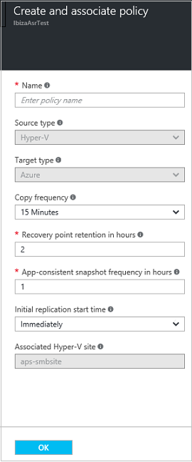

# Step 9: Set up a replication policy for Hyper-V VM replication to Azure

This article describes how to set up a replication policy when you're replicating Hyper-V VMs to Azure (without System Center VMM) using the [Azure Site Recovery](site-recovery-overview.md) service in the Azure portal.

Post comments and questions at the bottom of this article, or on the [Azure Recovery Services Forum](https://social.msdn.microsoft.com/forums/azure/home?forum=hypervrecovmgr).

## About snapshots

Hyper-V uses two types of snapshots — a standard snapshot that provides an incremental snapshot of the entire virtual machine, and an application-consistent snapshot that takes a point-in-time snapshot of the application data inside the virtual machine.
    - Application-consistent snapshots use Volume Shadow Copy Service (VSS) to ensure that applications are in a consistent state when the snapshot is taken.
    - If you enable application-consistent snapshots, it will affect the performance of applications running on source virtual machines. Ensure that the value you set is less than the number of additional recovery points you configure.

## Set up a replication policy

1. To create a new replication policy, click **Prepare infrastructure** > **Replication Settings** > **+Create and associate**.

    
2. In **Create and associate policy**, specify a policy name.
3. In **Copy frequency**, specify how often you want to replicate delta data after the initial replication (every 30 seconds, 5 or 15 minutes).

	> [!NOTE]
	> A 30 second frequency isn't supported when replicating to premium storage. The limitation is determined by the number of snapshots per blob (100) supported by premium storage. [Learn more](../storage/storage-premium-storage.md#snapshots-and-copy-blob).

4. In **Recovery point retention**, specify in hours how long the retention window is for each recovery point. VMs can be recovered to any point within a window.
5. In **App-consistent snapshot frequency**, specify how frequently (1-12 hours) recovery points containing application-consistent snapshots are created.
6. In **Initial replication start time**, specify when to start the initial replication. The replication occurs over your internet bandwidth so you might want to schedule it outside your busy hours. Then click **OK**.

    

When you create a new policy, it's automatically associated with the Hyper-V site. You can associate a Hyper-V site (and the VMs in it) with multiple replication policies in **Replication** > policy-name > **Associate Hyper-V Site**.

## Next steps

Go to [Step 10: Enable replication](hyper-v-site-walkthrough-enable-replication.md)
