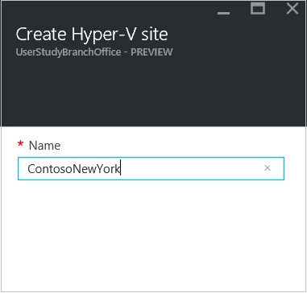

# Step 8: Set up the source and target for Hyper-V replication to Azure

This article describes how to configure source and target settings when replicating on-premises Hyper-V virtual machines (without System Center VMM) to Azure, using the [Azure Site Recovery](site-recovery-overview.md) service in the Azure portal.

Post comments and questions at the bottom of this article, or on the [Azure Recovery Services Forum](https://social.msdn.microsoft.com/forums/azure/home?forum=hypervrecovmgr).

## Set up the source environment

Set up the Hyper-V site, install the Azure Site Recovery Provider and the Azure Recovery Services agent on Hyper-V hosts, and register the site in the vault.

1. In **Prepare Infrastructure**, click **Source**. To add a new Hyper-V site as a container for your Hyper-V hosts or clusters, click **+Hyper-V Site**.

    
2. In **Create Hyper-V site**, specify a name for the site. Then click **OK**. Now, select the site you created, and click **+Hyper-V Server** to add a server to the site.

    

3. In **Add Server** > **Server type**, check that **Hyper-V server** is displayed.

    - Make sure that the Hyper-V server you want to add complies with the [prerequisites](#on-premises-prerequisites), and is able to access the specified URLs.
    - Download the Azure Site Recovery Provider installation file. You run this file to install the Provider and the Recovery Services agent on each Hyper-V host.

    

## Install the Provider and agent

1. Run the Provider setup file on each host you added to the Hyper-V site. If you're installing on a Hyper-V cluster, run setup on each cluster node. Installing and registering each Hyper-V cluster node ensures that VMs are protected, even if they migrate across nodes.
2. In **Microsoft Update**, you can opt in for updates so that Provider updates are installed in accordance with your Microsoft Update policy.
3. In **Installation**, accept or modify the default Provider installation location and click **Install**.
4. In **Vault Settings**, click **Browse** to select the vault key file that you downloaded. Specify the Azure Site Recovery subscription, the vault name, and the Hyper-V site to which the Hyper-V server belongs.

    

5. In **Proxy Settings**, specify how the Provider running on Hyper-V hosts connects to Azure Site Recovery over the internet.

	* If you want the Provider to connect directly select **Connect directly to Azure Site Recovery without a proxy**.
	* If your existing proxy requires authentication, or you want to use a custom proxy for the Provider connection, select **Connect to Azure Site Recovery using a proxy server**.
	* If you use a proxy:
        - Specify the address, port, and credentials
	    - Make sure the URLs described in the [prerequisites](#prerequisites) are allowed through the proxy.

    

6. After installation finishes, click **Register** to register the server in the vault.

	

7. After registration finishes, metadata from the Hyper-V server is retrieved by Azure Site Recovery, and the server is displayed in **Site Recovery Infrastructure** > **Hyper-V Hosts**.

## Set up the target environment

Specify the Azure storage account for replication, and the Azure network to which Azure VMs will connect after failover.

1. Click **Prepare infrastructure** > **Target**.
2. Select the subscription and the resource group in which you want to create the Azure VMs after failover. Choose the deployment model that you want to use in Azure (classic or resource management) for the VMs.

3. Site Recovery checks that you have one or more compatible Azure storage accounts and networks.

	- If you don't have a storage account, click **+Storage** to create a Resource Manager-based account inline. 
	- If you don't have a Azure network, click **+Network** to create a Resource Manager-based network inline.

## Next steps

Go to [Step 9: Set up a replication policy](hyper-v-site-walkthrough-replication.md)
