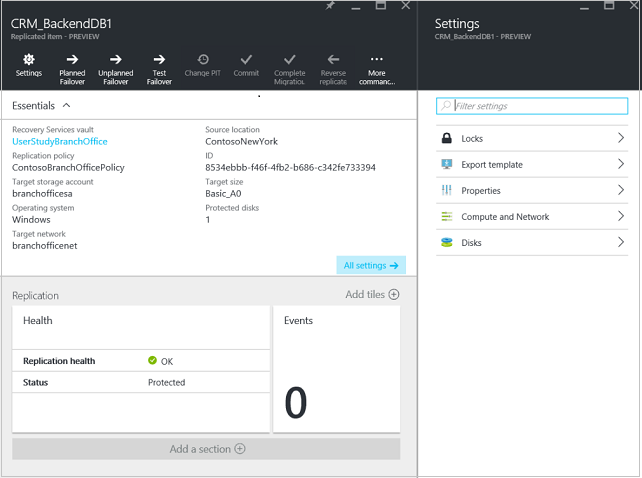

# Step 11: Run a test failover for Hyper-V replication to Azure

This article describes how to run a test failover from  on-premises Hyper-V virtual machines (not managed by System Center VMM) to Azure, using the [Azure Site Recovery](site-recovery-overview.md) service in the Azure portal.

Post comments and questions at the bottom of this article, or on the [Azure Recovery Services Forum](https://social.msdn.microsoft.com/forums/azure/home?forum=hypervrecovmgr).

## Before you start

Before you run a test failover we recommend that you verify the VM properties, and make any changes you need to. you can access the VM properties in **Replicated items**. The **Essentials** blade shows information about machines settings and status.

## Managed disk considerations

[Managed disks](../storage/storage-managed-disks-overview.md) simplify disk management for Azure VMs, by managing the storage accounts associated with the VM disks. 

- Managed disks are created and attached to the VM only when a failover to Azure occurs. When you enable protection, data from on-premises VMs replicates to storage accounts.
- Managed disks can be created only for VMs that are deployed using the Resource manager deployment model.
- Failback from Azure to an on-premises Hyper-V environment is not currently supported for machines with managed disks. You should only set **Use managed disks** to **YeS** if you're doing a migration only (failover to Azure without failback)
- With this setting enabled, only availability sets in Resource Groups that have **Use managed disks** enabled can be selected. VMs with managed disks must be in availability sets with **Use managed disks** set to **Yes**. If the setting isn't enabled for VMs, then only availability sets in Resource Groups without managed disks enabled can be selected. [Learn more](https://docs.microsoft.com/en-us/azure/virtual-machines/windows/manage-availability#use-managed-disks-for-vms-in-an-availability-set).
- - If the storage account you use for replication has been encrypted with Storage Service Encryption, managed disks can't be created during failover. In this case either don't enable use of managed disks, or disable protection for the VM, and reenable it to use a storage account that doesn't have encryption enabled. [Learn more](https://docs.microsoft.com/azure/storage/storage-managed-disks-overview#managed-disks-and-encryption).

 
## Network considerations
    
- You can set the target IP address to be used for the Azure VM after failover. If you don't provide an address, the failed over machine will use DHCP. If you set an address that isn't available at failover, the failover will fail. The same target IP address can be used for test failover if the address is available in the test failover network.
- The number of network adapters is dictated by the size you specify for the target virtual machine, as follows:
    - If the number of network adapters on the source machine is less than or equal to the number of adapters allowed for the target machine size, then the target will have the same number of adapters as the source.
    - If the number of adapters for the source virtual machine exceeds the number allowed for the target size then the target size maximum will be used.
    - For example if a source machine has two network adapters and the target machine size supports four, the target machine will have two adapters. If the source machine has two adapters but the supported target size only supports one then the target machine will have only one adapter.     
- If the VM has multiple network adapters they will all connect to the same network.
- If the virtual machine has multiple network adapters then the first one shown in the list becomes the *Default* network adapter in the Azure virtual machine.

## View and manage VM settings

We recommend that you verify the properties of the source machine before you run a failover.

1. In **Protected Items**, click **Replicated Items**, and click the VM.

    
2. In the **Replicated item** pane, you can see a summary of VM information, health status, and the latest available recovery points. Click **Properties** to view more details.

    
3. In **Compute and Network**, you can:
    - Modify the Azure VM name. The name must meet [Azure requirements](site-recovery-support-matrix-to-azure.md#failed-over-azure-vm-requirements).
    - Specify a post-failover [resource group](../virtual-machines/windows/infrastructure-resource-groups-guidelines.md)
    - Specify a target size for the Azure VM
    - Select an [availability set](../virtual-machines/windows/infrastructure-availability-sets-guidelines.md).
    - Specify whether to use [managed disks](#managed-disk-considerations). Select **Yes**, if you want to attach managed disks to your machine on migration to Azure.
    - View or modify network settings, including the network/subnet in which the Azure VM will be located after failover, and the IP address that will be assigned to it.

    
4. In **Disks**, you can see information about the operating system and data disks on the VM.

## Run a test failover

Now, run a test failover to make sure everything's working as expected. Note that:

- If you want to connect to Azure VMs using RDP after failover, [prepare to connect](site-recovery-test-failover-to-azure.md#prepare-to-connect-to-azure-vms-after-failover).
 - To fully test you need to copy of Active Directory and DNS in your test environment. [Learn more](site-recovery-active-directory.md#test-failover-considerations).
 - For full information about test failover, read [this article](site-recovery-test-failover-to-azure.md) article.

1. To fail over a single machine, in **Replicated Items**, click the VM > **+Test Failover** icon.
2. To fail over a recovery plan, in **Recovery Plans**, right-click the plan > **Test Failover**. To create a recovery plan, [follow these instructions](site-recovery-create-recovery-plans.md).
3. In **Test Failover**, select the Azure network to which Azure VMs will be connected after failover occurs.
4. Click **OK** to begin the failover. You can track progress by clicking on the VM to open its properties, or on the **Test Failover** job in vault name > **Jobs** > **Site Recovery jobs**.
5. After the failover completes, you should also be able to see the replica Azure machine appear in the Azure portal > **Virtual Machines**. You should make sure that the VM is the appropriate size, that it's connected to the appropriate network, and that it's running.
6. If you prepared for connections after failover, you should be able to connect to the Azure VM.
7. After you finish, click on **Cleanup test failover** on the recovery plan. In **Notes** record and save any observations associated with the test failover. This will delete the virtual machines that were created during test failover.

## Next steps

- [Learn more](site-recovery-failover.md) about different types of failovers, and how to run them.
- [Read about failback](site-recovery-failback-from-azure-to-hyper-v.md), to fail back and replicate Azure VMs back to the primary on-premises Hyper-V site.

