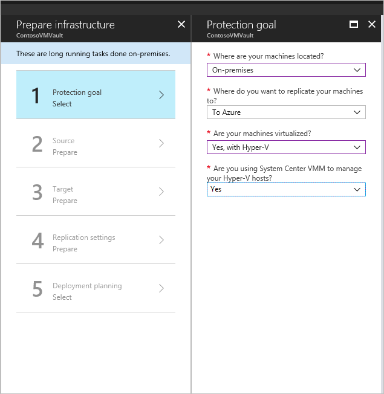
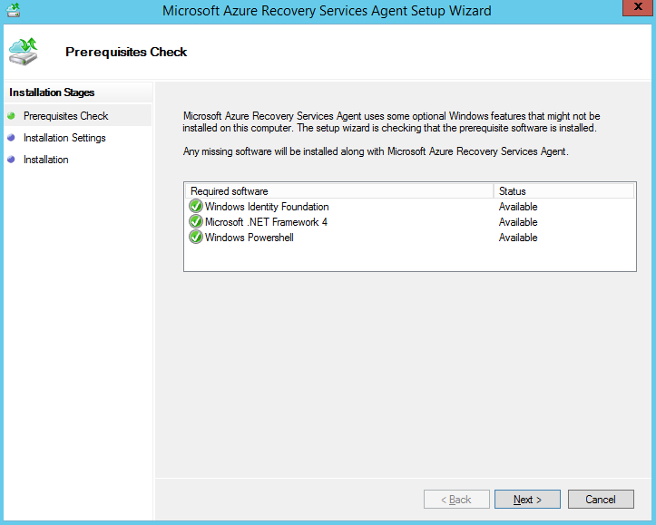
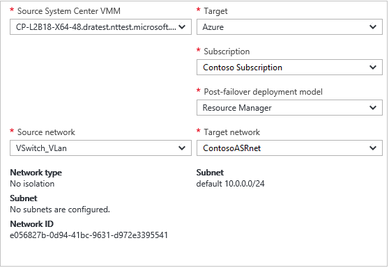

# Set up disaster recovery of on-premises Hyper-V VMs in VMM clouds to Azure

This tutorial describes how to enable replication for on-premises Hyper-V virtual machines (VM) managed by System Center Virtual Machine Manager (VMM) to Azure using [Azure Site Recovery](site-recovery-overview.md). If you aren't using VMM, [follow this tutorial](hyper-v-azure-tutorial.md).

In this tutorial, you learn how to:

> [!div class="checklist"]
> * Select your replication source and target.
> * Set up the source replication environment, including on-premises Site Recovery components and the target replication environment.
> * Set up network mapping between VMM VM networks and Azure virtual networks.
> * Create a replication policy.
> * Enable replication for a VM.

> [!NOTE]
> Tutorials show you the simplest deployment path for a scenario. They use default options where possible, and don't show all possible settings and paths. For detailed instructions, review the articles in the **How-to Guides** section of the [Site Recovery documentation](./index.yml).

## Prerequisites

This tutorial assumes that you already completed the following tutorials:

1. [Prepare Azure](tutorial-prepare-azure.md)
1. [Prepare on-premises Hyper-V servers](hyper-v-prepare-on-premises-tutorial.md)

## Select a replication goal

1. In the Azure portal, go to **Recovery Services vaults** and select the **ContosoVMVault** vault that was created in the [Prepare Azure](tutorial-prepare-azure.md#create-a-recovery-services-vault) tutorial.
1. From **Getting Started**, select **Site Recovery** > **Prepare Infrastructure** and configure the following settings:
    1. **Protection goal** > **Where are your machines located?**, select **On-premises**.
    1. **Where do you want to replicate your machines?**, select **To Azure**.
    1. **Are your machines virtualized?**, select **Yes, with Hyper-V**.
    1. **Are you using System Center VMM to manage your Hyper-V hosts?**, select **Yes**.
1. Select **OK**.

   

## Confirm deployment planning

1. In **Deployment planning**, if you're planning a large deployment, download the Deployment Planner for Hyper-V from the link on the page. [Learn more](hyper-v-deployment-planner-overview.md) about Hyper-V deployment planning.
1. For this tutorial, we don't need the Deployment Planner. In **Have you completed deployment planning?**, select **I will do it later**, and then select **OK**.

## Set up the source environment

When you set up the source environment, you install the Azure Site Recovery Provider on the VMM server and register the server in the vault. You install the Azure Recovery Services agent on each Hyper-V host.

1. **Prepare Infrastructure**. Select **Source**.
1. **Prepare source**. Select **+ VMM** to add a VMM server. In **Add Server**, check that **System Center VMM server** appears in **Server type**.
1. Download the installer for the Microsoft Azure Site Recovery Provider.
1. Download the vault registration key. You need this key when you run the Provider setup. The key is valid for five days after you generate it.
1. Download the installer for the Microsoft Azure Recovery Services agent.

   

### Install the Provider on the VMM server

1. In the Azure Site Recovery Provider Setup wizard **Microsoft Update**. Opt in to use Microsoft Update to check for Provider updates.
1. **Installation**. Accept the default installation location for the Provider and select **Install**.
1. After installation, in the Microsoft Azure Site Recovery Registration Wizard select **Vault Settings**, **Browse**, and in **Key file**, select the vault key file that you downloaded.
1. Specify the Azure Site Recovery subscription, and the vault name (**ContosoVMVault**). Specify a friendly name for the VMM server, to identify it in the vault.
1. **Proxy Settings**. Select **Connect directly to Azure Site Recovery without a proxy**.
1. Accept the default location for the certificate that's used to encrypt data. Encrypted data will be decrypted when you fail over.
1. **Synchronize cloud metadata**. Select **Sync cloud meta data to Site Recovery portal**. This action needs to happen only once on each server. Then, select **Register**.
1. After the server is registered in the vault, select **Finish**.

After registration finishes, metadata from the server is retrieved by Azure Site Recovery and the VMM server is displayed in **Site Recovery Infrastructure**.

### Install the Recovery Services agent on Hyper-V hosts

Install the agent on each Hyper-V host containing VMs that you want to replicate.

In the Microsoft Azure Recovery Services Agent Setup Wizard, configure these settings:

1. **Prerequisites Check**. Select **Next**. Any missing prerequisites will be installed automatically.
1. **Installation Settings**. Accept the installation location. Then, select **Install**.

    >[!NOTE]
    >For Azure Site Recovery, **Cache Location** is not required.

1. **Installation**. When the installation finishes, select **Close** to finish the wizard.

   

### Install the Recovery Services agent on Windows core Hyper-V hosts

Install the agent on each Windows core Hyper-V host containing VMs that you want to replicate.

1. On the Windows Core Hyper-V host, create a directory by running the following command:

   ```powershell
   New-Item -Path C:\ASR -ItemType Directory
   ```

2. Download the installer for the Microsoft Azure Recovery Services agent:

   ```powershell
   Invoke-WebRequest -Uri <put the URI here> -OutFile .\ASR\MARSsoftware.exe
   ```
   
3. Execute the installer by running the below command:

   ```powershell
   .\MARSsoftware.exe
   ```

4. Once the Microsoft Azure Recovery Services agent installation completes, you can close the Wizard console.

## Set up the target environment

1. Select **Prepare infrastructure** > **Target**.
1. Select the subscription and the resource group (**ContosoRG**) in which the Azure VMs will be created after failover.
1. Select the **Resource Manager** deployment model.

Site Recovery checks that there's one or more compatible Azure storage accounts and networks.

## Configure network mapping

1. **Site Recovery Infrastructure** > **Network mappings** > **Network Mapping**. Select the **+Network Mapping** icon.
1. **Add network mapping**. Select the **Source System Center VMM** server. For the **Target**, select Azure.
1. Verify the subscription and the deployment model after failover.
1. **Source network**. Select the source on-premises VM network.
1. **Target network**. Select the Azure network in which replica Azure VMs will be located when they're created after failover. Then, select **OK**.

   

## Set up a replication policy

1. Select **Prepare infrastructure** > **Replication Settings** > **+Create and associate**.
1. In **Create and associate policy**, specify a policy name. We're using **ContosoReplicationPolicy**.
1. Accept the default settings and select **OK**:
   - **Copy frequency** indicates that, after initial replication, delta data will replicate every five minutes.
   - **Recovery point retention** indicates that each recovery point will be retained for two hours.
   - **App-consistent snapshot frequency** indicates that recovery points containing app-consistent snapshots will be created every hour.
   - **Initial replication start time** indicates that initial replication will start immediately.
   - **Encrypt data stored on Azure** is set to the default (**Off**) and indicates that at-rest data in Azure isn't encrypted.
1. After the policy is created, select **OK**. When you create a new policy, it's automatically associated with the VMM cloud.

## Enable replication

1. **Replicate application**. Select **Source**.
1. **Source**. Select the VMM cloud. Then, select **OK**.
1. **Target**. Verify the target (Azure), the vault subscription, and select the **Resource Manager** model.
1. Select the **contosovmsacct1910171607** storage account and the **ContosoASRnet** Azure network.
1. **Virtual machines** > **Select**. Select the VM that you want to replicate. Then, select **OK**.

   You can track progress of the **Enable Protection** action in **Jobs** > **Site Recovery jobs**. After the **Finalize Protection** job finishes, the initial replication is complete, and the VM is ready for failover.

## Next steps

> [!div class="nextstepaction"]
> [Run a disaster recovery drill](tutorial-dr-drill-azure.md)
