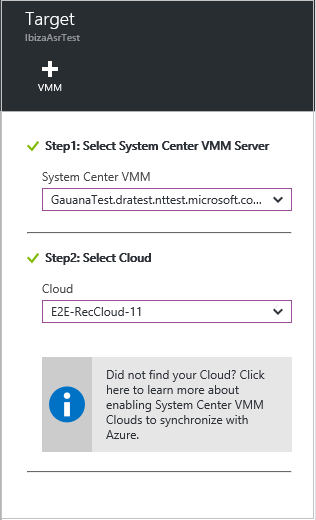
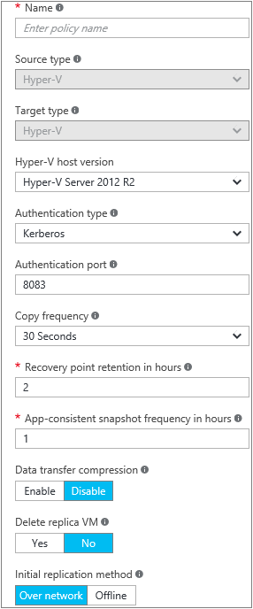

# Set up disaster recovery for Hyper-V VMs to a secondary on-premises site

The [Azure Site Recovery](site-recovery-overview.md) service contributes to your disaster recovery strategy by managing and orchestrating replication, failover, and failback of on-premises machines, and Azure virtual machines (VMs).

This article shows you how to set up disaster recovery to a secondary site, for on-premises Hyper-V VMs managed in System Center Virtual Machine Manager (VMM) clouds. In this article, you learn how to:

> [!div class="checklist"]
> * Prepare on-premises VMM servers and Hyper-V hosts
> * Create a Recovery Services vault for Site Recovery 
> * Set up the source and target replication environments. 
> * Set up network mapping 
> * Create a replication policy
> * Enable replication for a VM

## Prerequisites

To complete this scenario:

- Review the [scenario architecture and components](hyper-v-vmm-architecture.md).
- Make sure that VMM servers and Hyper-V hosts comply with [support requirements](hyper-v-vmm-secondary-support-matrix.md).
- Check that VMs you want to replicate comply with [replicated machine support](hyper-v-vmm-secondary-support-matrix.md#replicated-vm-support).
- Prepare VMM servers for network mapping.

### Prepare for network mapping

[Network mapping](hyper-v-vmm-network-mapping.md) maps between on-premises VMM VM networks in source and target clouds. Mapping does the following:

- Connects VMs to appropriate target VM networks after failover. 
- Optimally places replica VMs on target Hyper-V host servers. 
- If you don’t configure network mapping, replica VMs won’t be connected to a VM network after failover.

Prepare VMM as follows:

1. Make sure you have [VMM logical networks](https://docs.microsoft.com/system-center/vmm/network-logical) on the source and target VMM servers.
    - The logical network on the source server should be associated with the source cloud in which Hyper-V hosts are located.
    - The logical network on the target server should be associated with the target cloud.
1. Make sure you have [VM networks](https://docs.microsoft.com/system-center/vmm/network-virtual) on the source and target VMM servers. VM networks should be linked to the logical network in each location.
2. Connect VMs on the source Hyper-V hosts to the source VM network. 

## Create a Recovery Services vault

[!INCLUDE [site-recovery-create-vault](../../includes/site-recovery-create-vault.md)]

## Choose a protection goal

Select what you want to replicate and where you want to replicate to.

1. Click **Site Recovery** > **Step 1: Prepare Infrastructure** > **Protection goal**.
2. Select **To recovery site**, and select **Yes, with Hyper-V**.
3. Select **Yes** to indicate you're using VMM to manage the Hyper-V hosts.
4. Select **Yes** if you have a secondary VMM server. If you're deploying replication between clouds on a single VMM server, click **No**. Then click **OK**.

## Set up the source environment

Install the Azure Site Recovery Provider on VMM servers, and discover and register servers in the vault.

1. Click **Prepare Infrastructure** > **Source**.
2. In **Prepare source**, click **+ VMM** to add a VMM server.
3. In **Add Server**, check that **System Center VMM server** appears in **Server type**.
4. Download the Azure Site Recovery Provider installation file.
5. Download the registration key. You need this when you install the Provider. The key is valid for five days after you generate it.

    

6. Install the Provider on each VMM server. You don't need to explicitly install anything on Hyper-V hosts.

### Install the Azure Site Recovery Provider

1. Run the Provider setup file on each VMM server. If VMM is deployed in a cluster, install for the first time as follows:
    -  Install the Provider on an active node, and finish the installation to register the VMM server in the vault.
    - Then, install the Provider on the other nodes. Cluster nodes should all run the same version of the Provider.
2. Setup runs a few prerequisite checks, and requests permission to stop the VMM service. The VMM service will be restarted automatically when setup finishes. If you install on a VMM cluster, you're prompted to stop the Cluster role.
3. In **Microsoft Update**, you can opt in to specify that provider updates are installed in accordance with your Microsoft Update policy.
4. In **Installation**, accept or modify the default installation location, and click **Install**.
5. After installation is complete, click **Register** to register the server in the vault.

    
6. In **Vault name**, verify the name of the vault in which the server will be registered. Click **Next**.
7. In **Proxy Connection**, specify how the Provider running on the VMM server connects to Azure.
   - You can specify that the provider should connect directly to the internet, or via a proxy. Specify proxy settings as needed.
   - If you use a proxy, a VMM RunAs account (DRAProxyAccount) is created automatically, using the specified proxy credentials. Configure the proxy server so that this account can authenticate successfully. The RunAs account settings can be modified in the VMM console > **Settings** > **Security** > **Run As Accounts**.
   - Restart the VMM service to update changes.
8. In **Registration Key**, select the key that you downloaded and copied to the VMM server.
9. The encryption setting isn't relevant in this scenario. 
10. In **Server name**, specify a friendly name to identify the VMM server in the vault. In a cluster, specify the VMM cluster role name.
11. In **Synchronize cloud metadata**, select whether you want to synchronize metadata for all clouds on the VMM server. This action only needs to happen once on each server. If you don't want to synchronize all clouds, leave this setting unchecked. You can synchronize each cloud individually, in the cloud properties in the VMM console.
12. Click **Next** to complete the process. After registration, Site Recovery retrieves metadata from the VMM server. The server is displayed in **Servers** > **VMM Servers** in the vault.
13. After the server appears in the vault, in **Source** > **Prepare source** select the VMM server, and select the cloud in which the Hyper-V host is located. Then click **OK**.

## Set up the target environment

Select the target VMM server and cloud:

1. Click **Prepare infrastructure** > **Target**, and select the target VMM server.
2. VMM clouds that are synchronized with Site Recovery are displayed. Select the target cloud.

   

## Set up a replication policy

Before you start, make sure that all hosts using the policy have the same operating system. If hosts are running different versions of Windows Server, you need multiple replication policies.

1. To create a new replication policy, click **Prepare infrastructure** > **Replication Settings** > **+Create and associate**.
2. In **Create and associate policy**, specify a policy name. The source and target type should be **Hyper-V**.
3. In **Hyper-V host version**, select which operating system is running on the host.
4. In **Authentication type** and **Authentication port**, specify how traffic is authenticated between the primary and recovery Hyper-V host servers.
    - Select **Certificate** unless you have a working Kerberos environment. Azure Site Recovery will automatically configure certificates for HTTPS authentication. You don't need to do anything manually.
    - By default, port 8083 and 8084 (for certificates) will be opened in the Windows Firewall on the Hyper-V host servers.
    - If you do select **Kerberos**, a Kerberos ticket will be used for mutual authentication of the host servers. Kerberos is only relevant for Hyper-V host servers running on Windows Server 2012 R2 or later.
1. In **Copy frequency**, specify how often you want to replicate delta data after the initial replication (every 30 seconds, 5 or 15 minutes).
2. In **Recovery point retention**, specify \how long (in hours) the retention window will be for each recovery point. Replicated machines can be recovered to any point within a window.
3. In **App-consistent snapshot frequency**, specify how frequently (1-12 hours) recovery points containing application-consistent snapshots are created. Hyper-V uses two types of snapshots:
    - **Standard snapshot**: Provides an incremental snapshot of the entire virtual machine.
    - **App-consistent snapshot**: Takes a point-in-time snapshot of the application data inside the VM. Volume Shadow Copy Service (VSS) ensures that apps are in a consistent state when the snapshot is taken. Enabling application-consistent snapshots, affects app performance on source VMs. Set a value that's less than the number of additional recovery points you configure.
4. In **Data transfer compression**, specify whether transferred replication data should be compressed.
5. Select **Delete replica VM**, to specify that the replica virtual machine should be deleted if you disable protection for the source VM. If you enable this setting, when you disable protection for the source VM it's removed from the Site Recovery console, Site Recovery settings for the VMM are removed from the VMM console, and the replica is deleted.
6. In **Initial replication method**, if you're replicating over the network, specify whether to start the initial replication or schedule it. To save network bandwidth, you might want to schedule it outside your busy hours. Then click **OK**.

     
     
7. The new policy is automatically associated with the VMM cloud. In **Replication policy**, click **OK**. 

## Enable replication

1. Click **Replicate application** > **Source**. 
2. In **Source**, select the VMM server, and the cloud in which the Hyper-V hosts you want to replicate are located. Then click **OK**.
3. In **Target**, verify the secondary VMM server and cloud.
4. In **Virtual machines**, select the VMs you want to protect from the list.

You can track progress of the **Enable Protection** action in **Jobs** > **Site Recovery jobs**. After the **Finalize Protection** job completes, the initial replication is complete, and the VM is ready for failover.

## Next steps

[Run a disaster recovery drill](hyper-v-vmm-test-failover.md)
