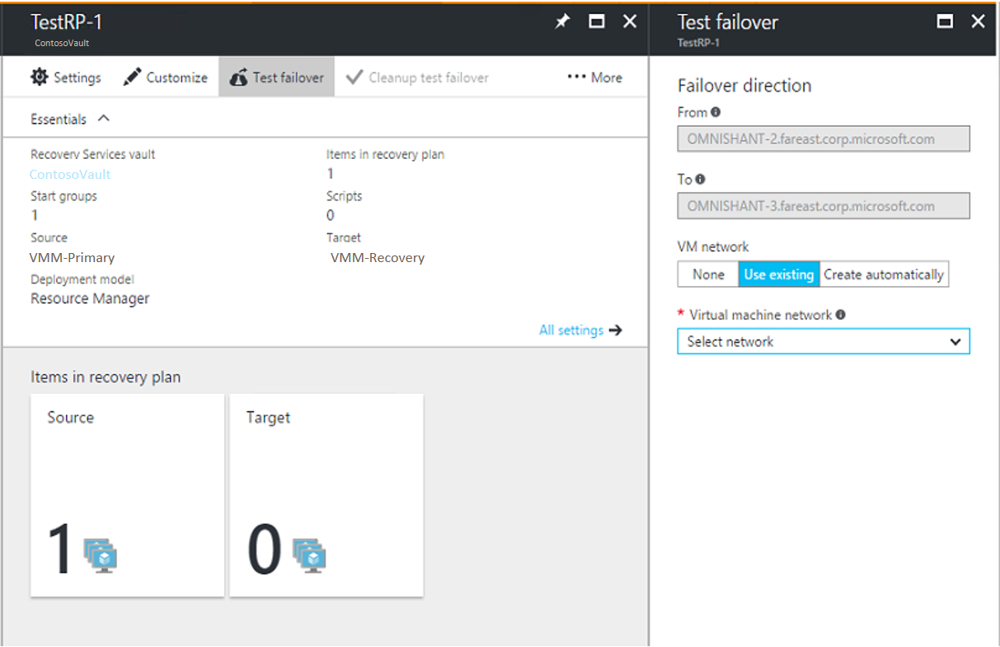

# Run a DR drill for Hyper-V VMs to a secondary site

This article describes how to do a disaster recovery (DR) drill for Hyper-V VMs that are managed in System Center Virtual Machine Manager V(MM) clouds, to a secondary on-premises site, using [Azure Site Recovery](site-recovery-overview.md).

You run a test failover to validate your replication strategy, and perform a DR drill without any data loss or downtime. A test failover doesn't have any impact on the ongoing replication, or on your production environment. 

## How do test failovers work?

You run a test failover from the primary to the secondary site. If you simply want to check that a VM fails over, you can run a test failover without setting anything up on the secondary site. If you want to verify app failover works as expected, you will need to set up networking and infrastructure in the secondary location.
- You can run a test failover on a single VM, or on a [recovery plan](site-recovery-create-recovery-plans.md).
- You can run a test failover without a network, with an existing network, or with an automatically created network. More details about these options are provided in the table below.
    - You can run a test failover without a network. This option is useful if you simply want to check that a VM was able to fail over, but you won't be able to verify any network configuration.
    - Run the failover with an existing network. We recommend you don't use a production network.
    - Run the failover and let Site Recovery automatically create a test network. In this case Site Recovery will create the network automatically, and clean it up when test failover is complete.
- You need to select a recovery point for the test failover: 
    - **Latest processed**: This option fails a VM over to the latest recovery point processed by Site Recovery. This option provides a low RTO (Recovery Time Objective), because no time is spent processing unprocessed data.
    - **Latest app-consistent**: This option fail over a VM to the latest application-consistent recovery point processed by Site Recovery. 
    - **Latest**: This option first processes all the data that has been sent to Site Recovery service, to create a recovery point for each VM before failing over to it. This option provides the lowest RPO (Recovery Point Objective), because the VM created after failover will have all the data replicated to Site Recovery when the failover was triggered.
    - **Latest multi-VM processed**: Available for recovery plans that include one or more VMs that have multi-VM consistency enabled. VMs with the setting enabled fail over to the latest common multi-VM consistent recovery point. Other VMs fail over to the latest processed recovery point.
    - **Latest multi-VM app-consistent**: This option is available for recovery plans with one or more VMs that have multi-VM consistency enabled. VMs that are part of a replication group fail over to the latest common multi-VM application-consistent recovery point. Other VMs fail over to their latest application-consistent recovery point.
    - **Custom**: Use this option to fail over a specific VM to a particular recovery point.

## Prepare networking

When you run a test failover, you're asked to select network settings for test replica machines, as summarized in the table.

| **Option** | **Details** | |
| --- | --- | --- |
| **None** | The test VM is created on the host on which the replica VM is located. It isn’t added to the cloud, and isn't connected to any network.   You can connect the machine to a VM network after it has been created.| |
| **Use existing** | The test VM is created on the host on which the replica VM is located. It isn’t added to the cloud.  Create a VM network that's isolated from your production network.  If you're using a VLAN-based network, we recommend that you create a separate logical network (not used in production) in VMM for this purpose. This logical network is used to create VM networks for test failovers.  The logical network should be associated with at least one of the network adapters of all the Hyper-V servers that are hosting virtual machines.  For VLAN logical networks, the network sites that you add to the logical network should be isolated.  If you’re using a Windows Network Virtualization–based logical network, Azure Site Recovery automatically creates isolated VM networks. | |
| **Create a network** | A temporary test network is created automatically based on the setting that you specify in **Logical Network** and its related network sites.   Failover checks that VMs are created.   You should use this option if a recovery plan uses more than one VM network.   If you're using Windows Network Virtualization networks, this option can automatically create VM networks with the same settings (subnets and IP address pools) in the network of the replica virtual machine. These VM networks are cleaned up automatically after the test failover is complete.   The test VM is created on the host on which the replica virtual machine exists. It isn’t added to the cloud.|

### Best practices

- Testing a production network causes downtime for production workloads. Ask your users not to use related apps when the disaster recovery drill is in progress.

- The test network doesn't need to match the VMM logical network type used for test failover. But, some combinations don't work:

     - If the replica uses DHCP and VLAN-based isolation, the VM network for the replica doesn't need a static IP address pool. So using Windows Network Virtualization for the test failover won't work because no address pools are available. 
        
     - Test failover won't work if the replica network uses no isolation, and the test network uses Windows Network Virtualization. This is because the no-isolation network doesn't have the subnets required to create a Windows Network Virtualization network.
        
- We recommend that you don't use the network you selected for network mapping, for test failover.

- How replica virtual machines are connected to mapped VM networks after failover depends on how the VM network is configured in the VMM console.

### VM network configured with no isolation or VLAN isolation

If a VM network is configured in VMM with no isolation, or VLAN isolation, note the following:

- If DHCP is defined for the VM network, the replica virtual machine is connected to the VLAN ID through the settings that are specified for the network site in the associated logical network. The virtual machine receives its IP address from the available DHCP server.
- You don't need to define a static IP address pool for the target VM network. If a static IP address pool is used for the VM network, the replica virtual machine is connected to the VLAN ID through the settings that are specified for the network site in the associated logical network.
- The virtual machine receives its IP address from the pool that's defined for the VM network. If a static IP address pool isn't defined on the target VM network, IP address allocation will fail. Create the IP address pool on both the source and target VMM servers that you will use for protection and recovery.

### VM network with Windows Network Virtualization

If a VM network is configured in VMM with Windows Network Virtualization, note the following:

- You should define a static pool for the target VM network, regardless of whether the source VM network is configured to use DHCP or a static IP address pool. 
- If you define DHCP, the target VMM server acts as a DHCP server and provides an IP address from the pool that's defined for the target VM network.
- If use of a static IP address pool is defined for the source server, the target VMM server allocates an IP address from the pool. In both cases, IP address allocation will fail if a static IP address pool is not defined.

## Prepare the infrastructure

If you simply want to check that a VM can fail over, you can run a test failover without an infrastructure. If you want to do a full DR drill to test app failover, you need to prepare the infrastructure at the secondary site:

- If you run a test failover using an existing network, prepare Active Directory, DHCP, and DNS in that network.
- If you run a test failover with the option to create a VM network automatically, you need to add infrastructure resources to the automatically created network, before you run the test failover. In a recovery plan, you can facilitate this by adding a manual step before Group-1 in the recovery plan that you’re going to use for the test failover. Then, add the infrastructure resources to the automatically created network before you run the test failover.

### Prepare DHCP
If the virtual machines involved in test failover use DHCP, create a test DHCP server within the isolated network for the purpose of test failover.

### Prepare Active Directory
To run a test failover for application testing, you need a copy of the production Active Directory environment in your test environment. For more information, review the [test failover considerations for Active Directory](site-recovery-active-directory.md#test-failover-considerations).

### Prepare DNS
Prepare a DNS server for the test failover as follows:

* **DHCP**: If virtual machines use DHCP, the IP address of the test DNS should be updated on the test DHCP server. If you’re using a network type of Windows Network Virtualization, the VMM server acts as the DHCP server. Therefore, the IP address of DNS should be updated in the test failover network. In this case, the virtual machines register themselves to the relevant DNS server.
* **Static address**: If virtual machines use a static IP address, the IP address of the test DNS server should be updated in test failover network. You might need to update DNS with the IP address of the test virtual machines. You can use the following sample script for this purpose:

        Param(
        [string]$Zone,
        [string]$name,
        [string]$IP
        )
        $Record = Get-DnsServerResourceRecord -ZoneName $zone -Name $name
        $newrecord = $record.clone()
        $newrecord.RecordData[0].IPv4Address  =  $IP
        Set-DnsServerResourceRecord -zonename $zone -OldInputObject $record -NewInputObject $Newrecord

## Run a test failover

This procedure describes how to run a test failover for a recovery plan. Alternatively, you can run the failover for a single virtual machine on the **Virtual Machines** tab.

1. Select **Recovery Plans** > *recoveryplan_name*. Click **Failover** > **Test Failover**.
2. On the **Test Failover** blade, specify how replica VMs should be connected to networks after the test failover.
3. Track failover progress on the **Jobs** tab.
4. After failover is complete, verify that the VMs start successfully.
5. When you're done, click **Cleanup test failover** on the recovery plan. In **Notes**, record and save any observations associated with the test failover. This step deletes any VMs and networks that were created by Site Recovery during test failover. 

 

> [!TIP]
> The IP address given to a virtual machine during test failover is the same IP address that the virtual machine would receive for a planned or unplanned failover (presuming that the IP address is available in the test failover network). If the same IP address isn't available in the test failover network, the virtual machine receives another IP address that's available in the test failover network.

### Run a test failover to a production network

We recommend that you don't run a test failover to your production recovery site network that you specified during network mapping. But if you do need to validate end-to-end network connectivity in a failed-over VM, note the following points:

* Make sure that the primary VM is shut down when you're doing the test failover. If you don't, two virtual machines with the same identity will be running in the same network at the same time. That situation can lead to undesired consequences.
* Any changes that you make to the test failover VMs are lost when you clean up the test failover virtual machines. These changes are not replicated back to the primary VMs.
* Testing like this leads to downtime for your production application. Ask users of the application not to use the application when the DR drill is in progress.  

## Next steps
After you have successfully run a DR drill, you can [run a full failover](site-recovery-failover.md).

