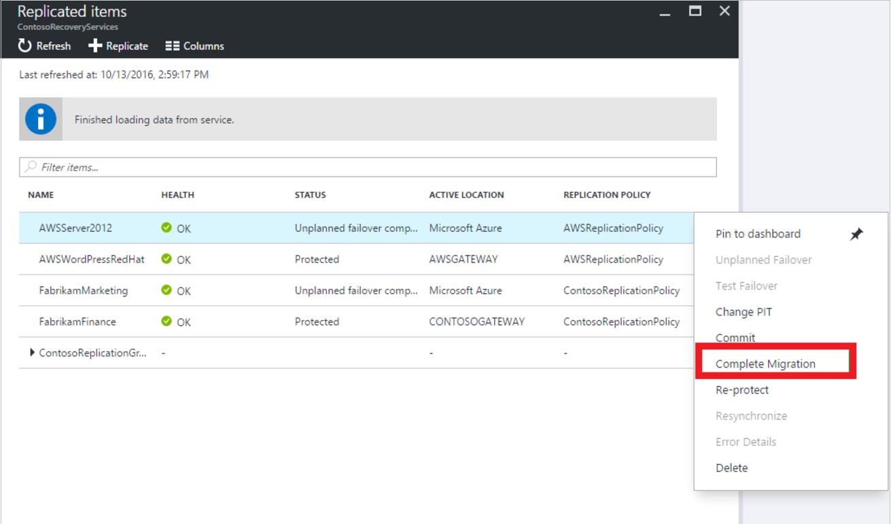

# Migrate on-premises machines to Azure

This article describes how to migrate on-premises machines to Azure, using the [Azure Site Recovery](site-recovery-overview.md). 

> [!TIP]
> You should now use Azure Migrate to migrate on-premises machines to Azure, instead of the Azure Site Recovery service. [Learn more](../migrate/migrate-services-overview.md).

This tutorial shows you how to migrate on-premises VMs and physical servers to Azure. You learn how to:

> [!div class="checklist"]
> * Set up the source and target environment for migration
> * Set up a replication policy
> * Enable replication
> * Run a test migration to make sure everything's working as expected
> * Run a one-time failover to Azure

> [!TIP]
> You can now migrate on-premises servers to Azure using the Azure Migrate service. [Learn more](../migrate/migrate-services-overview.md)

## Before you start

Devices exported by paravirtualized drivers aren't supported.

## Prepare Azure and on-premises

1. Prepare Azure as described in [this article](tutorial-prepare-azure.md). Although this article describes preparation steps for disaster recovery, the steps are also valid for migration.
2. Prepare on-premises [VMware](vmware-azure-tutorial-prepare-on-premises.md) or [Hyper-V](hyper-v-prepare-on-premises-tutorial.md) servers. If you're migrating physical machines, you don't need to prepare anything. Just verify the [support matrix](vmware-physical-azure-support-matrix.md).

## Select a protection goal

Select what you want to replicate, and where you want to replicate to.
1. Click **Recovery Services vaults** > vault.
2. In the Resource Menu, click **Site Recovery** > **Prepare Infrastructure** > **Protection goal**.
3. In **Protection goal**, select what you want to migrate.
    - **VMware**: Select **To Azure** > **Yes, with VMWare vSphere Hypervisor**.
    - **Physical machine**: Select **To Azure** > **Not virtualized/Other**.
    - **Hyper-V**: Select **To Azure** > **Yes, with Hyper-V**. If Hyper-V VMs are managed by VMM, select **Yes**.

## Set up the source environment

**Scenario** | **Details**
--- | --- 
VMware | Set up the [source environment](vmware-azure-set-up-source.md), and set up the [configuration server](vmware-azure-deploy-configuration-server.md).
Physical machine | [Set up](physical-azure-set-up-source.md) the source environment and configuration server.
Hyper-V | Set up the [source environment](hyper-v-azure-tutorial.md#set-up-the-source-environment)   Set up the [source environment](hyper-v-vmm-azure-tutorial.md#set-up-the-source-environment) for Hyper-V deployed with System Center VMM.

## Set up the target environment

Select and verify target resources.

1. Click **Prepare infrastructure** > **Target**, and select the Azure subscription you want to use.
2. Specify the Resource Manager deployment model.
3. Site Recovery checks the Azure resources.
    - If you're migrating VMware VMs or physical servers, Site Recovery verifies you have an Azure network in which the Azure VMs will be located when they're created after failover.
    - If you're migrating Hyper-V VMs, Site Recovery verifies you have a compatible Azure storage account and network.
4. If you're migrating Hyper-V VMs managed by System Center VMM, set up [network mapping](hyper-v-vmm-azure-tutorial.md#configure-network-mapping).

## Set up a replication policy

**Scenario** | **Details**
--- | --- 
VMware | Set up a [replication policy](vmware-azure-set-up-replication.md) for VMware VMs.
Physical machine | Set up a [replication policy](physical-azure-disaster-recovery.md#create-a-replication-policy) for physical machines.
Hyper-V | Set up a [replication policy](hyper-v-azure-tutorial.md#set-up-a-replication-policy)   Set up a [replication policy](hyper-v-vmm-azure-tutorial.md#set-up-a-replication-policy) for Hyper-V deployed with System Center VMM.

## Enable replication

**Scenario** | **Details**
--- | --- 
VMware | [Enable replication](vmware-azure-enable-replication.md) for VMware VMs.
Physical machine | [Enable replication](physical-azure-disaster-recovery.md#enable-replication) for physical machines.
Hyper-V | [Enable replication](hyper-v-azure-tutorial.md#enable-replication)   [Enable replication](hyper-v-vmm-azure-tutorial.md#enable-replication) for Hyper-V deployed with System Center VMM.

## Run a test migration

Run a [test failover](tutorial-dr-drill-azure.md) to Azure, to make sure everything's working as expected.

## Migrate to Azure

Run a failover for the machines you want to migrate.

1. In **Settings** > **Replicated items** click the machine > **Failover**.
2. In **Failover** select a **Recovery Point** to fail over to. Select the latest recovery point.
3. The encryption key setting isn't relevant for this scenario.
4. Select **Shut down machine before beginning failover**. Site Recovery will attempt to shutdown virtual machines before triggering the failover. Failover continues even if shutdown fails. You can follow the failover progress on the **Jobs** page.
5. Check that the Azure VM appears in Azure as expected.
6. In **Replicated items**, right-click the VM > **Complete Migration**. This does the following:

   - Finishes the migration process, stops replication for the on-premises VM, and stops Site Recovery billing for the VM.
   - This step cleans up the replication data. It doesn't delete the migrated VMs.

     

> [!WARNING]
> **Don't cancel a failover in progress**: VM replication is stopped before failover starts. If you cancel a failover in progress, failover stops, but the VM won't replicate again.

In some scenarios, failover requires additional processing that takes around eight to ten minutes to complete. You might notice longer test failover times for physical servers, VMware Linux machines, VMware VMs that don't have the DHCP service enabled, and VMware VMs that don't have the following boot drivers: storvsc, vmbus, storflt, intelide, atapi.

## After migration

After machines are migrated to Azure, there are a number of steps you should complete.

Some steps can be automated as part of the migration process using the in-built automation scripts capability in [recovery plans](site-recovery-runbook-automation.md)   

### Post-migration steps in Azure

- Perform any post-migration app tweaks, such as updating database connection strings, and web server configurations. 
- Perform final application and migration acceptance testing on the migrated application now running in Azure.
- The [Azure VM agent](https://docs.microsoft.com/azure/virtual-machines/extensions/agent-windows) manages VM interaction with the Azure Fabric Controller. It's required for some Azure services, such as Azure Backup, Site Recovery, and Azure Security.
    - If you're migrating VMware machines and physical servers, the Mobility Service installer installs available Azure VM agent on Windows machines. On Linux VMs, we recommend that you install the agent after failover.
    - If you're migrating Azure VMs to a secondary region, the Azure VM agent must be provisioned on the VM before the migration.
    - If you're migrating Hyper-V VMs to Azure, install the Azure VM agent on the Azure VM after the migration.
- Manually remove any Site Recovery provider/agent from the VM. If you migrate VMware VMs or physical servers, uninstall the Mobility service from the VM.
- For increased resilience:
    - Keep data secure by backing up Azure VMs using the Azure Backup service. [Learn more]( https://docs.microsoft.com/azure/backup/quick-backup-vm-portal).
    - Keep workloads running and continuously available by replicating Azure VMs to a secondary region with Site Recovery. [Learn more](azure-to-azure-quickstart.md).
- For increased security:
    - Lock down and limit inbound traffic access with Azure Security Center [Just in time administration]( https://docs.microsoft.com/azure/security-center/security-center-just-in-time)
    - Restrict network traffic to management endpoints with [Network Security Groups](https://docs.microsoft.com/azure/virtual-network/security-overview).
    - Deploy [Azure Disk Encryption](https://docs.microsoft.com/azure/security/azure-security-disk-encryption-overview) to help secure disks, and keep data safe from theft and unauthorized access.
    - Read more about [securing IaaS resources]( https://azure.microsoft.com/services/virtual-machines/secure-well-managed-iaas/ ), and visit the [Azure Security Center](https://azure.microsoft.com/services/security-center/ ).
- For monitoring and management:
    - Consider deploying [Azure Cost Management](https://docs.microsoft.com/azure/cost-management/overview) to monitor resource usage and spending.

### Post-migration steps on-premises

- Move app traffic over to the app running on the migrated Azure VM instance.
- Remove the on-premises VMs from your local VM inventory.
- Remove the on-premises VMs from local backups.
- Update any internal documentation to show the new location and IP address of the Azure VMs.

## Next steps

In this tutorial you migrated on-premises VMs to Azure VMs. Now

> [!div class="nextstepaction"]
> [Set up disaster recovery](azure-to-azure-replicate-after-migration.md) to a secondary Azure region for the Azure VMs.

  
