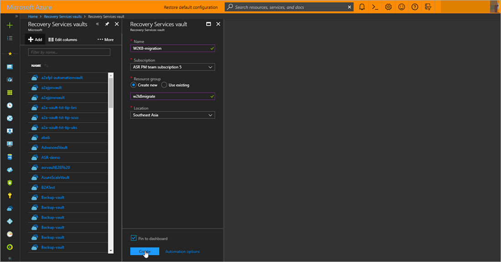
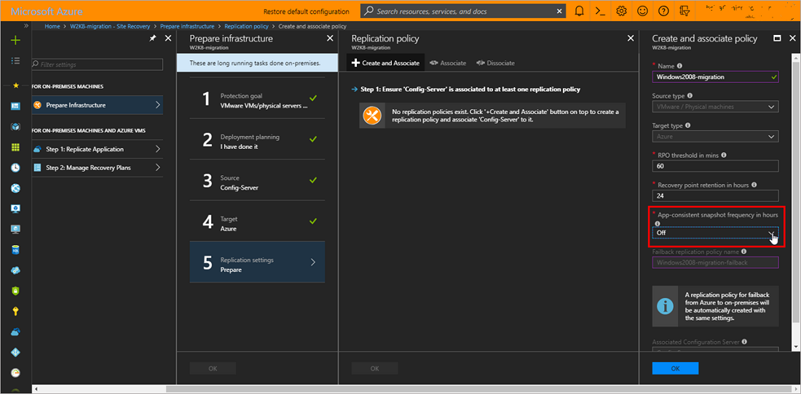
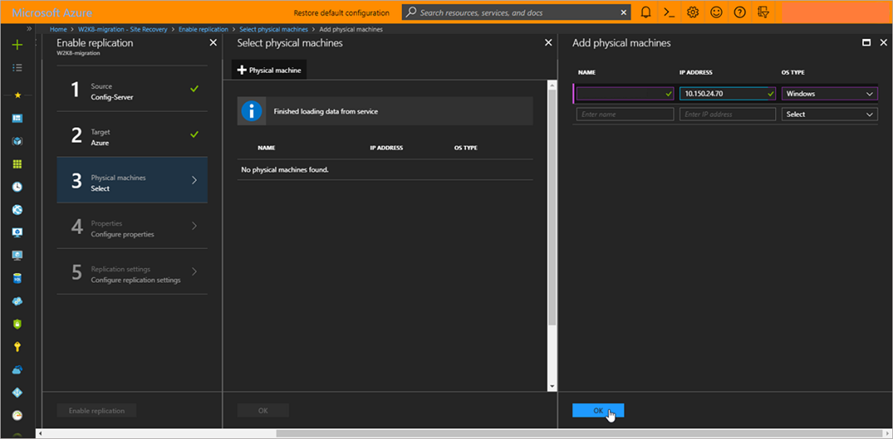
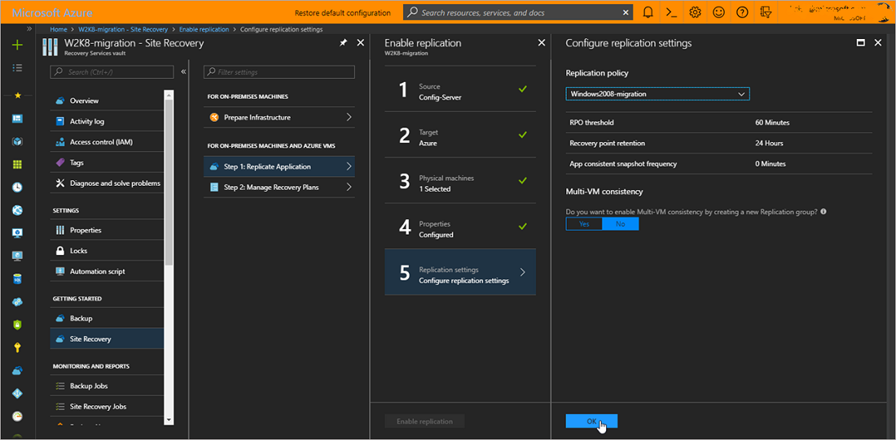
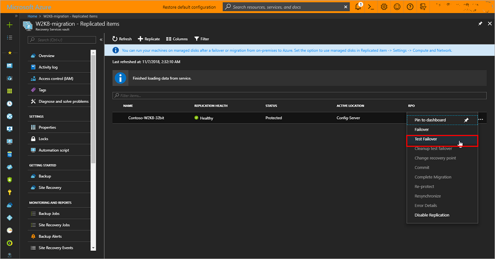

# Migrate servers running Windows Server 2008 to Azure

This tutorial shows you how to migrate on-premises servers running Windows Server 2008 or 2008 R2 to Azure using Azure Site Recovery. In this tutorial, you learn how to:

> [!div class="checklist"]
> * Prepare your on-premises environment for migration
> * Set up the target environment
> * Set up a replication policy
> * Enable replication
> * Run a test migration to make sure everything's working as expected
> * Failover to Azure and complete the migration

The limitations and known issues section, lists some of limitations and workarounds for known issues that you may encounter while migrating Windows Server 2008 machines to Azure. 

> [!NOTE]
> You can now migrate from on-premises to Azure using the Azure Migrate service. [Learn more](../migrate/migrate-services-overview.md).

## Supported Operating Systems and environments

|Operating System  | On-premises environment  |
|---------|---------|
|Windows Server 2008 SP2 - 32 bit and 64 bit(IA-32 and x86-64) - Standard - Enterprise - Datacenter   |     VMware VMs, Hyper-V VMs, and Physical Servers    |
|Windows Server 2008 R2 SP1 - 64 bit - Standard - Enterprise - Datacenter     |     VMware VMs, Hyper-V VMs, and Physical Servers|

> [!WARNING]
> - Migration of servers running Server Core is not supported.
> - Ensure that you have the latest service pack and Windows updates installed before migrating.

## Prerequisites

Before you start, it's helpful to review the Azure Site Recovery architecture for [VMware and Physical server migration](vmware-azure-architecture.md) or [Hyper-V virtual machine migration](hyper-v-azure-architecture.md) 

To migrate Hyper-V virtual machines running Windows Server 2008 or Windows Server 2008 R2, follow the steps in the [migrate on-premises machines to Azure](migrate-tutorial-on-premises-azure.md) tutorial.

The rest of this tutorial shows you how you can migrate on-premises VMware virtual machines and Physical servers running Windows Server 2008 or 2008 R2.
> [!TIP]
> Looking for an agentless way to migrate VMware VMs to Azure? [Click here](https://aka.ms/migrateVMs-signup)

## Limitations and known issues

- The Configuration Server, additional process servers, and mobility service used to migrate Windows Server 2008 SP2 servers should be running version 9.19.0.0 or later of the Azure Site Recovery software.

- Application consistent recovery points and the multi-VM consistency feature are not supported for replication of servers running Windows Server 2008 SP2. Windows Server 2008 SP2 servers should be migrated to a crash consistent recovery point. Crash consistent recovery points are generated every 5 minutes by default. Using a replication policy with a configured application consistent snapshot frequency will cause replication health to turn critical due to the lack of application consistent recovery points. To avoid false positives, set the application-consistent snapshot frequency in the replication policy to "Off".

- The servers being migrated should have .NET Framework 3.5 Service Pack 1 for the mobility service to work.

- If your server has dynamic disks, you may notice in certain configurations, that these disks on the failed over server are marked offline or shown as foreign disks. You may also notice that the mirrored set status for mirrored volumes across dynamic disks is marked "Failed redundancy". You can fix this issue from diskmgmt.msc by manually importing these disks and reactivating them.

- The servers being migrated should have the vmstorfl.sys driver. Failover may fail if the driver is not present in the server being migrated. 
  > [!TIP]
  >Check if the driver is present at "C:\Windows\system32\drivers\vmstorfl.sys" . If the driver is not found, you can workaround the issue by creating a dummy file in place. 
  >
  > Open command prompt (run > cmd) and run the following: "copy nul c:\Windows\system32\drivers\vmstorfl.sys"

- You may be unable to RDP to Windows Server 2008 SP2 servers running the 32-bit operating system immediately after they are failed over or test failed over to Azure. Restart the failed over virtual machine from the Azure portal and try connecting again. If you are still unable to connect, check if the server is configured to allow remote desktop connections, and ensure that there are no firewall rules or network security groups blocking the connection. 
  > [!TIP]
  > A test failover is highly recommended before migrating servers. Ensure that  you've performed at least one successful test failover on each server that you  are migrating. As part of the test failover, connect to the test failed over  machine and ensure things work as expected.
  >
  >The test failover operation is non-disruptive and helps you test migrations by  creating virtual machines in an isolated network of your choice. Unlike the  failover operation, during the test failover operation, data replication  continues to progres. You can perform as many test failovers as you like before  you are ready to migrate. 
  >
  >

## Getting started

Perform the following tasks to prepare the Azure subscription and on-premises VMware/Physical environment:

1. [Prepare Azure](tutorial-prepare-azure.md)
2. Prepare on-premises [VMware](vmware-azure-tutorial-prepare-on-premises.md)

## Create a Recovery Services vault

1. Sign in to the [Azure portal](https://portal.azure.com) > **Recovery Services**.
2. Click **Create a resource** > **Management Tools** > **Backup and Site Recovery**.
3. In **Name**, specify the friendly name **W2K8-migration**. If you have more than one
   subscription, select the appropriate one.
4. Create a resource group **w2k8migrate**.
5. Specify an Azure region. To check supported regions, see geographic availability in [Azure Site Recovery Pricing Details](https://azure.microsoft.com/pricing/details/site-recovery/).
6. To quickly access the vault from the dashboard, click **Pin to dashboard** and then click **Create**.

   

The new vault is added to the **Dashboard** under **All resources**, and on the main **Recovery Services vaults** page.

## Prepare your on-premises environment for migration

- To migrate Windows Server 2008 virtual machines running on VMware, [setup the on-premises Configuration Server on VMware](vmware-azure-tutorial.md#set-up-the-source-environment).
- If the Configuration Server cannot be setup as a VMware virtual machine, [setup the Configuration Server on an on-premises physical server or virtual machine](physical-azure-disaster-recovery.md#set-up-the-source-environment).

## Set up the target environment

Select and verify target resources.

1. Click **Prepare infrastructure** > **Target**, and select the Azure subscription you want to use.
2. Specify the Resource Manager deployment model.
3. Site Recovery checks that you have one or more compatible Azure storage accounts and networks.

## Set up a replication policy

1. To create a new replication policy, click **Site Recovery infrastructure** > **Replication Policies** > **+Replication Policy**.
2. In **Create replication policy**, specify a policy name.
3. In **RPO threshold**, specify the recovery point objective (RPO) limit. An alert is generated if the replication RPO exceeds this limit.
4. In **Recovery point retention**, specify how long (in hours) the retention window is for each recovery point. Replicated servers can be recovered to any point in this window. Up to 24 hours retention is supported for machines replicated to premium storage, and 72 hours for standard storage.
5. In **App-consistent snapshot frequency**, specify **Off**. Click **OK** to create the policy.

The policy is automatically associated with the configuration server.

> [!WARNING]
> Ensure that you specify **OFF** in the App-consistent snapshot frequency setting of the replication policy. Only crash-consistent recovery points are supported while replicating servers running Windows Server 2008. Specifying any other value for the App-consistent snapshot frequency will result in false alerts by turning replication health of the server critical due to lack of App-consistent recovery points.

   

## Enable replication

[Enable replication](physical-azure-disaster-recovery.md#enable-replication) for the Windows Server 2008 SP2 / Windows Server 2008 R2 SP1 server to be migrated.
   
   

   

## Run a test migration

You can perform a test failover of replicating servers after initial replication completes and the server status turns to **Protected**.

Run a [test failover](tutorial-dr-drill-azure.md) to Azure, to make sure everything's working as expected.

   

## Migrate to Azure

Run a failover for the machines you want to migrate.

1. In **Settings** > **Replicated items** click the machine > **Failover**.
2. In **Failover** select a **Recovery Point** to fail over to. Select the latest recovery point.
3. Select **Shut down machine before beginning failover**. Site Recovery will attempt to shut down the server before triggering the failover. Failover continues even if shutdown fails. You can follow the failover progress on the **Jobs** page.
4. Check that the Azure VM appears in Azure as expected.
5. In **Replicated items**, right-click the server > **Complete Migration**. This does the following:

    - Finishes the migration process, stops replication for the server, and stops Site Recovery billing for the serve.
    - This step cleans up the replication data. It doesn't delete the migrated VMs.

   

> [!WARNING]
> **Don't cancel a failover in progress**: Server replication is stopped before failover starts. If you cancel a failover in progress, failover stops, but the server won't continue to replicate.
