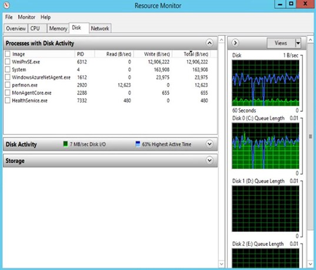
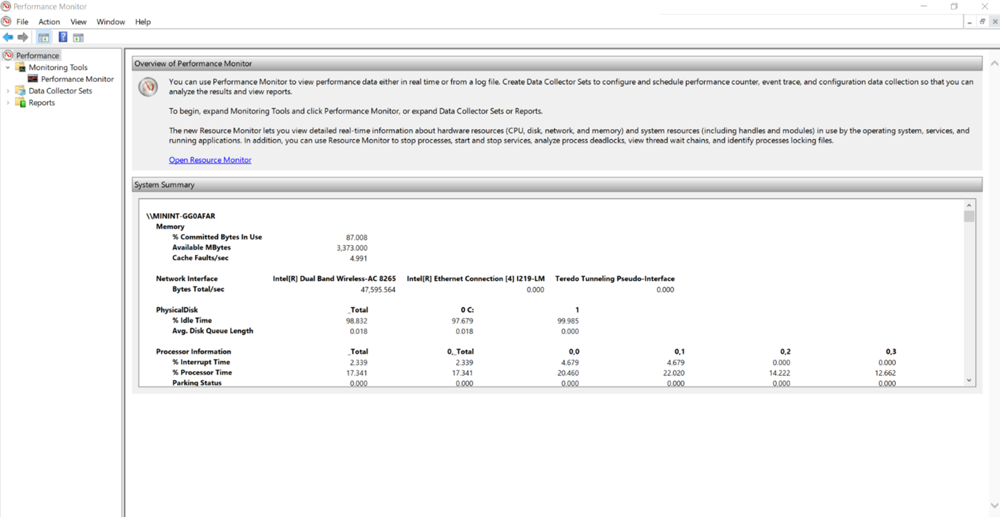

# Monitoring churn patterns on virtual machines

This article provides an overview of various tools that can be used to monitor churn patterns on a virtual machine. By using proper tools, it is easy to find out exactly which application is causing high churn and then further actions for that application can be taken.

## For Azure virtual machines (Windows or Linux)

If your machine is hosted in Azure and is using a managed or unmanaged disk for storage, then you can easily track performance, by tracking disk metrics. This enables you to closely monitor and make the right disk selection to suit your application usage pattern. You can also use it to create alerts, diagnosis, and build automation. [Learn more](https://azure.microsoft.com/blog/per-disk-metrics-managed-disks/).

Once you have protected your machines with Azure Site Recovery, you can monitor your machines by using Azure Monitor Logs and Log Analytics. [Learn more](./monitor-log-analytics.md).

There are also some operating system-specific tools that you can use.

## For Windows machines

In case you have a machine, be it on-premises or not, which is running Windows operating system, then there are a few more tools available.

Apart from checking the disk usage on Task Manager, you can always refer to **Resource Monitor** and **Performance Monitor**. These tools are already present on Windows machines.

### Resource Monitor

**Resource Monitor** displays information about the use of hardware and software resources in real time. To run Resource Monitor on a Windows machine, follow the below steps –

1. Press Win + R and type _resmon_.
1. Once the resmon, that is, Resource Monitor, window opens switch to the Disk tab. It gives following view -

    

1. This tab must be monitored continuously for some time to obtain a clear picture. In the above example, we see that _wmiprv.exe_ is churning high.

Once you have identified the applications causing high churn on your machine, you can take necessary actions to tackle the churn related to those applications.

### Performance Monitor

**Performance Monitor** monitors various activities on a computer such as CPU or memory usage. To run Performance Monitor on a Windows machine, follow the below steps –

1. Press Win + R and type _perfmon_.
1. Once the perfmon, that is, Performance Monitor, window opens, it gives following view -

    

1. Expand the **Monitoring Tools** folder on the right and click on Performance Monitor. This will open the below view giving you a real-time information about the current performance -

    

1. This graph is currently monitoring just one monitor, that is, the '% Processor Time' – as indicated by the table right below the graph. You can add more items for monitoring by clicking on the **‘+’** on top of the tool.
1. Below is a visual of how Performance Monitor looks like once we add more counters to it -

    

Learn more about Performance Monitor [here](/dynamics365/business-central/dev-itpro/administration/monitor-use-performance-monitor-collect-event-trace-data).

## For Linux machines

In case you have a machine, be it on-premises or not, which is running Linux operating system, then there are a few more tools available to monitor the churn patterns.

### Iotop

One of the most used tools is _iotop_. It is a utility for displaying real-time disk activity. It can list the processes that are performing I/O, along with the disk bandwidth they are using.

Open the command prompt and run the command `iotop` .

### IoStat

IoStat is simple tool that will collect and show system input and output storage device statistics. This tool is often used to trace storage device performance issues including devices, local disks, remote disks.

Open the command prompt and run the command `iostat` .

## Next steps

Learn how to monitor with [Azure Monitor](monitor-log-analytics.md).