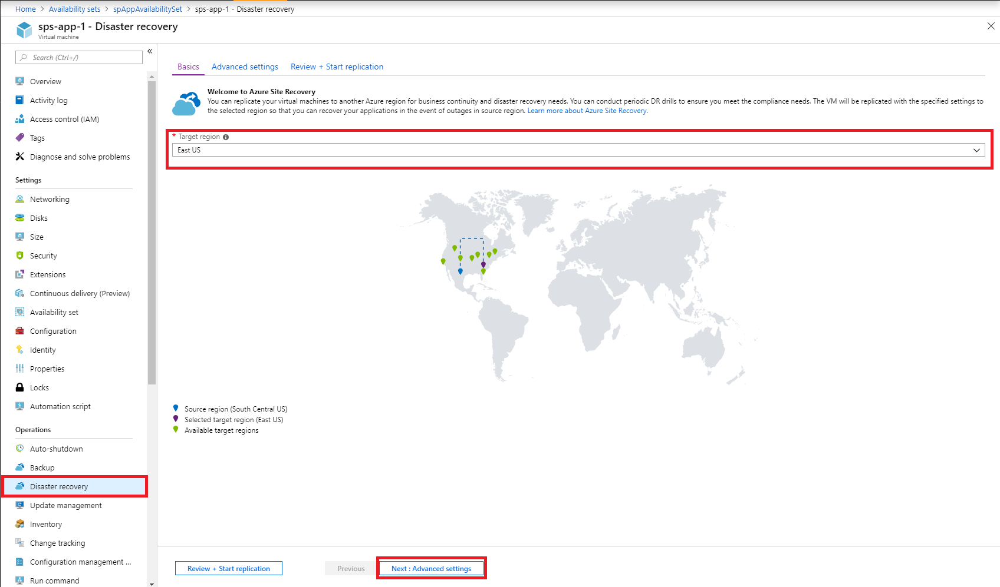
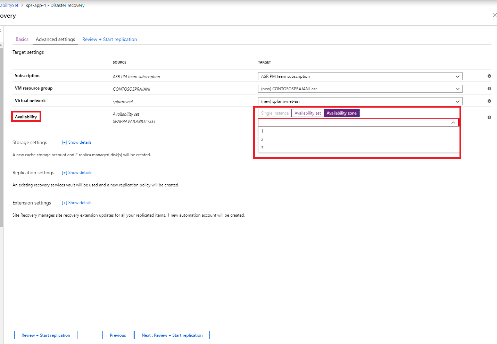

# Move Azure VMs into Availability Zones
Availability Zones in Azure protects your applications and data from datacenter failures. Each availability Zones is made up of one or more datacenters equipped with independent power, cooling, and networking. To ensure resiliency, there’s a minimum of three separate zones in all enabled regions. The physical separation of Availability Zones within a region protects applications and data from datacenter failures. With Availability Zones, Azure offers industry best 99.99% VM uptime SLA. Availability zone is supported in select regions as mentioned [here](https://docs.microsoft.com/azure/availability-zones/az-overview#regions-that-support-availability-zones). 

In a scenario where you deployed your Virtual machines as 'single instance' into a specific region, and you want to improve your availability by moving these into Availability zone, you can do so by using Azure Site Recovery. This can further be categorized into:

- Move single instance VMs into Availability zones in a target region
- Move VMs in an Availability set into Availability zones in a target region

> [!IMPORTANT]
> Currently Azure Site Recovery supports moving VMs from on region to another and doesn't support moving within a region. 

## Verify Prerequisites

- Verify if the target region has [support for Availability zone](https://docs.microsoft.com/azure/availability-zones/az-overview#regions-that-support-availability-zones)- Verify if your choice of [source region - target region combination is supported](https://docs.microsoft.com/azure/site-recovery/azure-to-azure-support-matrix#region-support) and make an informed decision on the target region.
- Make sure that you understand the [scenario architecture and components](azure-to-azure-architecture.md).
- Review the [support limitations and requirements](azure-to-azure-support-matrix.md).
- Verify account permissions: If you have just created your free Azure account then you are the administrator of your subscription. If you are not the subscription administrator, work with the administrator to assign the permissions you need. To enable replication for a VM and eventually copy data to the target using Azure Site Recovery, you must have:

    1. Permissions to create a VM in Azure resources. The 'Virtual Machine Contributor' built-in role has these permissions, which include:
        - Permission to create a VM in the selected resource group
        - Permission to create a VM in the selected virtual network
        - Permission to write to the selected storage account

    2. You also need permission to manage Azure Site Recovery operations. The 'Site Recovery Contributor' role has all permissions required to manage Site Recovery operations in a Recovery Services vault.

## Prepare the source VMs

1. Your VMs should be using managed disks if you want to move them to Availability zone using Site Recovery. You can convert existing Windows virtual machines (VMs) that use unmanaged disks, you can convert the VMs to use managed disks by following steps mentioned [here](https://docs.microsoft.com/azure/virtual-machines/windows/convert-unmanaged-to-managed-disks). For this,  ensure that the Availability set is configured as 'Managed. 
2. Check that all the latest root certificates are present on the Azure VMs you want to move. If the latest root certificates aren't present, the data copy to the target region cannot be enabled due to security constraints.

3. For Windows VMs, install all the latest Windows updates on the VM, so that all the trusted root certificates are on the machine. In a disconnected environment, follow the standard Windows Update and certificate update processes for your organization.

4. For Linux VMs, follow the guidance provided by your Linux distributor, to get the latest trusted root certificates and certificate revocation list on the VM.
5. Make sure you're not using an authentication proxy to control network connectivity for VMs you want to move.

6. If the VM you are trying to move doesn't have access to internet and is using a firewall proxy to control outbound access, please check the requirements [here](azure-to-azure-tutorial-enable-replication.md#configure-outbound-network-connectivity).

7. Identify the source networking layout and all the resources that you are currently using - including load balancers, NSGs, public IP etc. for your verification.

## Prepare the target region

1. Verify that your Azure subscription allows you to create VMs in the target region used for disaster recovery. Contact support to enable the required quota if required.

2. Make sure your subscription has enough resources to support VMs with sizes that match your source VMs. if you are using Site Recovery to copy data to the target, it picks the same size or the closest possible size for the target VM.

3. Ensure that you create a target resource for every component identified in the source networking layout. This is important to ensure that, post cutting over to the target region, your VMs have all the functionality & features that you had in the source.

    > [!NOTE]
    > Azure Site Recovery automatically discovers and creates a virtual network & storage account when you enable replication for the source VM, or you can also pre-create these resources and assign to the VM as part of the enable replication step. But for any other resources, as mentioned below, you need to manually create them in the target region.

     Please refer to the following documents to create the most commonly used network resources relevant to you, based on the source VM configuration.

    - [Network Security Groups](https://docs.microsoft.com/azure/virtual-network/manage-network-security-group)
    - [Load balancers](https://docs.microsoft.com/azure/load-balancer/#step-by-step-tutorials
        
     - [Public IP](https://docs.microsoft.com/azure/load-balancer/#step-by-step-tutorials)
    
   For any other networking components, refer to the networking [documentation.](https://docs.microsoft.com/azure/#pivot=products&panel=network) 

> [!IMPORTANT]
> Ensure to use a zone redundant load balancer in the target. You can read more [here](https://docs.microsoft.com/azure/load-balancer/load-balancer-standard-availability-zones).

4. Manually [create a non-production network](https://docs.microsoft.com/azure/virtual-network/quick-create-portal) in the target region if you wish to test the configuration before you perform the final cut over to the target region. This will create minimal interference with the production environment and is recommended.

> [!NOTE]
> The below steps are for a single VM, you can extend the same to multiple VMs by navigating to the Recovery Services vault and clicking on + Replicate and selecting the relevant VMs together.

## Enable replication
The below steps will guide you how to use Azure Site Recovery to enable replication of data to the target region, before you eventually move them into Availability Zones.

1. In the Azure portal, click **Virtual machines**, and select the VM you want to move into Availability zones.
2. In **Operations**, click **Disaster recovery**.
3. In **Configure disaster recovery** > **Target region** select the target region to which you'll replicate. Ensure this region [supports](https://docs.microsoft.com/azure/availability-zones/az-overview#regions-that-support-availability-zones) Availability zones.

1. Select **Next: Advanced settings**
2. Choose the appropraite values for Target subscriptiom, target VM Resource Group & virtual network.
3. In the **Availability** section, choose the Availabilty zone into which you want to move the VM. 
> [!NOTE]
> If you don’t see the option for availability set or Availabilty zone, please ensure that the [prerequisites](#prepare-the-source-vms) are met and the [preparation](#prepare-the-source-vms) of source VMs are complete.

   

7. Click on enable replicaiton. This starts a job to enable replication for the VM.

## Verify settings

After the replication job has finished, you can check the replication status, modify replication settings, and test the deployment.

1. In the VM menu, click **Disaster recovery**.
2. You can verify replication health, the recovery points that have been created, and source, target regions on the map.

   

## Test the configuration

1. In the virtual machine menu, click on  **Disaster Recovery**.
2. Click **Test Failover** icon.
3. In **Test Failover**, Select a recovery point to use for the failover:

   - **Latest processed**: Fails the VM over to the latest recovery point that was processed by the
     Site Recovery service. The time stamp is shown. With this option, no time is spent processing
     data, so it provides a low RTO (Recovery Time Objective)
   - **Latest app-consistent**: This option fails over all VMs to the latest app-consistent
     recovery point. The time stamp is shown.
   - **Custom**: Select any recovery point.

3. Select the test target Azure virtual network to which you want to move the Azure VMs to test the configuration. 

> [!IMPORTANT]
> We recommend that you use a separate Azure VM network for the test failure, and not the production network in the target region into which you want to move your VMs eventually.

4. To start testing the move, click **OK**. To track progress, click the VM to open its properties. Or,
   you can click the **Test Failover** job in the vault name > **Settings** > **Jobs** > **Site Recovery jobs**.
5. After the failover finishes, the replica Azure VM appears in the Azure portal > **Virtual Machines**. Make sure that the VM is running, sized appropriately, and connected to the appropriate network.
6. If you wish to delete the VM created as part of testing the move, click **Cleanup test failover** on the replicated item. In **Notes**, record and save any observations associated with the test.

## Perform the move to the target region and confirm.

1.  In the virtual machine menu, click on  **Disaster Recovery**.
2. Click on **Failover** icon.
3. In **Failover**, select **Latest**. 
4. Select **Shut down machine before beginning failover**. Site Recovery attempts to shut down the source VM before triggering the failover. Failover continues even if shutdown fails. You can follow the failover progress on the **Jobs** page. 
5. Once the job is complete, check that the VM appears in the target Azure region as expected.
6. In **Replicated items**, right-click the VM > **Commit**. This finishes the move process to the target region. Wait till the commit job completes.

## Discard the resource in the source region 

1. Navigate to the VM.  Click on **Disable Replication**.  This stops the process of copying the data for the VM.  

> [!IMPORTANT]
> It is important to perform the above step to avoid getting charged for Site Recovery replication post the move. The source replication settings are cleaned up automatically. Please note that the Site Recovery extension that is installed as part of the replication isn't removed and needs to be removed manually. 

## Next steps

In this tutorial you increased the availability of an Azure VM by moving into an Availability set or Availability Zone. Now you can configure disaster recovery for the moved VM.

> [!div class="nextstepaction"]
> [Set up disaster recovery after migration](azure-to-azure-quickstart.md)

