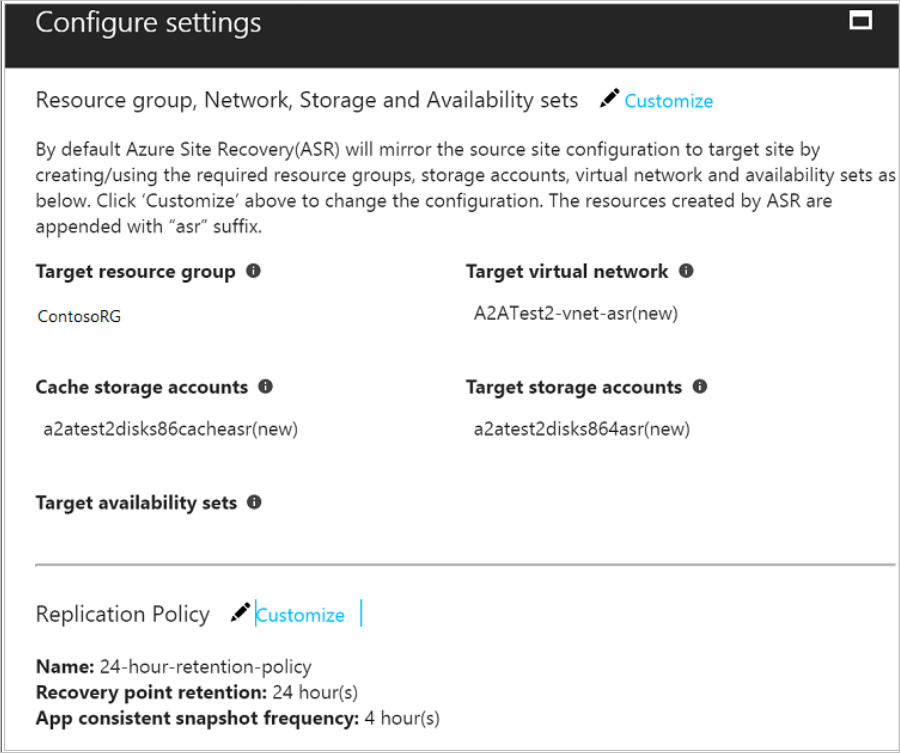

# Move Azure VMs to another region

You might want to move Azure infrastructure as a service (IaaS) virtual machines from one region to another to improve reliability, availability, management, or governance. This tutorial shows you how to move VMs to another region by using Azure Site Recovery. You'll learn how to:

> [!div class="checklist"]
> * Verify prerequisites
> * Prepare the source VMs
> * Prepare the target region
> * Copy data to the target region
> * Test the configuration
> * Perform the move
> * Discard the resources from the source region

> [!IMPORTANT]
> This article describes how to move Azure VMs from one region to another *as is*. If your goal is to improve the availability of your infrastructure by moving VMs to availability zones, see [Move Azure VMs to Availability Zones](move-azure-vms-avset-azone.md).

## Prerequisites

- Make sure that you have Azure VMs in the source Azure region that you want to move *from*.
- Verify that your choice of [source region-target region combination is supported](https://docs.microsoft.com/azure/site-recovery/azure-to-azure-support-matrix#region-support), and carefully choose the target region.
- Make sure that you understand the [scenario architecture and components](azure-to-azure-architecture.md).
- Review the [support limitations and requirements](azure-to-azure-support-matrix.md).
- Verify account permissions. If you just created your free Azure account, *you* are the administrator of your subscription. If you aren't the administrator, work with the administrator to get the permissions that you need:
  -  To enable replication for a VM and copy data to the target by using Site Recovery, you must have permissions to create a VM in your Azure resources. The Virtual Machine Contributor built-in role has these permissions. With the permissions, you can:
        - Create a VM in the selected resource group.
        - Create a VM in the selected virtual network.
        - Write to the selected storage account.

  - You also need permissions to manage Site Recovery operations. The Site Recovery Contributor role has all the permissions that are required to manage Site Recovery operations in an Azure Recovery Services vault.

## Prepare the source VMs

1. Check that the Azure VMs that you plan to move have the latest root certificates. If they don't, you can't enable data copy to the target region because of security constraints.

    - For Windows VMs, install the latest Windows updates so that all the trusted root certificates are on the machine. In a disconnected environment, follow the standard Windows Update and certificate-update processes for your organization.
    - For Linux VMs, follow guidance from your Linux distributor to get the latest trusted root certificates and certificate revocation list.
2. Make sure that you're not using an authentication proxy to control network connectivity for VMs that you plan to move.
3. If a VM that you want to move doesn't have access to the internet and is using a firewall proxy to control outbound access, check the [requirements](azure-to-azure-tutorial-enable-replication.md#set-up-outbound-network-connectivity-for-vms).
4. Document the source networking layout and all resources that you're currently using, including (but not limited to) load balancers, network security groups, and public IP addresses for verification.

## Prepare the target region

1. In your Azure subscription, verify that you can create VMs in the target region that's used for disaster recovery. Contact Support to enable the required quota if necessary.

2. Make sure that your subscription has enough resources to support your source VMs. If you're using Site Recovery to copy data to the target, it picks the same size or closest available size for the target VMs.

3. Make sure that you create a target resource for every component that you identified in the source networking layout. This ensures that your VMs will have all the functionality and features in the target region that they had in the source region.

   Azure Site Recovery automatically discovers and creates a virtual network and storage account when you enable replication for the source VM. You can also pre-create these resources and assign them to the VM as part of the enable-replication step. But you must manually create any other resources in the target region. Refer to the following documents to create the most commonly used network resources based on the your source VM configuration:

   - [Network security groups](https://docs.microsoft.com/azure/virtual-network/manage-network-security-group)
   - [Load balancers](https://docs.microsoft.com/azure/load-balancer/#step-by-step-tutorials)
   - [Public IP](https://docs.microsoft.com/azure/load-balancer/#step-by-step-tutorials)
    
   For any other networking components, see the [Azure networking documentation](https://docs.microsoft.com/azure/#pivot=products&panel=network). 

4. To test the configuration before you perform the move, manually [create a non-production network](https://docs.microsoft.com/azure/virtual-network/quick-create-portal) in the target region. Testing the setup creates minimal interference with the production environment, and we recommend it.
    
## Copy data to the target region
The following steps use Azure Site Recovery to copy data to the target region.

### Create the vault in any region except the source

1. Sign in to the [Azure portal](https://portal.azure.com) > **Recovery Services**.
2. Select **Create a resource** > **Management Tools** > **Backup and Site Recovery**.
3. For **Name**, specify the friendly name **ContosoVMVault**. If you have more than one subscription, select the appropriate one.
4. Create a resource group **ContosoRG**.
5. Specify an Azure region. To check supported regions, see [Azure Site Recovery Pricing Details](https://azure.microsoft.com/pricing/details/site-recovery/).
6. For Recovery Services vaults, select **Overview** > **ConsotoVMVault** > **+Replicate**.
7. For **Source**, select **Azure**.
8. For **Source location**, select the source Azure region where your VMs are currently running.
9. Select the Azure Resource Manager deployment model. Then, select the **Source subscription** and **Source resource group**.
10. Select **OK** to save the settings.

### Enable replication for Azure VMs and start copying the data

Site Recovery retrieves a list of the VMs that are associated with the subscription and resource group.

1. Select the VM that you want to move, and then select **OK**.
2. For **Settings**, select **Disaster recovery**.
3. For **Configure disaster recovery** > **Target region**, select the target region that you're replicating to.
4. Choose to use the default target resources or those that you pre-created.
5. Select **Enable replication** to start the job.

   

 

## Test the configuration

1. Go to the vault. In **Settings** > **Replicated items**, select the virtual machine that you want to move to the target region. Then, select **Test Failover**.
2. In **Test Failover**, select a recovery point to use for the failover:

   - **Latest processed**: Fails the VM over to the latest recovery point that was processed by the
     Site Recovery service. The time stamp is shown. No time is spent processing data, so this option provides a low recovery time objective (RTO).
   - **Latest app-consistent**: Fails over all VMs to the latest app-consistent
     recovery point. The time stamp is shown.
   - **Custom**: Select any recovery point.

3. Select the target Azure virtual network to which you want to move the Azure VMs to test the configuration.

   > [!IMPORTANT]
   > We recommend that you use a separate Azure VM network for the test failover, not the production network in the target region.

4. To start testing the move, select **OK**. To track progress, select the VM to open its **Properties.** Or,
   select the **Test Failover** job in the vault. Then, select **Settings** > **Jobs** > **Site Recovery jobs**.
5. After the failover finishes, the replica Azure VM appears in the Azure portal > **Virtual Machines**. Make sure that the VM is running, sized appropriately, and connected to the appropriate network.
6. To delete the VM that you created for testing, select **Cleanup test failover** on the replicated item. From **Notes**, record and save any observations related to the test.

## Perform the move and confirm

1. Go to the vault in **Settings** > **Replicated items**, select the virtual machine, and then select **Failover**.
1. For **Failover**, select **Latest**. 
2. Select **Shut down machine before beginning failover**. Site Recovery tries to shut down the source VM before triggering the failover. But failover continues even if shutdown fails. You can follow the failover progress on the **Jobs** page.
3. When the job is finished, check that the VM appears in the target Azure region as expected.
4. In **Replicated items**, right-click the VM and select **Commit**. This finishes the move. Wait until the commit job finishes.

## Discard the resources from the source region

- Go to the VM and select **Disable Replication**. This stops the process of copying the data for the VM.

  > [!IMPORTANT]
  > Complete this step to avoid being charged for Site Recovery replication after the move.

If you don't plan to reuse any of the source resources, follow these steps:

1. Delete all relevant network resources in the source region that you listed in step 4 of [Prepare the source VMs](#prepare-the-source-vms).
2. Delete the corresponding storage account in the source region.

## Next steps

In this tutorial, you learned how to move Azure VMs to a different Azure region. Now you can configure disaster recovery for those VMs.

> [!div class="nextstepaction"]
> [Set up disaster recovery after migration](azure-to-azure-quickstart.md)

