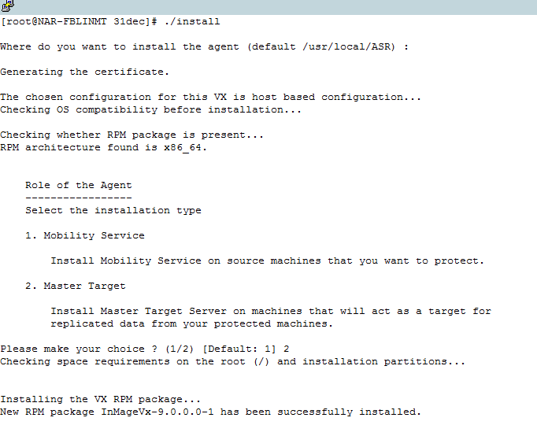
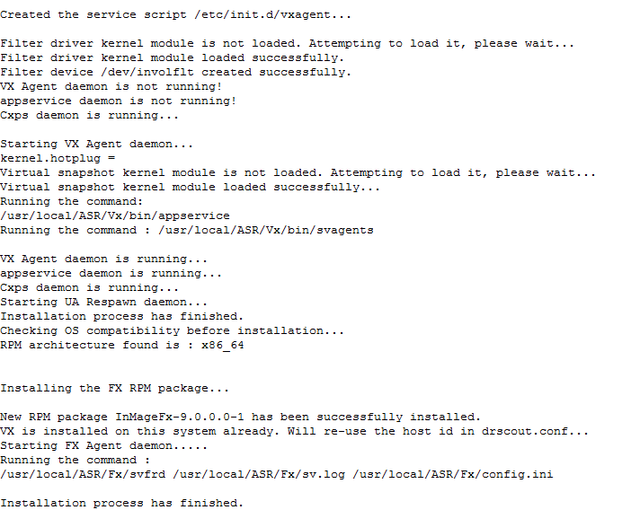

# Linux MT deployment in VMWare environment (Failback) 

## Install CentOS 6.6 Minimal**

Follow the steps as mentioned below to install CentOS 6.6 - 64bit
Operating System.

**Step 1:** From following links choose a nearest mirror to download a
CentOS 6.6 minimal 64-bit ISO.

<http://archive.kernel.org/centos-vault/6.6/isos/x86_64/CentOS-6.6-x86_64-minimal.iso>

<http://mirror.symnds.com/distributions/CentOS-vault/6.6/isos/x86_64/CentOS-6.6-x86_64-minimal.iso>

<http://bay.uchicago.edu/centos-vault/6.6/isos/x86_64/CentOS-6.6-x86_64-minimal.iso>

<http://mirror.nsc.liu.se/centos-store/6.6/isos/x86_64/CentOS-6.6-x86_64-minimal.iso>

Keep CentOS 6.6 minimal 64-bit ISO in DVD drive and boot the system.


**Step 2:** Select **Skip** to ignore the media testing process.


**Step 3:** Now you can see the installation welcome screen. Here click
**Next** button.


**Step 4:** Select **English** as your preferred Language and click
**Next** to continue.


**Step 5:** Select **US English** as a Keyboard layout. Click **Next**
to continue installation.


**Step 6:** Select the type of devices where you will install. Select
**Basic storage Devices**.

Click **Next** to continue installation.


**Step 7:** A warning message appears, that denotes the existing data in
the hard drive will be deleted. Make sure the hard drive does not have
any important data and click **Yes, discard any data**.


**Step 8:** Enter the hostname for your server in **Hostname text box**.
Click **Configure Network**,

In **Network Connection** window select your network interface. Click
**Edit** button to configure IPV4Settings.


**Step 9:** Following **Editing System etho** window displays. Select
**Connect automatically** checkbox. Under “IPv4 Settings” tab, choose
method as **Manual** and then click **Add** button. Provide the Static
IP, Netmask, Gateway and DNS Server details. Click **Apply** to save the
details.


**Step 10:** Select your Time Zone from the Combo box and click **Next**
to continue.


**Step 11:** Enter the **Root password** and confirm the password, click
**Next** to continue.


**Step 12:** Select **Create Custom Layout** as Mode of Partition and
click **Next** to continue.


**Step 13:** Select **Free** partition and click on **Create** for
creating **/**, **/var/crash** and **/home** partitions with **ext4** as
File System Type. Create **Swap partition** with **swap** as file system
type. To allocate partition size, follow the size allocation formula as
mentioned in below table.

NOTE: Linux Master Target (MT) system should not use LVM for root or
retention storage spaces. Linux MT configured to avoid LVM
partitions/disks discovery by default.


**Step 14:** After creation of partition click **Next** to continue.


**Step 15:** If any pre-existing devices is found, warning message
appears for formatting.

Click **Format** to format the hard drive with latest partition table.


**Step 16:** Click **Write changes to disk** to apply the partition
changes on disk.


**Step 17:** Check the **Install boot loader** option and click **Next**
to install boot loader on root partition.


**Step 18:** The Installation process starts. You can monitor the
progress of installation.


**Step 19:** The following screen displays on successful completion of
installation. Click **Reboot**


## Post Installation Steps

To get SCSI ID’s for each of SCSI hard disk in a Linux virtual machine,
you should enable the parameter “disk.EnableUUID = TRUE”.

To enable this parameter, follow the steps as given below:

a. Shut down your virtual machine.

b. Right-click the VM’s entry in the left-hand panel and select **Edit
Settings.**

c. Click the **Options** tab.

d. Select the **Advanced&gt;General item** on the left and click the
**Configuration Parameters** that you see on the right.


“Configuration Parameters” option will be in de-active state when the
machine is running”. In order to make this tab active, shutdown machine.

e. See whether already a row with **disk.EnableUUID** exists?

If exists and if the value is set to False over write the value with
True (True and False values are case in-sensitive).

If exists and is set to true, click on cancel and test the SCSI
command inside guest operating system after it is boot-up.

f. If does not exist click **Add Row.**

Add disk.EnableUUID in the Name column.

Set its value as TRUE

NOTE: Do not add the above values along with double-quotes.


## Download and Install the Additional Packages

NOTE: Make sure system has Internet connectivity before download and
installing additional packages.

```
# yum install -y xfsprogs perl lsscsi rsync wget kexec-tools
```

Above command will download below mentioned 15 packages from CentOS 6.6
repository and install.


bc-1.06.95-1.el6.x86\_64.rpm

busybox-1.15.1-20.el6.x86\_64.rpm

elfutils-libs-0.158-3.2.el6.x86\_64.rpm

kexec-tools-2.0.0-280.el6.x86\_64.rpm

lsscsi-0.23-2.el6.x86\_64.rpm

lzo-2.03-3.1.el6\_5.1.x86\_64.rpm

perl-5.10.1-136.el6\_6.1.x86\_64.rpm

perl-Module-Pluggable-3.90-136.el6\_6.1.x86\_64.rpm

perl-Pod-Escapes-1.04-136.el6\_6.1.x86\_64.rpm

perl-Pod-Simple-3.13-136.el6\_6.1.x86\_64.rpm

perl-libs-5.10.1-136.el6\_6.1.x86\_64.rpm

perl-version-0.77-136.el6\_6.1.x86\_64.rpm

rsync-3.0.6-12.el6.x86\_64.rpm

snappy-1.1.0-1.el6.x86\_64.rpm

wget-1.12-5.el6\_6.1.x86\_64.rpm

NOTE: If source protected machines use Reiser or XFS filesystem for the
root or boot device, then following additional packages should be
download and installed on Linux Master Target prior to the protection.

***ReiserFS (Suse11SP3. ReiserFS is not the default filesystem in
Suse11SP3 though)***

```
# cd /usr/local

# wget
<http://elrepo.org/linux/elrepo/el6/x86_64/RPMS/kmod-reiserfs-0.0-1.el6.elrepo.x86_64.rpm>

# wget
<http://elrepo.org/linux/elrepo/el6/x86_64/RPMS/reiserfs-utils-3.6.21-1.el6.elrepo.x86_64.rpm>

# rpm -ivh kmod-reiserfs-0.0-1.el6.elrepo.x86\_64.rpm
reiserfs-utils-3.6.21-1.el6.elrepo.x86\_64.rpm
```

***XFS (RHEL, CentOS 7 onwards)***

```
# cd /usr/local

# wget
<http://archive.kernel.org/centos-vault/6.6/os/x86_64/Packages/xfsprogs-3.1.1-16.el6.x86_64.rpm>

# rpm -ivh xfsprogs-3.1.1-16.el6.x86\_64.rpm

# yum install device-mapper-multipath 
```
This is required to enable
Multipath packages on the MT server.

### Apply Custom Configuration Changes

Before applying custom configuration changes make sure you have
completed Post Installation Steps

To apply custom configuration changes, follow the below mentioned steps:

1. Copy the RHEL6-64 Unified Agent binary to the newly created OS.

2. Run the below command to untar the binary.

```
tar -zxvf <File name>
```

3. Execute below command to give permission.
```
# chmod 755 ./ApplyCustomChanges.sh
```

4. Execute the below command to run the script.
```
# ./ApplyCustomChanges.sh
```
NOTE: Execute the script only once on the server. **REBOOT** the server
after successful execution of the above script.

## Add Retention Disk to Linux MT VM 

Follow the steps as mentioned below to create a retention disk.

**Step 1:** Attach a new **1 TB** disk to the Linux MT VM and find out
its multipath id

Invoke **multipath -ll** command to know the retention disk's
multipath id.


**Step 2:** Invoke **mkfs.ext4 /dev/mapper/<Retention disk's multipath id>** command to create a filesystem on retention disk.


**Step 3:** Once done with filesystem creation, invoke below command(s)
to mount the retention disk.


**Step 4:** Finally create the fstab entry:
```
vi /etc/fstab 
```
and append the line

**/dev/mapper/36000c2989daa2fe6dddcde67f2079afe /mnt/retention ext4 rw
0 0 **

## Install Master Target

1\. Copy the "latest" RHEL6-64 Unified Agent binary (You can copy it from ASR\_INSTALL\_DIR\\home\\svsystems\\pushinstallsvc\\repository)

to the newly created OS.

2\. Run the below command to untar the binary.
```
tar -zxvf <File name>
```
3\. Execute below command to install Master Target. Choose agent role as
‘Master Target’.

\# **./install**




