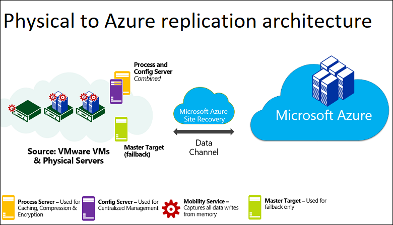
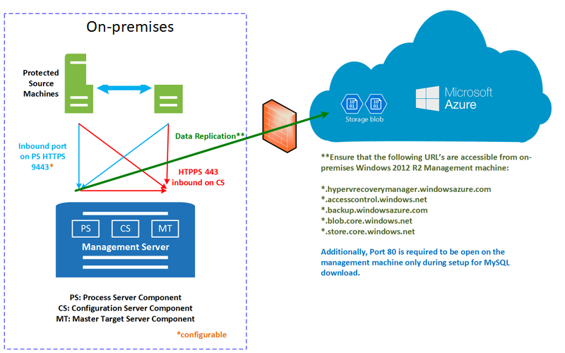
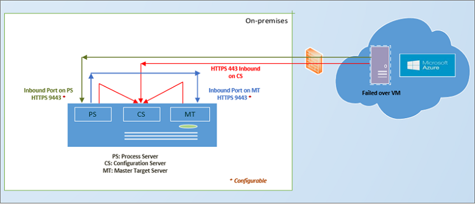

# Physical server to Azure disaster recovery architecture

This article describes the architecture and processes used when you replicate, fail over, and recover physical Windows and Linux servers between an on-premises site and Azure, using the [Azure Site Recovery](site-recovery-overview.md) service.

## Architectural components

The following table and graphic provides a high-level view of the components used for physical server replication to Azure.

| **Component** | **Requirement** | **Details** |
| --- | --- | --- |
| **Azure** | An Azure subscription and an Azure network. | Replicated data from on-premises physical machines is stored in Azure managed disks. Azure VMs are created with the replicated data when you run a failover from on-premises to Azure. The Azure VMs connect to the Azure virtual network when they're created. |
| **Configuration server machine** | A single on-premises machine. We recommend that you run it as a VMware VM that can be deployed from a downloaded OVF template.   The machine runs all on-premises Site Recovery components, which include the configuration server, process server, and master target server. | **Configuration server**: Coordinates communications between on-premises and Azure, and manages data replication.   **Process server**: Installed by default on the configuration server. It receives replication data; optimizes it with caching, compression, and encryption; and sends it to Azure Storage. The process server also installs Azure Site Recovery Mobility Service on VMs you want to replicate, and performs automatic discovery of on-premises machines. As your deployment grows, you can add additional, separate process servers to handle larger volumes of replication traffic.   **Master target server**: Installed by default on the configuration server. It handles replication data during failback from Azure. For large deployments, you can add an additional, separate master target server for failback. |
| **Replicated servers** | The Mobility service is installed on each server you replicate. | We recommend you allow automatic installation from the process server. Or, you can install the service manually, or use an automated deployment method such as Configuration Manager. |

**Physical to Azure architecture**

## Set up outbound network connectivity

For Site Recovery to work as expected, you need to modify outbound network connectivity to allow your environment to replicate.

> [!NOTE]
> Site Recovery doesn't support using an authentication proxy to control network connectivity.

### Outbound connectivity for URLs

If you're using a URL-based firewall proxy to control outbound connectivity, allow access to these URLs:

| **Name**                  | **Commercial**                               | **Government**                                 | **Description** |
| ------------------------- | -------------------------------------------- | ---------------------------------------------- | ----------- |
| Storage                   | `*.blob.core.windows.net`                  | `*.blob.core.usgovcloudapi.net` | Allows data to be written from the VM to the cache storage account in the source region. |
| Azure Active Directory    | `login.microsoftonline.com`                | `login.microsoftonline.us`                   | Provides authorization and authentication to Site Recovery service URLs. |
| Replication               | `*.hypervrecoverymanager.windowsazure.com` | `*.hypervrecoverymanager.windowsazure.com`   | Allows the VM to communicate with the Site Recovery service. |
| Service Bus               | `*.servicebus.windows.net`                 | `*.servicebus.usgovcloudapi.net`             | Allows the VM to write Site Recovery monitoring and diagnostics data. |

## Replication process

1. You set up the deployment, including on-premises and Azure components. In the Recovery Services vault, you specify the replication source and target, set up the configuration server, create a replication policy, and enable replication.
1. Machines replicate using the replication policy, and an initial copy of the server data is replicated to Azure storage.
1. After initial replication finishes, replication of delta changes to Azure begins. Tracked changes for a machine are held in a file with the _.hrl_ extension.
   - Machines communicate with the configuration server on HTTPS port 443 inbound, for replication management.
   - Machines send replication data to the process server on HTTPS port 9443 inbound (can be modified).
   - The configuration server orchestrates replication management with Azure over HTTPS port 443 outbound.
   - The process server receives data from source machines, optimizes and encrypts it, and sends it to Azure storage over HTTPS port 443 outbound.
   - If you enable multi-VM consistency, machines in the replication group communicate with each other over port 20004. Multi-VM is used if you group multiple machines into replication groups that share crash-consistent and app-consistent recovery points when they fail over. These groups are useful if machines are running the same workload and need to be consistent.
1. Traffic is replicated to Azure storage public endpoints, over the internet. Alternately, you can use Azure ExpressRoute [public peering](../expressroute/about-public-peering.md).

   > [!NOTE]
   > Replication isn't supported over a site-to-site VPN from an on-premises site or Azure ExpressRoute [private peering](concepts-expressroute-with-site-recovery.md#on-premises-to-azure-replication-with-expressroute).

For information related to troubleshooting, see [this article](vmware-azure-troubleshoot-replication.md).

**Physical to Azure replication process**

## Failover and failback process

After replication is set up, you can run a disaster recovery drill (test failover) to check that everything works as expected. Then, you can fail over and fail back as needed. Consider the following items:

- Planned failover isn't supported.
- Fail back to an on-premises VMware VM is necessary. You need an on-premises VMware infrastructure, even when you replicate on-premises physical servers to Azure.
- You fail over a single machine, or create recovery plans, to fail over multiple machines together.
- When you run a failover, Azure VMs are created from replicated data in Azure storage.
- After the initial failover is triggered, you commit it to start accessing the workload from the Azure VM.
- When your primary on-premises site is available again, you can fail back.
- Set up a failback infrastructure that includes:
  - **Temporary process server in Azure**: To fail back from Azure, you set up an Azure VM to act as a process server, to handle replication from Azure. You can delete this VM after fail back finishes.
  - **VPN connection**: To fail back, you need a VPN connection (or Azure ExpressRoute) from the Azure network to the on-premises site.
  - **Separate master target server**: By default, the fail back is handled by the master target server that was installed with the configuration server on the on-premises VMware VM. If you need to fail back large volumes of traffic, you should set up a separate on-premises master target server.
  - **Failback policy**: To replicate back to your on-premises site, you need a failback policy. The policy was automatically created when you created your replication policy from on-premises to Azure.
  - **VMware infrastructure**: To fail back, you need a VMware infrastructure. You can't fail back to a physical server.
- After the components are in place, fail back occurs in three stages:
  - **Stage 1**: Reprotect the Azure VMs so that they replicate from Azure back to the on-premises VMware VMs.
  - **Stage 2**: Run a failover to the on-premises site.
  - **Stage 3**: After workloads have failed back, you reenable replication.

**VMware failback from Azure**

## Next steps

To set up disaster recovery for physical servers to Azure, see the [how-to guide](physical-azure-disaster-recovery.md).
