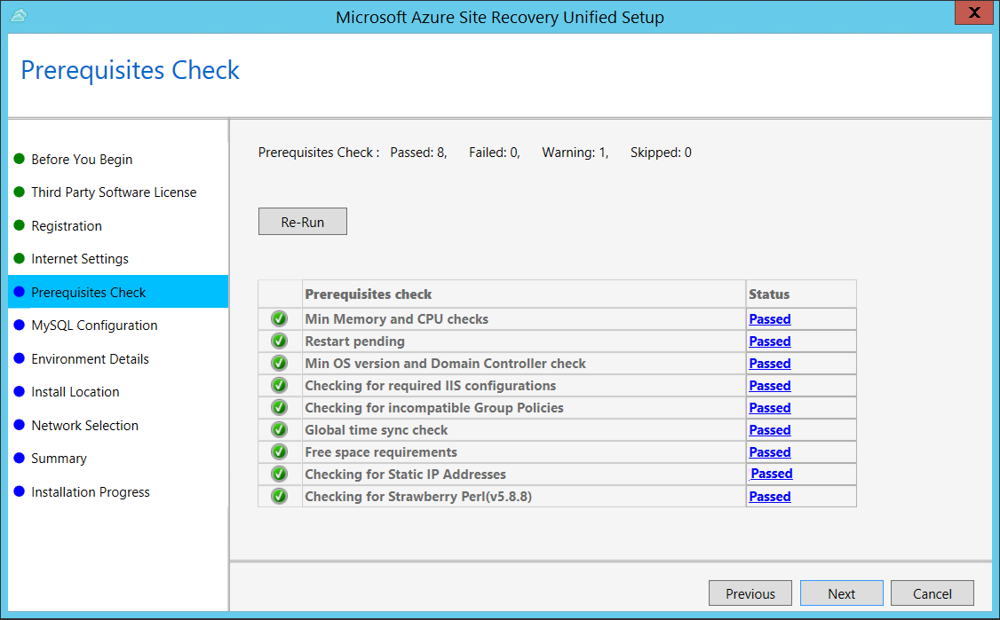
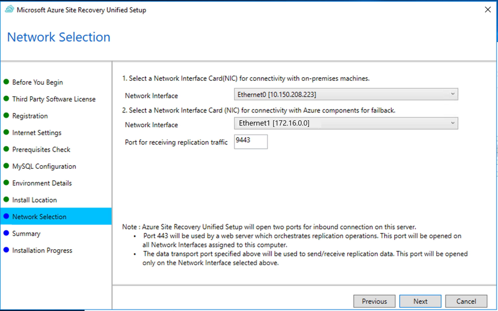
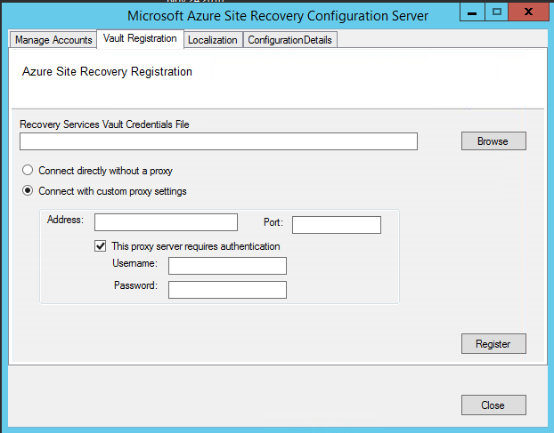

# Manage the configuration server for physical server disaster recovery

You set up an on-premises configuration server when you use the [Azure Site Recovery](site-recovery-overview.md) service for disaster recovery of physical servers to Azure. The configuration server coordinates communications between on-premises machines and Azure, and manages data replication. This article summarizes common tasks for managing the configuration server after it's been deployed.

[!INCLUDE [updated-for-az](../../includes/updated-for-az.md)]

## Prerequisites

The table summarizes the prerequisites for deploying the on-premises configuration server machine.

| **Component** | **Requirement** |
| --- |---|
| CPU cores| 8 |
| RAM | 16 GB|
| Number of disks | 3, including the OS disk, process server cache disk, and retention drive for failback |
| Disk free space (process server cache) | 600 GB
| Disk free space (retention disk) | 600 GB|
| Operating system  | Windows Server 2012 R2 <br> Windows Server 2016 |
| Operating system locale | English (US)|
| VMware vSphere PowerCLI version | [PowerCLI 6.0](https://my.vmware.com/web/vmware/details?productId=491&downloadGroup=PCLI600R1 "PowerCLI 6.0")|
| Windows Server roles | Don't enable these roles: <br> - Active Directory Domain Services <br>- Internet Information Services <br> - Hyper-V |
| Group policies| Don't enable these group policies: <br> - Prevent access to the command prompt <br> - Prevent access to registry editing tools <br> - Trust logic for file attachments <br> - Turn on Script Execution <br> [Learn more](https://technet.microsoft.com/library/gg176671(v=ws.10).aspx)|
| IIS | - No pre-existing default website <br> - Enable  [Anonymous Authentication](https://technet.microsoft.com/library/cc731244(v=ws.10).aspx) <br> - Enable [FastCGI](https://technet.microsoft.com/library/cc753077(v=ws.10).aspx) setting  <br> - No pre-existing website/application listening on port 443<br>|
| NIC type | VMXNET3 (when deployed as a VMware VM) |
| IP address type | Static |
| Internet access | The server needs access to these URLs: <br> - \*.accesscontrol.windows.net<br> - \*.backup.windowsazure.com <br>- \*.store.core.windows.net<br> - \*.blob.core.windows.net<br> - \*.hypervrecoverymanager.windowsazure.com <br> - https://management.azure.com <br> - *.services.visualstudio.com <br> - https://dev.mysql.com/get/Downloads/MySQLInstaller/mysql-installer-community-5.7.20.0.msi (not required for Scale-out Process Servers) <br> - time.nist.gov <br> - time.windows.com |
| Ports | 443 (Control channel orchestration)<br>9443 (Data transport)|

## Download the latest installation file

The latest version of the configuration server installation file is available in the Site Recovery portal. Additionally, it can be downloaded directly from the [Microsoft Download Center](https://aka.ms/unifiedsetup).

1. Log on to the Azure portal and browse to your Recovery Services Vault.
2. Browse to **Site Recovery Infrastructure** > **Configuration Servers** (under For VMware & Physical Machines).
3. Click the **+Servers** button.
4. On the **Add Server** page, click the Download button to download the Registration key. You need this key during the Configuration Server installation to register it with Azure Site Recovery service.
5. Click the **Download the Microsoft Azure Site Recovery Unified Setup** link to download the latest version of the Configuration Server.

   


## Install and register the server

1. Run the Unified Setup installation file.
2. In **Before You Begin**, select **Install the configuration server and process server**.

	

3. In **Third Party Software License**, click **I Accept** to download and install MySQL.
4. In **Internet Settings**, specify how the Provider running on the configuration server connects to Azure Site Recovery over the Internet. Make sure you've allowed the required URLs.

    - If you want to connect with the proxy that's currently set up on the machine, select **Connect to Azure Site Recovery using a proxy server**.
    - If you want the Provider to connect directly, select **Connect directly to Azure Site Recovery without a proxy server**.
    - If the existing proxy requires authentication, or if you want to use a custom proxy for the Provider connection, select **Connect with custom proxy settings**, and specify the address, port, and credentials.
     
6. In **Prerequisites Check**, Setup runs a check to make sure that installation can run. If a warning appears about the **Global time sync check**, verify that the time on the system clock (**Date and Time** settings) is the same as the time zone.

    
7. In **MySQL Configuration**, create credentials for logging on to the MySQL server instance that is installed.

    
8. In **Environment Details**, select whether you're going to replicate VMware VMs. If you are, then Setup checks that PowerCLI 6.0 is installed.
9. In **Install Location**, select where you want to install the binaries and store the cache. The drive you select must have at least 5 GB of disk space available, but we recommend a cache drive with at least 600 GB of free space.

    
10. In **Network Selection**, first select the NIC that the in-built process server uses for discovery and push installation of mobility service on source machines, and then select the NIC that Configuration Server uses for connectivity with Azure. Port 9443 is the default port used for sending and receiving replication traffic, but you can modify this port number to suit your environment's requirements. In addition to the port 9443, we also open port 443, which is used by a web server to orchestrate replication operations. Do not use port 443 for sending or receiving replication traffic.

    


11. In **Summary**, review the information and click **Install**. When installation finishes, a passphrase is generated. You will need this when you enable replication, so copy it and keep it in a secure location.


After registration finishes, the server is displayed on the **Settings** > **Servers** blade in the vault.


## Install from the command line

Run the installation file as follows:

  ```
  UnifiedSetup.exe [/ServerMode <CS/PS>] [/InstallDrive <DriveLetter>] [/MySQLCredsFilePath <MySQL credentials file path>] [/VaultCredsFilePath <Vault credentials file path>] [/EnvType <VMWare/NonVMWare>] [/PSIP <IP address to be used for data transfer] [/CSIP <IP address of CS to be registered with>] [/PassphraseFilePath <Passphrase file path>]
  ```

### Sample usage
  ```
  MicrosoftAzureSiteRecoveryUnifiedSetup.exe /q /x:C:\Temp\Extracted
  cd C:\Temp\Extracted
  UNIFIEDSETUP.EXE /AcceptThirdpartyEULA /servermode "CS" /InstallLocation "D:\" /MySQLCredsFilePath "C:\Temp\MySQLCredentialsfile.txt" /VaultCredsFilePath "C:\Temp\MyVault.vaultcredentials" /EnvType "VMWare"
  ```


### Parameters

|Parameter Name| Type | Description| Values|
|-|-|-|-|
| /ServerMode|Required|Specifies whether both the configuration and process servers should be installed, or the process server only|CS<br>PS|
|/InstallLocation|Required|The folder in which the components are installed| Any folder on the computer|
|/MySQLCredsFilePath|Required|The file path in which the MySQL server credentials are stored|The file should be the format specified below|
|/VaultCredsFilePath|Required|The path of the vault credentials file|Valid file path|
|/EnvType|Required|Type of environment that you want to protect |VMware<br>NonVMware|
|/PSIP|Required|IP address of the NIC to be used for replication data transfer| Any valid IP Address|
|/CSIP|Required|The IP address of the NIC on which the configuration server is listening on| Any valid IP Address|
|/PassphraseFilePath|Required|The full path to location of the passphrase file|Valid file path|
|/BypassProxy|Optional|Specifies that the configuration server connects to Azure without a proxy|To do get this value from Venu|
|/ProxySettingsFilePath|Optional|Proxy settings (The default proxy requires authentication, or a custom proxy)|The file should be in the format specified below|
|DataTransferSecurePort|Optional|Port number on the PSIP to be used for replication data| Valid Port Number (default value is 9433)|
|/SkipSpaceCheck|Optional|Skip space check for cache disk| |
|/AcceptThirdpartyEULA|Required|Flag implies acceptance of third-party EULA| |
|/ShowThirdpartyEULA|Optional|Displays third-party EULA. If provided as input all other parameters are ignored| |


### Create file input for MYSQLCredsFilePath

The MySQLCredsFilePath parameter takes a file as input. Create the file using the following format and pass it as input MySQLCredsFilePath parameter.
```ini
[MySQLCredentials]
MySQLRootPassword = "Password"
MySQLUserPassword = "Password"
```
### Create file input for ProxySettingsFilePath
ProxySettingsFilePath parameter takes a file as input. Create the file using the following format and pass it as input ProxySettingsFilePath parameter.

```ini
[ProxySettings]
ProxyAuthentication = "Yes/No"
Proxy IP = "IP Address"
ProxyPort = "Port"
ProxyUserName="UserName"
ProxyPassword="Password"
```
## Modify proxy settings

You can modify proxy settings for the configuration server machine as follows:

1. Log on to the configuration server.
2. Launch the cspsconfigtool.exe using the shortcut on your desktop.
3. Click the **Vault Registration** tab.
4. Download a new vault registration file from the portal, and provide it as input to the tool.

   
5. Provide the new proxy details and click the **Register** button.
6. Open an Admin PowerShell command window.
7. Run the following command:

   ```powershell
   $Pwd = ConvertTo-SecureString -String MyProxyUserPassword
   Set-OBMachineSetting -ProxyServer http://myproxyserver.domain.com -ProxyPort PortNumber –ProxyUserName domain\username -ProxyPassword $Pwd
   net stop obengine
   net start obengine
   ```

   > [!WARNING]
   > If you have additional process servers attached to the configuration server, you need to [fix the proxy settings on all the scale-out process servers](vmware-azure-manage-process-server.md#modify-proxy-settings-for-an-on-premises-process-server) in your deployment.

## Reregister a configuration server with the same vault
1. Log in to your Configuration Server.
2. Launch the cspsconfigtool.exe using the shortcut on your desktop.
3. Click the **Vault Registration** tab.
4. Download a new registration file from the portal and provide it as input to the tool.
      
5. Provide the Proxy Server details and click the **Register** button.  
6. Open an Admin PowerShell command window.
7. Run the following command

    ```powershell
    $Pwd = ConvertTo-SecureString -String MyProxyUserPassword
    Set-OBMachineSetting -ProxyServer http://myproxyserver.domain.com -ProxyPort PortNumber –ProxyUserName domain\username -ProxyPassword $Pwd
    net stop obengine
    net start obengine
    ```

   > [!WARNING]
   > If you have multiple process server, you need to [reregister them](vmware-azure-manage-process-server.md#reregister-a-process-server).

## Register a configuration server with a different vault

> [!WARNING]
> The following step disassociates the configuration server from the current vault, and the replication of all protected virtual machines under the configuration server is stopped.

1. Log onto the configuration server
2. from an admin command prompt, run the command:

    ```
    reg delete HKLM\Software\Microsoft\Azure Site Recovery\Registration
    net stop dra
    ```
3. Launch the cspsconfigtool.exe using the shortcut on your desktop.
4. Click the **Vault Registration** tab.
5. Download a new registration file from the portal and provide it as input to the tool.
6. Provide the Proxy Server details and click the **Register** button.  
7. Open an Admin PowerShell command window.
8. Run the following command
    ```powershell
    $pwd = ConvertTo-SecureString -String MyProxyUserPassword
    Set-OBMachineSetting -ProxyServer http://myproxyserver.domain.com -ProxyPort PortNumber –ProxyUserName domain\username -ProxyPassword $pwd
    net stop obengine
    net start obengine
    ```

## Upgrade a configuration server

You run update rollups to update the configuration server. Updates can be applied for up to N-4 versions. For example:

- If you're running 9.7, 9.8, 9.9, or 9.10 - you can upgrade directly to 9.11.
- If you're running 9.6 or earlier, and you want to upgrade to 9.11, you must first upgrade to version 9.7. before  9.11.

Links to update rollups for upgrading to all versions of the configuration server are available in the [wiki updates page](https://social.technet.microsoft.com/wiki/contents/articles/38544.azure-site-recovery-service-updates.aspx).

Upgrade the server as follows:

1. Download the update installer file to the configuration server.
2. Double-click to run the installer.
3. The installer detects the current version running on the machine.
4. Click **OK** to confirm, and run the upgrade. 


## Delete or unregister a configuration server

> [!WARNING]
> Ensure the following before you start decommissioning your Configuration Server.
> 1. [Disable protection](site-recovery-manage-registration-and-protection.md#disable-protection-for-a-vmware-vm-or-physical-server-vmware-to-azure) for all virtual machines under this Configuration Server.
> 2. [Disassociate](vmware-azure-set-up-replication.md#disassociate-or-delete-a-replication-policy) and [Delete](vmware-azure-set-up-replication.md#disassociate-or-delete-a-replication-policy) all Replication policies from the Configuration Server.
> 3. [Delete](vmware-azure-manage-vcenter.md#delete-a-vcenter-server) all vCenters servers/vSphere hosts that are associated to the Configuration Server.


### Delete the Configuration Server from Azure portal
1. In Azure portal, browse to **Site Recovery Infrastructure** > **Configuration Servers** from the Vault menu.
2. Click the configuration server that you want to decommission.
3. On the Configuration Server's details page, click the **Delete** button.
4. Click **Yes** to confirm the deletion of the server.

### Uninstall the configuration server and its dependencies
> [!TIP]
>   If you plan to reuse the Configuration Server with Azure Site Recovery again, then you can skip to step 4 directly

1. Log on to the Configuration Server as an Administrator.
2. Open up Control Panel > Program > Uninstall Programs
3. Uninstall the programs in the following sequence:
   * Microsoft Azure Recovery Services Agent
   * Microsoft Azure Site Recovery Mobility Service/Master Target server
   * Microsoft Azure Site Recovery Provider
   * Microsoft Azure Site Recovery Configuration Server/Process Server
   * Microsoft Azure Site Recovery Configuration Server Dependencies
   * MySQL Server 5.5
4. Run the following command from and admin command prompt.
   ```
   reg delete HKLM\Software\Microsoft\Azure Site Recovery\Registration
   ```

## Delete or unregister a configuration server (PowerShell)

1. [Install](https://docs.microsoft.com/powershell/azure/install-Az-ps) Azure PowerShell module
2. Login into to your Azure account using the command
    
    `Connect-AzAccount`
3. Select the subscription under which the vault is present

     `Get-AzSubscription –SubscriptionName <your subscription name> | Select-AzSubscription`
3.  Now set up your vault context
    
    ```powershell
    $Vault = Get-AzRecoveryServicesVault -Name <name of your vault>
    Set-AzSiteRecoveryVaultSettings -ARSVault $Vault
    ```
4. Get select your configuration server

    `$Fabric = Get-AzSiteRecoveryFabric -FriendlyName <name of your configuration server>`
6. Delete the Configuration Server

    `Remove-AzSiteRecoveryFabric -Fabric $Fabric [-Force]`

> [!NOTE]
> The **-Force** option in the Remove-AzSiteRecoveryFabric can be used to force the removal/deletion of the Configuration server.

## Renew SSL certificates
The configuration server has an inbuilt web server, which orchestrates activities of the Mobility service, process servers, and master target servers connected to it. The web server uses an SSL certificate to authenticate clients. The certificate expires after three years, and can be renewed at any time.

### Check expiry

For configuration server deployments before May 2016, certificate expiry was set to one year. If you have a certificate is going to expire, the following occurs:

- When the expiry date is two months or less, the service starts sending notifications in the portal, and by email (if you subscribed to Azure Site Recovery notifications).
- A notification banner appears on the vault resource page. Click the banner for more details.
- If you see an **Upgrade Now** button, this indicates that there are some components in your environment that haven't been upgraded to 9.4.xxxx.x or higher versions. Upgrade components before you renew the certificate. You can't renew on older versions.

### Renew the certificate

1. In the vault, open **Site Recovery Infrastructure** > **Configuration Server**, and click the required configuration server.
2. The expiry date appears under **Configuration Server health**
3. Click **Renew Certificates**. 


## Common issues
[!INCLUDE [site-recovery-vmware-to-azure-install-register-issues](../../includes/site-recovery-vmware-to-azure-install-register-issues.md)]

## Next steps

Review the tutorials for setting up disaster recovery of [physical servers](tutorial-physical-to-azure.md) to Azure.

