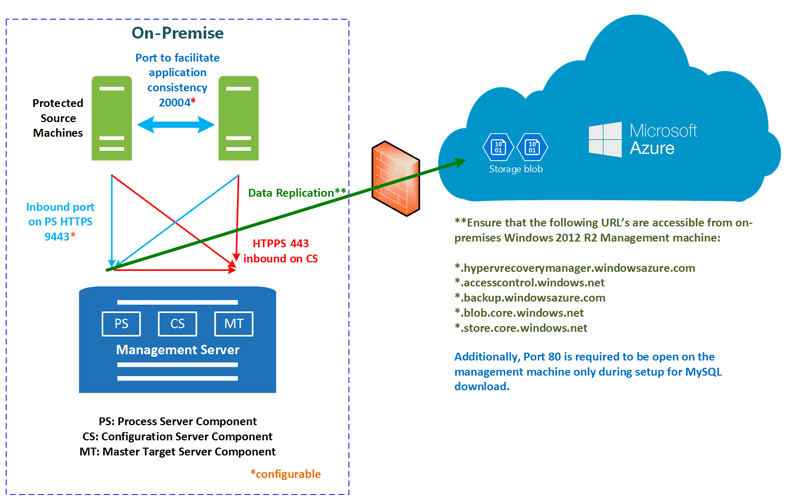

# Step 1: Review the architecture for physical server replication to Azure
you 
This article describes the components and processes used when you replicate on-premises Windows/Linux physical servers to Azure, using the [Azure Site Recovery](site-recovery-overview.md) service.

Post any comments at the bottom of this article, or ask questions in the [Azure Recovery Services Forum](https://social.msdn.microsoft.com/forums/azure/home?forum=hypervrecovmgr).

## Architectural components

The table summarizes the components you need.

**Component** | **Requirement** | **Details**
--- | --- | ---
**Azure** | You need an Azure account, an Azure storage account, and an Azure network. | Replicated data is stored in the storage account, and Azure VMs are created with the replicated data when failover occurs. Azure VMs connect to the Azure virtual network when they're created.
**Configuration server** | A single on-premises management server (physical server or VMware VM) that runs all the on-premises Site Recovery components. These include a configuration server, process server, master target server. | The configuration server component coordinates communications between on-premises and Azure, and manages data replication.
 **Process server**:  | Installed by default on the configuration server. | Acts as a replication gateway. Receives replication data, optimizes it with caching, compression, and encryption, and sends it to Azure storage.   The process server also handles push installation of the Mobility service to protected machines.   You can add additional separate dedicated process servers, to handle increasing volumes of replication traffic.
 **Master target server** | Installed by default on the on-premises configuration server. | Handles replication data during failback from Azure.   If volumes of failback traffic are high, you can deploy a separate master target server for failback.
**Replicated servers** | The Mobility service component is installed on each Windows/Linux server you want to replicate. It can be installed manually on each machine, or with a push installation from the process server.
**Failback** | For failback a VMware infrastructure is required. You can't fail back to a physical server.

**Figure 1: Physical to Azure components**

## Replication process

1. You set up the deployment, including on-premises and Azure components. In the Recovery Services vault, you specify the replication source and target, set up the configuration server, create a replication policy, deploy the Mobility service, enable replication, and run a test failover.
2.  Machines replicate in accordance with the replication policy, and an initial copy of the data is replicated to Azure storage.
4. After initial replication finishes, replication of delta changes to Azure begins. Tracked changes for a machine are held in a .hrl file.
    - Replicating machines communicate with the configuration server on port HTTPS 443 inbound, for replication management.
    - Replicating machines send replication data to the process server on port HTTPS 9443 inbound (can be modified).
    - The configuration server orchestrates replication management with Azure over port HTTPS 443 outbound.
    - The process server receives data from source machines, optimizes and encrypts it, and sends it to Azure storage over port 443 outbound.
    - If you enable multi-VM consistency, then machines in the replication group communicate with each other over port 20004. Multi-VM is used if you group multiple machines into replication groups that share crash-consistent and app-consistent recovery points when they fail over. This is useful if machines are running the same workload and need to be consistent.
5. Traffic is replicated to Azure storage public endpoints, over the internet. Alternately, you can use Azure ExpressRoute [public peering](../expressroute/expressroute-circuit-peerings.md#public-peering). Replicating traffic over a site-to-site VPN from an on-premises site to Azure isn't supported.

**Figure 2: Physical to Azure replication**

## Failover and failback process

1. After you verify that test failover is working as expected, you can run unplanned failovers to Azure as required. Planned failover isn't supported.
2. You can fail over a single machine, or create [recovery plans](site-recovery-create-recovery-plans.md), to fail over multiple machines together.
3. When you run a failover, Azure VMs are created from replicated data.
4. You commit a failover to start accessing the workload from the replica Azure VM.
5. When your primary on-premises site is available again, you can fail back.
6. You set up a failback infrastructure with the components listed below.
7. You replicate the machine from the secondary to the primary site, and run an unplanned failover from the secondary site.
8. After you commit this failover, data will be back on-premises, and you need to enable replication to Azure again.

Failback components include:

- **Temporary process server in Azure**: You need to set up an Azure VM to act as a process server, to handle replication from Azure. You can delete this VM after failback finishes.
- **VPN connection**: You need a VPN connection (or Azure ExpressRoute) from the Azure network to the on-premises site.
- **Separate on-premises master target server**: The on-premises master target server (installed by default on the configuration server) handles failback. If you fail back large volumes of traffic, you should set up a separate on-premises master target server for this purpose.
- **Failback policy**: You need a failback policy. This is automatically created when you created your replication policy.
- **VMware infrastructure**: You must fail back to an on-premises VMware VM. This means you need an on-premises VMware infrastructure, even if you're replicating on-premises physical servers to Azure.

**Figure 3: Physical server failback**

## Next steps

Go to [Step 2: Verify prerequisites and limitations](physical-walkthrough-prerequisites.md)
