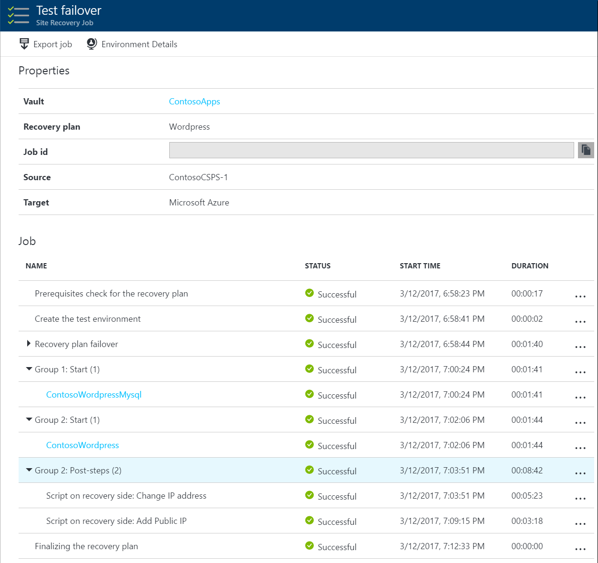

# About recovery plans

This article describes recovery plans in [Azure Site Recovery](site-recovery-overview.md).

A recovery plan gathers machines into recovery groups. You can customize a plan by adding order, instructions, and tasks to it. After a plan is defined, you can run a failover on it.  Machines can be referenced in multiple Recovery Plans, in which subsequent plans will skip the deployment/startup of the machine if it was previously deployed via another recovery plan.

## Why use a recovery plan?

A recovery plan helps you to define a systematic recovery process, by creating small independent units that you can fail over. A unit typically represents an app in your environment. A recovery plan defines how machines fail over, and the sequence in which they start after failover. Use recovery plans to:

* Model an app around its dependencies.
* Automate recovery tasks to reduce RTO.
* Verify that you're prepared for migration or disaster recovery by ensuring that your apps are part of a recovery plan.
* Run test failover on recovery plans, to ensure disaster recovery or migration is working as expected.

## Model apps

You can plan and create a recovery group to capture app-specific properties. As an example, let's consider a typical three-tier application with a SQL server backend, middleware, and a web frontend. Typically, you customize the recovery plan so that machines in each tier start in the correct order after failover.

- The SQL backend should start first, the middleware next, and finally the web frontend.
- This start order ensures that the app is working by the time the last machine starts.
- This order ensures that when the middleware starts and tries to connect to the SQL Server tier, the SQL Server tier is already running. 
- This order also helps ensure that the front-end server starts last, so that end users don't connect to the app URL before all the components are up and running, and the app is ready to accept requests.

To create this order, you add groups to the recovery group, and add machines into the groups.
- Where order is specified, sequencing is used. Actions run in parallel where appropriate, to improve application recovery RTO.
- Machines in a single group fail over in parallel.
- Machines in different groups fail over in group order, so that Group 2 machines start their failover only after all the machines in Group 1 have failed over and started.

	

With this customization in place, here's what happens when you run a failover on the recovery plan: 

1. A shutdown step attempts to turn off the  on-premises machines. The exception is if you run a test failover, in which case the primary site continues to run. 
2. The shutdown triggers a parallel failover of all the machines in the recovery plan.
3. The failover prepares virtual machine disks using replicated data.
4. The startup groups run in order, and start the machines in each group. First, Group 1 runs, then Group 2, and finally, Group 3. If there's more than one machine in any group, then all the machines start in parallel.

## Automate tasks

Recovering large applications can be a complex task. Manual steps make the process prone to error, and the person running the failover might not be aware of all app intricacies. You can use a recovery plan to impose order, and automate the actions needed at each step, using Azure Automation runbooks for failover to Azure, or scripts. For tasks that can't be automated, you can insert pauses for manual actions into recovery plans. There are a couple of types of tasks you can configure:

* **Tasks on the Azure VM after failover**: When you're failing over to Azure, you typically need to perform actions so that you can connect to the VM after failover. For example: 
	* Create a public IP address on the Azure VM.
	* Assign a network security group to the network adapter of the Azure VM.
	* Add a load balancer to an availability set.
* **Tasks inside VM after failover**: These tasks typically reconfigure the app running on the machine, so that it continues to work correctly in the new environment. For example:
	* Modify the database connection string inside the machine.
	* Change the web server configuration or rules.

## Test failover

You can use a recovery plan to trigger a test failover. Use the following best practices:

- Always complete a test failover on an app, before running a full failover. Test failovers help you to check whether the app comes up on the recovery site.
- If you find you've missed something, trigger a clean up, and then rerun the test failover. 
- Run a test failover multiple times, until you're sure that the app recovers smoothly.
- Because each app is unique, you need to build recovery plans that are customized for each application, and run a test failover on each.
- Apps and their dependencies change frequently. To ensure recovery plans are up-to-date, run a test failover for each app every quarter.

	

## Watch the video

Watch a quick example video showing an on-click failover for a two-tier WordPress app.
    
> [!VIDEO https://channel9.msdn.com/Series/Azure-Site-Recovery/One-click-failover-of-a-2-tier-WordPress-application-using-Azure-Site-Recovery/player]

## Next steps

- [Create](site-recovery-create-recovery-plans.md) a recovery plan.
- Learn about [running failovers](site-recovery-failover.md).  
