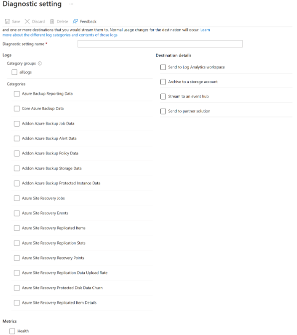
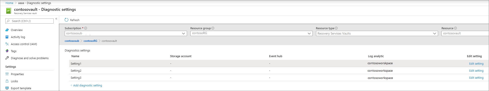

# (Preview) Configure Azure Site Recovery reports

Azure Site Recovery provides a reporting solution for Backup and Disaster Recovery admins to gain insights on long-term data. This includes:

- Allocating and forecasting of cloud storage consumed. 
- Auditing backups and restores.
- Identifying key trends at different levels of detail. 

Like [Azure Backup](../backup/configure-reports.md), Azure Site Recovery offers a reporting solution that uses [Azure Monitor logs](/azure/azure-monitor/logs/log-analytics-tutorial) and [Azure workbooks](/azure/azure-monitor/visualize/workbooks-overview). These resources help you gain insights on your estate that are protected with Site Recovery. 

This article shows how to set up and view Azure Site Recovery reports. 

## Supported scenarios

Azure Site Recovery reports are supported for the following scenarios:
- Site Recovery jobs and Site Recovery replicated items.
- Azure virtual machine replication to Azure, Hyper-V replication to Azure, VMware replication to Azure – Classic & Modernized. 

## Configure reports

To start using Azure Site Recovery reports, follow these steps:

### Create a Log Analytics workspace or use an existing workspace

Set up one or more Log Analytics workspaces to store your Backup reporting data. The location and subscription of this Log Analytics workspace can be different from where your vaults are located or subscribed. 

To set up a Log Analytics workspace, [follow these steps](/azure/azure-monitor/logs/quick-create-workspace). The data in a Log Analytics workspace is kept for 30 days by default. If you want to see data for a longer time span, change the retention period of the Log Analytics workspace. To change the retention period, see [Configure data retention and archive policies in Azure Monitor Logs](/azure/azure-monitor/logs/data-retention-configure). 

### Configure diagnostics settings for your vaults 

Azure Resource Manager resources, like Recovery Services vaults, record information about site recovery jobs and replicated items as diagnostics data.

To learn how to configure diagnostics settings, see [Diagnostic settings in Azure Monitor](/azure/azure-monitor/essentials/diagnostic-settings).

You can also configure diagnostics settings for your vaults using the following steps in the Azure portal.

1. Navigate to the chosen the Recovery Services vault, then select **Monitoring** > **Diagnostic settings**.
1. Specify the target for the Recovery Services Vault's diagnostic data. Learn more about [using diagnostic events](../backup/backup-azure-diagnostic-events.md) for Recovery Services vaults.
1. Select **Azure Site Recovery Jobs** and **Azure Site Recovery Replicated Item Details**, and on the **Destination** table **Resource Specific** options to populate the reports. 
    :::image type="content" source="./media/report-site-recovery/logs.png" alt-text="Screenshot of logs options.":::

    > [!NOTE]
    > After diagnostics configuration, it takes up to 24 hours for the initial data push to complete. After the data starts flowing into the Log Analytics workspace, you might not see the data in the reports immediately since the data for the current partial day isn't shown in the reports. 
    >
    > For more information, see the [conventions](#conventions-used-in-site-recovery-reports). We recommend that you start viewing the reports two days after you configure your vaults to send data to Log Analytics. 

Currently, Azure Site Recovery *doesn't* provide a built-in Azure policy definition that automates the configuration of diagnostics settings for all Recovery Services vaults in a given scope. 

### View reports in Business Continuity Center 

To view your reports after setting up your vault to transfer data to Log Analytics workspace, go to the **Business Continuity Center** > **Monitoring+Reporting** > **Reports**. 

You must select one or more workspace subscriptions, one or more log analytics workspaces, and the replication scenario of your choice, before you can see the report with information. 

**Following are some of the reports available in the Business Continuity Center:**

#### Azure Site Recovery Job History

This report provides information about the Site Recovery jobs by operation type and completion status. This report includes  information on job status, start time, duration, vault, subscription, etc.

It also offers multiple filters for time range, operation, resource group, status, and search item, enabling you to generate focused reports and visualizations.

:::image type="content" source="./media/report-site-recovery/job-history.png" alt-text="Screenshot of Job history."lightbox="./media/report-site-recovery/job-history.png":::

#### Azure Site Recovery Replication History 

This report provides information about the Site Recovery replicated items and their status over a specified time period. This report also includes failover date and detailed replication health error list for troubleshooting. It offers filters for time range, vault subscription, resource group, and search item and enables focused report generation and visualization.

:::image type="content" source="./media/report-site-recovery/replication-history.png" alt-text="Screenshot of Replication history."lightbox="./media/report-site-recovery/replication-history.png":::

## Export to Excel

Select the down arrow button at the top of any widget, for example, a table or chart, to export the contents of that widget as an Excel sheet with existing filters applied. To export more rows of a table to Excel, you can increase the number of rows displayed on the page by adjusting **Rows Per Page** option at the top of each widget.

## Pin to dashboard

To pin the widget to your Azure portal dashboard, select the pin button at the top of each widget. This feature helps you create customized dashboards tailored to display the most important information that you need. 

## Cross-tenant reports

If you use Azure Lighthouse with delegated access to subscriptions across multiple tenant environments, you can access the default subscription filter by selecting the filter button in the top corner of the Azure portal to choose all the subscriptions you wish to view data for. This enables the selection of Log Analytics workspaces across your tenants for viewing multi-tenanted reports.

## Conventions used in Site Recovery reports

The reports do not display data for the current partial day. If you set the **Time range** to *Last 7 days*, the report shows records for the last seven *completed* days, excluding the current day. The report provides information on jobs that were triggered within the selected time range.

## Troubleshoot

If you don't see data in the reports or see any discrepancy, check the following:

- Ensure that all vaults are sending the required [configurations](#configure-diagnostics-settings-for-your-vaults) to the Log Analytics workspace.
- Ensure that you've selected correct filters in the reports.
- Note that, since it takes up to 24 hours for the initial data push to complete while configuring diagnostics settings, you might not see the data in the reports immediately. 
- The reports only take full days (UTC) into consideration and don't include partial days. Consider these examples:
    - If you select a time range from 4:30 PM on March 23 to 10:00 AM on March 24th, the query runs internally for the period between 12:00 AM UTC on March 23 and 11:59 PM UTC on March 24th. This means that the query overrides the time component of the datetime.
    - If today's date is March 29, the data shown in the reports will only go up to the end of March 28 (11:59 PM UTC). Jobs created on March 29 won't be visible in the reports until the next day, March 30.

If none of the above explains the data seen in the report, contact Microsoft Support. 

## Power BI reports

The Power BI template app for reporting, which sources data from an Azure storage account, is being deprecated. We recommend, that you begin sending vault diagnostic data to Log Analytics to view reports instead. 

Additionally, the V1 schema for sending diagnostics data to a storage account or an LA Workspace is also being deprecated. If you have created any custom queries or automations using the V1 schema, it is recommended that you update them to use the currently supported V2 schema.

## Send Azure Site Recovery events to Log Analytics

Azure Backup and Azure Site Recovery events are sent from the same Recovery Services vault. Azure Site Recovery offers two resource-specific tables - *Azure Site Recovery Jobs* and *Azure Site Recovery Replicated Items Details*. Users must choose resource specific for the two tables mentioned. Choosing the resource-specific mode for Azure Site Recovery events for any other table for site recovery prevents the required data from being sent to the Log Analytics workspace. Azure Site Recovery Jobs is available as both resource specific and legacy table.

> [!NOTE]
> When you create a Log Analytics workspace, it does not matter if the Recovery Services vault is located in a different region.

To summarize:

* If you already have Log Analytics diagnostics set up with Azure Diagnostics and have written custom queries on top of it, keep that setting *intact* until you migrate your queries to use data from the new events.
* If you also want to onboard onto new tables, as we recommend, create a **new** diagnostics setting, select **Resource specific**, and select the six new events.
* If you're currently sending Azure Site Recovery events to Log Analytics, *do not* choose the resource-specific mode for these events. Otherwise, data for these events won't flow into your Log Analytics workspace. Instead, create an additional diagnostic setting, select **Azure diagnostics**, and select the relevant Azure Site Recovery events.

The following image shows an example of a user who has three diagnostics settings for a vault. The first setting, named **Setting1**, sends data from an Azure Backup Reporting Data event to a Log Analytics workspace in Azure diagnostics mode. The second setting, named **Setting2**, sends data from the six new Azure Backup events to a Log Analytics workspace in the resource-specific mode. The third setting, named **Setting3**, sends data from the Azure Site Recovery events to a Log Analytics workspace in Azure diagnostics mode.

## Next steps

- [Diagnostics in Azure Backup](../backup/backup-azure-diagnostic-events.md)
