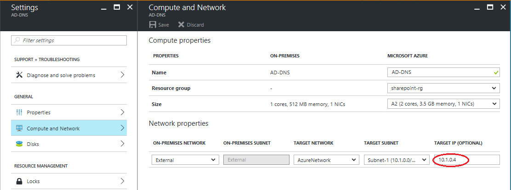

# Protect Active Directory and DNS with Azure Site Recovery
Enterprise applications such as SharePoint, Dynamics AX, and SAP depend on Active Directory and a DNS infrastructure to function correctly. When you create a disaster recovery solution for applications, it's important to remember that you need to protect and recover Active Directory and DNS before the other application components, to ensure that things function correctly when disaster occurs.

Site Recovery is an Azure service that provides disaster recovery by orchestrating replication, failover, and recovery of virtual machines. Site Recovery supports a number of replication scenarios to consistently protect, and seamlessly failover virtual machines and applications to private, public, or hoster clouds.

Using Site Recovery, you can create a complete automated disaster recovery plan for Active Directory. When disruptions occur, you can initiate a failover within seconds from anywhere and get Active Directory up and running in a few minutes. If you've deployed Active Directory for multiple applications such as SharePoint and SAP in your primary site, and you want to fail over the complete site, you can fail over Active Directory first using Site Recovery, and then fail over the other applications using application-specific recovery plans.

This article explains how to create a disaster recovery solution for Active Directory, how to perform planned, unplanned, and test failovers using a one-click recovery plan, the supported configurations, and prerequisites.  You should be familiar with Active Directory and Azure Site Recovery before you start.

## Replicating Domain Controller

You need to setup [Site Recovery replication](#enable-protection-using-site-recovery) on at least one virtual machine hosting Domain Controller and DNS. If you have [multiple domain controllers](#environment-with-multiple-domain-controllers) in your environment, in addition to replicating the domain controller virtual machine with Site Recovery you would also have to set up an [additional domain controller](#protect-active-directory-with-active-directory-replication) on the target site (Azure or a secondary on-premises datacenter). 

### Single domain controller environment
If you have a few applications and only a single domain controller, and you want to fail over the entire site together, then we recommend using Site Recovery to replicate the domain controller to the secondary site (whether you're failing over to Azure or to a secondary site). The same replicated domain controller/DNS virtual machine can be used for [test failover](#test-failover-considerations) as well.

### Environment with multiple domain controllers
If you have many applications and there's more than one domain controller in the environment, or if you plan to fail over a few applications at a time, we recommend that in addition to replicating the domain controller virtual machine with Site Recovery you also set up an [additional domain controller](#protect-active-directory-with-active-directory-replication) on the target site (Azure or a secondary on-premises datacenter). For [test failover](#test-failover-considerations), you use domain controller replicated by Site Recovery and for failover, the additional domain controller on the target site. 

The following sections explain how to enable protection for a domain controller in Site Recovery, and how to set up a domain controller in Azure.

## Prerequisites
* An on-premises deployment of Active Directory and DNS server.
* An Azure Site Recovery Services vault in a Microsoft Azure subscription.
* If you're replicating to Azure, run the Azure Virtual Machine Readiness Assessment tool on VMs to ensure they're compatible with Azure VMs and Azure Site Recovery Services.

## Enable protection using Site Recovery
### Protect the virtual machine
Enable protection of the domain controller/DNS virtual machine in Site Recovery. Configure Site Recovery settings based on the virtual machine type (Hyper-V or VMware). The domain controller replicated using Site Recovery is used for [test failover](#test-failover-considerations). Make sure it meets the following requirements:

1. The domain controller is a global catalog server
2. The domain controller should be the FSMO role owner for roles that will be needed during a test failover (else these roles will need to be [seized](http://aka.ms/ad_seize_fsmo) after the failover)

### Configure virtual machine network settings
For the domain controller/DNS virtual machine, configure network settings in Site Recovery so that the virtual machine will be attached to the right network after failover. 

## Protect Active Directory with Active Directory replication
### Site-to-site protection
Create a domain controller on the secondary site. When you promote the server to a domain controller role, specify the name of the same domain that is being used on the primary site. You can use the **Active Directory Sites and Services** snap-in to configure settings on the site link object to which the sites are added. By configuring settings on a site link, you can control when replication occurs between two or more sites, and how often. For more information, see [Scheduling Replication Between Sites](https://technet.microsoft.com/library/cc731862.aspx).

### Site-to-Azure protection
Follow the instructions to [create a domain controller in an Azure virtual network](../active-directory/active-directory-install-replica-active-directory-domain-controller.md). When you promote the server to a domain controller role, specify the same domain name that's used on the primary site.

Then [reconfigure the DNS server for the virtual network](../active-directory/active-directory-install-replica-active-directory-domain-controller.md#reconfigure-dns-server-for-the-virtual-network), to use the DNS server in Azure.

**DNS in Azure Production Network**

## Test failover considerations
Test failover occurs in a network that's isolated from production network so that there's no impact on production workloads.

Most applications also require the presence of a domain controller and a DNS server to function. Therefore, before the application is failed over, a domain controller needs to be created in the isolated network to be used for test failover. The easiest way to do this is to replicate a domain controller/DNS virtual machine with Site Recovery. Then run a test failover of the domain controller virtual machine before running a test failover of the recovery plan for the application. Here's how you do that:

1. [Replicate](site-recovery-replicate-vmware-to-azure.md) the domain controller/DNS virtual machine using Site Recovery.
1. Create an isolated network. Any virtual network created in Azure by default is isolated from other networks. We recommend that the IP address range for this network is same as that of your production network. Don't enable site-to-site connectivity on this network.
1. Provide a DNS IP address in the network created, as the IP address that you expect the DNS virtual machine to get. If you're replicating to Azure, then provide the IP address for the VM that is used on failover in **Target IP** setting in **Compute and Network** settings. 

	
	**Target IP**

	

	**DNS in Azure Test Network**

> [!TIP]
> Site Recovery attempts to create test virtual machines in a subnet of same name and using the same IP as that provided in **Compute and Network** settings of the virtual machine. If subnet of same name is not available in the Azure virtual network provided for test failover, then test virtual machine is created in the first subnet alphabetically. If the target IP is part of the chosen subnet, then Site Recovery tries to create the test failover virtual machine using the target IP. If the target IP is not part of the chosen subnet, then test failover virtual machine gets created using any available IP in the chosen subnet. 
>
>

1. If you're replicating to another on-premises site and you're using DHCP, follow the instructions to [setup DNS and DHCP for test failover](site-recovery-test-failover-vmm-to-vmm.md#prepare-dhcp)
1. Do a test failover of the domain controller virtual machine run in the isolated network. Use latest available **application consistent** recovery point of the domain controller virtual machine to do the test failover. 
1. Run a test failover for the recovery plan that contains virtual machines of the application. 
1. After testing is complete, **Cleanup test failover** on the domain controller virtual machine. This step deletes the domain controller that was created for test failover.

### Removing reference to other domain controllers
When you are doing a test failover, you don't bring all the domain controllers in the test network. To remove the reference of other domain controllers that exist in your production environment, you might need to [seize FSMO Active Directory roles](http://aka.ms/ad_seize_fsmo) and do [metadata cleanup](https://technet.microsoft.com/library/cc816907.aspx) for missing domain controllers. 

> [!IMPORTANT]
> Some of the configurations described in the following section are not the standard/default domain controller configurations. If you don't want to make these changes to a production domain controller, then you can create a domain controller dedicated to be used for Site Recovery test failover and make these changes to that.  
>
>

### Issues because of virtualization safeguards 

Beginning with Windows Server 2012, [additional safeguards have been built into Active Directory Domain Services](https://technet.microsoft.com/windows-server-docs/identity/ad-ds/introduction-to-active-directory-domain-services-ad-ds-virtualization-level-100). These safeguards help protect virtualized domain controllers against USN Rollbacks, as long as the underlying hypervisor platform supports VM-GenerationID. Azure supports VM-GenerationID, which means that domain controllers that run Windows Server 2012 or later on Azure virtual machines have the additional safeguards. 

When the VM-GenerationID is reset, the invocationID of the AD DS database is also reset, the RID pool is discarded, and SYSVOL is marked as non-authoritative. For more information, see [Introduction to Active Directory Domain Services Virtualization](https://technet.microsoft.com/windows-server-docs/identity/ad-ds/introduction-to-active-directory-domain-services-ad-ds-virtualization-level-100) and [Safely Virtualizing DFSR](https://blogs.technet.microsoft.com/filecab/2013/04/05/safely-virtualizing-dfsr/)

Failing over to Azure may cause resetting of VM-GenerationID and that kicks in the additional safeguards when the domain controller virtual machine starts in Azure. This may result in a **significant delay** in user being able to login to the domain controller virtual machine. Since this domain controller would be used only in a test failover, virtualization safeguards are not necessary. To ensure that VM-GenerationID for the domain controller virtual machine doesn't change, then you can change the value of following DWORD to 4 in the on-premises domain controller.

		
		HKEY_LOCAL_MACHINE\SYSTEM\CurrentControlSet\Services\gencounter\Start
 

#### Symptoms of virtualization safeguards
 
If virtualization safeguards have kicked in after a test failover, you may see one or more of following symptoms:  

Generation ID change

Invocation ID change

Sysvol and Netlogon shares are not available

Any DFSR databases are deleted

> [!IMPORTANT]
> Some of the configurations described in the following section are not the standard/default domain controller configurations. If you don't want to make these changes to a production domain controller, then you can create a domain controller dedicated to be used for Site Recovery test failover and make these changes to that.  
>
>

### Troubleshooting domain controller issues during test failover

On a command prompt, run the following command to check whether SYSVOL and NETLOGON folders are shared:

	NET SHARE

On the command prompt, run the following command to ensure that the domain controller is functioning properly.

	dcdiag /v > dcdiag.txt

In the output log, look for following text to confirm that the domain controller is functioning well. 

* "passed test Connectivity"
* "passed test Advertising"
* "passed test MachineAccount"

If the preceding conditions are satisfied, it is likely that the domain controller is functioning well. If not, try following steps.

* Do an authoritative restore of the domain controller.
	* Although it is [not recommended to use FRS replication](https://blogs.technet.microsoft.com/filecab/2014/06/25/the-end-is-nigh-for-frs/), but if you are still using it then follow the steps provided [here](https://support.microsoft.com/kb/290762) to do an authoritative restore. You can read more about Burflags talked about in the previous link [here](https://blogs.technet.microsoft.com/janelewis/2006/09/18/d2-and-d4-what-is-it-for/).
	* If you are using DFSR replication, then follow the steps available [here](https://support.microsoft.com/kb/2218556) to do an authoritative restore. You can also use Powershell functions available on this [link](https://blogs.technet.microsoft.com/thbouche/2013/08/28/dfsr-sysvol-authoritative-non-authoritative-restore-powershell-functions/) for this purpose. 
	
* Bypass initial synchronization requirement by setting following registry key to 0 in the on-premises domain controller. If this DWORD doesn't exist, then you can create it under node 'Parameters'. You can read more about it [here](https://support.microsoft.com/kb/2001093)

	    HKEY_LOCAL_MACHINE\SYSTEM\CurrentControlSet\Services\NTDS\Parameters\Repl Perform Initial Synchronizations

* Disable the requirement that a global catalog server is available to validate user logon by setting following registry key to 1 in the on-premises domain controller. If this DWORD doesn't exist, then you can create it under node 'Lsa'. You can read more about it [here](http://support.microsoft.com/kb/241789)

    	HKEY_LOCAL_MACHINE\SYSTEM\CurrentControlSet\Control\Lsa\IgnoreGCFailures

### DNS and domain controller on different machines
If DNS isn't on the same virtual machine as the domain controller, you need to create a DNS VM for the test failover. If they're on the same VM, you can skip this section.

You can use a fresh DNS server and create all the required zones. For example, if your Active Directory domain is contoso.com, you can create a DNS zone with the name contoso.com. The entries corresponding to Active Directory must be updated in DNS, as follows:

1. Ensure these settings are in place before any other virtual machine in the recovery plan comes up:
   
   * The zone must be named after the forest root name.
   * The zone must be file-backed.
   * The zone must be enabled for secure and non-secure updates.
   * The resolver of the domain controller virtual machine should point to the IP address of the DNS virtual machine.
2. Run the following command on domain controller virtual machine:
   
    `nltest /dsregdns`
3. Add a zone on the DNS server, allow non-secure updates, and add an entry for it to DNS:
   
        dnscmd /zoneadd contoso.com  /Primary
        dnscmd /recordadd contoso.com  contoso.com. SOA %computername%.contoso.com. hostmaster. 1 15 10 1 1
        dnscmd /recordadd contoso.com %computername%  A <IP_OF_DNS_VM>
        dnscmd /config contoso.com /allowupdate 1

## Next steps
Read [What workloads can I protect?](site-recovery-workload.md) to learn more about protecting enterprise workloads with Azure Site Recovery.

