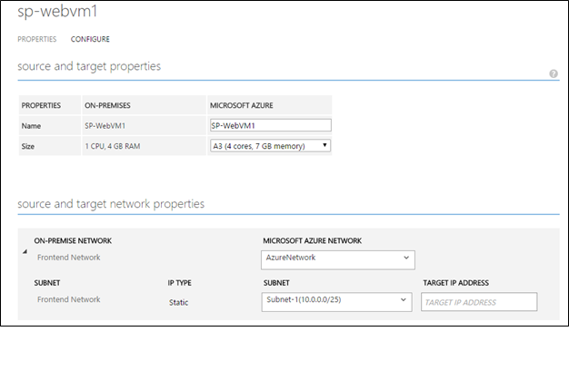
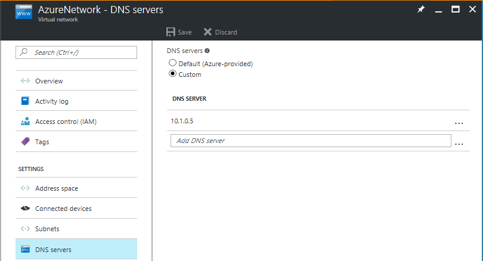

<properties
	pageTitle="Protect Active Directory and DNS with Azure Site Recovery | Microsoft Azure"
	description="This article describes how to implement a disaster recovery solution for Active Directory using Azure Site Recovery."
	services="site-recovery"
	documentationCenter=""
	authors="prateek9us"
	manager="abhiag"
	editor=""/>

<tags
	ms.service="site-recovery"
	ms.devlang="na"
	ms.topic="article"
	ms.tgt_pltfrm="na"
	ms.workload="storage-backup-recovery"
	ms.date="06/13/2016"
	ms.author="pratshar"/>

# Protect Active Directory and DNS with Azure Site Recovery

Enterprise applications such as SharePoint, Dynamics AX and SAP depend on Active Directory and a DNS infrastructure to function correctly. When you create a disaster recovery solution for applications, it's important to remember that you need to protect and recover Active Directory and DNS before the other application components, to ensure that things function correctly when disaster occurs.

Site Recovery is an Azure service that provides disaster recovery by orchestrating replication, failover and recovery of virtual machines. Site Recovery supports a number of replication scenarios to consistently protect, and seamlessly failover virtual machines and applications to private, public or hoster clouds.

Using Site Recovery, you can create a complete automated disaster recovery plan for Active Directory. When disruptions occur, you can initiate a failover within seconds from anywhere in get Active Directory up and running in a few minutes. If you've deployed Active Directory for multiple applications such as SharePoint and SAP in your primary site, and you want to fail over the complete site, you can fail over Active Directory first using Site Recovery, and then fail over the other applications using application-specific recovery plans.

This article explains how to create a disaster recovery solution for Active Directory, how to perform planned, unplanned, and test failovers using a one-click recovery plan, the supported configurations, and prerequisites.  You should be familiar with Active Directory and Azure Site Recovery before you start.

There are two recommended options based on the complexity of your environment.

### Option 1

If you have a small number of applications and a single domain controller, and you want to fail over the entire site, then we recommend using Site Recovery to replicate the domain controller to  the secondary site (whether you're failing over to Azure or to a secondary site). The same replicated virtual machine can be used for test failover too.

### Option 2

If you have a large number of applications and there's more than one domain controller in the environment, or if you plan to fail over a few applications at a time, we recommend that in addition to replicating the domain controller virtual machine with Site Recovery you'll also set up an additional domain controller on the target site ( Azure or a secondary on-premises datacenter).

>[AZURE.NOTE] Even if you're implementing Option-2, for doing a test failover you'll still need to replicate the domain controller using Site Recovery. Read [test failover considerations](#considerations-for-test-failover) for more information.

The following sections explain how to enable protection for a domain controller in Site Recovery, and how to set up a domain controller in Azure.

## Prerequisites

- An on-premises deployment of Active Directory and DNS server.
- An Azure Site Recovery Services vault in a Microsoft Azure subscription.
- If you're replicating to Azure run the Azure Virtual Machine Readiness Assessment tool on VMs to ensure they're compatible with Azure VMs and Azure Site Recovery Services.

## Enable protection using Site Recovery

### Protect the virtual machine

Enable protection of the domain controller/DNS virtual machine in Site Recovery. Configure Site Recovery settings based on the virtual machine type (Hyper-V or VMware). We recommend a crash consistent replication frequency of 15 minutes.

###Configure virtual machine network settings

For the domain controller/DNS virtual machine, configure network settings in Site Recovery so that the VM will be attached to the right network after failover. For example if you're replicating Hyper-V VMs to Azure you can select the the VM in the VMM cloud or in the protect group to configure the network settings as shown below

## Protect Active Directory with Active Directory replication

### Site-to-site protection

Create a domain controller on the secondary site and specify the name of the same domain that is being used on the primary site when you premote the server to a domain controller role. You can use the **Active Directory Sites and Services** snap-in to configure settings on the site link object to which the sites are added. By configuring settings on a site link, you can control when replication occurs between two or more sites, and how often. See [Scheduling Replication Between Sites](https://technet.microsoft.com/library/cc731862.aspx) for more details.

###Site-to-Azure protection

Follow the instructions to [create a domain controller in an Azure virtual network](../active-directory/active-directory-install-replica-active-directory-domain-controller.md). When you  promote the server to a domain controller role specify the same domain name that's used on the primary site.

Then [reconfigure the DNS server for the virtual network](../active-directory/active-directory-install-replica-active-directory-domain-controller.md#reconfigure-dns-server-for-the-virtual-network), to use the DNS server in Azure.

## Test failover considerations

Test failover occurs in a network that's isolated from production network so that there's no impact on production workloads.

Most applications also require the presence of a domain controller and a DNS server to function, so before the application's failed over, a domain controller needs to be created in the isolated network to be used for test failover. The easiest way to do this is to enable protection on the domain controller/DNS virtual machine with Site Recovery, and run a test failover of that virtual machine, before running a test failover of the recovery plan for the application. Here's how you do that:

1. Enable protection in Site Recovery for the domain controller/DNS virtual machine.
2. Create an isolated network. Any virtual network created in Azure by default is isolated from other network. We recommend that the IP address range for this network is same as that of your production network. Don't enable site-to-site connectivity on this network.
3. Provide a DNS IP  address in the network created,  as the IP address that you expect the DNS virtual machine to get. If you're replicating to Azure then provide the IP address for the VM that will be used on failover in **Target IP** setting in VM properties. If you're replicating to another on-premises site and you're using DHCP follow the instructions to [setup DNS and DHCP for test failover](site-recovery-failover.md#prepare-dhcp)

>[AZURE.NOTE] The IP address allocated to a virtual machine during a test failover is same as the IP address it would get on during a planned or unplanned failover, if the IP address is available in the test failover network. If it isn't then the virtual machine  receives a different IP address that is available in the test failover network.

4. On the domain controller virtual machine run a test failover of it in the isolated network.
5. Run a test failover for the application recovery plan.
6. After testing is complete, mark the test failover of job of domain controller virtual machine and the recovery plan 'Complete' on the **Jobs** tab in the Site Recovery portal.

### DNS and domain controller on different machines

If DNS isn't on the same virtual machine as the domain controller you’ll need to create a DNS VM for the test failover. If they're on the same VM you can skip this section.

You can use a fresh DNS server and create all the required zones. For example, if your Active Directory domain is contoso.com, you can create a DNS zone with the name contoso.com. The entries corresponding to Active Directory must be updated in DNS, as follows:

1. Ensure these settings are in place before any other virtual machine in the recovery plan comes up:

	- The zone must be named after the forest root name.
	- The zone must be file backed.
	- The zone must be enabled for secure and non-secure updates.
	- The resolver of the domain controller virtual machine should point to the IP address of the DNS virtual machine.

2. Run the following command on domain controller virtual machine:

	`nltest /dsregdns`

3. Add a zone on the DNS server, allow non-secure updates, and add an entry for it to DNS:

	    dnscmd /zoneadd contoso.com  /Primary
	    dnscmd /recordadd contoso.com  contoso.com. SOA %computername%.contoso.com. hostmaster. 1 15 10 1 1
	    dnscmd /recordadd contoso.com %computername%  A <IP_OF_DNS_VM>
	    dnscmd /config contoso.com /allowupdate 1

## Next steps

Read [What workloads can I protect?](../site-recovery/site-recovery-workload.md) to learn more about protecting enterprise workloads with Azure Site Recovery.
