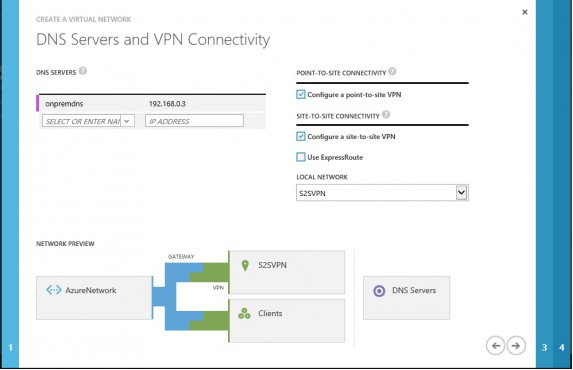
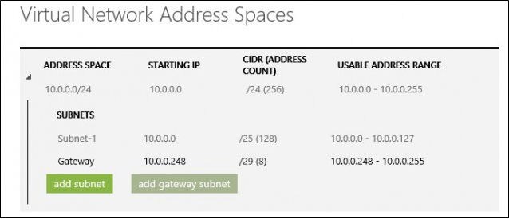
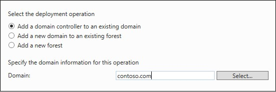

<properties
	pageTitle="Site Recovery Workload Guidance - Active Directory" 
	description="Azure Site Recovery coordinates the replication, failover and recovery of virtual machines and physical servers located on on-premises to Azure or to a secondary on-premises site." 
	services="site-recovery" 
	documentationCenter="" 
	authors="prateek9us" 
	manager="abhiag" 
	editor=""/>

<tags 
	ms.service="site-recovery" 
	ms.devlang="na"
	ms.topic="article"
	ms.tgt_pltfrm="na"
	ms.workload="storage-backup-recovery" 
	ms.date="10/06/2015" 
	ms.author="pratshar"/>

#Automated DR Solution for AD and DNS using ASR

All the enterprise applications such as SharePoint, Dynamics AX and SAP depend on AD and DNS infrastructure to function correctly. While creating a disaster recovery (DR) solution for any such application, it is important to protect and recover AD before the other components of the application come up in the event of a disruption.

Azure Site Recovery  is an Azure based service that provides disaster recovery capabilities by orchestrating replication, failover and recovery of virtual machines. Azure Site Recovery supports a number of replication technologies to consistently replicate, protect, and seamlessly failover virtual machines and applications to private/public or hoster’s clouds. 

Using Azure Site Recovery, you can create a complete automated disaster recovery plan for your AD. You can initiate the failover within seconds from anywhere in the event of a disruption and get the AD up and running in a few minutes. In case you have an AD for multiple applications such as SharePoint and SAP in your primary site and you decide to failover the complete site, you can failover AD first using ASR and then failover the other applications using application specific recovery plans.

This article explains in detail about how you can create a disaster recovery solution for your AD, perform a planned/unplanned/test failovers using one-click recovery plan, supported configurations and prerequisites.  The audience is expected to be familiar with AD and Azure Site Recovery.There are two recommended options based on the complexity of the customer’s on-premises environment to protect AD.
####Option 1

If the customer has a small number of applications and a single domain controller for his entire on-premises site and will be failing over the entire site together, then we recommend using ASR-Replication to replicate the DC machine to secondary site (applicable for both Site to Site and Site to Azure)
####Option 2
If the customer has a large number of applications and is running an Active Directory forest and will failover few applications at a time, then we recommend setting up an additional domain controller on the DR site (secondary site or in Azure). 
Both the options are explained in detail below. If you decide to go with the second option (using AD inbuilt replication), then the further steps such as networking configuration, failover and recovery plan (that are specific to ASR) are not required.

##Prerequisites

Implementing disaster recovery for AD using Azure Site Recovery requires the following pre-requisites completed.

- An on-premises deployment of the AD and DNS server
- Azure Site Recovery Services vault has been created in Microsoft Azure subscription 
- If Azure is your recovery site, run the Azure Virtual Machine Readiness Assessment tool  on VMs to ensure that they are compatible with Azure VMs and Azure Site Recovery Services

##Enable protection for AD using ASR

###Protect VM
Enable protection of AD VM in ASR. Perform relevant Azure Site Recovery configuration based on whether the VM is deployed on Hyper-V or on VMware.The recommended Crash consistent frequency to configure is 15 minutes.

###Configure VM Network Settings
- For the AD server VM, configure network settings in ASR so that the VM networks get attached to the right DR network after failover. 
- You can select the VM in the ‘VMM Cloud’ or the ‘Protection Group’ to configure the network settings as shown in the snapshot below.

##Enable protection for AD using AD Replication
###Site to Site scenario

To control replication of AD between two sites , you can use the Active Directory Sites and Services snap-in to configure settings on the site link object to which the sites are added. By configuring settings on a site link, you can control when replication occurs between two or more sites, and how often. You can refer to ['Scheduling Replication Between Sites'](https://technet.microsoft.com/en-us/library/cc731862.aspx "") for more details.

###Site to Azure scenario
If you are planning for a complete site disaster then yes it is mandatory to replicate AD to Azure. You refer to installing a [replica Active Directory domain controller in an Azure virtual network](../virtual-network/virtual-networks-install-replica-active-directory-domain-controller.md) for more details. 

But if you foresee that you will be doing planned failover of only some of the applications at a time and if the applications are not too chatty with respect to communication with active directory and DNS, then you can choose not to replicate AD and DNS to Azure. In such a case you can provide the IP of the on-premises DNS Server in the network that you create in Azure.

####Create an Azure Virtual Network
Create a new Azure Virtual network (Ex: AzureNetwork) in Microsoft Azure. While creating this network, the IP of the on-premises DNS Server is given as the DNS Server IP. Point to site connectivity as well as site to site connectivity  should be enabled on this network.

 
In the above example, address range of 10.0.0.0 – 10.0.0.255 is specified for the AzureNetwork. It is important to note that you should use an address range different from the on-premises address range for two main reasons:
•	You want to establish site to site connectivity with the on-premises network. An S2S gateway can’t have same IP ranges on both sides of the network
•	If there are multiple applications running on-premises, we want the capability to failover only some of the applications rather than the complete subnet

####Create an AD server in Azure
Once the connectivity between two sites is setup, you can create an Active Directory and DNS Server in Azure so that the applications running in Azure don’t have to go to on-premises AD and DNS for each name lookup and authentication request. Follow the steps below to create an active directory in Azure:
1.	It is recommended that you create a separate site for AzureSite in the on-premises Active Directory using Active Directory Sites and Services
2.	Create an IaaS VM on the network created in earlier
3.	Use Server Manager to install Active Directory Domain Services and DNS Server roles
4.	While promoting the server to a domain controller, give the name of the on-premises domain contoso.com. The IaaS virtual machine should be able to resolve contoso.com as in Step-3 we gave the IP of on-premises DNS Server as the DNS
5.	Add this active directory in the Active Directory site named AzureSite if you have created one

 

Since there is a DNS Server running in Azure, it is better to use this for the IaaS VMs that are created from now on. To do this, go to the AzureNetwork and modify the DNS Server IP to provide the IP of the virtual machine created in the step above.
  

##Considerations for Test Failover
For Test Failover (TFO) scenarios using AD , the production workload should not be impacted. If you are using AD replication, care should be taken not to impact the AD running in production during TFO. 

1. Create another virtual network (let’s call it AzureTestNetwork) and use the same IP ranges as used in the network created earlier. This network will be used during TFO. Don’t add site to site connectivity and point to site connectivity in the network just yet.
2. Go to AD virtual machine in ASR and do a test failover of it in AzureTestNetwork.
3. Once the IaaS virtual machine is created for AD in AzureTestNetwork, check the IP that has been provided to this virtual machine.
4. If the IP is not same as what was given to DNS of AzureTestNetwork, modify the DNS IP to the IP that AD VM has got. Azure starts giving IP from the 4th IP of the IP range defined in virtual network. If the IP range added in the network is 10.0.0.0 – 10.0.0.255, the first VM that is created in this network would get IP 10.0.0.4. As AD would be the first machine to be failed over in a DR drill, you can predict the IP that this VM is going to get and accordingly add that as the DNS IP in AzureTestNetwork.
5. Once the testing is complete, you can mark the test failover complete from the Jobs view in ASR. This will delete the virtual machines that were created on AzureTestNetwork.

##Summary
Using Azure Site Recovery, you can create a complete automated disaster recovery plan for your AD. You can initiate the failover within seconds from anywhere in the event of a disruption and get the AD up and running in a few minutes. In case you have an AD for multiple applications such as SharePoint and SAP in your primary site and you decide to failover the complete site, you can failover the AD using ASR first and then failover the other applications using application specific recovery plans.

