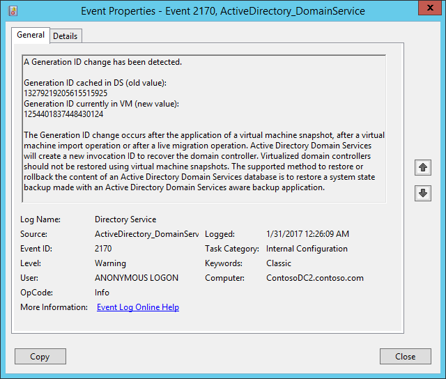
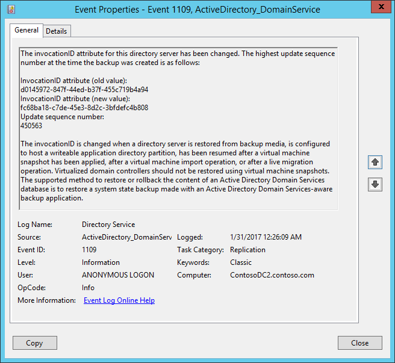
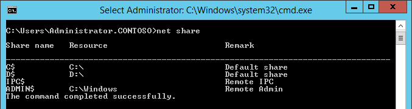
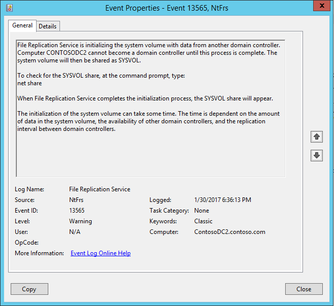
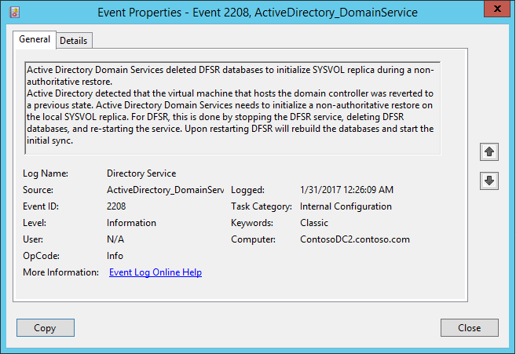

# Use Azure Site Recovery to protect Active Directory and DNS

Enterprise applications such as SharePoint, Dynamics AX, and SAP depend on Active Directory and a DNS infrastructure to function correctly. When you set up disaster recovery for applications,  you often need to recover Active Directory and DNS before you recover other application components, to ensure correct application functionality.

You can use [Site Recovery](site-recovery-overview.md) to create a disaster recovery plan for Active Directory. When a disruption occurs, you can initiate a failover. You can have Active Directory up and running in a few minutes. If you have deployed Active Directory for multiple applications in your primary site, for example, for SharePoint and SAP, you might want to fail over the complete site. You can first fail over Active Directory using Site Recovery. Then, fail over the other applications, using application-specific recovery plans.

This article explains how to create a disaster recovery solution for Active Directory. It includes prerequisites, and failover instructions. You should be familiar with Active Directory and Site Recovery before you begin.

## Prerequisites

* If you're replicating to Azure, [prepare Azure resources](tutorial-prepare-azure.md), including a subscription, an Azure Virtual Network, a storage account, and a Recovery Services vault.
* Review the [support requirements](site-recovery-support-matrix-to-azure.md) for all components.

## Replicate the domain controller

- You must set up [Site Recovery replication](#enable-protection-using-site-recovery), on at least one VM that hosts a domain controller or DNS.
- If you have [multiple domain controllers](#environment-with-multiple-domain-controllers) in your environment, you also must set up an [additional domain controller](#protect-active-directory-with-active-directory-replication) on the target site. The additional domain controller can be in Azure, or in a secondary on-premises datacenter.
- If you have only a few applications and one domain controller, you might want to fail over the entire site together. In this case, we recommend using Site Recovery to replicate the domain controller to the target site (either in Azure or in a secondary on-premises datacenter). You can use the same replicated domain controller or DNS virtual machine for [test failover](#test-failover-considerations).
- - If you have many applications and more than one domain controller in your environment, or if you plan to fail over a few applications at a time, in addition to replicating the domain controller virtual machine with Site Recovery, we recommend that you set up an [additional domain controller](#protect-active-directory-with-active-directory-replication) on the target site (either in Azure or in a secondary on-premises datacenter). For [test failover](#test-failover-considerations), you can use domain controller that's replicated by Site Recovery. For failover, you can use the additional domain controller on the target site.

## Enable protection with Site Recovery

You can use Site Recovery to protect the virtual machine that hosts the domain controller or DNS.

### Protect the VM
The domain controller that is replicated by using Site Recovery is used for [test failover](#test-failover-considerations). Ensure that it meets the following requirements:

1. The domain controller is a global catalog server.
2. The domain controller should be the FSMO role owner for roles that are needed during a test failover. Otherwise, these roles will need to be [seized](http://aka.ms/ad_seize_fsmo) after the failover.

### Configure VM network settings
For the virtual machine that hosts the domain controller or DNS, in Site Recovery, configure network settings under the **Compute and Network** settings of the replicated virtual machine. This ensures that the virtual machine is attached to the correct network after failover.

## Protect Active Directory

### Site-to-site protection
Create a domain controller on the secondary site. When you promote the server to a domain controller role, specify the name of the same domain that is being used on the primary site. You can use the **Active Directory Sites and Services** snap-in to configure settings on the site link object to which the sites are added. By configuring settings on a site link, you can control when replication occurs between two or more sites, and how often it occurs. For more information, see [Scheduling replication between sites](https://technet.microsoft.com/library/cc731862.aspx).

### Site-to-Azure protection
First, create a domain controller in an Azure virtual network. When you promote the server to a domain controller role, specify the same domain name that's used on the primary site.

Then, reconfigure the DNS server for the virtual network to use the DNS server in Azure.

### Azure-to-Azure protection
First, create a domain controller in an Azure virtual network. When you promote the server to a domain controller role, specify the same domain name that's used on the primary site.

Then, reconfigure the DNS server for the virtual network to use the DNS server in Azure.

## Test failover considerations
To avoid impact on production workloads, test failover occurs in a network that's isolated from the production network.

Most applications require the presence of a domain controller or a DNS server. Therefore, before the application fails over, you must create a domain controller in the isolated network to be used for test failover. The easiest way to do this is to use Site Recovery to replicate a virtual machine that hosts a domain controller or DNS. Then, run a test failover of the domain controller virtual machine before you run a test failover of the recovery plan for the application. Here's how you do that:

1. Use Site Recovery to [replicate](vmware-azure-tutorial.md) the virtual machine that hosts the domain controller or DNS.
2. Create an isolated network. Any virtual network that you create in Azure is isolated from other networks by default. We recommend that you use the same IP address range for this network that you use in your production network. Don't enable site-to-site connectivity on this network.
3. Provide a DNS IP address in the isolated network. Use the IP address that you expect the DNS virtual machine to get. If you're replicating to Azure, provide the IP address for the virtual machine that's used on failover. To enter the IP address, in the replicated virtual machine, in the **Compute and Network** settings, select the **Target IP** settings.

	

    > [!TIP]
    > Site Recovery attempts to create test virtual machines in a subnet of the same name and by using the same IP address that's provided in the **Compute and Network** settings of the virtual machine. If a subnet of the same name isn't available in the Azure virtual network that's provided for test failover, the test virtual machine is created in the alphabetically first subnet.
    >
    > If the target IP address is part of the selected subnet, Site Recovery tries to create the test failover virtual machine by using the target IP address. If the target IP isn't part of the selected subnet, the test failover virtual machine is created by using the next available IP in the selected subnet.
    >
    >

### Test failover to a secondary site

1. If you're replicating to another on-premises site and you use DHCP, [set up DNS and DHCP for test failover](hyper-v-vmm-test-failover.md#prepare-dhcp).
2. Do a test failover of the domain controller virtual machine that runs in the isolated network. Use the latest available *application consistent* recovery point of the domain controller virtual machine to do the test failover.
3. Run a test failover for the recovery plan that contains virtual machines that the application runs on.
4. When testing is complete, *clean up the test failover* on the domain controller virtual machine. This step deletes the domain controller that was created for test failover.

### Remove references to other domain controllers
When you initiate a test failover, don't include all the domain controllers in the test network. To remove references to other domain controllers that exist in your production environment, you might need to [seize FSMO Active Directory roles](http://aka.ms/ad_seize_fsmo) and do [metadata cleanup](https://technet.microsoft.com/library/cc816907.aspx) for missing domain controllers.

### Issues caused by virtualization safeguards

> [!IMPORTANT]
> Some of the configurations described in this section are not standard or default domain controller configurations. If you don't want to make these changes to a production domain controller, you can create a domain controller that's dedicated for Site Recovery to use for test failover. Make these changes only to that domain controller.  
>
>

Beginning with Windows Server 2012, [additional safeguards are built into Active Directory Domain Services (AD DS)](https://technet.microsoft.com/windows-server-docs/identity/ad-ds/introduction-to-active-directory-domain-services-ad-ds-virtualization-level-100). These safeguards help protect virtualized domain controllers against USN rollbacks if the underlying hypervisor platform supports **VM-GenerationID**. Azure supports **VM-GenerationID**. Because of this, domain controllers that run Windows Server 2012 or later on Azure virtual machines have these additional safeguards.

When **VM-GenerationID** is reset, the **InvocationID** value of the AD DS database is also reset. In addition, the RID pool is discarded, and SYSVOL is marked as non-authoritative. For more information, see [Introduction to Active Directory Domain Services virtualization](https://technet.microsoft.com/windows-server-docs/identity/ad-ds/introduction-to-active-directory-domain-services-ad-ds-virtualization-level-100) and [Safely virtualizing DFSR](https://blogs.technet.microsoft.com/filecab/2013/04/05/safely-virtualizing-dfsr/).

Failing over to Azure might cause **VM-GenerationID** to reset. Resetting **VM-GenerationID** triggers additional safeguards when the domain controller virtual machine starts in Azure. This might result in a *significant delay* in being able to log in to the domain controller virtual machine.

Because this domain controller is used only in a test failover, virtualization safeguards aren't necessary. To ensure that the **VM-GenerationID** value for the domain controller virtual machine doesn't change, you can change the value of following DWORD to **4** in the on-premises domain controller:

`HKEY_LOCAL_MACHINE\SYSTEM\CurrentControlSet\Services\gencounter\Start`

#### Symptoms of virtualization safeguards

If virtualization safeguards are triggered after a test failover, you might see one or more of following symptoms:  

* The **GenerationID** value changes.

    

* The **InvocationID** value changes.

    

* SYSVOL and NETLOGON shares aren't available.

    

    

* DFSR databases are deleted.

    

### Troubleshoot domain controller issues during test failover

> [!IMPORTANT]
> Some of the configurations described in this section aren't standard or default domain controller configurations. If you don't want to make these changes to a production domain controller, you can create a domain controller that's dedicated for Site Recovery test failover. Make the changes only to that dedicated domain controller.  
>
>

1. At the command prompt, run the following command to check whether SYSVOL and NETLOGON folders are shared:

	`NET SHARE`

2. At the command prompt, run the following command to ensure that the domain controller is functioning properly:

	`dcdiag /v > dcdiag.txt`

3. In the output log, look for the following text. The text confirms that the domain controller is functioning correctly.

    * "passed test Connectivity"
    * "passed test Advertising"
    * "passed test MachineAccount"

If the preceding conditions are satisfied, it's likely that the domain controller is functioning correctly. If it's not, complete the following steps:

1. Do an authoritative restore of the domain controller. Keep the following information in mind:
	* Although we don't recommend [FRS replication](https://blogs.technet.microsoft.com/filecab/2014/06/25/the-end-is-nigh-for-frs/), if you use FRS replication, follow the steps for an authoritative restore. The process is described in [Using the BurFlags registry key to reinitialize File Replication Service](https://support.microsoft.com/kb/290762).

        For more information about BurFlags, see the blog post [D2 and D4: What is it for?](https://blogs.technet.microsoft.com/janelewis/2006/09/18/d2-and-d4-what-is-it-for/).
	* If you use DFSR replication, complete the steps for an authoritative restore. The process is described in [Force an authoritative and non-authoritative sync for DFSR-replicated SYSVOL (like "D4/D2" for FRS)](https://support.microsoft.com/kb/2218556).

        You can also use the PowerShell functions. For more information, see [DFSR-SYSVOL authoritative/non-authoritative restore PowerShell functions](https://blogs.technet.microsoft.com/thbouche/2013/08/28/dfsr-sysvol-authoritative-non-authoritative-restore-powershell-functions/).

2. Bypass the initial sync requirement by setting the following registry key to **0** in the on-premises domain controller. If the DWORD doesn't exist, you can create it under the **Parameters** node.

	`HKEY_LOCAL_MACHINE\SYSTEM\CurrentControlSet\Services\NTDS\Parameters\Repl Perform Initial Synchronizations`

    For more information, see [Troubleshoot DNS Event ID 4013: The DNS server was unable to load AD integrated DNS zones](https://support.microsoft.com/kb/2001093).

3. Disable the requirement that a global catalog server be available to validate the user login. To do this, in the on-premises domain controller, set the following registry key to **1**. If the DWORD doesn't exist, you can create it under the **Lsa** node.

    `HKEY_LOCAL_MACHINE\SYSTEM\CurrentControlSet\Control\Lsa\IgnoreGCFailures`

    For more information, see [Disable the requirement that a global catalog server be available to validate user logons](http://support.microsoft.com/kb/241789).

### DNS and domain controller on different machines

If you're running the domain controller and DNs on the same VM, you can skip this procedure.

If DNS isn't on the same VM as the domain controller, you need to create a DNS VM for the test failover. You can use a fresh DNS server, and create all the required zones. For example, if your Active Directory domain is contoso.com, you can create a DNS zone with the name contoso.com. The entries that correspond to Active Directory must be updated in DNS as follows:

1. Ensure that these settings are in place before any other virtual machine in the recovery plan starts:
   * The zone must be named after the forest root name.
   * The zone must be file-backed.
   * The zone must be enabled for secure and nonsecure updates.
   * The resolver of the virtual machine that hosts the domain controller should point to the IP address of the DNS virtual machine.

2. Run the following command on the VM that hosts the domain controller:

    `nltest /dsregdns`

3. Run the following commands to add a zone on the DNS server, allow nonsecure updates, and add an entry for the zone to DNS:

    `dnscmd /zoneadd contoso.com  /Primary`

    `dnscmd /recordadd contoso.com  contoso.com. SOA %computername%.contoso.com. hostmaster. 1 15 10 1 1`

    `dnscmd /recordadd contoso.com %computername%  A <IP_OF_DNS_VM>`

    `dnscmd /config contoso.com /allowupdate 1`

## Next steps
Learn more about [protecting enterprise workloads with Azure Site Recovery](site-recovery-workload.md).
