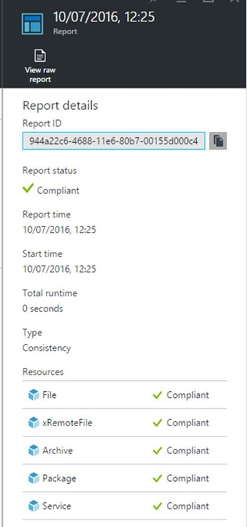

<properties
	pageTitle="Replicate VMware virtual machines to Azure using Site Recovery with Azure Automation DSC | Microsoft Azure"
	description="Describes how to use Azure Automation DSC to automatically deploy ASR Mobility Service and Azure agent for virtual/physical machines to Azure."
	services="site-recovery"
	documentationCenter=""
	authors="krnese"
	manager="lorenr"
	editor=""/>

<tags
	ms.service="site-recovery"
	ms.workload="backup-recovery"
	ms.tgt_pltfrm="na"
	ms.devlang="na"
	ms.topic="article"
	ms.date="07/26/2016"
	ms.author="krnese"/>

# Replicate VMware VMs to Azure using Site Recovery with Azure Automation DSC

In OMS, we provide you with a comprehensive Backup & Disaster Recovery solution that can be leveraged as part of your business continuity plan.

We started this journey together with Hyper-V using Hyper-V Replica, but have expanded to support a heterogeneous setup as we are well aware that customers have multiple hypervisors and platforms in their clouds.

If you are running VMware workloads or/and physical servers today, we rely on a management server that runs all of the Site Recovery components running in your environment to handle the communication and data replication with Azure when Azure is your destination.

## Deploy ASR Mobility Service using OMS Automation DSC
Let us start by doing a quick breakdown of what this management server really does:

The management server runs several server roles, such as **configuration** – which coordinates communication and manages data replication and recovery processes.

In addition, the **process** role acts as a replication gateway where it receives replication data from protected source machines, optimizes it with caching, compression and encryption, before it sends it to Azure storage account. One of the functions for the process role is also to push installation of the Mobility Service to protected machines and perform automatic discovery of VMware VMs.

In case of a failback from Azure, the **master target** role will be responsible, and will handle the replication data as part of this operation.

For the protected machines, we rely on the **Mobility Service** – which is a component that is deployed to every machine (VMware VM or physical server) that you want to replicate to Azure. Its role is to captures data writes on the machine and forward them to the management server (process role).

When dealing with business continuity, it is important to understand your workloads, your infrastructure, and also the components involved in order to meet the requirements for your RTO and RPO. In this context, the mobility service is key to ensure that your workloads are protected as you would expect.

So how can we in an optimized way ensure that we have a reliable protected setup with the help from some OMS components?

In this article we will provide you with an example on how you can leverage OMS Automation DSC together with OMS Site Recovery to ensure that the Mobility Service and Azure VM agent are deployed to your Windows machines you want to protect, and always be running when Azure is the replication target.

## Prerequisites

- A repository to store the required setup
- A repository to store the required passphrase to register with the management server
- Windows Management Framework 5.0 installed on the machines you want to enable for protection (requirement for OMS Automation DSC)

If you want to use DSC towards your Windows machines using WMF 4.0, see the section for ‘Using DSC in disconnected environments’

(An unique passphrase is generated for each management server. If you are going to deploy multiple management servers, you would have to ensure that the correct passphrase is stored in passphrase.txt file)

The Mobility Service can be installed through command line and accepts several arguments.

That’s why we need to have the binaries (after extracting them from our setup) and store them somewhere we are able to retrieve them using a DSC configuration.

## Step 1: Extracting binaries

1. To extract the files you need for this setup, navigate to the following directory on your management server: **\Microsoft Azure Site Recovery\home\svsystems\pushinstallsvc\repository**

    In this folder, you should see a MSI file named:

    **Microsoft-ASR_UA_<version>_Windows_GA_<date>_Release.exe**

    Use the following command to extract the installer:

    .\Microsoft-ASR_UA_9.1.0.0_Windows_GA_02May2016_release.exe /q /x:C:\Users\Administrator\Desktop\Mobility_Service\Extract

2. Select all files and send to a compressed (zipped) folder.

That’s it! You now have the binaries you need to automate the setup of the mobility service using OMS Automation DSC.

### Passphrase
Next, you need to determine where you want to place this zipped folder. In my case, I will later show that I am using a storage account in Azure, where I have also placed the passphrase I need for the setup, so that the agent will register with the management server as part of the process.

The passphrase you got when deploying the management server can be saved to a txt-file as passphrase.txt.

I have placed both the zipped folder and the passphrase in a dedicated container in my Azure storage account


If you prefer to keep these files on a share within your network, you can perfectly do so. You just need to ensure that the DSC resource we will be using later actually has access and can get the setup and passphrase.

## Step 2 – Creating the DSC configuration
My setup depends on WMF 5.0, so that means that in order for the machine to successfully apply the configuration through OMS Automation DSC, WMF 5.0 needs to be present.

The following DSC configuration is used in my environment:

```powershell
configuration ASRMobilityService {

    $RemoteFile = 'https://knrecstor01.blob.core.windows.net/asr/ASR.zip'
    $RemotePassphrase = 'https://knrecstor01.blob.core.windows.net/asr/passphrase.txt'
    $RemoteAzureAgent = 'http://go.microsoft.com/fwlink/p/?LinkId=394789'
    $LocalAzureAgent = 'C:\Temp\AzureVmAgent.msi'
    $TempDestination = 'C:\Temp\asr.zip'
    $LocalPassphrase = 'C:\Temp\Mobility_service\passphrase.txt'
    $Role = 'Agent'
    $Install = 'C:\Program Files (x86)\Microsoft Azure Site Recovery'
    $CSEndpoint = '10.0.0.115'
    $Arguments = '/Role "{0}" /InstallLocation "{1}" /CSEndpoint "{2}" /PassphraseFilePath "{3}"' -f $Role,$Install,$CSEndpoint,$LocalPassphrase

    Import-DscResource -ModuleName xPSDesiredStateConfiguration

    node localhost {

        File Directory {
            DestinationPath = 'C:\Temp\ASRSetup\'
            Type = 'Directory'            
        }

        xRemoteFile Setup {
            URI = $RemoteFile
            DestinationPath = $TempDestination
            DependsOn = '[File]Directory'
        }

        xRemoteFile Passphrase {
            URI = $RemotePassphrase
            DestinationPath = $LocalPassphrase
            DependsOn = '[File]Directory'
        }

        xRemoteFile AzureAgent {
            URI = $RemoteAzureAgent
            DestinationPath = $LocalAzureAgent
            DependsOn = '[File]Directory'
        }

        Archive ASRzip {
            Path = $TempDestination
            Destination = 'C:\Temp\ASRSetup'
            DependsOn = '[xRemotefile]Setup'
        }

        Package Install {
            Path = 'C:\temp\ASRSetup\ASR\UNIFIEDAGENT.EXE'
            Ensure = 'Present'
            Name = 'Microsoft Azure Site Recovery mobility Service/Master Target Server'
            ProductId = '275197FC-14FD-4560-A5EB-38217F80CBD1'
            Arguments = $Arguments
            DependsOn = '[Archive]ASRzip'
        }

        Package AzureAgent {
            Path = 'C:\Temp\AzureVmAgent.msi'
            Ensure = 'Present'
            Name = 'Windows Azure VM Agent - 2.7.1198.735'
            ProductId = '5CF4D04A-F16C-4892-9196-6025EA61F964'
            Arguments = '/q /l "c:\temp\agentlog.txt'
            DependsOn = '[Package]Install'
        }

        Service ASRvx {
            Name = 'svagents'
            Ensure = 'Present'
            State = 'Running'
            DependsOn = '[Package]Install'
        }

        Service ASR {
            Name = 'InMage Scout Application Service'
            Ensure = 'Present'
            State = 'Running'
            DependsOn = '[Package]Install'
        }

        Service AzureAgentService {
            Name = 'WindowsAzureGuestAgent'
            Ensure = 'Present'
            State = 'Running'
            DependsOn = '[Package]AzureAgent'
        }

        Service AzureTelemetry {
            Name = 'WindowsAzureTelemetryService'
            Ensure = 'Present'
            State = 'Running'
            DependsOn = '[Package]AzureAgent'
        }
    }
}
```
The configuration will do the following:

- The variables will tell the configuration where to get the binaries for the Mobility Service and the Azure VM Agent, and also the passphrase, as well as where to store the output.
- Import the xPSDesiredStateConfiguration DscResource, so that we can use ‘xRemoteFile’ to download the files from the repository.
- Create a directory where we want to store the binaries.
- The Archive resource will extract the files from the zipped folder.
- The Package ‘Install’ resource will install the Mobility Service from the UNIFIEDAGENT.EXE installer with the specific arguments (the variables constructing the arguments need to be changed to reflect your environment).
- The Package ‘AzureAgent’ will install the Azure VM Agent which is recommended on every VM that runs in Azure, and also makes it possible to add extensions to the VM post failover.
- The Service resource(s) will ensure that the related Mobility services and the Azure services are always running.

I have saved the configuration as **ASRMobilityService** in a folder on my computer.

(Remember to replace the CSIP in your configuration to reflect the actual management server, so that the agent will be connected correctly, also using the correct passphrase).

## Step 3 – Uploading to OMS Automation DSC

Since the DSC configuration we made will import a required DSC resource module (xPSDesiredStateConfiguration), you need to import that module in OMS Automation prior to uploading the DSC configuration.

Login to your automation account and navigate to AssetsàModules and click on Browse Gallery.

Here you can search for the module and import it to your account.


Once this is done, head over to your machine where you have the Azure RM modules installed and proceed to import the newly created DSC configuration.

### Import cmdlets

In PowerShell, logon to your Azure subscription and modify the cmdlets to reflect your environment and capture your Automation Account information into a variable:
```powershell
$AAAccount = Get-AzureRmAutomationAccount -ResourceGroupName 'KNOMS' -Name 'KNOMSAA'
```

First I want to upload the configuration to OMS Automation DSC using the following cmdlet:

```powershell
$ImportArgs = @{
    SourcePath = 'C:\ASR\ASRMobilityService.ps1'
    Published = $true
    Description = 'DSC Config for Mobility Service'
}
$AAAccount | Import-AzureRmAutomationDscConfiguration @ImportArgs
```

Next, we need to compile the configuration in OMS Automation DSC, so that we can start to register nodes to it.

### Compile the configuration in OMS Automation DSC

We achieve that by running the following cmdlet:

```powershell
$AAAccount | Start-AzureRmAutomationDscCompilationJob -ConfigurationName ASRMobilityService
```

This can take a few minutes, as we are basically deploying the configuration to the hosted DSC Pull service.

Once completed, you can either retrieve the job information by using PowerShell (Get-AzureRmAutomationDscCompilationJob) or use portal.azure.com


We have now successfully published and uploaded our DSC configuration to OMS Automation DSC.

## Step 4 – Onboarding machines to OMS Automation DSC
*One of the pre-reqs for completing this scenario, is that your Windows machines are updated with the latest version of WMF. You can download and install the correct version for your platform following this URL: https://www.microsoft.com/download/details.aspx?id=50395*

We will now create a metaconfig for DSC that we will apply to our nodes. To succeed with this, you need to retrieve the endpoint URL and the primary key for your selected Automation account in Azure.

These values can be located under ‘Keys’ on the Automation account ‘All settings’ blade.


In my environment, I have a Windows Server 2012 R2 physical server that I want to protect with OMS Site Recovery.

Before we start to associate the server with the Automation DSC endpoint, it is recommended that we check for any pending file rename operations in the registry, as this might prohibit the setup to complete due to a pending reboot.

### Check for any pending file rename operations in the registry

Run the following cmdlet to verify that there’s no pending reboot on the server:

```powershell
Get-ItemProperty 'HKLM:\SYSTEM\CurrentControlSet\Control\Session Manager\' | Select-Object -Property PendingFileRenameOperations
```
If this shows empty, you are ok to proceed. If not, you should address this by rebooting the server during a maintenance window.

To apply the configuration on the server, I start PowerShell ISE and runs the following script. This is essentially a DSC Local Configuration configuration that will instruct the local configuration manager engine to register with the OMS Automation DSC service and retrieve the specific configuration (ASRMobilityService.localhost)

```powershell
[DSCLocalConfigurationManager()]
configuration metaconfig {
    param (
        $URL,
        $Key
    )
    node localhost {
        Settings {
            RefreshFrequencyMins = '30'
            RebootNodeIfNeeded = $true
            RefreshMode = 'PULL'
            ActionAfterReboot = 'ContinueConfiguration'
            ConfigurationMode = 'ApplyAndMonitor'
            AllowModuleOverwrite = $true
        }
        
        ResourceRepositoryWeb AzureAutomationDSC {
            ServerURL = $URL
            RegistrationKey = $Key
        }
        
        ConfigurationRepositoryWeb AzureAutomationDSC {
            ServerURL = $URL
            RegistrationKey = $Key
            ConfigurationNames = 'ASRMobilityService.localhost'
        }
        
        ReportServerWeb AzureAutomationDSC {
            ServerURL = $URL
            RegistrationKey = $Key
        }
    }
}
metaconfig -URL 'https://we-agentservice-prod-1.azure-automation.net/accounts/<YOURAAAccountID>' -Key '<YOURAAAccountKey>'

Set-DscLocalConfigurationManager .\metaconfig -Force -Verbose
```

This configuration will configure the local configuration manager to register itself with OMS Automation DSC and basically instruct how the engine should operate, what it should do in case of a configuration drift (ApplyAndAutoCorrect) and in case there is a reboot that’s required, proceed with the configuration afterwards.

Once you run this, the node should start to register with Automation DSC


If we go back to portal.azure.com, we can see that the newly registered node has now appeared in the portal.


On the server, we can run the following PowerShell cmdlet to verify it has been registered correctly:

```powershell
Get-DscLocalConfigurationManager
```

Once the configuration has been pulled and applied to the server, you can verify this by running:

```powershell
Get-DscConfigurationStatus
```

The output shows that the server has successfully pulled its configuration:


In addition, the Mobility Service setup has its own log that can be found at ‘<SystemDrive>\ProgramData\ASRSetupLogs’.

That’s it – we have now successfully deployed and registered the Mobility Service on our machine we want to protect with Site Recovery, and we can rely on DSC that the required services will always be running.



Once this has been detected by the management server, you can proceed to configure protection and enable replication on the machine with Site Recovery.

## Using DSC in disconnected environments

If your machines aren’t connected to the internet, you can still rely on DSC to deploy and configure the Mobility Service on the workloads you would like to protect.

You can either instantiate your own DSC Pull Server in your environment that will essentially provide the same capabilities as you get from OMS Automation DSC – where the clients will pull the configuration once registered to the DSC endpoint. However, we have another option which is to use push, where you manually are pushing the DSC configuration to your machines, either locally or remote.

Note that in this example, we have added a parameter for computername and the remote files are now located on a remote share that should be accessible by the machines you want to protect, and in the end of the script we enact the configuration, and then start to apply the DSC configuration to the target computer.

### Prerequesites

· xPSDesiredStateConfiguration PowerShell module installed

For Windows machines where WMF 5.0 is installed, you can simply install xPSDesiredStateConfiguration module by running the following cmdlet on the target machine(s):

```powershell
Find-Module -Name xPSDesiredStateConfiguration | Install-Module
```

You can also download and save the module in case you need to distribute it to Windows machines using WMF 4.0, by running this cmdlet on a machine where PowerShellGet (WMF 5.0) is present:

```powershell
Save-Module -Name xPSDesiredStateConfiguration -Path <location>
```

Also for WMF 4.0, ensure the following update is installed on the machine(s):

https://www.microsoft.com/download/details.aspx?id=40749

The following configuration can be pushed towards both Windows machines with WMF 5.0 and 4.0

```powershell
configuration ASRMobilityService {
    param (
        [Parameter(Mandatory=$true)]
        [ValidateNotNullOrEmpty()]
        [System.String] $ComputerName
    )

    $RemoteFile = '\\myfileserver\share\asr.zip'
    $RemotePassphrase = '\\myfileserver\share\passphrase.txt'
    $RemoteAzureAgent = '\\myfileserver\share\AzureVmAgent.msi'
    $LocalAzureAgent = 'C:\Temp\AzureVmAgent.msi'
    $TempDestination = 'C:\Temp\asr.zip'
    $LocalPassphrase = 'C:\Temp\Mobility_service\passphrase.txt'
    $Role = 'Agent'
    $Install = 'C:\Program Files (x86)\Microsoft Azure Site Recovery'
    $CSEndpoint = '10.0.0.115'
    $Arguments = '/Role "{0}" /InstallLocation "{1}" /CSEndpoint "{2}" /PassphraseFilePath "{3}"' -f $Role,$Install,$CSEndpoint,$LocalPassphrase
    
    Import-DscResource -ModuleName xPSDesiredStateConfiguration

    node $ComputerName {      
        File Directory {
            DestinationPath = 'C:\Temp\ASRSetup\'
            Type = 'Directory'            
        }
        
        xRemoteFile Setup {
            URI = $RemoteFile
            DestinationPath = $TempDestination
            DependsOn = '[File]Directory'
        }

        xRemoteFile Passphrase {
            URI = $RemotePassphrase
            DestinationPath = $LocalPassphrase
            DependsOn = '[File]Directory'
        }

        xRemoteFile AzureAgent {
            URI = $RemoteAzureAgent
            DestinationPath = $LocalAzureAgent
            DependsOn = '[File]Directory'
        }

        Archive ASRzip {
            Path = $TempDestination
            Destination = 'C:\Temp\ASRSetup'
            DependsOn = '[xRemotefile]Setup'
        }

        Package Install {
            Path = 'C:\temp\ASRSetup\ASR\UNIFIEDAGENT.EXE'
            Ensure = 'Present'
            Name = 'Microsoft Azure Site Recovery mobility Service/Master Target Server'
            ProductId = '275197FC-14FD-4560-A5EB-38217F80CBD1'
            Arguments = $Arguments
            DependsOn = '[Archive]ASRzip'
        }

        Package AzureAgent {
            Path = 'C:\Temp\AzureVmAgent.msi'
            Ensure = 'Present'
            Name = 'Windows Azure VM Agent - 2.7.1198.735'
            ProductId = '5CF4D04A-F16C-4892-9196-6025EA61F964'
            Arguments = '/q /l "c:\temp\agentlog.txt'
            DependsOn = '[Package]Install'
        }

        Service ASRvx {
            Name = 'svagents'
            State = 'Running'
            DependsOn = '[Package]Install'
        }

        Service ASR {
            Name = 'InMage Scout Application Service'
            State = 'Running'
            DependsOn = '[Package]Install'
        }

        Service AzureAgentService {
            Name = 'WindowsAzureGuestAgent'
            State = 'Running'
            DependsOn = '[Package]AzureAgent'
        }

        Service AzureTelemetry {
            Name = 'WindowsAzureTelemetryService'
            State = 'Running'
            DependsOn = '[Package]AzureAgent'
        }
    }
}
ASRMobilityService -ComputerName 'MyTargetComputerName'

Start-DscConfiguration .\ASRMobilityService -Wait -Force -Verbose
```

If you want to instantiate your own DSC pull server within your corporate network, to mimic the same capabilities you can get from OMS Automation DSC, see the following guide: https://msdn.microsoft.com/powershell/dsc/pullserver?f=255&MSPPError=-2147217396

## Optional: Deploy DSC Configuration using Azure Resource Manager Template

In this article, we have so far been focusing on how you can create your own DSC configuration to automatically deploy the Mobility Service and the Azure VM Agent – and ensure they are running on the machines you would like to protect. As a bonus, we have also an Azure Resource Manager##  ## template that will deploy this DSC configuration to a new or existing Azure Automation account, creating automation assets that will contain the variables for your environment through input parameters in the template.

Once deployed, you can simply refer to Step 4 in this guide to onboard your machines.

The template will do the following:

· Use an existing or create a new OMS Automation account

· Take input parameters for your:

	· ASRRemoteFile – the location where you have stored the Mobility Service setup
	· ASRPassphrase – the location where you have stored the passphrase.txt file
	· ASRCSEndpoint – the IP address of your Management server
	· Import xPSDesiredStateConfiguration PowerShell module
	· Create and compile the DSC configuration


All the above steps will be taken in the right order, so that you easily get started by onboarding your machines for protection.

The template with instructions for deployment is located at:

https://github.com/krnese/AzureDeploy/tree/master/OMS/MSOMS/DSC

Deploy using PowerShell:

```powershell
$RGDeployArgs = @{
    Name = 'DSC3'
    ResourceGroupName = 'KNOMS'
    TemplateFile = 'https://raw.githubusercontent.com/krnese/AzureDeploy/master/OMS/MSOMS/DSC/azuredeploy.json'
    OMSAutomationAccountName = 'KNOMSAA'
    ASRRemoteFile = 'https://knrecstor01.blob.core.windows.net/asr/ASR.zip'
    ASRRemotePassphrase = 'https://knrecstor01.blob.core.windows.net/asr/passphrase.txt'
    ASRCSEndpoint = '10.0.0.115'
    DSCJobGuid = [System.Guid]::NewGuid().ToString()
}
New-AzureRmResourceGroupDeployment @RGDeployArgs -Verbose
```

## Next steps:

After you deploy the Mobility Service Agents, you can continue to [enable replication](site-recovery-vmware-to-azure.md#step-6-replicate-applications) for the virtual machines.
