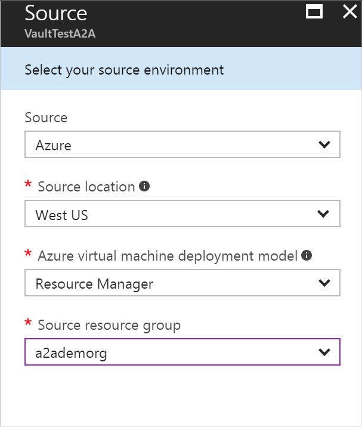

# Replicate Azure VMs between regions with Azure Site Recovery

>[!NOTE]
>
> Site Recovery replication for Azure virtual machines is currently in preview.

This article describes how to replicate Azure virtual machines (VMs) between Azure regions, using the [Azure Site Recovery](site-recovery-overview.md) service in the Azure portal.

Post comments and questions at the bottom of this article, or on the [Azure Recovery Services Forum](https://social.msdn.microsoft.com/forums/azure/home?forum=hypervrecovmgr).

## Disaster recovery in Azure

In addition to the inbuilt Azure infrastructure capabilities and features that contribute to a robust and resilient availability strategy for workloads running on Azure VMs, there are a number of reasons why you need to plan for disaster recovery between Azure regions yourself:

- Your compliance guidelines for specific apps and workloads require a Business continuity and Disaster Recovery (BCDR) strategy.
- You want the ability to protect and recover Azure VMs based on your business decisions, and not only based on inbuilt Azure functionality.
- You need to be able to test failover and recovery in accordance with your business and compliance needs, with no impact on production.
- You need to be able to failover to the recovery region in the event of a disaster and fail back to the original source region seamlessly.

Azure to Azure VM replication using Site Recovery helps you to do all the above.

## Why use Site Recovery?      

Site Recovery provides a simple way to replicate Azure VMs between regions:

- **Automatic deployment**. Unlike an active-active replication model, there's no need for an expensive and complex infrastructure in the secondary region. When you enable replication, Site Recovery automatically creates the required resources in the target region, based on source region settings.
- **Control regions**. With Site Recovery you can replicate from any region to any region within a continent. Compare this with RA-GRS (read-access geo-redundant storage), which replicates asynchronously between standard [paired regions](https://docs.microsoft.com/azure/best-practices-availability-paired-regions) only, and provides read-only access to the data in the target region.
- **Automated replication**. Site Recovery provides automated continuous replication. Failover and failback can be triggered with just a single click.
- **RTO and RPO**. Site Recovery takes advantage of the Azure network infrastructure that connects regions, to keep RTO and RPO very low.
- **Testing**. You can run disaster recovery drills with on-demand test failovers, as and when needed, without impacting your production workloads or ongoing replication.
- **Recovery plans**. You can use recovery plans to orchestrate failover and failback of the entire application running on multiple VMs. Recovery plan feature has rich first class integration with Azure automation runbooks.

## Deployment summary

Here's a summary of what you need to do to set up replication of VMs between Azure regions:

1. Create a Recovery Services vault. The vault contains configuration settings, and orchestrates replication.
2. Enable replication for the Azure VMs.
3. Run a test failover to make sure everything's working as expected.

>[!IMPORTANT]
>
> You can check the [support matrix for Azure VM replication here.](./site-recovery-support-matrix-azure-to-azure.md).

>[!IMPORTANT]
>
> Refer to [Networking guidance document](./site-recovery-azure-to-azure-networking-guidance.md) for configuring the required network outbound connectivity for Azure VMs for Site Recovery replication.

#### Before you start

* Your Azure user account needs to have certain [permissions](site-recovery-role-based-linked-access-control.md#permissions-required-to-enable-replication-for-new-virtual-machines) to enable replication of an Azure virtual machine.
* Your Azure subscription should be enabled to create VMs in the target location you want to use as DR region. You can contact support to enable the required quota.

## Create a Recovery Services vault

[!INCLUDE [site-recovery-create-vault](../../includes/site-recovery-create-vault.md)]

>[!NOTE]
>
> It is recommended that you create the 'Recovery services vault' in the location where you want your VMs to replicate. For example, if your target location is 'Central US', create vault in 'Central US'.

## Enable replication

In **Recovery Services vaults**, click the vault name. In the vault, click **+Replicate** button on the top.

### Step 1 - Configure Source
1. In **Source**, select **Azure - PREVIEW**.
2. In **Source location**, select the source Azure region where your VMs are currently running.
3. Select the deployment model of your VMs - **Resource Manager** or **Classic**.
4. Select the **Source resource group** in case of Resource manager VMs or **cloud service** in case of classic VMs.

    

### Step 2 - Select virtual machines

1. Site Recovery retrieves VMs in the resource group or cloud service.
2. Select the VMs you want to replicate, and then click **OK**.

    

### Step 3 - Configure settings

1. By default, Site Recovery automatically creates settings in the target location using settings that are configured in the source location, including a target resource group, storage accounts, virtual network, and availability sets (all are created with the suffix **asr**).

    

2. Click **Customize** to override the default target settings and specify the settings of your choice. You can refer to ['Customize settings'](site-recovery-replicate-azure-to-azure.md##customize-target-resources) for more details.

3. By default, Site Recovery creates a replication policy that takes app-consistent snapshots every 4 hours, and retains recovery points for 24 hours. To create a policy with different settings, click **Customize** next to **Replication Policy**.

    

4. Click **Create target resources** to start provisioning the target resources. It should take a minute or so. Don't close the blade during provisioning, or you'll need to start over.

5. Click **Enable replication**. This triggers replication of the selected VMs.

6. You can track progress of the **Enable protection** job in **Settings** **Jobs** > **Site Recovery Jobs**.

7. In **Settings** > **Replicated Items**, you can view the status of VMs, and initial replication progress. Click on the VM to drill down into its settings.

## Run a test failover

After you've set everything up, run a test failover to make sure everything's working as expected.

1. To fail over a single machine, in **Settings** > **Replicated Items**, click the VM > **+Test Failover** icon.

2. To fail over a recovery plan, in **Settings** > **Recovery Plans**, right-click the plan > **Test Failover**. To create a recovery plan, [follow these instructions](site-recovery-create-recovery-plans.md).  

3. In **Test Failover**, select the target Azure virtual network to which Azure VMs will be connected after failover occurs.

4. Click **OK** to begin the failover. You can track progress by clicking on the VM to open its properties, or on the **Test Failover** job in vault name > **Settings** > **Jobs** > **Site Recovery jobs**.

5. After the failover completes, you should also be able to see the replica Azure machine appear in the Azure portal > **Virtual Machines**. You should make sure that the VM is the appropriate size, that it's connected to the appropriate network, and that it's running.

6. Once you're done, click on **Cleanup test failover** on the replicated item or the recovery plan. In **Notes**, record and save any observations associated with the test failover. This will delete the VMs that were created during test failover.

[Learn more](site-recovery-test-failover-to-azure.md) about test failovers.

## Next steps

After you've tested the deployment:

- [Learn more](site-recovery-failover.md) about different types of failovers, and how to run them.
- Learn more about [using recovery plans](site-recovery-create-recovery-plans.md) to reduce RTO.
