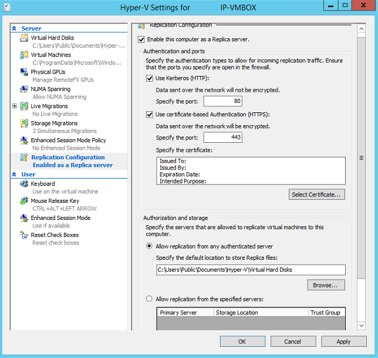
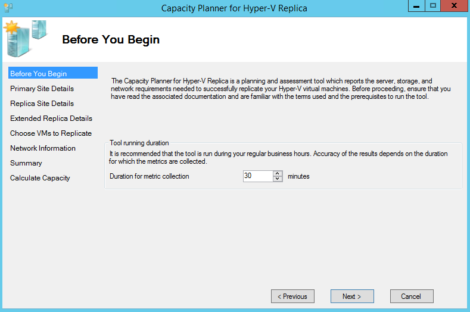
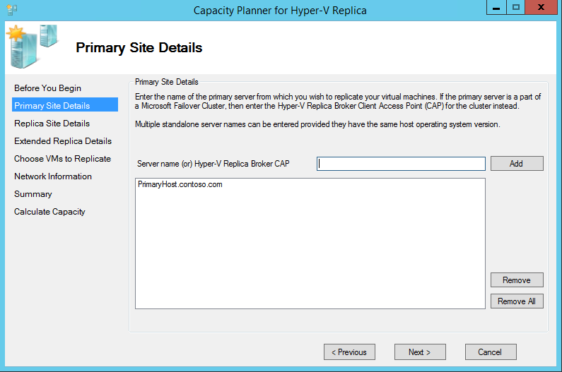
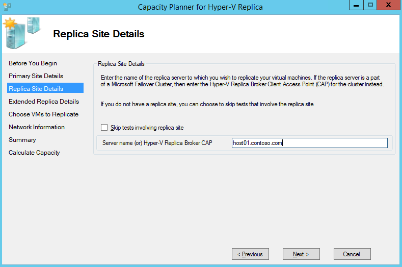
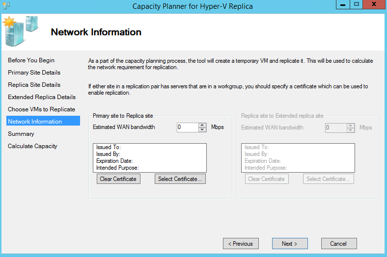
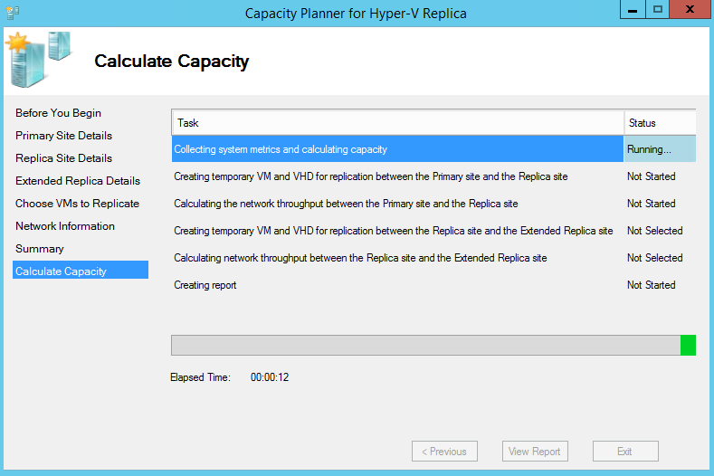

<properties
	pageTitle="Capacity planning for Hyper-V replication"
	description="This article contains instructions on how to use the capacity planner tool for Azure Site Recovery, and includes resources for capacity planning for Hyper-V replication"
	services="site-recovery"
	documentationCenter="na"
	authors="csilauraa"
	manager="jwhit"
	editor="tysonn" />
<tags
	ms.service="site-recovery"
	ms.devlang="na"
	ms.topic="get-started-article"
	ms.tgt_pltfrm="na"
	ms.workload="infrastructure-services"
	ms.date="08/05/2015"
	ms.author="lauraa" />

# Capacity planning for Hyper-V replication

Azure Site Recovery uses Hyper-V Replica for replication between two on-premises VMM sites or between an on-premise VMM server and Azure storage. This article contains step-by-step instructions on using the Capacity planner for Azure Site Recovery (ASR) - Hyper-V Replica tool. The Capacity Planner for ASR - Hyper-V Replica tool guides an IT administrator in designing the server, storage, and network infrastructure that is required to successfully deploy Hyper-V Replica and to validate network connectivity between two sites.

## System requirements
- Operating system: Windows Server® 2012 or Windows Server® 2012 R2
- Memory: 20 MB (minimum)
- CPU: 5 percent overhead (minimum)
- Disk space: 5 MB (minimum)

## Tutorial steps
- Step 1: Prepare the primary site
- Step 2: Prepare the recovery site if your recovery site is on-premises
- Step 3: Run the capacity planner tool
- Step 4: Interpret the results

## Step 1: Prepare the primary site
1. Make a list of all of the Hyper-V virtual machines that will need to be enabled for replication and the corresponding primary Hyper-V hosts/clusters.
2. Group primary Hyper-V hosts and clusters into one of the following:

  - Windows Server® 2012 standalone servers
  - Windows Server® 2012 clusters
  - Windows Server® 2012 R2 standalone servers
  - Windows Server® 2012 R2 clusters

3. You will need to run the capacity planner tool once per standalone server group and once for each cluster.
4. Enable remote access to WMI on all primary hosts and clusters. Ensure that the right set of firewall rules and user permissions are set.

        netsh firewall set service RemoteAdmin enable

5. Enable performance monitoring on the primary hosts.

  - Open the **Windows Firewall** with the **Advanced Security** snapin, and then enable the following inbound rules:
    - COM+ Network Access (DCOM-IN)
    - All rules in the Remote Event Log Management group

## Step 2: Prepare the recovery site
If you are using Azure as the recovery site, or your on-premises recovery site is not yet ready, then you can skip this section. But if you skip it, you won't be able to measure the available bandwidth between the two sites.

1. Identify the authentication method

	a. Kerberos: To be used when both the primary and recovery Hyper-V hosts are in the same domain or are in mutually trusted domains.

	b. Certificate: To be used when primary and recovery Hyper-V hosts are in different domains. Certificates can be created using makecert. For information about the steps required to deploy certificates using this technique, see the [Hyper-V Replica Certificate Based Authentication - makecert](http://blogs.technet.com/b/virtualization/archive/2013/04/13/hyper-v-replica-certificate-based-authentication-makecert.aspx) blog post.

2. Identify a **single** Recovery Hyper-V host/cluster from the recovery site.

	a. This recovery host/cluster will be used to replicate a dummy virtual machine, and to estimate the available bandwidth between the primary and secondary sites.

	b. **Recommended**: Use a single recovery Hyper-V host for running the tests.

### Prepare a single Hyper-V host as a recovery server
1. In Hyper-V Manager, click **Hyper-V Settings** in the **Actions** pane.
2. In the **Hyper-V Settings** dialog, click **Replication Configuration**.
3. In the Details pane, select **Enable this computer as a Replica server**.
4. In the **Autentication and ports** section, select the authentication method you previously chose. For either authentication method, specify the port to be used (the default ports are 80 for kerberos over HTTP and 443 for certificate-based authentication over HTTPS).
5. If you are using certificate-based authentication, click **Select Certificate**, and then provide the certificate information.
6. In the **Authorization and Storage** section, specify to allow **any** authenticated (primary) server to send replication data to this replica server.
7. Click **OK** or **Apply**.

8. Validate that the https listener is running by executing the command:
        netsh http show servicestate
9. Open firewall ports:

        Port 443 (certificae-based authentication):
          Enable-Netfirewallrule -displayname "Hyper-V Replica HTTPS Listener (TCP-In)"

        Port 80 (Kerberos):
          Enable-Netfirewallrule -displayname "Hyper-V Replica HTTP Listener (TCP-In)"

### Prepare a single Hyper-V cluster as a recovery target
If you have already prepared a standalone Hyper-V host a recovery server, then you can skip this section.

1. Configure Hyper-V Replica broker:

	a. In **Server Manager**, open **Failover Cluster Manager**.

	b. In the left pane, connect to the cluster, and while the cluster name is highlighted, click **Configure Role** in the **Actions** pane. This opens the **High Availability wizard**.

	c. In the **Select Role** screen, select **Hyper-V Replica Broker**.

	d. Complete the wizard, providing a **NetBIOS name** and **IP address** to be used as the connection point to the cluster (called a client access point). The **Hyper-V Replica Broker** is configured, resulting in a client access point name. Make a note of the client access point name - you will use it to configure the replica later on.

	e. Verify that the Hyper-V Replica Broker role comes online successfully and can fail over between all nodes of the cluster. To do this, right click the role, point to **Move**, and then click **Select Node**. Select a node > **OK**.

	f. If you use certificate-based authentication, ensure that each cluster node and the Hyper-V Replica Broker's client access point all have the certificate installed.

2. Configure replica settings:

	a. In **Server Manager**, open **Failover Cluster Manager**.
	
	b. In the left pane, connect to the cluster, and while the cluster name is highlighted, click **Roles** in the **Navigate** category of the **Details** pane.
	
	c. Right-click the role, and then choose **Replication Settings**.
	
	d. In the **Details** pane, select **Enable this cluster as a Replica Server**.

	e. In the **Authentication and ports** section, select the authentication method you chose earlier. For either authentication method, specify the port to be used (the default ports are 80 for Kerberos over HTTP, and 443 for certificate-based authentication over HTTPS).

	f. If you are using certificate-based authentication, click **Select Certificate**, and then provide the reqeusted certificate information.

	g. In the **Authorization and storage** section, specify whether to allow **any** authenticated (primary) server to send replication data to this replica server or to limit acceptance to data from specific primary servers. You can use wildcard characters to limit acceptance to servers from a particular domain without having to specify them each individually (for example, *.contoso.com).

	h. Open firewall ports on all recovery Hyper-V hosts:
          Port 443 (Certificate auth):
             Get-ClusterNode | ForEach-Object {Invoke-command -computername \$\_.name -scriptblock {Enable-Netfirewallrule -displayname "Hyper-V Replica HTTPS Listener (TCP-In)"}}

          Port 80 (Kerberos auth):
              Get-ClusterNode | ForEach-Object {Invoke-command -computername \$\_.name -scriptblock {Enable-Netfirewallrule -displayname "Hyper-V Replica HTTP Listener (TCP-In)"}}

## Step 3: Run the capacity planner tool
1. Download the Capacity Planner tool.
2. Run the tool from one of the primary servers (or one of the nodes from the primary cluster). Right-click the .exe file, and then choose **Run as administrator**.
3. If you choose, accept the **Terms of License**, and then click **Next**.
4. Select a **Duration for metric collection**. It is highly recommended that the tool runs during production hours to ensure that the most representative data is collected. The suggested duration for metric collection is 30 minutes. If you're only trying to validate network connectivity, you can choose one minute as the duration.

5. Specify the **Primary site details**, as shown, and then click **Next**.

	For a standalone host, enter the server name or FQDN.

	If your Primary host is part of a cluster, you can enter FQDN of one of the following:

	a. The Hyper-V Replica Broker Client Access Point (CAP)

	b. The cluster name

	c. Any node of the cluster

  

6. Enter the **Replica site details** (on-premises site to on-premises site replication only)

  If you want to enable replication to Azure or you didn't prepare a Hyper-V host or cluster as a recovery server (as explained in Step 2), you should skip test involving the replica site.

  Specify the **Replica site** details, and then click **Next**.

i. For a standalone host, enter the server name or FQDN

ii. If your Primary host is part of a cluster, you can enter FQDN of one of the following:

a. The Hyper-V Replica Broker Client Access Point (CAP)

b. The cluster name

c. Any node of the cluster

   

7. Skip the tests involving **Extended Replica site**. They are not supported by ASR.
8. Select the virtual machines to profile. The tool connects to the cluster or standalone servers specified in **Primary Site Details**, and enumerates the virtual machines that are running. Select the virtual machines and virtual disks for which you want metrics to be collected.

The following virtual machines will not be enumerated or shown:

- Virtual machines that have already been enabled for replication
- Virtual machines that are not running

9. Enter **Network information** (this is applicable only to on-premises site to on-premises site replication and when replica site details are provided).

Specify the requested network information, and then click **Next**.

- Estimated WAN bandwidth
- The certificate to be used for authentication (optional): If you plan to use certificate-based authentication, you should provide the required certificates on this page.

   

10. On the next set of screens, click **Next** to start the tool.

11. When the tool is done running, click **View Report** to review the output.

    Default report location:

    %systemdrive%\Users\Public\Documents\Capacity Planner

    Logs location:

    %systemdrive%\Users\Public\Documents\CapacityPlanner

## Step 4: Interpret the results
You can ignore metrics which are not listed under one of the following two scenarios, as they are not relevant for this scenario.

### On-premises site to on-premises site replication
  - Impact of replication on the primary host's compute, memory
  - Impact of replication on the primary, recovery hosts's storage disk space, IOPS
  - Total bandwidth required for delta replication (Mbps)
  - Observed network bandwidth between the primary host and the recovery host (Mbps)
  - Suggestion for the ideal number of active parallel transfers between the two hosts/clusters

### On-premises site to Azure replication
  - Impact of replication on the primary host's compute, memory
  - Impact of replication on the primary host's storage disk space, IOPS
  - Total bandwidth required for delta replication (Mbps)

More detailed guidance can be found on the [Capacity Planner for Hyper-V Replica download page](http://go.microsoft.com/?linkid=9876170).

## Other resources
The following resources can help you with capacity planning for Hyper-V replication:

- [Update: Capacity Planner for Hyper-V Replica](http://go.microsoft.com/fwlink/?LinkId=510891)—Read this blog entry for an overview of this new tool.

- [Capacity Planner for Hyper-V Replica](http://go.microsoft.com/fwlink/?LinkId=510892)—Download the latest version of this tool.

- [Guided Hands-On Lab](http://go.microsoft.com/fwlink/?LinkId=510893)—Get a great walkthrough of capacity planning with the tool on Keith Mayer’s TechNet blog.

- [Performance and Scaling Testing - On-Premises to On-Premises](https://msdn.microsoft.com/library/azure/dn760892.aspx)—Read the results of replication testing for an on-premises to on-premises deployment.

## Next steps

To start deploying ASR:

- [Set up protection between an on-premises VMM site and Azure](site-recovery-vmm-to-azure.md)
- [Set up protection between an on-premises Hyper-V site and Azure](site-recovery-hyper-v-site-to-azure)
- [Set up protection between two on-premises VMM sites](site-recovery-vmm-to-vmm)
- [Set up protection between two on-premises VMM sites with SAN](site-recovery-vmm-san)
- [Set up protection with a single VMM server](site-recovery-single-vmm)
 
