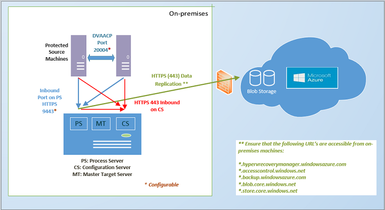
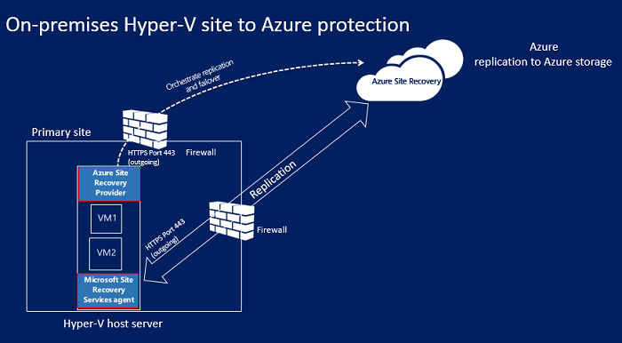
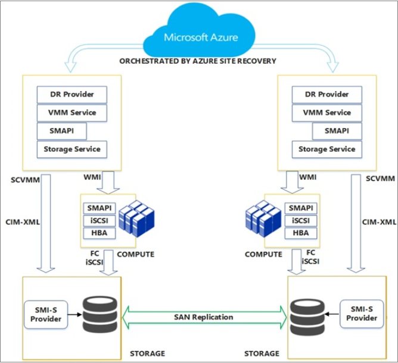

<properties
	pageTitle="How does Site Recovery work? | Microsoft Azure"
	description="This article provides an overview of Site Recovery architecture"
	services="site-recovery"
	documentationCenter=""
	authors="rayne-wiselman"
	manager="jwhit"
	editor=""/>

<tags
	ms.service="site-recovery"
	ms.workload="backup-recovery"
	ms.tgt_pltfrm="na"
	ms.devlang="na"
	ms.topic="get-started-article"
	ms.date="07/12/2016"
	ms.author="raynew"/>

# How does Azure Site Recovery work?

Read this article to understand the underlying architecture of the Azure Site Recovery service and the components that make it work. 

Post any comments or questions at the bottom of this article, or on the [Azure Recovery Services Forum](https://social.msdn.microsoft.com/forums/azure/home?forum=hypervrecovmgr).

## Overview

Organizations need a BCDR strategy that determines how apps, workloads, and data stay running and available during planned and unplanned downtime, and recover to normal working conditions as soon as possible. Your BCDR strategy should keep business data safe and recoverable, and ensure that workloads remain continuously available when disaster occurs. 

Site Recovery is an Azure service that contributes to your BCDR strategy by orchestrating replication of on-premises physical servers and virtual machines to the cloud (Azure) or to a secondary datacenter. When outages occur in your primary location, you fail over to the secondary location to keep apps and workloads available. You fail back to your primary location when it returns to normal operations. Learn more in [What is Site Recovery?](site-recovery-overview.md)

## Site Recovery in the Azure portal

Azure has two different [deployment models](../resource-manager-deployment-model.md) for creating and working with resources: the Azure Resource Manager model and the classic services management model. Azure also has two portals – the [Azure classic portal](https://manage.windowsazure.com/) that supports the classic deployment model, and the [Azure portal](https://portal.azure.com) with support for both deployment models.

Site Recovery is available in both the classic portal and the Azure portal. In the Azure classic portal you can support Site Recovery with the classic services management model. In the Azure portal you can support the classic model or Resource Model deployments. [Read more](site-recovery-overview.md#site-recovery-in-the-azure-portal) about deploying with the Azure portal.

The information in this article applies to both classic and Azure portal deployments. Differences are noted where applicable.

## Deployment scenarios

Site Recovery can be deployed to orchestrate replication in a number of scenarios:

- **Replicate VMware virtual machines**: You can replicate on-premises VMware virtual machines to Azure or to a secondary datacenter.
- - **Replicate physical machines**: You can replicate physical machines running Windows or Linux to Azure or to a secondary datacenter. The process for replicating physical machines is almost the same as the process for replicating VMware VMs
- **Replicate Hyper-V VMs (without VMM)**: You can replicate Hyper-V VMs that aren't managed by VMM to Azure.
- **Replicate Hyper-V VMs managed in System Center VMM clouds**: You can replicate on-premises Hyper-V virtual machines running on Hyper-V host servers in VMM clouds to Azure or to a secondary datacenter. You can replicate using standard Hyper-V Replica or using SAN replication.
- **Migrate VMs**: You can use Site Recovery to [migrate Azure IaaS VMs](site-recovery-migrate-azure-to-azure.md) between regions, or to [migrate AWS Windows instances](site-recovery-migrate-aws-to-azure.md) to Azure IaaS VMs. Currently only migration is supported which means you can fail over these VMs but you can't fail them back.

Site Recovery can replicate most apps running on these VMs and physical servers. You can get a full summary of the supported apps in [What workloads can Azure Site Recovery protect?](site-recovery-workload.md)

## Replicate to Azure: VMware virtual machines or physical Windows/Linux servers

There are couple of ways to replicate VMware VMs with Site Recovery.

- **Using the Azure portal**-When you deploy Site Recovery in the Azure portal you can fail over VMs to classic service manager storage or to Resource Manager. Replicating VMware VMs in the Azure portal brings a number of advantages, including the ability to replicate to classic or Resource Manager storage in Azure. [Learn more](site-recovery-vmware-to-azure.md).
- **Using the classic portal**-You can deploy Site Recovery in the classic portal using an enhanced experience. This should be used for all new deployments in the classic portal. In this deployment you can only fail over VMs to classic storage in Azure and not to Resource Manager storage. [Learn more](site-recovery-vmware-to-azure-classic.md). There is also a [legacy experience](site-recovery-vmware-to-azure-classic-legacy.md) for setting up VMware replication in the classic portal. This shouldn't be used for new deployments.  If you've already deployed using the legacy experience [learn about migrating](site-recovery-vmware-to-azure-classic-legacy.md#migrate-to-the-enhanced-deployment) to the enhanced deployment.

The architectural requirements for deploying Site Recovery to replicate VMware VMs/physical servers in the Azure portal or the Azure classic portal (enhanced) are similar, with a couple of differences:

- If you deploy in the Azure portal you can replicate to Resource Manager-based storage and use Resource Manager networks for connecting the Azure VMs after failover.
- When you deploy in the Azure portal both LRS and GRS storage is supported. In the classic portal GRS is required.
- The deployment process is simplified and more user-friendly in the Azure portal.

Here's what you'll need:

- **Azure account**: You'll need a Microsoft Azure account.
- **Azure storage**: You'll need an Azure storage account to store replicated data. You can use a classic account or a Resource Manager storage account. The account can be LRS or GRS when you deploy in the Azure portal. Replicated data is stored in Azure storage and Azure VMs are spun up when failover occurs. 
- **Azure network**: You'll need an Azure virtual network that Azure VMs will connect to when they're created at failover. In the Azure portal they can be networks created in the classic service manager model or in the Resource Manager model.
- **On-premises configuration server**: You'll need an on-premises Windows Server 2012 R2 machine that runs the configuration server and other Site Recovery components. If you're replicating VMware VMs this should be a highly available VMware VM. If you want to replicate physical servers the machine can be physical. These Site Recovery components will be installed on the machine:
	- **Configuration server**: Coordinates communication between your on-premises environment and Azure, and manages data replication and recovery.
	- **Process server**: Acts as a replication gateway. It receives replication data from protected source machines, optimizes it with caching, compression, and encryption, and sends the data to Azure storage. It also handles push installation of the Mobility service to protected machines, and performs automatic discovery of VMware VMs. As your deployment grows you can add additional separate dedicated process servers to handle increasing volumes of replication traffic.
	- **Master target server**: Handles replication data during failback from Azure. 
- **VMware VMs or physical servers to replicate**: Each machine that you want to replicate to Azure will need the Mobility service component installed. This service captures data writes on the machine and forwards them to the process server. This component can be installed manually, or can be pushed and installed automatically by the process server when you enable replication for a machine.
- **vSPhere hosts/vCenter server**: You'll need one or more vSphere host servers running VMware VMs. We recommend that you deploy a vCenter server to manage those hosts.
- **Failback**:  Here's what you need:
	- **Physical-to-physical failback isn't supported**: This means that if you fail over physical servers to Azure and then want to fail back, you must fail back to a VMware VM. You can't fail back to a physical server. You'll need an Azure VM to fail back to, and if you didn't deploy the configuration server as a VMware VM you'll need to set up a separate master target server as a VMware VM. This is needed because the master target server interacts and attaches to VMware storage to restore the disks to a VMware VM.
	- - **Temporary process server in Azure**: If you want to fail back from Azure after failover you'll need to set up an Azure VM configured as a process server, to handle replication from Azure. You can delete this VM after failback finishes.
	- **VPN connection**: For failback you'll need a VPN connection (or Azure ExpressRoute) set up from the Azure network to the on-premises site.
	- **Separate on-premises master target server**: The on-premises master target server handles failback. The master target server is installed by default on the management server, but if you're failing back larger volumes of traffic you should set up a separate on-premises master target server for this purpose.

**General architecture**

**Deployment components**

**Failback**

- [Learn more](site-recovery-vmware-to-azure.md#azure-prerequisites) about requirements for Azure portal deployment.
- [Learn more](site-recovery-vmware-to-azure-classic.md#before-you-start-deployment) about enhanced deployment requirements in the classic portal.
- [Learn more](site-recovery-failback-azure-to-vmware.md) about failback in the Auzre portal.
- [Learn more](site-recovery-failback-azure-to-vmware-clas- [Learn more](site-recovery-failback-azure-to-vmware-classic.md) about failback in the Auzre portal.sic.md) about failback in the classic portal.

## Replicate to Azure: Hyper-V VMs not managed by VMM

You can replicate Hyper-V VMs that aren't managed by System Center VMM to Azure with Site Recovery as follows:

- **Using the Azure portal**-When you deploy Site Recovery in the Azure portal you can fail over VMs to classic storage or to Resource Manager. [Learn more](site-recovery-hyper-v-site-to-azure.md).
- **Using the classic portal**-You can deploy Site Recovery in the classic portal. In this deployment you can only fail over VMs to classic storage in Azure and not to Resource Manager storage. [Learn more](site-recovery-hyper-v-site-to-azure-classic.md).

The architecture for both deployments is similar, except that:

- If you deploy in the Azure portal you can replicate to Resource Manager storage and use Resource Manager networks for connecting the Azure VMs after failover.
- The deployment process is simplified and more user-friendly in the Azure portal.

Here's what you'll need:

- **Azure account**: You'll need a Microsoft Azure account.
- **Azure storage**: You'll need an Azure storage account to store replicated data. In the Azure portal you can use a classic account or a Resource Manager storage account. In the classic portal you can use a classic account only. Replicated data is stored in Azure storage and Azure VMs are created when failover occurs.
- **Azure network**: You'll need an Azure network that Azure VMs will connect to when they're created after failover. 
- **Hyper-v host**: You'll need one or more Windows Server 2012 R2 Hyper-V host server. During Site Recovery deployment you'll install the 
- **Hyper-V VMs**: You'll need one or more VMs on the Hyper-V host server. Azure Site Recovery Provider and the Azure Recovery Services agent on the Hyper-V host during Site Recovery deployment. The Provider coordinates and orchestrates replication with the Site Recovery service over the internet. The agent handles data replication data over HTTPS 443. Communications from both the Provider and the agent are secure and encrypted. Replicated data in Azure storage is also encrypted.

**General architecture**

- [Learn more](site-recovery-hyper-v-site-to-azure.md#azure-prerequisites) about requirements for Azure portal deployment.
- [Learn more](site-recovery-hyper-v-site-to-azure-classic.md#azure-prerequisites) about requirements for classic portal deployment.

## Replicate to Azure: Hyper-V VMs managed by VMM

You can replicate Hyper-V VMs in VMM clouds to Azure with Site Recovery as follows:

- **Using the Azure portal**-When you deploy Site Recovery in the Azure portal you can fail over VMs to classic storage or to Resource Manager. [Learn more](site-recovery-vmm-to-azure.md).
- **Using the classic portal**-You can deploy Site Recovery in the classic portal. In this deployment you can only fail over VMs to classic storage in Azure and not to Resource Manager storage. [Learn more](site-recovery-vmm-to-azure-classic.md).

The architecture for both deployments is similar, except that:

- If you deploy in the Azure portal you can replicate to Resource Manager-based storage and use Resource Manager networks for connecting the Azure VMs after failover.
- The deployment process is simplified and more user-friendly in the Azure portal.

Here's what you'll need:

- **Azure account**: You'll need a Microsoft Azure account.
- **Azure storage**: You'll need an Azure storage account to store replicated data. In the Azure portal you can use a classic account or a Resource Manager storage account. In the classic portal you can use a classic account only. Replicated data is stored in Azure storage and Azure VMs are created when failover occurs.
- **Azure network**: You'll need to set up network mapping so that Azure VMs are connected to appropriate networks when they're created after failover. 
- **VMM server**: You'll need one or more on-premises VMM servers running on System Center 2012 R2 and set up with one or more private clouds. If you're deploying in the Azure portal you'll need logical and VM networks set up so you can configure network mapping. In the classic portal this is optional.  A VM network should be linked to a logical network that's associated with the cloud.
- **Hyper-v host**: You'll need one or more Windows Server 2012 R2 Hyper-V host servers in the VMM cloud.
- **Hyper-V VMs**: You'll need one or more VMs on the Hyper-V host server.

**General architecture**

- [Learn more](site-recovery-vmm-to-azure.md#azure-requirements) about requirements for Azure portal deployment.
- [Learn more](site-recovery-vmm-to-azure-classic.md#before-you-start) about requirements for classic portal deployment.

## Replicate to a secondary site: VMware virtual machines or physical servers 

To replicate VMware VMs or physical servers to a secondary site as download InMage Scout that's included in the Azure Site Recovery subscription. It can be downloaded from the Azure portal or from the Azure classic portal. 

You set up the component servers in each site (configuration, process, master target), and install the Unified Agent on machines that you want to replicate. After initial replication the agent on each machine sends delta replication changes to the process server. The process server optimizes the data and transfers it to the master target server on the secondary site. The configuration server manages the replication process.

Here's what you need:

**Azure account**: You deploy this scenario using InMage Scout. To obtain it you'll need an Azure subscription. After you create a Site Recovery vault you download InMage Scout and install the latest updates to set up the deployment.
**Process server (primary site)**: Set up the process server component in your primary site to handle caching, compression, and data optimization. It also handles push installation of the Unified Agent to machines you want to protect. 
**VMware ESX/ESXi and vCenter server (primary site)**: If you're protecting VMware VMs you'll need a VMware EXS/ESXi hypervisor and optionally a VMware vCenter server to manage hypervisors.
- **VMs/physical servers (primary site)**: VMware VMs or Windows/Linux physical servers you want to protect will need the Unified Agent installed. The Unified Agent is also installed on the machines acting as the master target server. The agent acts as a communication provider between all of the components. 
- - **Configuration server (secondary site)**: The configuration server is the first component you install, and it's installed on the secondary site to manage, configure, and monitor your deployment, either using the management website or the vContinuum console. There's only a single configuration server in a deployment and it must be installed on a machine running Windows Server 2012 R2.
- **vContinuum server (secondary site)**: It's installed in the same location (secondary site) as the configuration server. It provides a console for managing and monitoring your protected environment. In a default installation the vContinuum server is the first master target server and has the Unified Agent installed.
- **Master target server (secondary site)**: The master target server holds replicated data. It receives data from the process server, creates a replica machine in the secondary site, and holds the data retention points. The number of master target servers you need depends on the number of machines you're protecting. If you want to fail back to the primary site you'll need a master target server there too. 

**General architecture**

## Replicate to a secondary site: Hyper-V VMs managed by VMM

You can replicate Hyper-V VMs that are managed by System Center VMM to a secondary datacenter with Site Recovery as follows:

- **Using the Azure portal**-When you deploy Site Recovery in the Azure portal. [Learn more](site-recovery-hyper-v-site-to-azure.md).
- **Using the classic portal**-You can deploy Site Recovery in the classic portal. [Learn more](site-recovery-hyper-v-site-to-azure-classic.md).

The architecture for both deployments is similar, except that:

- If you deploy in the Azure portal you must set up network mapping. this is optional in the classic portal.
- The deployment process is simplified and more user-friendly in the Azure portal.
- - If you deploy in the Azure classic portal [storage mapping](site-recovery-storage-mapping.md) is available.

Here's what you'll need:

- **Azure account**: You'll need a Microsoft Azure account.
- **VMM server**: We recommend a VMM server in the primary site and one in the secondary site, each containing at least one VMM private cloud. The server should be running at least System Center 2012 SP1 with latest updates, and connected to the internet. Clouds should have the Hyper-V capability profile set. You'll install the Azure Site Recovery Provider on the VMM server. The Provider coordinates and orchestrates replication with the Site Recovery service over the internet. Communications between the Provider and Azure are secure and encrypted.
- **Hyper-V server**: Hyper-V host servers should be located in the primary and secondary VMM clouds. The host servers should be running at least Windows Server 2012 with the latest updates installed, and connected to the internet. Data is replicated between the primary and secondary Hyper-V host servers over the LAN or VPN using Kerberos or certificate authentication.  
- **Protected machines**: The source Hyper-V host server should have at least one VM that you want to protect.

**General architecture**

- [Learn more](site-recovery-vmm-to-vmm.md#azure-prerequisites) about deployment requirements in the Azure portal.
- - [Learn more](site-recovery-vmm-to-vmm-classic.md#before-you-start) about deployment requirements in the Azure classic portal.

## Replicate to a secondary site with SAN replication: Hyper-V VMs managed by VMM

You can replicate Hyper-V VMs managed in VMM clouds to a secondary site using SAN replication using the Azure classic portal. This scenario isn't currently supported in the new Azure portal. 

In this scenario during Site Recovery deployment you'll install the Azure Site Recovery Provider on VMM servers. The Provider coordinates and orchestrates replication with the Site Recovery service over the internet. Data is replicated between the primary and secondary storage arrays using synchronous SAN replication.

Here's what you'll need:

**Azure account**: You'll need an Azure subscription
- **SAN array**: A [supported SAN array](http://social.technet.microsoft.com/wiki/contents/articles/28317.deploying-azure-site-recovery-with-vmm-and-san-supported-storage-arrays.aspx) managed by the primary VMM server. The SAN shares a network infrastructure with another SAN array in the secondary site.
- **VMM server**: We recommend a VMM server in the primary site and one in the secondary site, each containing at least one VMM private cloud. The server should be running at least System Center 2012 SP1 with latest updates, and connected to the internet. Clouds should have the Hyper-V capability profile set.
- **Hyper-V server**: Hyper-V host servers located in the primary and secondary VMM clouds. The host servers should be running at least Windows Server 2012 with the latest updates installed, and connected to the internet.
- **Protected machines**: The source Hyper-V host server should have at least one VM that you want to protect.

**SAN replication architecture**

[Learn more](site-recovery-vmm-san.md#before-you-start) about deployment requirements.
### On-premises

## Hyper-V protection lifecycle

This workflow shows the process for protecting, replicating, and failing over Hyper-V virtual machines. 

1. **Enable protection**: You set up the Site Recovery vault, configure replication settings for a VMM cloud or Hyper-V site, and enable protection for VMs. A job called **Enable Protection** is initiated and can be monitored in the **Jobs** tab. The job checks that the machine complies with prerequisites and then invokes the [CreateReplicationRelationship](https://msdn.microsoft.com/library/hh850036.aspx) method which sets up replication to Azure with the settings you've configured. The **Enable protection** job also invokes the [StartReplication](https://msdn.microsoft.com/library/hh850303.aspx) method to initialize a full VM replication.
2. **Initial replication**: A virtual machine snapshot is taken and virtual hard disks are replicated one by one until they're all copied to Azure or to the secondary datacenter. The time needed to complete this depends on the VM size, network bandwidth, and the initial replication method. If disk changes occur while initial replication is in progress the Hyper-V Replica Replication Tracker tracks those changes as Hyper-V Replication Logs (.hrl) that are located in the same folder as the disks. Each disk has an associated .hrl file that will be sent to secondary storage. Note that the snapshot and log files consume disk resources while initial replication is in progress. When the initial replication finishes the VM snapshot is deleted and the delta disk changes in the log are synchronized and merged.
3. **Finalize protection**: After initial replication finishes the **Finalize protection** job configures network and other post-replication settings so that the virtual machine is protected. If you're replicating to Azure you might need to tweak the settings for the virtual machine so that it's ready for failover. At this point you can run a test failover to check everything is working as expected.
4. **Replication**: After the initial replication delta synchronization begins, in accordance with replication settings. 
	- **Replication failure**: If delta replication fails, and a full replication would be costly in terms of bandwidth or time, then resynchronization occurs. For example if the .hrl files reach 50% of the disk size then the VM will be marked for resynchronization. Resynchronization minimizes the amount of data sent by computing checksums of the source and target virtual machines and sending only the delta. After resynchronization finishes delta replication will resume. By default resynchronization is scheduled to run automatically outside office hours, but you can resynchronize a virtual machine manually.
	- **Replication error**: If a replication error occurs there's a built-in retry. If it's a non-recoverable error such as an authentication or authorization error, or a replica machine is in an invalid state,  then no retry will be attempted. If it's a recoverable error such as a network error, or low disk space/memory, then a retry occurs with increasing intervals between retries (1, 2, 4, 8, 10, and then every 30 minutes).
4. **Planned/unplanned failovers**: You can run planned or unplanned failovers as needed. If you run a planned failover then source VMs are shut down to ensure no data loss. After replica VMs are created they're placed in a commit pending state. You need to commit them to complete the failover, unless you're replicating with SAN in which case commit is automatic. After the primary site is up and running failback can occur. If you've replicated to Azure reverse replication is automatic. Otherwise you kick off reverse replication manually.
 

## Next steps

[Prepare for deployment](site-recovery-best-practices.md)
