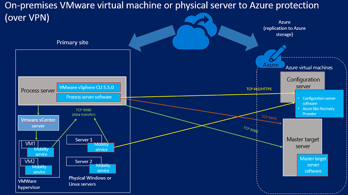
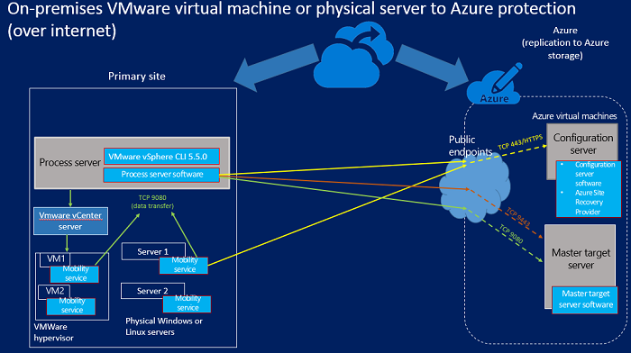

<properties
	pageTitle="How does Azure Site Recovery work?"
	description="This article provides an overview of Site Recovery architecture"
	services="site-recovery"
	documentationCenter=""
	authors="rayne-wiselman"
	manager="jwhit"
	editor=""/>

<tags
	ms.service="site-recovery"
	ms.workload="backup-recovery"
	ms.tgt_pltfrm="na"
	ms.devlang="na"
	ms.topic="get-started-article"
	ms.date="11/29/2015"
	ms.author="raynew"/>

# How does Azure Site Recovery work?

## About this article

This article describes the underlying architecture of Site Recovery and the components that make it work. After reading this article you can post any questions on the [Azure Recovery Services Forum](https://social.msdn.microsoft.com/forums/azure/home?forum=hypervrecovmgr).

## Overview

Organizations need a business continuity and disaster recovery (BCDR) strategy that a determines how apps, workloads, and data remain available during planned and unplanned downtime, and recover to normal working conditions as soon as possible. Much of your BCDR strategy will center around solutions that keep business data safe and recoverable, and workloads continuously available, when disaster occurs.

Site Recovery is an Azure service that contributes to your BCDR strategy by orchestrating replication of on-premises physical servers and virtual machines to the cloud (Azure) or to a secondary datacenter. When outages occur in your primary location, you fail over to the secondary site to keep apps and workloads available. You fail back to your primary location when it returns to normal operations.

Site Recovery can be used in a number of scenarios and can protect a number of workloads. 

- **Protect VMware virtual machines**: You can protect on-premises VMware virtual machines by replicating them to Azure or to a secondary datacenter.- **Protect Hyper-V VMs**: You can protect on-premises Hyper-V virtual machines by replicating them to the cloud (Azure) or to a secondary datacenter.  
- **Protect physical servers**: You can protect physical machines running Windows or Linux by replicating them to Azure or to a secondary datacenter.
- **Migrate VMs**: You can use Site Recovery to migrate Azure IaaS VMs between regions, or to migrate AWS Windows instances to Azure IaaS VMs.

You can get a full summary of the supported deployments in [What is Azure Site Recovery?](site-recovery-overview.md) and 
[What workloads can Azure Site Recovery protect?](site-recovery-workload.md)

## Replicate between an on-premises physical server or VMware virtual machine and Azure

If you want to protect either VMware VMs, or Windows/Linux physical machines by replicating them to Azure here's what you'll need.

**Location** | **What you need** 
--- | --- 
 On-premises | **Process server**: This server optimizes data from protected VMware virtual machines or physical Windows/Linux machines before sending it to Azure. It also handles push installation of the Mobility service component to protected machine, and performs automatic discovery of VMware virtual machines.    **VMware vCenter server**: If you're protecting VMware VMs you'll need a VMwave vCenter server managing your vSphere hypervisors   **ESX server**: If you're protecting VMware VMs you'll need a server running ESX/ESXi version 5.1 or 5.5 with the latest updates.   **Machines**: If you're protecting VMware you should have VMware VMs with VMware tools installed and running. If you're protecting physical machines they should be running a supported Windows or Linux operating system. See [what's supported](site-recovery-vmware-to-azure/#before-you-start).    **Mobility service**: Installs on machines you want to protect to capture changes and communicate them to the process server.   Third-party components: This deployment depends on some [third-party components](http://download.microsoft.com/download/C/D/7/CD79E327-BF5A-4026-8FF4-9EB990F9CEE2/Third-Party_Notices.txt).
Azure | **Configuration server**: Standard A3 Azure VM that coordinates communication between protected machines, the process server, and master target servers in Azure. It sets up replication and coordinates recovery when failover occurs.   **Master target server**: Azure VM that holds replicated data from protected machines using attached VHDs created on blob storage in your Azure storage account. A failback master target server runs on premises so that you can fail back Azure VMs to VMware VMs.    **Site Recovery vault**: At least one Azure Site Recovery vault (set up with a subscription to the Site Recovery service)    **Virtual network**: An Azure network on which the configuration server and master target servers are located, in the same subscription and region as the Site Recovery service.    **Azure storage**: Azure storage account to store replicated data. Should be a standard geo-redundant or premium account in the same region as the Site Recovery subscription.

In this scenario communications can occur over a a VPN connection to internal ports on the Azure network (using Azure ExpressRoute or a site-to-site VPN), or over a secure internet connection to the mapped public endpoints on the Azure cloud service for the configuration and master target server VMs. 

The Mobility service on protected machines sends replication data the process server, and sends replication metadata to the configuration server. The process server communicates with configuration server for management and control information. It sends replication information to the master target server and it optimizes and sends replicated data to the master target server.

## Replicating Hyper-V VMs to Azure (with VMM)

If you're VMs are located on a Hyper-V host that's managed in a System Center VMM cloud here's what you'll need in order to replicate them to Azure.

**Location** |  **What you need** 
--- | --- 
On-premises | **VMM server**: At least one VMM server set up with at least one VMM private cloud. The Azure Site Recovery Provider will be installed on each VMM server  **Hyper-V server**: At least one Hyper-V host server located in the VMM cloud. The Microsoft Recovery Services agent will be installed on each Hyper-V server.    **Virtual machines**: At least one virtual machine running on the Hyper-V server. Nothing gets installed on the virtual machine.
Azure | **Site Recovery vault**: At least one Azure Site Recovery vault (set up with a subscription to the Site Recovery service)   **Storage account**: An Azure storage account under the same subscription as the Site Recovery service. Replicated machines are stored in Azure storage. 

In this scenario the Provider running on the VMM server coordinates and orchestrates replication with the Site Recovery service over the internet. Data is replicated between the Recovery Services agent running on the on-premises Hyper-V server and Azure storage over HTTPS 443. Communications from both the Provider and the agent are secure and encrypted. Replicated data in Azure storage is also encrypted.

## Replicating Hyper-V VMs to Azure (without VMM)

If your VMs aren't managed by a System Center VMM server  here's what you'll need to do to replicate them to Azure

**Location** | **What you need**
--- | --- 
 On-premises | **Hyper-V server**: At least one Hyper-V host server.  The Azure Site Recovery Provider and the Microsoft Recovery Services agent will be installed on each Hyper-V server.   **Virtual machines**: At least one virtual machine running on the Hyper-V server. Nothing gets installed on the virtual machine.
Azure | **Site Recovery vault**: At least one Azure Site Recovery vault (set up with a subscription to the Site Recovery service)   **Storage account**: An Azure storage account under the same subscription as the Site Recovery service. Replicated machines are stored in Azure storage.

In this scenario the Provider running on the Hyper-V server coordinates and orchestrates replication with the Site Recovery service over the internet. Data is replicated between the Recovery Services agent running on the on-premises Hyper-V server and Azure storage over HTTPS 443. Communications from both the Provider and the agent are secure and encrypted. Replicated data in Azure storage is also encrypted.

## Replicate Hyper-V VMs to a secondary datacenter

If you want to protect your Hyper-V VMs by replicating them to a secondary datacenter here's what you'll need to do. Note that you can only do this if your Hyper-V host server is managed in a System Center VMM cloud.

**Location** | **What you need** 
--- | --- 
 On-premises | **VMM server**: A VMM server in the primary site and one in the secondary site The Azure Site Recovery Provider will be installed on each VMM server.  **Hyper-V server**: At least one Hyper-V host server located in a VMM cloud in the primary and secondary sites. Nothing gets installed on the Hyper-V servers    **Virtual machines**: At least one virtual machine running on the Hyper-V server. Nothing gets installed on the virtual machine.
Azure | **Site Recovery vault**: At least one Azure Site Recovery vault (set up with a subscription to the Site Recovery service). 

In this scenario the Provider on the VMM server coordinates and orchestrates replication with the Site Recovery service over the internet. Data is replicated between the primary and secondary Hyper-V host servers over the internet using Kerberos or certificate authentication. Communications from both the Provider and between Hyper-V host servers are secure and encrypted. 

## Replicate Hyper-V VMs to a secondary datacenter with SAN replication

If your VMs are located on a Hyper-V host that's managed in a System Center VMM cloud and you're using SAN storage here's what you'll need in order to replicate between two datacenters.

**Location** | **What you need** 
--- | --- 
 Primary datacenter | **SAN array**: A [supported SAN array](http://social.technet.microsoft.com/wiki/contents/articles/28317.deploying-azure-site-recovery-with-vmm-and-san-supported-storage-arrays.aspx) managed by the primary VMM server. The SAN shares a network infrastructure with another SAN array in the secondary site    **VMM server**: At least one VMM server with one or more VMM clouds and replication groups set up. The Azure Site Recovery Provider will be installed on each VMM server.    **Hyper-V server**: At least one Hyper-V host server with virtual machines, located in a replication group. Nothing gets installed on the Hyper-V host servers.   **Virtual machines**: At least one virtual machine running on the Hyper-V host server. Nothing gets installed on the virtual machine. 
Secondary datacenter | **SAN array**: A [supported SAN array](http://social.technet.microsoft.com/wiki/contents/articles/28317.deploying-azure-site-recovery-with-vmm-and-san-supported-storage-arrays.aspx) managed by the secondary VMM server.   **VMM server**: At least one VMM server with one or more VMM clouds.   **Hyper-V server**: At least one Hyper-V host server. 
Azure | **Site Recovery vault**: At least one Azure Site Recovery vault (set up with a subscription to the Site Recovery service)

In this scenario the Provider on the VMM server coordinates and orchestrates replication with the Site Recovery service over the internet.  Data is replicated between the primary and secondary storage arrays using synchronous SAN replication. 

## Hyper-V protection lifecycle

This workflow shows the process for protecting, replicating, and failing over Hyper-V virtual machines. 

1. **Enable protection**: You set up the Site Recovery vault, configure replication settings for a VMM cloud or Hyper-V site, and enable protection for VMs. A job called **Enable Protection** is initiated and can be monitored in the **Jobs** tab. The job checks that the machine complies with prerequisites and then invokes the [CreateReplicationRelationship](https://msdn.microsoft.com/library/hh850036.aspx) method which sets up replication to Azure with the settings you've configured. The **Enable protection** job also invokes the [StartReplication](https://msdn.microsoft.com/library/hh850303.aspx) method to initialize a full VM replication.
2. **Initial replication**: A virtual machine snapshot is taken and virtual hard disks are replicated one by one until they're all copied to Azure or to the secondary datacenter. This The time to complete this depends on the size and network bandwidth and the initial replication method you've chosen. If disk changes occur while initial replication is in progress the Hyper-V Replica Replication Tracker tracks those changes as Hyper-V Replication Logs (.hrl) that are located in the same folder as the disks. Each disk has an associated .hrl file that will be sent to secondary storage. Note that the snapshot and log files consume disk resources while initial replication is in progress. When the initial replication finishes the VM snapshot is deleted and the delta disk changes in the log are synchronized and merged.
3. **Finalize protection**: After initial replication finishes the **Finalize protection** job configures network and other post-replication settings and the virtual machine is protected. If you're replicating to Azure you might need to tweak the settings for the virtual machine so that it's ready for failover. At this point you can run a test failover to check everything's working as expected.
4. **Replication**: After initial replication delta synchronized occurs, in accordance with the replication settings and method. 
	- **Replication failure**: If delta replication fails and a full replication would be costly in terms of bandwidth or time then resynchronization occurs. For example if the .hrl files reach 50% of the disk size then the virtual machine will be marked for resynchronization. Resynchronization minimizes the amount of data sent by computing checksums of the source and target virtual machines and sending only the delta. After resynchronization finishes delta replication should resume. By default resynchronization is scheduled to run automatically outside office hours, but you can resynchronize a virtual machine manually.
	- **Replication error**: If a replication error occurs there's a built-in retry. If it's a non-recoverable error such as an authentication or authorization error, or a replica machine in an invalid state no retry will be attempted. If it's a recoverable error such as a network error, or low disk space/memory then a retry occurs with increasing intervals between retries (1, 2, 4, 8, 10, and then every 30 minutes).
4. **Planned/unplanned failovers**: You run planned/unplanned failovers when the need arises. If you run a planned failover source VMs are shut down to ensure no data loss. After replica VMs are created they're in a commit pending state. You need to commit them to complete the failover unless you're replicating with SAN in which case commit is automatic. After the primary site is up and running failback can occur. If you've replicated to Azure reverse replication is automatic. Otherwise you kick off a reverse replication.
 

## Replicate VMware virtual machines and physical servers to Azure

You can replicate VMware virtual machines and physical servers (Windows/Linux) to Azure over a VPN site-to-site connection or over the internet.

### Replicate over a VPN site-to-site connection (or ExpressRoute) to Azure

#### Replicate over the internet

## Replicate between on-premises physical servers or VMware virtual machines in primary and secondary datacenters

If you want to protect either VMware VMs, or Windows/Linux physical machines by replicating them between two on-premises datacenters here's what you'll need.

**Location** | **What you need** 
--- | --- 
 On-premises primary | **Process server**: Set up the process server component in your primary site to handle caching, compression, and data optimization. It also handles push installation of the Unified Agent to machines you want to protect.    **VMware protection**: If you're protecting VMware VMs you'll need a VMware EXS/ESXi hypervisor or a VMware vCenter server managing multiple hypervisors   **Physical server protection**: If you're protecting physical machines they should be running Windows or Linux.    **Unified Agent**: Installs on machines you want to protect and on the machine that operates as the master target server. It acts as a communication provider between all the InMage components.
On-premises secondary | **Configuration server**: The configuration server is the first component you install, and it's installed on the secondary site to manage, configure, and monitor your deployment, either using the management website or the vContinuum console. The configuration server also includes the push mechanism for remote deployment of the Unified Agent. There's only a single configuration server in a deployment and it must be installed on a machine running Windows Server 2012 R2.    **vContinuum server**: Install in the same location (secondary site) as the configuration server. It provides a console for managing and monitoring your protected environment. In a default install the vContinuum server is the first master target server and has the Unified Agent installed.    **Master target server**: The master target server holds replicated data. It receives data from the process server and creates a replica machine in the secondary site, and holds the data retention points. The number of master target servers you need depends on the number of machines you're protecting. If you want to fail back to the primary site you'll need a master target server there too. 
Azure | **Site Recovery vault**: At least one Azure Site Recovery vault (set up with a subscription to the Site Recovery service). You download InMage Scout to set up the deployment after creating the vault. You also install the latest update for all the InMage component servers.

In this scenario delta replication changes are sent from the Unified Agent running on the protected machine to the process server. The process server optimizes this data and transfers it to the master target server on the secondary site. The configuration server manages the replication process.  

## Next steps

[Get ready for deployment](site-recovery-best-practices.md).
