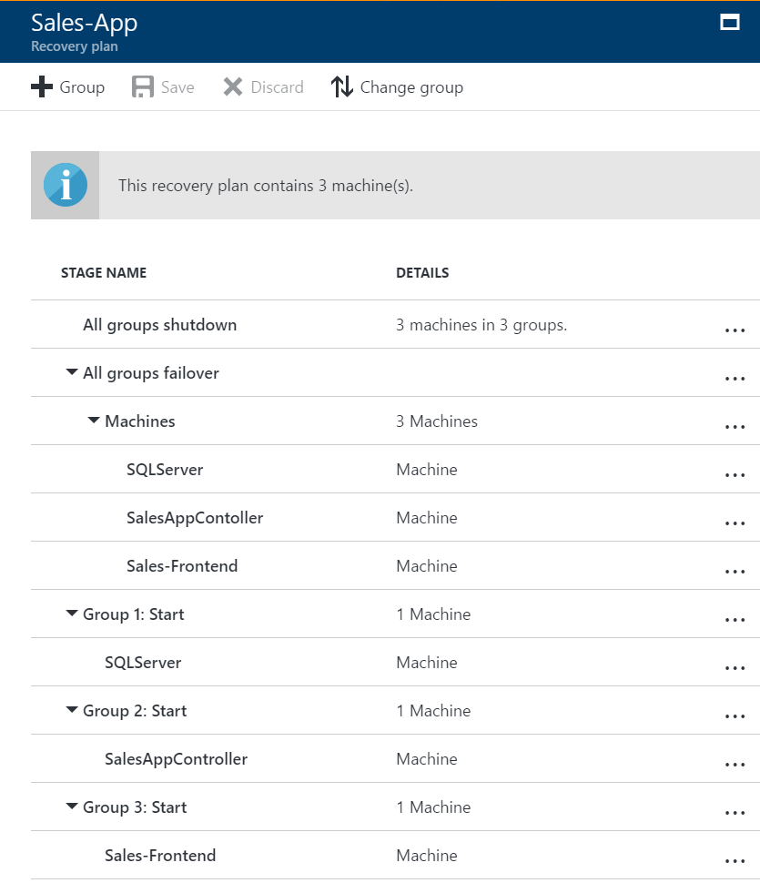

# Create a recovery plan by using Site Recovery

This article describes how to create and customize a recovery plan in [Azure Site Recovery](site-recovery-overview.md).

Create a recovery plan to do the following:

* Define groups of machines that fail over together and then start together.
* Model dependencies between machines by grouping them together in a recovery plan group. For example, to fail over and bring up a specific application, include all the VMs for that application in the same recovery plan group.
* Run a failover. You can run a test, planned, or unplanned failover on a recovery plan.

## Why use a recovery plan

A recovery plan can help you prepare for a systematic recovery process by creating small independent units that you can manage. The units typically represent an application in your environment. A recovery plan can help you define the sequence in which the VMs start. You can also use a recovery plan to automate common tasks during recovery.

> [!TIP]
> One way to check that you are prepared for cloud migration or disaster recovery is to ensure that each of your applications is part of a recovery plan. Also, ensure that each recovery plan is tested for recovery to Azure. With this preparedness, you can confidently migrate or fail over your complete datacenter to Azure.
 
A recovery plan has three key value propositions:

* Model an application to capture dependencies.
* Automate most recovery tasks to reduce RTO.
* Test failover to be ready for a disaster.

### Model an application to capture dependencies

A recovery plan is a group of virtual machines that generally comprise an application, and which fail over together. Using recovery plan constructs, you can enhance a recovery plan group to capture your application-specific properties. 

In this article, we use a typical three-tier application that might have a SQL back end, middleware, and a web front end. You can customize the recovery plan to help ensure that the virtual machines start in the correct order after a failover. The SQL back end should start first, the middleware should start next, and the web front end should start last. This order ensures that the application is working by the time the last virtual machine starts. 

For example, when the middleware starts, it tries to connect to the SQL tier. The recovery plan ensures that the SQL tier is already running. Having a front-end server start last also helps ensure that end users don't connect to the application URL before all the components are up and running, and the application is ready to accept requests. To build these dependencies, customize the recovery plan to add groups, and then select a virtual machine. To move a virtual machine between groups, change the virtual machine's group.

After you complete the customization, you can visualize the exact steps of the recovery. Here's the order of steps that are executed during the failover of a recovery plan:

1. A shutdown step attempts to turn off the virtual machines on-premises. (Except in a test failover, during which the primary site needs to continue to run.)
2. The shutdown attempt triggers failover of all the virtual machines in the recovery plan in parallel. The failover step prepares virtual machine disks by using replicated data.
3. The startup groups execute in their order and start the virtual machines in each group. First, Group 1 executes, then Group 2 executes, and finally, Group 3 executes. If there's more than one virtual machine in any group (for example, a load-balanced web front end), all the virtual machines start in parallel.

> [!TIP]
> Sequencing across groups ensures that dependencies between various application tiers are honored. Parallelism, where appropriate to use, improves the RTO of application recovery.

   > [!NOTE]
   > Machines that are part of a single group fail over in parallel. Machines that are part of different groups fail over in the order of the groups. The machines of Group 2 start their failover only after all machines of Group 1 have failed over and started.

### Automate most recovery tasks to reduce RTO

Recovering large applications can be a complex task. Having many manual steps to remember in times of chaos is difficult and makes the process prone to error. Also, it might be someone who is unaware of the application intricacies who actually triggers the failover. 

You can use a recovery plan to automate the required actions that you need to take at each step. You can set up the required actions by using Azure Automation runbooks. With runbooks, you can automate common recovery tasks, like the tasks in the following examples. For tasks that can't be automated, you can insert manual actions into your recovery plans.

* **Tasks on the Azure virtual machine post-failover**: These tasks typically are required to be able to connect to the virtual machine. Examples:
	* Create a public IP address on the virtual machine post-failover.
	* Assign a network security group to the NIC on the failed-over virtual machine.
	* Add a load balancer to an availability set.
* **Tasks inside the virtual machine post-failover**: These tasks reconfigure the application so that it continues to work correctly in the new environment. Examples:
	* Modify the database connection string inside the virtual machine.
	* Change the web server configuration or rules.

> [!TIP]
> Achieve one-click failover and optimize RTO by creating a complete recovery plan that automates post-recovery tasks by using Automation runbooks.

### Test failover to be ready for a disaster

You can use a recovery plan to trigger either a failover or a test failover. Always complete a test failover on the application before doing a failover. Test failovers help you check whether the application comes up on the recovery site. If you have missed something in your setup, you can easily trigger cleanup, and then redo the test failover. Do the test failover multiple times until you are certain that the application recovers smoothly.

> [!TIP]
> Because each application is unique, you need to build recovery plans that are customized for each application. 
>
> Also, in today's dynamic, datacenter-focused environment, applications and their dependencies frequently change. To ensure that the recovery plan is current, test failover for your applications every quarter.

## Create a recovery plan

1. Select **Recovery Plans** > **Create Recovery Plan**.
   Specify a name for the recovery plan, and a source and target. The source location must have virtual machines that are enabled for failover and recovery. Choose a source and target based on the virtual machines that you want to be part of the recovery plan. 

   |Scenario                   |Source               |Target           |
   |---------------------------|---------------------|-----------------|
   |Azure to Azure             |Azure region         |Azure region     |
   |VMware to Azure            |Configuration server |Azure            |
   |Virtual Machine Manager (VMM) to Azure               |VMM display name    |Azure            |
   |Hyper-V site to Azure      |Hyper-V site name    |Azure            |
   |Physical machines to Azure |Configuration server |Azure            |
   |VMM to VMM                 |VMM friendly name    |VMM display name|

   > [!NOTE]
   > A recovery plan can contain virtual machines that have the same source and target. VMware and System Center Virtual Machine Manager (VMM) virtual machines can't be in the same recovery plan. However, you can add VMware virtual machines and physical machines to the same recovery plan. In this case, the source for both machines is a configuration server.

2. Under **Select virtual machines**, select the virtual machines (or replication group) that you want to add to the default group (Group 1) in the recovery plan. You can only select virtual machines that were protected on the source (as selected in the recovery plan) and which are protected on the target (as selected in the recovery plan).

## Customize and extend recovery plans

To customize and extend recovery plans, go to the Site Recovery recovery plan resource pane. Select the **Customize** tab. You can customize and extend recovery plans by using the following options:

- **Add new groups**: You can add up to seven additional recovery plan groups to the default group. Then, you can add more machines or replication groups to those recovery plan groups. Groups are numbered in the order in which you add them. You can include a virtual machine, or replication group, in only one recovery plan group.
- **Add a manual action**: You can add manual actions that run before or after a recovery plan group. When the recovery plan runs, it stops at the point at which you inserted the manual action. A dialog box prompts you to specify that the manual action was completed.
- **Add a script**: You can add scripts that run before or after a recovery plan group. When you add a script, it adds a new set of actions for the group. For example, a set of pre-steps for Group 1 is created with the name *Group 1: pre-steps*. All pre-steps are listed inside this set. You can add a script on the primary site only if you have a VMM server deployed. For more information, see [Add a VMM script to a recovery plan](site-recovery-how-to-add-vmmscript.md).
- **Add Azure runbooks**: You can extend recovery plans by using Azure runbooks. For example, you can use a runbook to automate tasks, or to create single-step recovery. For more information, see [Add Azure Automation runbooks to recovery plans](site-recovery-runbook-automation.md).

## Add a script, runbook, or manual action to a plan

After you've added virtual machines or replication groups to a default recovery plan group, you can add a script or manual action to the recovery plan group.

1. Open the recovery plan.
2. In the **Step** list, select an item. Then, select **Script** or **Manual Action**.
3. Specify whether you want to add the script or action before or after the selected item. To move the position of the script up or down, select the **Move Up** or **Move Down** buttons.
4. If you add a VMM script, select **Failover to VMM script**. In **Script Path**, enter the relative path to the share. For example, **\RPScripts\RPScript.PS1**.
5. If you add an Automation runbook, specify the Automation account in which the runbook is located. Then, select the Azure runbook script.
6. To ensure that the script works as expected, do a failover of the recovery plan.

Script or runbook options are available only in the following scenarios, and during a failover or failback. A manual action is available both for failover and failback.

|Scenario               |Failover |Failback |
|-----------------------|---------|---------|
|Azure to Azure         |Runbook |Runbook  |
|VMware to Azure        |Runbook |NA       | 
|VMM to Azure           |Runbook |Script   |
|Hyper-V site to Azure  |Runbook |NA       |
|VMM to VMM             |Script   |Script   |

## Next steps

* Learn more about [running failovers](site-recovery-failover.md).  
* To see the recovery plan in action, see this video:
    
    > [!VIDEO https://channel9.msdn.com/Series/Azure-Site-Recovery/One-click-failover-of-a-2-tier-WordPress-application-using-Azure-Site-Recovery/player]
