# Azure Site Recovery deployment planner
This article is the Azure Site Recovery Deployment Planner user guide for VMware-to-Azure production deployments.

## Overview

Before you begin protecting any VMware virtual machines (VMs) by using Site Recovery, allocate sufficient bandwidth, based on your daily data-change rate, to meet your desired recovery point objective (RPO). Be sure to deploy the right number of configuration servers and process servers on-premises.

You also need to create the right type and number of target Azure storage accounts. You create either standard or premium storage accounts, factoring in growth on your source production servers because of increased usage over time. You choose the storage type per VM, based on workload characteristics (for example, read/write I/O operations per second [IOPS], or data churn) and Site Recovery limits.

The Site Recovery deployment planner public preview is a command-line tool that's currently available only for the VMware-to-Azure scenario. You can remotely profile your VMware VMs by using this tool (with no production impact whatsoever) to understand the bandwidth and Azure Storage requirements for successful replication and test failover. You can run the tool without installing any Site Recovery components on-premises. However, to get accurate achieved throughput results, we recommend that you run the planner on a Windows Server that meets the minimum requirements of the Site Recovery configuration server that you would eventually need to deploy as one of the first steps in production deployment.

The tool provides the following details:

**Compatibility assessment**

* A VM eligibility assessment, based on number of disks, disk size, IOPS, churn and boot type(EFI/BIOS)
* The estimated network bandwidth that's required for delta replication

**Network bandwidth need versus RPO assessment**

* The estimated network bandwidth that's required for delta replication
* The throughput that Site Recovery can get from on-premises to Azure
* The number of VMs to batch, based on the estimated bandwidth to complete initial replication in a given amount of time

**Azure infrastructure requirements**

* The storage type (standard or premium storage account) requirement for each VM
* The total number of standard and premium storage accounts to be set up for replication
* Storage-account naming suggestions, based on Azure Storage guidance
* The storage-account placement for all VMs
* The number of Azure cores to be set up before test failover or failover on the subscription
* The Azure VM-recommended size for each on-premises VM

**On-premises infrastructure requirements**
* The required number of configuration servers and process servers to be deployed on-premises

>[!IMPORTANT]
>
>Because usage is likely to increase over time, all the preceding tool calculations are performed assuming a 30 percent growth factor in  workload characteristics, and using a 95th percentile value of all the profiling metrics (read/write IOPS, churn, and so forth). Both of these elements (growth factor and percentile calculation) are configurable. To learn more about growth factor, see the "Growth-factor considerations" section. To learn more about  percentile value, see the "Percentile value used for the calculation" section.
>

## Requirements
The tool has two main phases: profiling and report generation. There is also a third option to calculate throughput only. The requirements for the server from which the profiling and throughput measurement is initiated are presented in the following table:

| Server requirement | Description|
|---|---|
|Profiling and throughput measurement| <ul><li>Operating system: Microsoft Windows Server 2012 R2<br>(ideally matching at least the [size recommendations for the configuration server](https://aka.ms/asr-v2a-on-prem-components))</li><li>Machine configuration: 8 vCPUs, 16 GB RAM, 300 GB HDD</li><li>[Microsoft .NET Framework 4.5](https://aka.ms/dotnet-framework-45)</li><li>[VMware vSphere PowerCLI 6.0 R3](https://developercenter.vmware.com/tool/vsphere_powercli/6.0)</li><li>[Microsoft Visual C++ Redistributable for Visual Studio 2012](https://aka.ms/vcplusplus-redistributable)</li><li>Internet access to Azure from this server</li><li>Azure storage account</li><li>Administrator access on the server</li><li>Minimum 100 GB of free disk space (assuming 1000 VMs with an average of three disks each, profiled for 30 days)</li><li>VMware vCenter statistics level settings should be set to 2 or high level</li></ul>|
| Report generation | A Windows PC or Windows Server with Microsoft Excel 2013 or later |
| User permissions | Read-only permission for the user account that's used to access the VMware vCenter server/VMware vSphere ESXi host during profiling |

> [!NOTE]
>
>The tool can profile only VMs with VMDK and RDM disks. It cannot profile VMs with iSCSI or NFS disks. Site Recovery does support iSCSI and NFS disks for VMware servers but, because the deployment planner is not inside the guest and it profiles only by using vCenter performance counters, the tool does not have visibility into these disk types.
>

## Download and extract the public preview
1. Download the latest version of the [Site Recovery deployment planner public preview](https://aka.ms/asr-deployment-planner).  
The tool is packaged in a .zip folder. The current version of the tool supports only the VMware-to-Azure scenario.

2. Copy the .zip folder to the Windows server from which you want to run the tool.  
You can run the tool from Windows Server 2012 R2 if the server has network access to connect to the vCenter server/vSphere ESXi host that holds the VMs to be profiled. However, we recommend that you run the tool on a server whose hardware configuration meets the [configuration server sizing guideline](https://aka.ms/asr-v2a-on-prem-components). If you have already deployed Site Recovery components on-premises, run the tool from the configuration server.

 We recommend that you have the same hardware configuration as the configuration server (which has an in-built process server) on the server where you run the tool. Such a configuration ensures that the achieved throughput that the tool reports matches the actual throughput that Site Recovery can achieve during replication. The throughput calculation depends on available network bandwidth on the server and hardware configuration (CPU, storage, and so forth) of the server. If you run the tool from any other server, the throughput is calculated from that server to Microsoft Azure. Also, because the hardware configuration of the server might differ from that of the configuration server, the achieved throughput that the tool reports might be inaccurate.

3. Extract the .zip folder.  
The folder contains multiple files and subfolders. The executable file is ASRDeploymentPlanner.exe in the parent folder.

    Example:  
    Copy the .zip file to E:\ drive and extract it.
    E:\ASR Deployment Planner-Preview_v1.2.zip

    E:\ASR Deployment Planner-Preview_v1.2\ ASR Deployment Planner-Preview_v1.2\ ASRDeploymentPlanner.exe

## Capabilities
You can run the command-line tool (ASRDeploymentPlanner.exe) in any of the following three modes:

1. Profiling  
2. Report generation
3. Get throughput

First, run the tool in profiling mode to gather VM data churn and IOPS. Next, run the tool to generate the report to find the network bandwidth and storage requirements.

## Profiling
In profiling mode, the deployment planner tool connects to the vCenter server/vSphere ESXi host to collect performance data about the VM.

* Profiling does not affect the performance of the production VMs, because no direct connection is made to them. All performance data is collected from the vCenter server/vSphere ESXi host.
* To ensure that there is a negligible impact on the server because of profiling, the tool queries the vCenter server/vSphere ESXi host once every 15 minutes. This query interval does not compromise profiling accuracy, because the tool stores every minute’s performance counter data.

### Create a list of VMs to profile
First, you need a list of the VMs to be profiled. You can get all the names of VMs on a vCenter server/vSphere ESXi host by using the VMware vSphere PowerCLI commands in the following procedure. Alternatively, you can list in a file the friendly names or IP addresses of the VMs that you want to profile manually.

1. Sign in to the VM that VMware vSphere PowerCLI is installed in.
2. Open the VMware vSphere PowerCLI console.
3. Ensure that the execution policy is enabled for the script. If it is disabled, launch the VMware vSphere PowerCLI console in administrator mode, and then enable it by running the following command:

			Set-ExecutionPolicy –ExecutionPolicy AllSigned

4. To get all the names of VMs on a vCenter server/vSphere ESXi host and store the list in a .txt file, run the two commands listed here.
Replace &lsaquo;server name&rsaquo;, &lsaquo;user name&rsaquo;, &lsaquo;password&rsaquo;, &lsaquo;outputfile.txt&rsaquo;; with your inputs.

			Connect-VIServer -Server <server name> -User <user name> -Password <password>

			Get-VM |  Select Name | Sort-Object -Property Name >  <outputfile.txt>

5. Open the output file in Notepad, and then copy the names of all VMs that you want to profile to another file (for example, ProfileVMList.txt), one VM name per line. This file is used as input to the *-VMListFile* parameter of the command-line tool.

	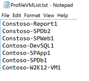

### Start profiling
After you have the list of VMs to be profiled, you can run the tool in profiling mode. Here is the list of mandatory and optional parameters of the tool to run in profiling mode.

ASRDeploymentPlanner.exe -Operation StartProfiling /?

| Parameter name | Description |
|---|---|
| -Operation | StartProfiling |
| -Server | The fully qualified domain name or IP address of the vCenter server/vSphere ESXi host whose VMs are to be profiled.|
| -User | The user name to connect to the vCenter server/vSphere ESXi host. The user needs to have read-only access, at minimum.|
| -VMListFile |	The file that contains the list of VMs to be profiled. The file path can be absolute or relative. The file should contain one VM name/IP address per line. Virtual machine name specified in the file should be the same as the VM name on the vCenter server/vSphere ESXi host.<br>For example, the file VMList.txt contains the following VMs:<ul><li>virtual_machine_A</li><li>10.150.29.110</li><li>virtual_machine_B</li><ul> |
| -NoOfDaysToProfile | The number of days for which profiling is to be run. We recommend that you run profiling for more than 15 days to ensure that the workload pattern in your environment over the specified period is observed and used to provide an accurate recommendation. |
| -Directory | (Optional) The universal naming convention (UNC) or local directory path to store profiling data generated during profiling. If a directory name is not given, the directory named ‘ProfiledData’ under the current path will be used as the default directory. |
| -Password | (Optional) The password to use to connect to the vCenter server/vSphere ESXi host. If you do not specify one now, you will be prompted for it when the command is executed.|
| -StorageAccountName | (Optional) The storage-account name that's used to find the throughput achievable for replication of data from on-premises to Azure. The tool uploads test data to this storage account to calculate throughput.|
| -StorageAccountKey | (Optional) The storage-account key that's used to access the storage account. Go to the Azure portal > Storage accounts > <*Storage account name*> > Settings > Access Keys > Key1 (or primary access key for classic storage account). |
| -Environment | (optional) This is your target Azure Storage account environment. This can be one of three values - AzureCloud,AzureUSGovernment, AzureChinaCloud. Default is AzureCloud. Use the parameter when your target Azure region is either Azure US Government or Azure China clouds. |


We recommend that you profile your VMs for at least 15 to 30 days. During the profiling period, ASRDeploymentPlanner.exe keeps running. The tool takes profiling time input in days. If you want to profile for few hours or minutes for a quick test of the tool, in the public preview, you will need to convert the time into the equivalent measure of days. For example, to profile for 30 minutes, the input must be 30/(60*24) = 0.021 days. The minimum allowed profiling time is 30 minutes.

During profiling, you can optionally pass a storage-account name and key to find the throughput that Site Recovery can achieve at the time of replication from the configuration server or process server to Azure. If the storage-account name and key are not passed during profiling, the tool does not calculate achievable throughput.

You can run multiple instances of the tool for various sets of VMs. Ensure that the VM names are not repeated in any of the profiling sets. For example, if you have profiled ten VMs (VM1 through VM10) and after few days you want to profile another five VMs (VM11 through VM15), you can run the tool from another command-line console for the second set of VMs (VM11 through VM15). Ensure that the second set of VMs do not have any VM names from the first profiling instance or you use a different output directory for the second run. If two instances of the tool are used for profiling the same VMs and use the same output directory, the generated report will be incorrect.

VM configurations are captured once at the beginning of the profiling operation and stored in a file called VMDetailList.xml. This information is used when the report is generated. Any change in VM configuration (for example, an increased number of cores, disks, or NICs) from the beginning to the end of profiling is not captured. If a profiled VM configuration has changed during the course of profiling, in the public preview, here is the workaround to get latest VM details when generating the report:

* Back up VMdetailList.xml, and delete the file from its current location.
* Pass -User and -Password arguments at the time of report generation.

The profiling command generates several files in the profiling directory. Do not delete any of the files, because doing so affects report generation.

#### Example 1: Profile VMs for 30 days, and find the throughput from on-premises to Azure
```
ASRDeploymentPlanner.exe -Operation StartProfiling -Directory “E:\vCenter1_ProfiledData” -Server vCenter1.contoso.com -VMListFile “E:\vCenter1_ProfiledData\ProfileVMList1.txt”  -NoOfDaysToProfile  30  -User vCenterUser1 -StorageAccountName  asrspfarm1 -StorageAccountKey Eby8vdM02xNOcqFlqUwJPLlmEtlCDXJ1OUzFT50uSRZ6IFsuFq2UVErCz4I6tq/K1SZFPTOtr/KBHBeksoGMGw==
```

#### Example 2: Profile VMs for 15 days

```
ASRDeploymentPlanner.exe -Operation StartProfiling -Directory “E:\vCenter1_ProfiledData” -Server vCenter1.contoso.com -VMListFile “E:\vCenter1_ProfiledData\ProfileVMList1.txt”  -NoOfDaysToProfile  15  -User vCenterUser1
```

#### Example 3: Profile VMs for 1 hour for a quick test of the tool
```
ASRDeploymentPlanner.exe -Operation StartProfiling -Directory “E:\vCenter1_ProfiledData” -Server vCenter1.contoso.com -VMListFile “E:\vCenter1_ProfiledData\ProfileVMList1.txt”  -NoOfDaysToProfile  0.04  -User vCenterUser1
```

>[!NOTE]
>
>* If the server that the tool is running on is rebooted or has crashed, or if you close the tool by using Ctrl + C, the profiled data is preserved. However, there is a chance of missing the last 15 minutes of profiled data. In such an instance, rerun the tool in profiling mode after the server restarts.
>* When the storage-account name and key are passed, the tool measures the throughput at the last step of profiling. If the tool is closed before profiling is completed, the throughput is not calculated. To find the throughput before generating the report, you can run the GetThroughput operation from the command-line console. Otherwise, the generated report will not contain the throughput information.


## Generate a report
The tool generates a macro-enabled Microsoft Excel file (XLSM file) as the report output, which summarizes all the deployment recommendations. The report is named DeploymentPlannerReport_<*unique numeric identifier*>.xlsm and placed in the specified directory.

After profiling is complete, you can run the tool in report-generation mode. The following table contains a list of mandatory and optional tool parameters to run in report-generation mode.

`ASRDeploymentPlanner.exe -Operation GenerateReport /?`

|Parameter name | Description |
|-|-|
| -Operation | GenerateReport |
| -Server |  The vCenter/vSphere server fully qualified domain name or IP address (use the same name or IP address that you used at the time of profiling) where the profiled VMs whose report is to be generated are located. Note that if you used a vCenter server at the time of profiling, you cannot use a vSphere server for report generation, and vice-versa.|
| -VMListFile | The file that contains the list of profiled VMs that the report is to be generated for. The file path can be absolute or relative. The file should contain one VM name or IP address per line. The VM names that are specified in the file should be the same as the VM names on the vCenter server/vSphere ESXi host, and match what was used during profiling.|
| -Directory | (Optional) The UNC or local directory path where the profiled data (files generated during profiling) is stored. This data is required for generating the report. If a name isn't specified, ‘ProfiledData’ directory will be used. |
| -GoalToCompleteIR | (Optional) The number of hours in which the initial replication of the profiled VMs needs to be completed. The generated report provides the number of VMs for which initial replication can be completed in the specified time. The default is 72 hours. |
| -User | (Optional) The user name to use to connect to the vCenter/vSphere server. The name is used to fetch the latest configuration information of the VMs, such as the number of disks, number of cores, and number of NICs, to use in the report. If the name isn't provided, the configuration information collected at the beginning of the profiling kickoff is used. |
| -Password | (Optional) The password to use to connect to the vCenter server/vSphere ESXi host. If the password isn't specified as a parameter, you will be prompted for it later when the command is executed. |
| -DesiredRPO | (Optional) The desired recovery point objective, in minutes. The default is 15 minutes.|
| -Bandwidth | Bandwidth in Mbps. The parameter to use to calculate the RPO that can be achieved for the specified bandwidth. |
| -StartDate | (Optional) The start date and time in MM-DD-YYYY:HH:MM (24-hour format). *StartDate* must be specified along with *EndDate*. When StartDate is specified, the report is generated for the profiled data that's collected between StartDate and EndDate. |
| -EndDate | (Optional) The end date and time in MM-DD-YYYY:HH:MM (24-hour format). *EndDate* must be specified along with *StartDate*. When EndDate is specified, the report is generated for the profiled data that's collected between StartDate and EndDate. |
| -GrowthFactor | (Optional) The growth factor, expressed as a percentage. The default is 30 percent. |

to a single storage account placement is caculated considering Failover/Test Test failover of virtual machines is done on Managed Disk instead of Unmanaged disk. |

#### Example 1: Generate a report with default values when the profiled data is on the local drive
```
ASRDeploymentPlanner.exe -Operation GenerateReport -Server vCenter1.contoso.com -Directory “\\PS1-W2K12R2\vCenter1_ProfiledData” -VMListFile “\\PS1-W2K12R2\vCenter1_ProfiledData\ProfileVMList1.txt”
```

#### Example 2: Generate a report when the profiled data is on a remote server
You should have read/write access on the remote directory.
```
ASRDeploymentPlanner.exe -Operation GenerateReport -Server vCenter1.contoso.com -Directory “\\PS1-W2K12R2\vCenter1_ProfiledData” -VMListFile “\\PS1-W2K12R2\vCenter1_ProfiledData\ProfileVMList1.txt”
```

#### Example 3: Generate a report with a specific bandwidth and goal to complete IR within specified time
```
ASRDeploymentPlanner.exe -Operation GenerateReport -Server vCenter1.contoso.com -Directory “E:\vCenter1_ProfiledData” -VMListFile “E:\vCenter1_ProfiledData\ProfileVMList1.txt” -Bandwidth 100 -GoalToCompleteIR 24
```

#### Example 4: Generate a report with a 5 percent growth factor instead of the default 30 percent
```
ASRDeploymentPlanner.exe -Operation GenerateReport -Server vCenter1.contoso.com -Directory “E:\vCenter1_ProfiledData” -VMListFile “E:\vCenter1_ProfiledData\ProfileVMList1.txt” -GrowthFactor 5
```

#### Example 5: Generate a report with a subset of profiled data
For example, you have 30 days of profiled data and want to generate a report for only 20 days.
```
ASRDeploymentPlanner.exe -Operation GenerateReport -Server vCenter1.contoso.com -Directory “E:\vCenter1_ProfiledData” -VMListFile “E:\vCenter1_ProfiledData\ProfileVMList1.txt” -StartDate  01-10-2017:12:30 -EndDate 01-19-2017:12:30
```

#### Example 6: Generate a report for 5-minute RPO
```
ASRDeploymentPlanner.exe -Operation GenerateReport -Server vCenter1.contoso.com -Directory “E:\vCenter1_ProfiledData” -VMListFile “E:\vCenter1_ProfiledData\ProfileVMList1.txt”  -DesiredRPO 5
```

## Percentile value used for the calculation
**What default percentile value of the performance metrics collected during profiling does the tool use when it generates a report?**

The tool defaults to the 95th percentile values of read/write IOPS, write IOPS, and data churn that are collected during profiling of all the VMs. This metric ensures that the 100th percentile spike your VMs might see because of temporary events is not used to determine your target storage-account and source-bandwidth requirements. For example, a temporary event might be a backup job running once a day, a periodic database indexing or analytics report-generation activity, or other similar short-lived, point-in-time events.

Using 95th percentile values gives a true picture of real workload characteristics, and it gives you the best performance when the workloads are running on Azure. We do not anticipate that you would need to change this number. If you do change the value (to the 90th percentile, for example), you can update the configuration file *ASRDeploymentPlanner.exe.config* in the default folder and save it to generate a new report on the existing profiled data.
```
<add key="WriteIOPSPercentile" value="95" />      
<add key="ReadWriteIOPSPercentile" value="95" />      
<add key="DataChurnPercentile" value="95" />
```

## Growth-factor considerations
**Why should I consider growth factor when I plan deployments?**

It is critical to account for growth in your workload characteristics, assuming a potential increase in usage over time. After protection is in place, if your workload characteristics change, you cannot switch to a different storage account for protection without disabling and re-enabling the protection.

For example, let's say that today your VM fits in a standard storage replication account. Over the next three months, several changes are likely to occur:

* The number of users of the application that runs on the VM will increase.
* The resulting increased churn on the VM will require the VM to go to premium storage so that Site Recovery replication can keep pace.
* Consequently, you will have to disable and re-enable protection to a premium storage account.

We strongly recommend that you plan for growth during deployment planning and while the default value is 30 percent. You are the expert on your application usage pattern and growth projections, and you can change this number accordingly while generating a report. Moreover, you can  generate multiple reports with various growth factors with the same profiled data and determine what target storage and source bandwidth recommendations work best for you.

The generated Microsoft Excel report contains the following information:

* [Input](site-recovery-deployment-planner.md#input)
* [Recommendations](site-recovery-deployment-planner.md#recommendations-with-desired-rpo-as-input)
* [Recommendations-Bandwidth Input](site-recovery-deployment-planner.md#recommendations-with-available-bandwidth-as-input)
* [VM<->Storage Placement](site-recovery-deployment-planner.md#vm-storage-placement)
* [Compatible VMs](site-recovery-deployment-planner.md#compatible-vms)
* [Incompatible VMs](site-recovery-deployment-planner.md#incompatible-vms)

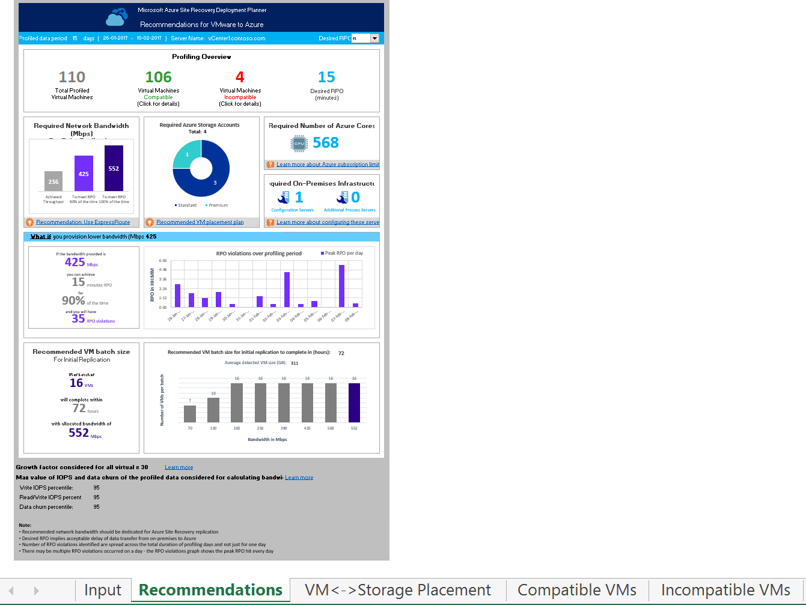

## Get throughput

To estimate the throughput that Site Recovery can achieve from on-premises to Azure during replication, run the tool in GetThroughput mode. The tool calculates the throughput from the server that the tool is running on. Ideally, this server is based on the configuration server sizing guide. If you have already deployed Site Recovery infrastructure components on-premises, run the tool on the configuration server.

Open a command-line console, and go to the Site Recovery deployment planning tool folder. Run ASRDeploymentPlanner.exe with following parameters.

`ASRDeploymentPlanner.exe -Operation GetThroughput /?`

|Parameter name | Description |
|-|-|
| -Operation | GetThroughput |
| -Directory | (Optional) The UNC or local directory path where the profiled data (files generated during profiling) is stored. This data is required for generating the report. If a directory name is not specified, ‘ProfiledData’ directory is used. |
| -StorageAccountName | The storage-account name that's used to find the bandwidth consumed for replication of data from on-premises to Azure. The tool uploads test data to this storage account to find the bandwidth consumed. |
| -StorageAccountKey | The storage-account key that's used to access the storage account. Go to the Azure portal > Storage accounts > <*Storage account name*> > Settings > Access Keys > Key1 (or a primary access key for a classic storage account). |
| -VMListFile | The file that contains the list of VMs to be profiled for calculating the bandwidth consumed. The file path can be absolute or relative. The file should contain one VM name/IP address per line. The VM names specified in the file should be the same as the VM names on the vCenter server/vSphere ESXi host.<br>For example, the file VMList.txt contains the following VMs:<ul><li>VM_A</li><li>10.150.29.110</li><li>VM_B</li></ul>|
| -Environment | (optional) This is your target Azure Storage account environment. This can be one of three values - AzureCloud,AzureUSGovernment, AzureChinaCloud. Default is AzureCloud. Use the parameter when your target Azure region is either Azure US Government or Azure China clouds. |

The tool creates several 64-MB asrvhdfile<#>.vhd files (where "#" is the number of files) on the specified directory. The tool uploads the files to the storage account to find the throughput. After the throughput is measured, the tool deletes all the files from the storage account and from the local server. If the tool is terminated for any reason while it is calculating throughput, it doesn't delete the files from the storage or from the local server. You will have to delete them manually.

The throughput is measured at a specified point in time, and it is the maximum throughput that Site Recovery can achieve during replication, provided that all other factors remain the same. For example, if any application starts consuming more bandwidth on the same network, the actual throughput varies during replication. If you are running the GetThroughput command from a configuration server, the tool is unaware of any protected VMs and ongoing replication. The result of the measured throughput is different if the GetThroughput operation is run when the protected VMs have high data churn. We recommend that you run the tool at various points in time during profiling to understand what throughput levels can be achieved at various times. In the report, the tool shows the last measured throughput.

### Example
```
ASRDeploymentPlanner.exe -Operation GetThroughput -Directory  E:\vCenter1_ProfiledData -VMListFile E:\vCenter1_ProfiledData\ProfileVMList1.txt  -StorageAccountName  asrspfarm1 -StorageAccountKey by8vdM02xNOcqFlqUwJPLlmEtlCDXJ1OUzFT50uSRZ6IFsuFq2UVErCz4I6tq/K1SZFPTOtr/KBHBeksoGMGw==
```

>[!NOTE]
>
> Run the tool on a server that has the same storage and CPU characteristics as the configuration server.
>
> For replication, set the recommended bandwidth to meet the RPO 100 percent of the time. After you set the right bandwidth, if you don’t see an increase in the achieved throughput reported by the tool, do the following:
>
>  1. Check to determine whether there is any network Quality of Service (QoS) that is limiting Site Recovery throughput.
>
>  2. Check to determine whether your Site Recovery vault is in the nearest physically supported Microsoft Azure region to minimize network latency.
>
>  3. Check your local storage characteristics to determine whether you can improve the hardware (for example, HDD to SSD).
>
>  4. Change the Site Recovery settings in the process server to [increase the amount of network bandwidth used for replication](./site-recovery-plan-capacity-vmware.md#control-network-bandwidth).

## Recommendations with desired RPO as input

### Profiled data

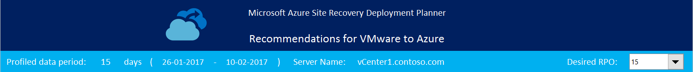

**Profiled data period**: The period during which the profiling was run. By default, the tool includes all profiled data in the calculation, unless it generates the report for a specific period by using StartDate and EndDate options during report generation.

**Server Name**: The name or IP address of the VMware vCenter or ESXi host whose VMs’ report is generated.

**Desired RPO**: The recovery point objective for your deployment. By default, the required network bandwidth is calculated for RPO values of 15, 30, and 60 minutes. Based on the selection, the affected values are updated on the sheet. If you have used the *DesiredRPOinMin* parameter while generating the report, that value is shown in the Desired RPO result.

### Profiling overview

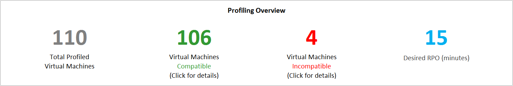

**Total Profiled Virtual Machines**: The total number of VMs whose profiled data is available. If the VMListFile has names of any VMs which were not profiled, those VMs are not considered in the report generation and are excluded from the total profiled VMs count.

**Compatible Virtual Machines**: The number of VMs that can be protected to Azure by using Site Recovery. It is the total number of compatible VMs for which the required network bandwidth, number of storage accounts, number of Azure cores, and number of configuration servers and additional process servers are calculated. The details of every compatible VM are available in the "Compatible VMs" section.

**Incompatible Virtual Machines**: The number of profiled VMs that are incompatible for protection with Site Recovery. The reasons for incompatibility are noted in the "Incompatible VMs" section. If the VMListFile has names of any VMs that were not profiled, those VMs are excluded from the incompatible VMs count. These VMs are listed as "Data not found" at the end of the "Incompatible VMs" section.

**Desired RPO**: Your desired recovery point objective, in minutes. The report is generated for three RPO values: 15 (default), 30, and 60 minutes. The bandwidth recommendation in the report is changed based on your selection in the Desired RPO drop-down list at the top right of the sheet. If you have generated the report by using the *-DesiredRPO* parameter with a custom value, this custom value will show as the default in the Desired RPO drop-down list.

### Required network bandwidth (Mbps)

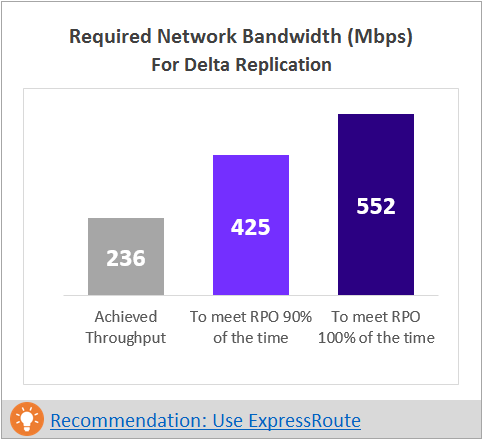

**To meet RPO 100 percent of the time:** The recommended bandwidth in Mbps to be allocated to meet your desired RPO 100 percent of the time. This amount of bandwidth must be dedicated for steady-state delta replication of all your compatible VMs to avoid any RPO violations.

**To meet RPO 90 percent of the time**: Because of broadband pricing or for any other reason, if you cannot set the bandwidth needed to meet your desired RPO 100 percent of the time, you can choose to go with a lower bandwidth setting that can meet your desired RPO 90 percent of the time. To understand the implications of setting this lower bandwidth, the report provides a what-if analysis on the number and duration of RPO violations to expect.

**Achieved Throughput:** The throughput from the server on which you have run the GetThroughput command to the Microsoft Azure region where the storage account is located. This throughput number indicates the estimated level that you can achieve when you protect the compatible VMs by using Site Recovery, provided that your configuration server or process server storage and network characteristics remain the same as that of the server from which you have run the tool.

For replication, you should set the recommended bandwidth to meet the RPO 100 percent of the time. After you set the bandwidth, if you don’t see any increase in the achieved throughput, as reported by the tool, do the following:

1. Check to see whether there is any network Quality of Service (QoS) that is limiting Site Recovery throughput.

2. Check to see whether your Site Recovery vault is in the nearest physically supported Microsoft Azure region to minimize network latency.

3. Check your local storage characteristics to determine whether you can improve the hardware (for example, HDD to SSD).

4. Change the Site Recovery settings in the process server to [increase the amount network bandwidth used for replication](./site-recovery-plan-capacity-vmware.md#control-network-bandwidth).

If you are running the tool on a configuration server or process server that already has protected VMs, run the tool a few times. The achieved throughput number changes depending on the amount of churn being processed at that point in time.

For all enterprise Site Recovery deployments, we recommend that you use [ExpressRoute](https://aka.ms/expressroute).

### Required storage accounts
The following chart shows the total number of storage accounts (standard and premium) that are required to protect all the compatible VMs. To learn which storage account to use for each VM, see the "VM-storage placement" section.

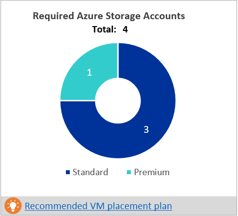

### Required number of Azure cores
This result is the total number of cores to be set up before failover or test failover of all the compatible VMs. If too few cores are available in the subscription, Site Recovery fails to create VMs at the time of test failover or failover.

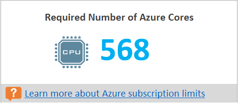

### Required on-premises infrastructure
This figure is the total number of configuration servers and additional process servers to be configured that would suffice to protect all the compatible VMs. Depending on the supported [size recommendations for the configuration server](https://aka.ms/asr-v2a-on-prem-components), the tool might recommend additional servers. The recommendation is based on the larger of either the per-day churn or the maximum number of protected VMs (assuming an average of three disks per VM), whichever is hit first on the configuration server or the additional process server. You'll find the details of total churn per day and total number of protected disks in the "Input" section.

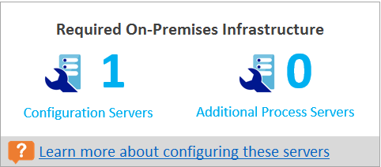

### What-if analysis
This analysis outlines how many violations could occur during the profiling period when you set a lower bandwidth for the desired RPO to be met only 90 percent of the time. One or more RPO violations can occur on any given day. The graph shows the peak RPO of the day.
Based on this analysis, you can decide if the number of RPO violations across all days and peak RPO hit per day is acceptable with the specified lower bandwidth. If it is acceptable, you can allocate the lower bandwidth for replication, else allocate the higher bandwidth as suggested to meet the desired RPO 100 percent of the time.

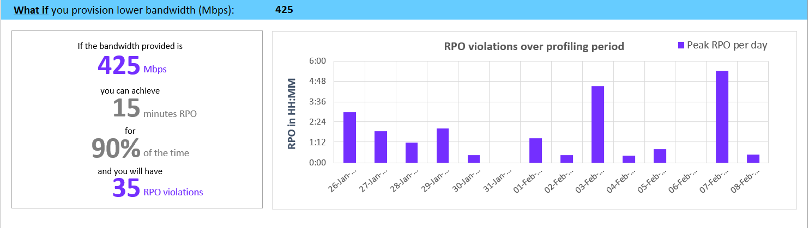

### Recommended VM batch size for initial replication
In this section, we recommend the number of VMs that can be protected in parallel to complete the initial replication within 72 hours with the suggested bandwidth to meet desired RPO 100 percent of the time being set. This value is configurable value. To change it at report-generation time, use the *GoalToCompleteIR* parameter.

The graph here shows a range of bandwidth values and a calculated VM batch size count to complete initial replication in 72 hours, based on the average detected VM size across all the compatible VMs.

In the public preview, the report does not specify which VMs should be included in a batch. You can use the disk size shown in the "Compatible VMs" section to find each VM’s size and select them for a batch, or you can select the VMs based on known workload characteristics. The completion time of the initial replication changes proportionally, based on the actual VM disk size, used disk space, and available network throughput.

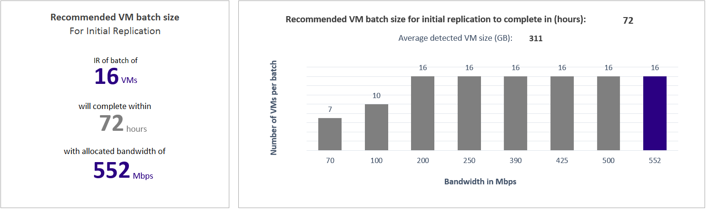

### Growth factor and percentile values used
This section at the bottom of the sheet shows the percentile value used for all the performance counters of the profiled VMs (default is 95th percentile), and the growth factor (default is 30 percent) that's used in all the calculations.

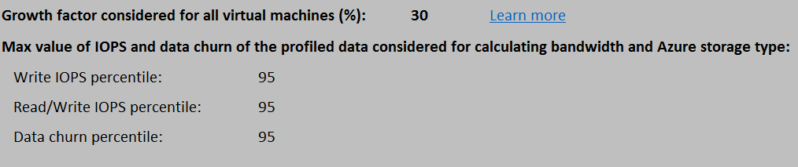

## Recommendations with available bandwidth as input

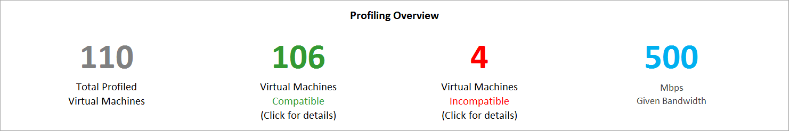

You might have a situation where you know that you cannot set a bandwidth of more than x Mbps for Site Recovery replication. The tool allows you to input available bandwidth (using the -Bandwidth parameter during report generation) and get the achievable RPO in minutes. With this achievable RPO value, you can decide whether you need to set up additional bandwidth or you are OK with having a disaster recovery solution with this RPO.

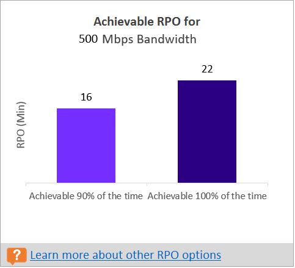

## Input
The Input worksheet provides an overview of the profiled VMware environment.

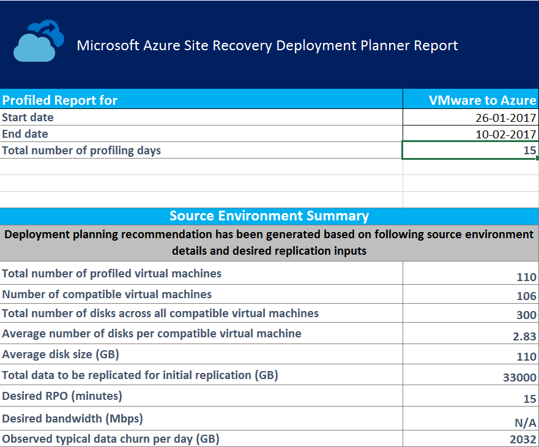

**Start Date** and **End Date**: The start and end dates of the profiling data considered for report generation. By default, the start date is the date when profiling starts, and the end date is the date when profiling stops. This can be the ‘StartDate’ and ‘EndDate’ values if the report is generated with these parameters.

**Total number of profiling days**: The total number of days of profiling between the start and end dates for which the report is generated.

**Number of compatible virtual machines**: The total number of compatible VMs for which the required network bandwidth, required number of storage accounts, Microsoft Azure cores, configuration servers and additional process servers are calculated.

**Total number of disks across all compatible virtual machines**: The number that's used as one of the inputs to decide the number of configuration servers and additional process servers to be used in the deployment.

**Average number of disks per compatible virtual machine**: The average number of disks calculated across all compatible VMs.

**Average disk size (GB)**: The average disk size calculated across all compatible VMs.

**Desired RPO (minutes)**: Either the default recovery point objective or the value passed for the ‘DesiredRPO’ parameter at the time of report generation to estimate required bandwidth.

**Desired bandwidth (Mbps)**: The value that you have passed for the ‘Bandwidth’ parameter at the time of report generation to estimate achievable RPO.

**Observed typical data churn per day (GB)**: The average data churn observed across all profiling days. This number is used as one of the inputs to decide the number of configuration servers and additional process servers to be used in the deployment.


## VM-storage placement

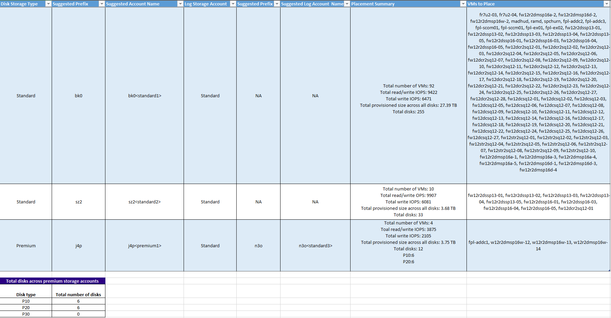

**Disk Storage Type**: Either a standard or premium storage account, which is used to replicate all the corresponding VMs mentioned in the **VMs to Place** column.

**Suggested Prefix**: The suggested three-character prefix that can be used for naming the storage account. You can use your own prefix, but the tool's suggestion follows the [partition naming convention for storage accounts](https://aka.ms/storage-performance-checklist).

**Suggested Account Name**: The storage-account name after you include the suggested prefix. Replace the name within the angle brackets (< and >) with your custom input.

**Log Storage Account**: All the replication logs are stored in a standard storage account. For VMs that replicate to a premium storage account, set up an additional standard storage account for log storage. A single standard log-storage account can be used by multiple premium replication storage accounts. VMs that are replicated to standard storage accounts use the same storage account for logs.

**Suggested Log Account Name**: Your storage log account name after you include the suggested prefix. Replace the name within the angle brackets (< and >) with your custom input.

**Placement Summary**: A summary of the total VMs' load on the storage account at the time of replication and test failover or failover. It includes the total number of VMs mapped to the storage account, total read/write IOPS across all VMs being placed in this storage account, total write (replication) IOPS, total setup size across all disks, and total number of disks.

**Virtual Machines to Place**: A list of all the VMs that should be placed on the given storage account for optimal performance and use.

## Compatible VMs
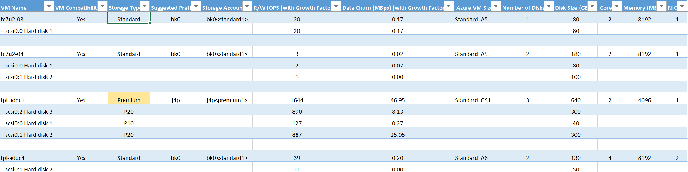

**VM Name**: The VM name or IP address that's used in the VMListFile when a report is generated. This column also lists the disks (VMDKs) that are attached to the VMs. To distinguish vCenter VMs with duplicate names or IP addresses, the names include the ESXi host name. The listed ESXi host is the one where the VM was placed when the tool discovered during the profiling period.

**VM Compatibility**: Values are **Yes** and **Yes**\*. **Yes**\* is for instances in which the VM is a fit for [Azure Premium Storage](https://aka.ms/premium-storage-workload). Here, the profiled high-churn or IOPS disk fits in the P20 or P30 category, but the size of the disk causes it to be mapped down to a P10 or P20. The storage account decides which premium storage disk type to map a disk to, based on its size. For example:
* <128 GB is a P10.
* 128 GB to 512 GB is a P20.
* 512 GB to 1023 GB is a P30.

If the workload characteristics of a disk put it in the P20 or P30 category, but the size maps it down to a lower premium storage disk type, the tool marks that VM as **Yes**\*. The tool also recommends that you either change the source disk size to fit into the recommended premium storage disk type or change the target disk type post-failover.

**Storage Type**: Standard or premium.

**Suggested Prefix**: The three-character storage-account prefix.

**Storage Account**: The name that uses the suggested storage-account prefix.

**R/W IOPS (with Growth Factor)**: The peak workload read/write IOPS on the disk (default is 95th percentile), including the future growth factor (default is 30 percent). Note that the total read/write IOPS of a VM is not always the sum of the VM’s individual disks’ read/write IOPS, because the peak read/write IOPS of the VM is the peak of the sum of its individual disks' read/write IOPS during every minute of the profiling period.

**Data Churn in Mbps (with Growth Factor)**: The peak churn rate on the disk (default is 95th percentile), including the future growth factor (default is 30 percent). Note that the total data churn of the VM is not always the sum of the VM’s individual disks’ data churn, because the peak data churn of the VM is the peak of the sum of its individual disks' churn during every minute of the profiling period.

**Azure VM Size**: The ideal mapped Azure Cloud Services virtual-machine size for this on-premises VM. The mapping is based on the on-premises VM’s memory, number of disks/cores/NICs, and read/write IOPS. The recommendation is always the lowest Azure VM size that matches all of the on-premises VM characteristics.

**Number of Disks**: The total number of virtual machine disks (VMDKs) on the VM.

**Disk size (GB)**: The total setup size of all disks of the VM. The tool also shows the disk size for the individual disks in the VM.

**Cores**: The number of CPU cores on the VM.

**Memory (MB)**: The RAM on the VM.

**NICs**: The number of NICs on the VM.

**Boot Type**: It is boot type of the VM. It can be either BIOS or EFI. Currently Azure Site Recovery supports only BIOS boot type. All the virtual machines of EFI boot type are listed in Incompatible VMs worksheet. 

**OS Type**: The is OS type of the VM. It can be either Windows or Linux or other.

## Incompatible VMs

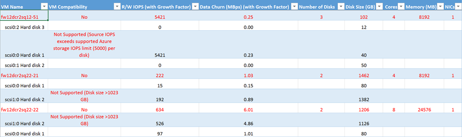

**VM Name**: The VM name or IP address that's used in the VMListFile when a report is generated. This column also lists the VMDKs that are attached to the VMs. To distinguish vCenter VMs with duplicate names or IP addresses, the names include the ESXi host name. The listed ESXi host is the one where the VM was placed when the tool discovered during the profiling period.

**VM Compatibility**: Indicates why the given VM is incompatible for use with Site Recovery. The reasons are described for each incompatible disk of the VM and, based on published [storage limits](https://aka.ms/azure-storage-scalbility-performance), can be any of the following:

* Disk size is >1023 GB. Azure Storage currently does not support disk sizes greater than 1 TB.
* Boot type is EFI. Azure Site Recovery currently supports only BIOS boot type virtual machine.

* Total VM size (replication + TFO) exceeds the supported storage-account size limit (35 TB). This incompatibility usually occurs when a single disk in the VM has a performance characteristic that exceeds the maximum supported Azure or Site Recovery limits for standard storage. Such an instance pushes the VM into the premium storage zone. However, the maximum supported size of a premium storage account is 35 TB, and a single protected VM cannot be protected across multiple storage accounts. Also note that when a test failover is executed on a protected VM, it runs in the same storage account where replication is progressing. In this instance, set up 2x the size of the disk for replication to progress and test failover to succeed in parallel.
* Source IOPS exceeds supported storage IOPS limit of 5000 per disk.
* Source IOPS exceeds supported storage IOPS limit of 80,000 per VM.
* Average data churn exceeds supported Site Recovery data churn limit of 10 MBps for average I/O size for the disk.
* Total data churn across all disks on the VM exceeds the maximum supported Site Recovery data churn limit of 54 MBps per VM.
* Average effective write IOPS exceeds the supported Site Recovery IOPS limit of 840 for disk.
* Calculated snapshot storage exceeds the supported snapshot storage limit of 10 TB.

**R/W IOPS (with Growth Factor)**: The peak workload IOPS on the disk (default is 95th percentile), including the future growth factor (default is 30 percent). Note that the total read/write IOPS of the VM is not always the sum of the VM’s individual disks’ read/write IOPS, because the peak read/write IOPS of the VM is the peak of the sum of its individual disks' read/write IOPS during every minute of the profiling period.

**Data Churn in Mbps (with Growth Factor)**: The peak churn rate on the disk (default 95th percentile) including the future growth factor (default 30 percent). Note that the total data churn of the VM is not always the sum of the VM’s individual disks’ data churn, because the peak data churn of the VM is the peak of the sum of its individual disks' churn during every minute of the profiling period.

**Number of Disks**: The total number of VMDKs on the VM.

**Disk size (GB)**: The total setup size of all disks of the VM. The tool also shows the disk size for the individual disks in the VM.

**Cores**: The number of CPU cores on the VM.

**Memory (MB)**: The amount of RAM on the VM.

**NICs**: The number of NICs on the VM.

**Boot Type**: It is boot type of the VM. It can be either BIOS or EFI. Currently Azure Site Recovery supports only BIOS boot type. All the virtual machines of EFI boot type are listed in Incompatible VMs worksheet. 

**OS Type**: The is OS type of the VM. It can be either Windows or Linux or other.


## Site Recovery limits

**Replication storage target** | **Average source disk I/O size** |**Average source disk data churn** | **Total source disk data churn per day**
---|---|---|---
Standard storage | 8 KB	| 2 MBps | 168 GB per disk
Premium P10 disk | 8 KB	| 2 MBps | 168 GB per disk
Premium P10 disk | 16 KB | 4 MBps |	336 GB per disk
Premium P10 disk | 32 KB or greater | 8 MBps | 672 GB per disk
Premium P20 or P30 disk | 8 KB	| 5 MBps | 421 GB per disk
Premium P20 or P30 disk | 16 KB or greater |10 MBps | 842 GB per disk

These are average numbers assuming a 30 percent I/O overlap. Site Recovery is capable of handling higher throughput based on overlap ratio, larger write sizes, and actual workload I/O behavior. The preceding numbers assume a typical backlog of approximately five minutes. That is, after data is uploaded, it is processed and a recovery point is created within five minutes.

These limits are based on our tests, but they cannot cover all possible application I/O combinations. Actual results can vary based on your application I/O mix. For best results, even after deployment planning, we always recommend that you perform extensive application testing by using a test failover to get the true performance picture.

## Updating the deployment planner
To update the deployment planner, do the following:

1. Download the latest version of the [Azure Site Recovery deployment planner](https://aka.ms/asr-deployment-planner).

2. Copy the .zip folder to a server that you want to run it on.

3. Extract the .zip folder.

4. Do either of the following:
 * If the latest version doesn't contain a profiling fix and profiling is already in progress on your current version of the planner, continue the profiling.
 * If the latest version does contain a profiling fix, we recommended that you stop profiling on your current version and restart the profiling with the new version.

  >[!NOTE]
  >
  >When you start profiling with the new version, pass the same output directory path so that the tool appends profile data on the existing files. A complete set of profiled data will be used to generate the report. If you pass a different output directory, new files are created, and old profiled data is not used to generate the report.
  >
  >Each new deployment planner is a cumulative update of the .zip file. You don't need to copy the newest files to the previous  folder. You can create and use a new folder.


## Version history
### 1.2
Updated: April 7, 2017

Added following fixes:

* Added boot type( BIOS or EFI) check for each virtual machine to determine if the virtual machine is compatible or incompatible for the protection.
* Added OS type information for each virtual machine in the Compatible VMs  and Incompatible VMs worksheets.
* The GetThroughput operation is now supported in the US Government and China Microsoft Azure regions.
* Added few more prerequisite checks for vCenter and ESXi Server.
* Incorrect report was getting generated when locale settings is set to non-English.


### 1.1
Updated: March 9, 2017

Fixed the following issues:

* The tool cannot profile VMs if the vCenter has two or more VMs with the same name or IP address across various ESXi hosts.
* Copy and search is disabled for the Compatible VMs and Incompatible VMs worksheets.

### 1.0
Updated: February 23, 2017

Azure Site Recovery Deployment Planner public preview 1.0 has the following known issues (to be addressed in upcoming updates):

* The tool works only for VMware-to-Azure scenarios, not for Hyper-V-to-Azure deployments. For Hyper-V-to-Azure scenarios, use the [Hyper-V capacity planner tool](./site-recovery-capacity-planning-for-hyper-v-replication.md).
* The GetThroughput operation is not supported in the US Government and China Microsoft Azure regions.
* The tool cannot profile VMs if the vCenter server has two or more VMs with the same name or IP address across various ESXi hosts. In this version, the tool skips profiling for duplicate VM names or IP addresses in the VMListFile. The workaround is to profile the VMs by using an ESXi host instead of the vCenter server. You must run one instance for each ESXi host.
