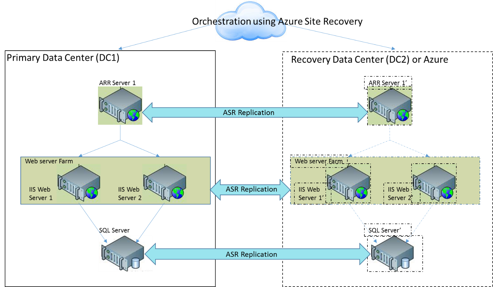

# Replicate a multi-tier Dynamics AX application using Azure Site Recovery

## Overview

Microsoft Dynamics AX is one of the most popular ERP solution among enterprises to standardized process across locations, manage resources and simplifying compliance. Considering the application is business critical to an organization it is very important to be sure that in case of any disaster, application should be up and running in minimum time.

Today, Microsoft Dynamics AX  does not provide any out-of-the-box disaster recovery capabilities. Regardless of the type and scale of a disaster, recovery involves the use of a standby data center that you can recover the complete application to. Standby data centers are required for scenarios where local redundant systems and backups cannot recover from the outage at the primary data center. Microsoft Dynamics AX consists of many server components like Application Object Server, Active Directory (AD), SQL Database Server, SharePoint Server, Reporting Server etc. To manage the disaster recovery of each of these components manually is not only expensive but also error-prone. 

This article explains in detail about how you can create a disaster recovery solution for your Dynamics AX application using [Azure Site Recovery](site-recovery-overview.md). It will also cover planned/unplanned/test failovers using one-click recovery plan, supported configurations and prerequisites.

> [!NOTE]
> Azure Site Recovery based disaster recovery solution is fully tested, certified and recommended by Microsoft Dynamics AX.
 
## Prerequisites

Before you start, make sure you understand the following:

1. [Replicating a virtual machine to Azure](site-recovery-vmware-to-azure.md)
1. How to [design a recovery network](site-recovery-network-design.md)
1. [Doing a test failover to Azure](site-recovery-test-failover-azure.md)
1. [Doing a failover to Azure](site-recovery-failover.md)
1. How to [replicate a domain controller](site-recovery-active-directory.md)
1. How to [replicate SQL Server](site-recovery-sql.md)

## Deployment patterns

Dynamics AX can be deployed on one or more servers using tiered topologies and server roles to implement a design that meets specific goals and objectives. Dynamics AX consists of many server components like Application Object Server, Active Directory (AD), SQL Database Server, SharePoint Server, Reporting Server etc. 
For this article we have choose a simple deployment topology to keep it simple 

* **Deployment pattern 1** - This deployment pattern will show a catchy picture with a link to an [external resource](external-resource.md)

* **Deployment pattern 2**

## Site Recovery support

For the purpose of creating this article VMware virtual machines with Dynamics AX 2012 R3 on Windows Server 2012 R2 Enterprise were used. As site recovery replication is application agnostic, the recommendations provided here are expected to hold on following scenarios as well. 

### Source and target

**Scenario** | **To a secondary site** | **To Azure**
--- | --- | ---
**Hyper-V** | Yes | Yes
**VMware** | Yes | Yes
**Physical server** | Yes | Yes

### Things to keep in mind

If you are using a shared disk based cluster as the middle tier in your application then you will not be able to use site recovery replication to replicate those virtual machines. You can use native replication provided by the application and then use a [recovery plan](site-recovery-recovery-plan.md) to failover all tiers. [This section](site-recovery.md#section-link) below covers it in detail.

## Replicating virtual machines

Follow [this guidance](site-recovery-vmware-to-azure.md) to start replicating the virtual machine to Azure. 

* Once the replication is complete, make sure you go to each virtual machine of the front end and [select same availability set](site-recovery-availability-set.md) for each of the virtual machine.
* If you are using a static IP then specify the IP that you want the virtual machine to take in the **Target IP** field 

## Creating a recovery plan

### Adding virtual machines to failover groups

### Adding scripts to the recovery plan

1. If you are using static IP for the virtual machine and you have hard-coded that in your application, you can use this [script](scipt-location.md) to change the site bindings. 

	

1. You can use this [script](scipt-location.md) to update the DNS with the new IPs of the failed over virtual machines.

1. Use this [script](scipt-location.md) to attach a load balance on the failed over virtual machine

## Doing a test failover

Follow [this guidance](site-recovery-test-failover-to-azure.md) to do a test failover. Make sure you do this and that before you start.

## Doing a failover

Follow [this guidance](site-recovery-failover.md) when you are doing a failover. Make sure you do this and that before you start.

## Next steps
You can [learn more](site-recovery-components.md) about replicating a multi-tier IIS based web application in this white paper. Look at the guidance to [replicate other applications](site-recovery-workload.md) using Site Recovery. 
