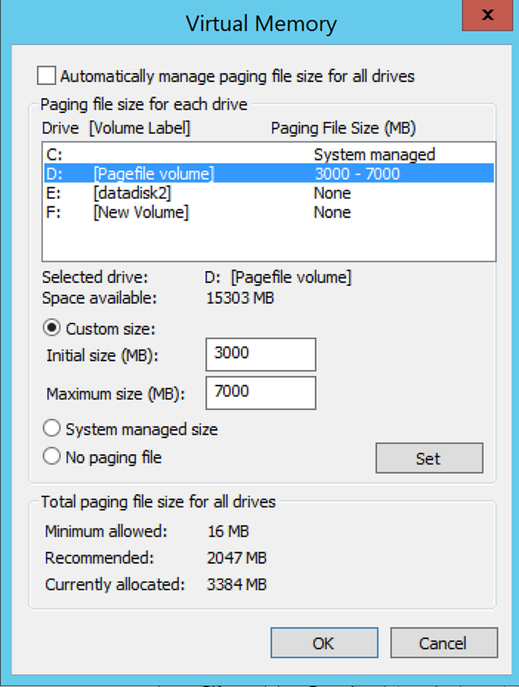
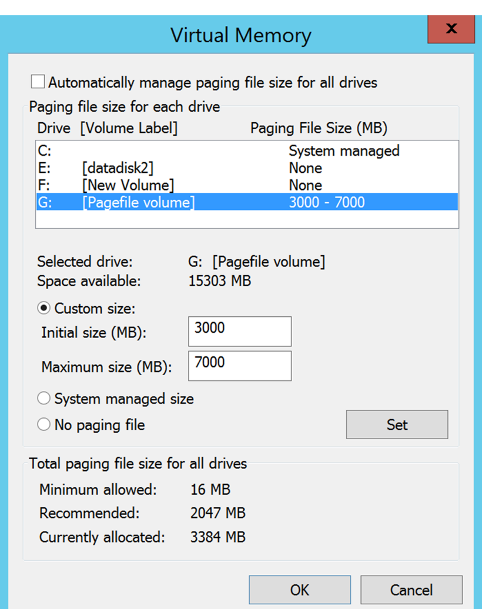
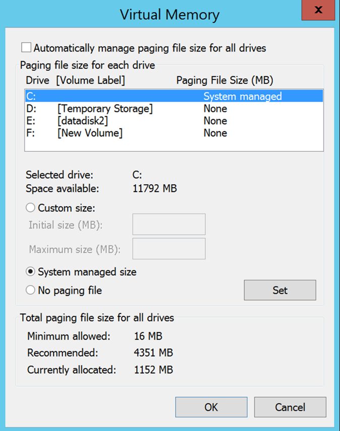

#Exclude disk from replication
This article describes how to exclude disk(s) from replication to optimize the replication bandwidth consumed or to optimize the target-side resources utilized by such disks. The feature is supported for VMware to Azure and Hyper-V to Azure scenarios.

##Prerequisites

By default all the disks on a machine are replicated. To exclude a disk from replication, the Mobility service must be installed manually on the machine before you enable replication if you are replicating from **VMware to Azure**

## Why exclude disks from replication?
Excluding disks from replication is often necessary because:

1. The data churned on the excluded disk is not important or doesn’t need to be replicated.

2. Storage and network resources can be saved by not replicating this churn.

##What are the typical scenarios?
There are some specific examples of data churn that can be easily identified and are great candidates for exclusion – for example any page file writes, Microsoft SQL server tempdb writes, etc. Depending on the workload and the storage subsystem, the page file can register a significant amount churn. However, replicating this data from the primary site to Azure would be resource intensive. Thus the replication of a VM with a single virtual disk having both the OS and the page file can be optimized by:

1. Splitting the single virtual disk into two virtual disks – one with the OS and one with the page file
2. Excluding the page file disk from replication

Similarly, for Microsoft SQL Server with tempdb and system database file on the same disk can be optimized by:

1. Keeping the system database and tempdb on two different disks
2. Excluding the tempdb disk from replication.

##How to Exclude disk from replication?

###VMware to Azure
Follow the [Enable replication](site-recovery-vmware-to-azure.md#enable-replication) workflow to protect a VM from Azure Site Recovery portal. In the 4th step of Enable replication, there is a column - **DISK TO REPLICATE** which can be used to exclude disk from the replication. By default all the disks are selected. Unselect the disk that you want to exclude from replication and complete the steps to enable the replication. 

	
	
>[!NOTE]
> 
> * You can only exclude disks that already have the Mobility service installed. You need to manually install the Mobility service, because the Mobility service is only installed using the push mechanism after replication is enabled.
> * Only basic disks can be excluded from replication. You can't exclude OS or dynamic disks.
> * After replication is enabled, you can't add or remove disks for replication. If you want to add or exclude a disk, you need to disable protection for the machine and then re-enable it.
> * If you exclude a disk that's needed for an application to operate, after failover to Azure, you’ll need to create it manually in Azure so that the replicated application can run. Alternatively, you could integrate Azure automation into a recovery plan to create the disk during failover of the machine.
> * Window VM: Disks you create manually in Azure are not failed back. For example, if you fail over three disks and create two directly in Azure VM, only three disks that were failed over are failed back. You can't include disks created manually itn failback or in reprotect from on-premises to Azure.
> * Linux VM: Disks you create manually in Azure are failed back. For example, if you fail over three disks and create two directly in Azure, all five will be failed back. You can't exclude disks created manually from failback.
> 

###Hyper-V to Azure
Follow the [Enable replication](site-recovery-hyper-v-site-to-azure.md#step-6-enable-replication) workflow to protect a VM from Azure Site Recovery portal. In the 4th step of Enable replication, there is a column - **DISK TO REPLICATE** which can be used to exclude disks from the replication. By default all the disks are selected for the replication. Unselect the disk that you want to exclude from replication and complete the steps to enable the replication. 

	
>[!NOTE]
> 
> * Only basic disks can be excluded from replication. You can't exclude OS disk and it is not recommended to exclude dynamic disks. ASR cannot identify which VHD disk is basic or dynamic disk inside the guest VM.  If all the dependent dynamic volume disks are not excluded, protected dynamic disk comes as a failed disk on failover VM and the data on that disk cannot be accessible.	
> * After replication is enabled, you can't add or remove disks for replication. If you want to add or exclude a disk, you need to disable protection for the VM and then reenable it.
> * If you exclude a disk that's needed for an application to operate, after failover to Azure you’ll need to create it manually in Azure so that the replicated application can run. Alternatively, you could integrate Azure automation into a recovery plan to create the disk during failover of the machine.
> * Disks you create manually in Azure will not be  failed back. For example, if you failover three disks and create two directly in Azure VM, only three disks which were failed over will be failed back from Azure to Hyper-V. You can't include disks created manually in failback or in reverse replication from Hyper-V to Azure.
 

##End to end scenarios of exclude disks
Let's consider two scenarios for better understanding of exclude disk feature.

1. SQL server tempdb disk
2. Pagefile disk

###Excluding the SQL Server tempdb disk
Let's consider a SQL Server virtual machine that has a tempdb that can be excluded.

Name of the VM: SalesDB
Disks on the source VM:

**Disk Name** | **Guest OS disk#** | **Drive letter** | **Data type on the disk**
--- | --- | --- | ---
DB-Disk0-OS | DISK0 | C:\ | OS disk
DB-Disk1| Disk1 | D:\ | SQL system database and User Database1
DB-Disk2 (Excluded the disk from the protection) | Disk2 | E:\ | Temp files
DB-Disk3 (Excluded the disk from the protection) | Disk3 | F:\ | SQL tempdb database (folder path(F:\MSSQL\Data\) --> note down the folder path before failover
DB-Disk4 | Disk4 |G:\ |User Database2

Since data churn on two disks of the VM are temporary in nature, while protecting SalesDB VM, exclude 'Disk2' and 'Disk3' from the replication. Azure Site Recovery will not replicate those disks and on failover those disks will not be present on the failover VM on Azure

Disks on the Azure VM after failover:

**Guest OS disk#** | **Drive letter** | **Data type on the disk**
--- | --- | ---
DISK0 |	C:\ | OS disk
Disk1 |	E:\ | Temporary storage [Azure adds this disk and assigns the first available drive letter]
Disk2 | D:\ | SQL system database and User Database1
Disk3 | G:\ | User Database2

Since Disk2 and Disk3 were excluded from SalesDB VM, E: is the first drive letter from the available list. Azure assigns E: to temporary storage volume. For all the replicated disks, drive letter remains the same.

Disk3 which was SQL tempdb disk (tempdb folder path F:\MSSQL\Data\) and excluded from replication, the disk is not available on the failover VM. As a result, the SQL service is in stopped state and it needs the F:\MSSQL\Data path.

There are two ways in which you can create this path.

1. Add a new disk and assign tempdb folder path or
2. Use existing temporary storage disk for tempdb folder path

####Add a new disk:

1. Note down the SQL tempdb.mdf and tempdb.ldf path before failover.
2. From the Azure portal, add a new disk to the failover VM with the same or more size as that of source SQL tempdb disk (Disk3).
3. Login to the Azure VM. From the disk management (diskmgmt.msc) console, initialize and format the newly added disk.
4. Assign the same drive letter that was used by SQL tempdb disk (F:).
5. Create tempdb folder on F: volume (F:\MSSQL\Data).
6. Start SQL service from service console.

####Use existing temporary storage disk for SQL tempdb folder path:

1. Open a command-line console
2. Run SQL server in recovery mode from command-line console

		Net start MSSQLSERVER /f / T3608

3. Run the following sqlcmd to change the tempdb path to new path

		sqlcmd -A -S SalesDB		**Use your SQL DBname**
		USE master;		
		GO		
		ALTER DATABASE tempdb		
		MODIFY FILE (NAME = tempdev, FILENAME = 'E:\MSSQL\tempdata\tempdb.mdf');
		GO		
		ALTER DATABASE tempdb		
		MODIFY FILE (NAME = templog, FILENAME = 'E:\MSSQL\tempdata\templog.ldf');		
		GO

4. Stop Microsoft SQL server service.

		Net stop MSSQLSERVER
5. Start Microsoft SQL server service.

		Net start MSSQLSERVER

Refer to the following Azure guideline for temporary storage disk

* Using SSDs in Azure VMs to store SQL Server TempDB and Buffer Pool Extensions
* Performance best practices for SQL Server in Azure Virtual Machines

###Failback (from Azure to on-premises)
Now let's understand what all disks will be replicated when you do failover from Azure to your on-premises VMware or Hyper-V host. Disks that you create manually in Azure will not be replicated. For example, if you fail over three disks and create two directly in Azure VM, only three disks which were failed over will be failed back. You can't include disks created manually in failback or in re-protect from on-premises to Azure. It also does not replicate temporary storage disk to on-premises.

####Failback to Original location recovery (OLR)

In the above example, Azure VM disk configuration:

**Guest OS disk#** | **Drive letter** | **Data type on the disk** 
--- | --- | --- 
DISK0 | C:\ | OS disk
Disk1 |	E:\ | Temporary storage [Azure adds this disk and assigns the first available drive letter]
Disk2 |	D:\ | SQL system database and User Database1
Disk3 |	G:\ | User Database2

####VMware to Azure
When failback is done to the original location, failback VM disk configuration does not have excluded disk. That means the disks which were excluded from VMware to Azure, will not be available on the failback VM. 

After planned failover from Azure to on-premises VMware, disks on the VMWare VM (Original Location):

**Guest OS disk#** | **Drive letter** | **Data type on the disk** 
--- | --- | --- 
DISK0 | C:\ | OS disk
Disk1 |	D:\ | SQL system database and User Database1
Disk2 |	G:\ | User Database2

####Hyper-V to Azure
When failback is done to the original location, failback VM disk configuration remains the same as that of original VM disk configuration for Hyper-V. That means the disks which were excluded from Hyper-V site to Azure, will be available on the failback VM.

After planned failover from Azure to on-premises Hyper-V, disks on the Hyper-V VM (Original Location):

**Disk Name** | **Guest OS disk#** | **Drive letter** | **Data type on the disk**
--- | --- | --- | ---
DB-Disk0-OS | DISK0 |	C:\ | OS disk
DB-Disk1 | Disk1 | D:\ | SQL system database and User Database1
DB-Disk2 (Excluded disk) | Disk2 | E:\ | Temp files
DB-Disk3 (Excluded disk) | Disk3 | F:\ | SQL tempdb database (folder path(F:\MSSQL\Data\)
DB-Disk4 | Disk4 | G:\ | User Database2

####Exclude Paging file disk

Let's consider a virtual machine that has a pagefile disk that can be excluded.
There are two cases:

####Case 1: Pagefile is configured on the D: drive
Disk configuration:

**Disk name** | **Guest OS disk#** | **Drive letter** | **Data type on the disk**
--- | --- | --- | ---
DB-Disk0-OS | DISK0 | C:\ | OS disk
DB-Disk1 (Excluded the disk from the protection) | Disk1 | D:\ | pagefile.sys
DB-Disk2 | Disk2 | E:\ | User data 1
DB-Disk3 | Disk3 | F:\ | User data 2

Pagefile settings on the Source VM:

	

After failover the VM from VMware to Azure or Hyper-V to Azure, disks on Azure VM:
**Disk name** | **Guest OS disk#** | **Drive letter** | **Data type on the disk**
--- | --- | --- | ---
DB-Disk0-OS | DISK0 | C:\ | OS disk
DB-Disk1 | Disk1 | D:\ | Temporary storage –> pagefile.sys
DB-Disk2 | Disk2 | E:\ | User data 1
DB-Disk3 | Disk3 | F:\ | User data 2

Since Disk1 (D:) was excluded, D: is the first drive letter from the available list, Azure assigns D: letter to temporary storage volume.  Since D: is available on the Azure VM, pagefile setting of the VM remains the same.

Pagefile settings on Azure VM:

####Case 2: Pagefile file is configured on any other drive(other than D: drive)

Source VM disk configuration:

**Disk name** | **Guest OS disk#** | **Drive letter** | **Data type on the disk**
--- | --- | --- | ---
DB-Disk0-OS | DISK0 | C:\ | OS disk
DB-Disk1 (Excluded the disk from the protection) | Disk1 | G:\ | pagefile.sys
DB-Disk2 | Disk2 | E:\ | User data 1
DB-Disk3 | Disk3 | F:\ | User data 2

Pagefile settings on the On-premise VM:

After failover the VM from VMware/Hyper-V to Azure, disks on Azure VM:

**Disk name**| **Guest OS disk#**| **Drive letter** | **Data type on the disk**
--- | --- | --- | ---
DB-Disk0-OS | DISK0  |C:\ |OS disk
DB-Disk1 | Disk1 | D:\ | Temporary storage –> pagefile.sys
DB-Disk2 | Disk2 | E:\ | User data 1
DB-Disk3 | Disk3 | F:\ | User data 2

Since D: is the first drive letter available from the list, Azure assigns D: to temporary storage volume. For all the replicated disks, drive letter remains the same. Since G: disk is not available system will use C: drive for pagefile.

Pagefile settings on Azure VM:

## Next steps
After your deployment is set up and running, [learn more](site-recovery-failover.md) about different types of failover.
