<properties 
   pageTitle="Fail back VMware virtual machines and physical servers from Azure to VMware (legacy) | Microsoft Azure" 
   description="This article describes how to fail back a VMware virtual machine that's been replicated to Azure with Azure Site Recovery." 
   services="site-recovery" 
   documentationCenter="" 
   authors="ruturaj" 
   manager="mkjain" 
   editor=""/>

<tags
   ms.service="site-recovery"
   ms.devlang="na"
   ms.tgt_pltfrm="na"
   ms.topic="article"
   ms.workload="storage-backup-recovery" 
   ms.date="07/08/2016"
   ms.author="ruturajd@microsoft.com"/>

# Fail back VMware virtual machines and physical servers from Azure to VMware with Azure Site Recovery (legacy)

> [AZURE.SELECTOR]
- [Azure Portal](site-recovery-failback-azure-to-vmware.md)
- [Azure Classic Portal](site-recovery-failback-azure-to-vmware-classic.md)
- [Azure Classic Portal (Legacy)](site-recovery-failback-azure-to-vmware-classic-legacy.md)

The Azure Site Recovery service contributes to your business continuity and disaster recovery (BCDR) strategy by orchestrating replication, failover and recovery of virtual machines and physical servers. Machines can be replicated to Azure, or to a secondary on-premises data center. For a quick overview read [What is Azure Site Recovery?](site-recovery-overview.md)

## Overview

This article describes how to fail back VMware virtual machines and Windows/Linux physical servers from Azure to your on-premises site after you've replicated from your on-premises site to Azure.

>[AZURE.NOTE] This article describes a legacy scenario. You should only use the instructions in this article if you replicated to Azure using [these legacy instructions](site-recovery-vmware-to-azure-classic-legacy.md). If you set up replication using the [enhanced deployment](site-recovery-vmware-to-azure-classic-legacy.md) then follow the instructions in [this article](site-recovery-failback-azure-to-vmware-classic.md) to fail back. 

## Architecture

This diagram represents the failover and failback scenario. The blue lines are the connections used during failover. The red lines are the connections used during failback. The lines with arrows go over the internet.

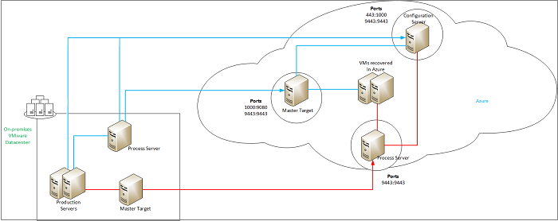

## Before you start 

- You should have failed over your VMware VMs or physical servers and they should be running in Azure.
- You should note that you can only fail back VMware virtual machines and Windows/Linux physical servers from Azure to VMware virtual machines in the on-premises primary site.  If you're failing back a physical machine, failover to Azure will convert it to an Azure VM, and failback to VMware will convert it to a VMware VM.

Here's how you set up failback:

1. **Set up failback components**: You'll need to set up a vContinuum server on-premises, and point it to the configuration server VM in Azure. You'll also set up a process server as an Azure VM to send data back to the on-premises master target server. You register the process server with the configuration server that  handled the failover. You install an on-premises master target server. If you need a Windows master target server it's set up automatically when you install vContinuum. If you need Linux you'll need to set it up manually on a separate server.
2. **Enable protection and failback**: After you've set up the components, in vContinuum you'll need to enable protection for failed over Azure VMs. You'll run a readiness check on the VMs and run a failover from Azure to your on-premises site. After failback finishes you reprotect on-premises machines so that they start replicating to Azure.

## Step 1: Install vContinuum on-premises

You'll need to install a vContinuum server on premises and point it to the configuration server.

1.  [Download vContinuum](http://go.microsoft.com/fwlink/?linkid=526305). 
2.  Then download the [vContinuum update](http://go.microsoft.com/fwlink/?LinkID=533813) version.
3. Install the latest version of vContinuum. On the **Welcome** page click **Next**.
	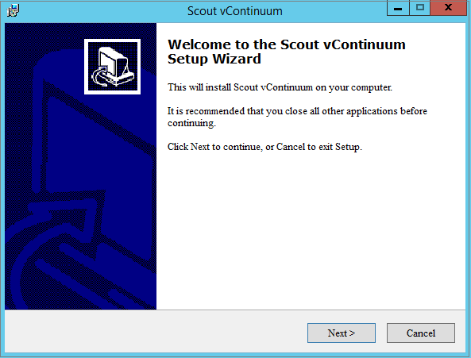
4.  On the first page of the wizard specify the CX server IP address and the CX server port. Select **Use HTTPS**.

	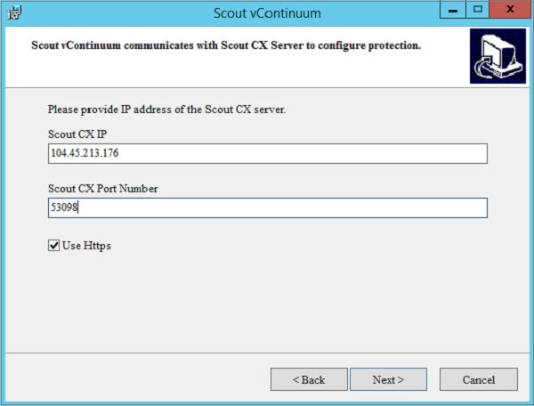

5.  Find the configuration server IP address on the **Dashboard** tab of the configuration server VM in Azure.
	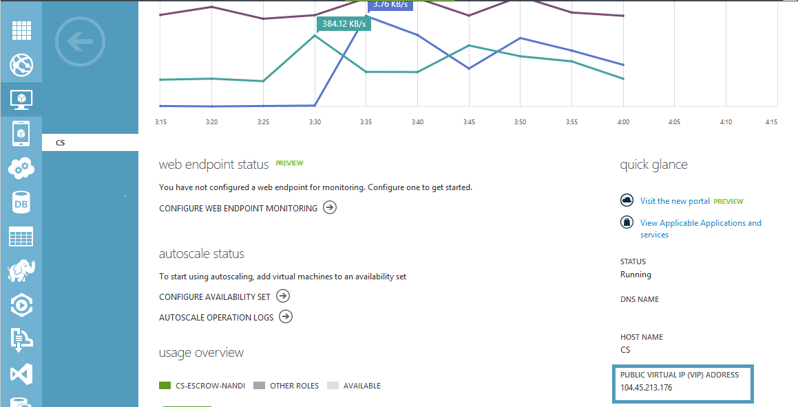

6.  Find the configuration server HTTPS public port on the **Endpoints** tab of the configuration server VM in Azure.

	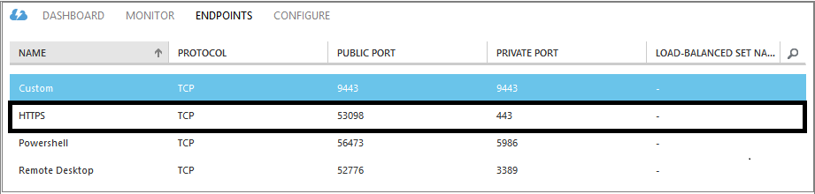

7. On the **CS Passphrase Details** page specify the passphrase that you noted down when you registered the configuration server. If you don't remember it check it in **C:\\Program Files (x86)\\InMage Systems\\private\\connection.passphrase** on the configuration server VM.

	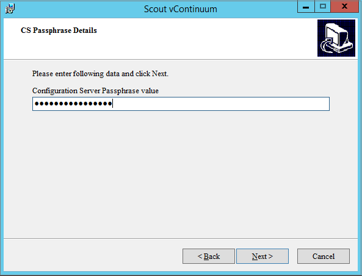

8.  In the **Select Destination Location** page specify where you want to install the vContinuum server and click **Install**.

	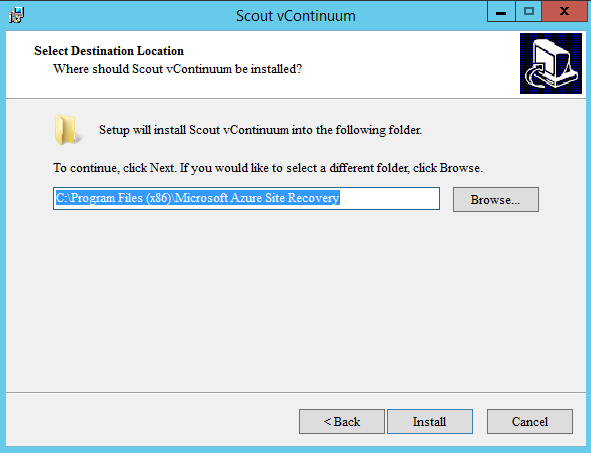

9. After installation completes, you can launch vContinuum.
    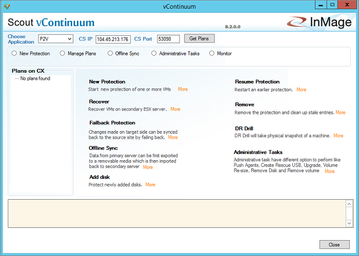

## Step 2: Install a process server in Azure 

You need to install a process server in Azure so that the VMs in Azure can send the data back to an on-premises master target server. 

1.  On the **Configuration Servers** page in Azure, select to add a new process server.

	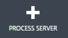

2.  Specify a process server name, and a name and password to connect to the virtual machine as an administrator. Select the configuration server to which you want to register the process server. This should be the same server you're using to protect and fail over your virtual machines.
3.  Specify the Azure network in which the process server should be deployed. It should be the same network as the configuration server. Specify a unique IP address selected subnet and begin deployment.

	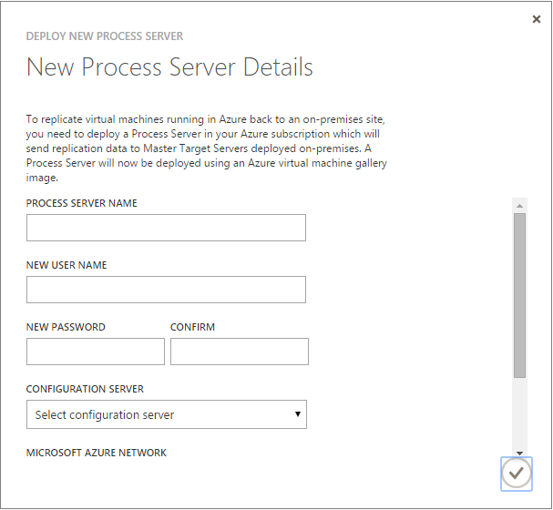

4.  A job is triggered to deploy the process server.

	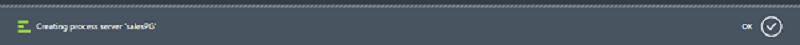

5.  After the process server is deployed in Azure you can log into the server
using the credentials you specified. Register the process server in the same way you registered the on-premises process server. 

	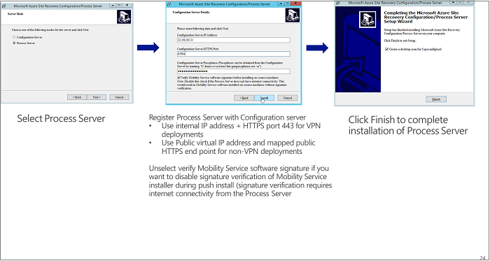

>[AZURE.NOTE] The servers registered during failback won't be visible under VM properties in Site Recovery. They are only visible under the **Servers** tab of the configuration server to which they're registered. It can take about 10-15 minutes until they the process server appears on the tab.

## Step 3: Install a master target server on-premises

Depending on your source virtual machines operating system, you need to install a Linux or a Windows master target server on-premises.

### Deploy a Windows master target server

A Windows master target is already bundled with vContinuum setup. When you install
the vContinuum, a master server is also deployed on the same machine and
registered to the configuration server.

1.  To begin deployment, create an empty machine on-premises on the ESX host onto which you want to recover the VMs from Azure.

2.  Ensure that there are at least two disks attached to the VM – one is used for the operating system and the other is used for the retention drive.

3.  Install the operating system.

4.  Install the vContinuum on the server. This also completes installation of the master target server.

### Deploy a Linux master target server

1.  To begin deployment, create an empty machine on-premises on the ESX host onto which you want to recover the VMs from Azure.

2.  Ensure that there are at least two disks attached to the VM – one is used for the operating system and the other is used for the retention drive.

3.  Install the Linux operating system. The Linux master target system should not use LVM for root or retention storage spaces. A Linux master target server is configured to avoid LVM partitions/disks discovery by default.
4.  Partitions that you can create:

	

5.  Carry out the below post installation steps before beginning the master target installation.

#### Post OS Installation Steps

To get the SCSI ID’s for each of SCSI hard disk in a Linux virtual machine,
enable the parameter “disk.EnableUUID = TRUE” as follows:

1. Shut down your virtual machine.
2. Right-click the VM entry in the left-hand panel > **Edit Settings**.
3. Click the **Options** tab. Select **Advanced\>General item** > **Configuration Parameters**. The **Configuration Parameters** option is only available when the machine is shut down.

	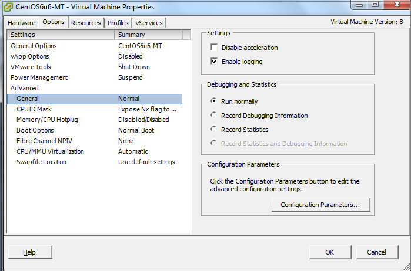

4. Checks whether a row with **disk.EnableUUID** exists. If it does and is set to **False** then set it to **True** (not case sensitive). If exists and is set to true, click **Cancel** and test the SCSI command inside the guest operating system after it's booted up. If doesn't exist click **Add Row**.
5. Add disk.EnableUUID in the **Name** column. Set its value as TRUE. Don't add the above values along with double-quotes.

	

#### Download and install the additional packages

NOTE: Make sure the system has internet connectivity before downloading and installing the additional packages.

\# yum install -y xfsprogs perl lsscsi rsync wget kexec-tools

This command downloads these 15 packages from CentOS 6.6
repository and installs them:

bc-1.06.95-1.el6.x86\_64.rpm

busybox-1.15.1-20.el6.x86\_64.rpm

elfutils-libs-0.158-3.2.el6.x86\_64.rpm

kexec-tools-2.0.0-280.el6.x86\_64.rpm

lsscsi-0.23-2.el6.x86\_64.rpm

lzo-2.03-3.1.el6\_5.1.x86\_64.rpm

perl-5.10.1-136.el6\_6.1.x86\_64.rpm

perl-Module-Pluggable-3.90-136.el6\_6.1.x86\_64.rpm

perl-Pod-Escapes-1.04-136.el6\_6.1.x86\_64.rpm
	
perl-Pod-Simple-3.13-136.el6\_6.1.x86\_64.rpm

perl-libs-5.10.1-136.el6\_6.1.x86\_64.rpm

perl-version-0.77-136.el6\_6.1.x86\_64.rpm

rsync-3.0.6-12.el6.x86\_64.rpm

snappy-1.1.0-1.el6.x86\_64.rpm

wget-1.12-5.el6\_6.1.x86\_64.rpm

NOTE: If the source machine uses Reiser or XFS filesystem for the root or boot
device, then following packages should be downloaded and installed on
Linux master target prior to protection.

\# cd /usr/local

\# wget
<http://elrepo.org/linux/elrepo/el6/x86_64/RPMS/kmod-reiserfs-0.0-1.el6.elrepo.x86_64.rpm>

\# wget
<http://elrepo.org/linux/elrepo/el6/x86_64/RPMS/reiserfs-utils-3.6.21-1.el6.elrepo.x86_64.rpm>

\# rpm -ivh kmod-reiserfs-0.0-1.el6.elrepo.x86\_64.rpm
reiserfs-utils-3.6.21-1.el6.elrepo.x86\_64.rpm

\# wget
<http://mirror.centos.org/centos/6.6/os/x86_64/Packages/xfsprogs-3.1.1-16.el6.x86_64.rpm>

\# rpm -ivh xfsprogs-3.1.1-16.el6.x86\_64.rpm

#### Apply custom configuration changes

Before applying these changes make sure you've completed the previous section, then follow these steps:

1. Copy the RHEL 6-64 Unified Agent binary to the newly created OS.

2. Run this command to untar the binary: **tar -zxvf \<File name\>**

3. Run this command to give permissions: \# **chmod 755 ./ApplyCustomChanges.sh**

4. Run the script: **\# ./ApplyCustomChanges.sh**. Run the script only once on the server. Restart the server after the script runs.

### Install the Linux server

1. [Download](http://go.microsoft.com/fwlink/?LinkID=529757) the installation file.
2. Copy the file to the Linux Master Target virtual machine using an sftp client utility of your choice. Alternately you can log onto the Linux master target virtual
machine and use wget to download the installation package from the
provided link
3. Log onto the Linux master target server virtual machine using an ssh
client of your choice
4. If you're connected to the Azure network on which you deployed your
Linux master target server through a VPN connection then use the
internal IP address for the server that you can find in the
virtual machine **Dashboard** tab, and port 22 to connect to the Linux master
target Server using Secure Shell.
5. If you're connecting to the Linux master target server over a public
internet connection use the Linux master target server’s public virtual
IP address (from the virtual machines **Dashboard** tab) and the public
endpoint created for ssh to login to the Linux servder.
6. Extract the files from the gzipped Linux master target Server installer
tar archive by running: *“tar –xvzf Microsoft-ASR\_UA\_8.2.0.0\_RHEL6-64\”* from the directory that contains the installer file.

	

7. If you extracted the installer files to a different directory change
to the directory to which the contents of the tar archive were
extracted. From this directory path run “sudo ./install.sh”.

	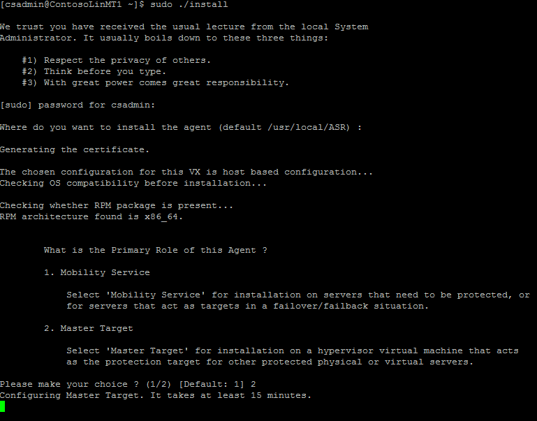

8. When prompted to choose a primary role select **2 (Master Target)**. Leave the other interactive install options at their default values.
9. Wait for installation to continue and the Host Config
Interface to appear. The Host Configuration utility for the Linux master
sarget Server is a command line utility. Don’t resize the ssh client
utility window. Use the arrow keys to select the **Global** option and press
ENTER on your keyboard.

	

	

10. In the field **IP** enter the Internal IP address of the configuration server (you can find it in the **Dashboard** tab of the configuration server VM) and press ENTER. In **Port** enter **22** and press ENTER. 
11.  Leave **Use HTTPS** as **Yes**, and press ENTER.
12.  Enter the Passphrase that was generated on the configuration server. If you're using a PUTTY client from a Windows machine to ssh to the Linux virtual machine you can use Shift+Insert to paste the contents of the clipboard. Copy the Passphrase to the local clipboard using Ctrl-C and use Shift+Insert to paste it. Press ENTER.
13.  Use the right arrow key to navigate to quit and press ENTER. Wait for installation to complete.

	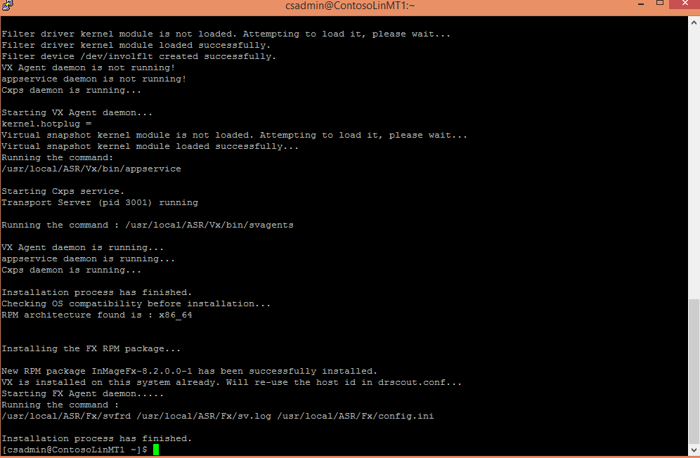

If for some reason you failed to register your Linux master target
server to the configuration server you can do so again by running the
host configuration utility from /usr/local/ASR/Vx/bin/hostconfigcli (you'll
first need to set access permissions to this directory by running chmod as a super user).

#### Validate master target registration

You can validate that the master target server was registered successfully
to the configuration server in Azure Site Recovery vault > **Configuration Server** > **Server Details**.

>[AZURE.NOTE] After registering the master target server, if you receive configuration errors that the virtual machine might have been deleted from Azure or that endpoints are not properly configured, this is because although the master target configuration is detected by the Azure dndpoints when the master target is deployed in Azure, this isn't true for an on-premises master target server on-premises. This won't affect failback and you can ignore these errors. 

## Step 4: Protect the virtual machines to the on-premises site

You need to protect VMs to the on-premises site before you fail back.

### Before you begin

When a VM is failed over to Azure, it adds an extra temp drive for page
file. This is an extra drive that is typically not required by your
failed over VM since it might already have a drive dedicated for the
page file. Before you begin reverse protection of the virtual machines, you need to
ensure that this drive is taken offline so that it does not get
protected. Do this as follows:

1.  Open Computer Management and select Storage Management so that it lists the disks online and attached to the machine.
2.  Select the temporary disk attached to the machine and choose to bring it offline. 

### Protect the VMs

1. In the Azure portal, check the states of the virtual machine to ensure that they're failed over.

	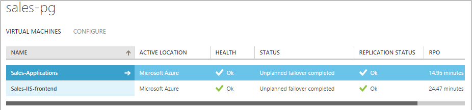

2. Launch vContinuum on your machine.

	

3. Click **New Protection** and select the operation system type, the 

4.  In the new window that open select the **OS type** > **Get Details** for the VMs you want to fail back. In **Primary server details**, identify and select the virtual machines that you want to protect. VMs are listed under the vCenter host name that they were on before failover.
5.  When you select a virtual machine to protect (and it has already failed over to Azure) a pop-up window provides two entries for the virtual machine. This is because the configuration server detects two instances of the virtual machines registered to it. You need to remove the entry for the on-premises VM so that you can protect the correct VM. To identify the correct Azure VM entry here, you can log into the Azure VM and go to C:\Program Files (x86)\Microsoft Azure Site Recovery\Application Data\etc. In the file drscout.conf , identify the host ID. In the vContinuum dialog, keep the entry for which you found the host ID on  the VM. Delete all other entries. To select the correct VM you can refer to its IP address. The IP address range on-premises will be the on-premises VM.

	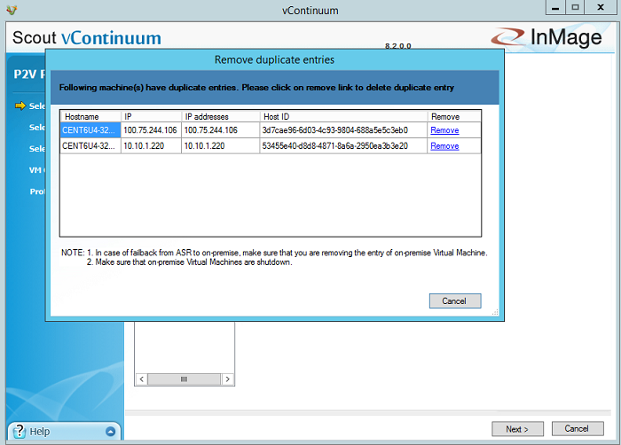

	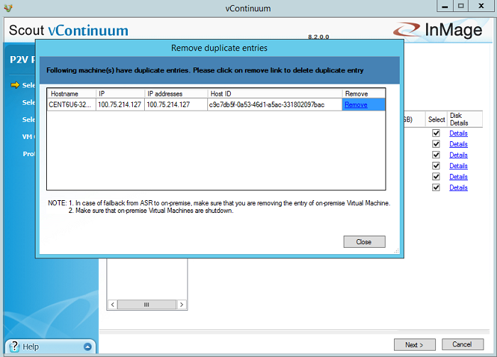

6. On the vCenter server stop the virtual machine. You can also delete the VMs on-premises.
7. Then specify the on-premises MT server to which you want to protect the VMs. To do this, connect to the vCenter server to which you want to fail back.

	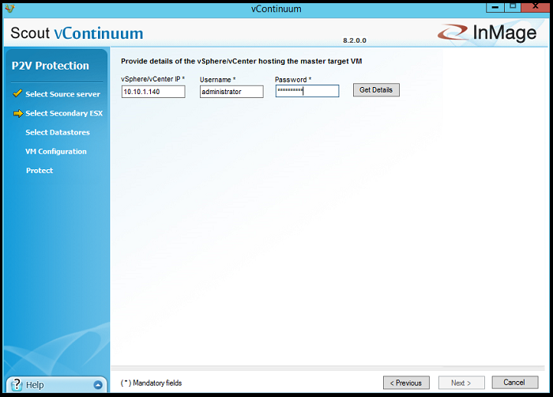

8. Select the master target server based on the host to which you want to recover the VM.

	

9. Provide the replication option for each of the virtual machines. To do this you need to select the recovery side datastore to which the VMs will be recovered. The table summarizes the different options you need to provide for each VM.

	

	**Option** | **Option recommended value**
	---|---
	Process server IP address | Select the process server deployed in Azure
	Retention size in MB| 
	Retention value | 1
	Days/Hours | Days
	Consistency interval | 1
	Select target datastore | The datastore available on the recovery site. The data store should have enough space, and be available to the ESX host on which you want to restore the virtual machine.

10. Configure the properties that the virtual machine will acquire after failover to on-premises site. The properties are summarized in the following table.

	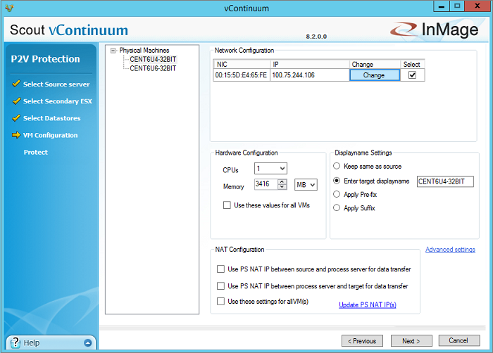

	**Property** | **Details**
	---|---
	Network configuration| For each network adapter detected, select it and click **Change** to configure the failback IP address for the virtual machine. 
	Hardware Configuration| Specify the CPU and the memory for the VM. Settings can be applied to all the VMs you are trying to protect. To identify the correct values for the CPU and memory, you can refer to the IAAS VMs role size and see the number of cores and memory assigned.
	Display name | After failback to on-premises, you can rename the virtual machines as they'll appear in the vCenter inventory. The default name is the virtual machine computer host name. To identify the VM name, you can refer to the VM list in the Protection group.
	NAT Configuration | Discussed in detail below

	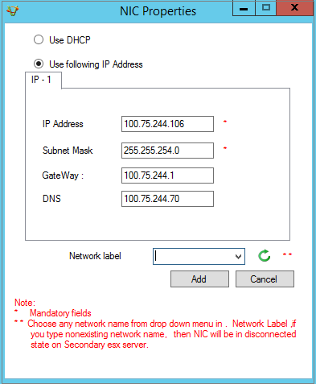

#### Configure NAT settings

1. To enable protection of the virtual machines, two communication channels need to be established. The first channel is between the virtual machine and the process server. This channel collects the data from the VM and sends it to the process server which then sends the data to the master target server. If the process server and the virtual machine to be protected are on the same Azure virtual network then you don't need to use NAT settings. Otherwise specify NAT settings. View the public IP address of the process server in Azure. 

	

2. The second channel is between the process server and the master target server. The option to use NAT or not depends on whether you are using a VPN based connection or communicating over the internet. Don't select NAt if you're using VPN, but only if you're using an internet connection.

	

	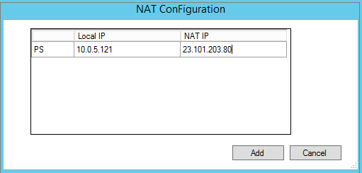

3. If you haven't deleted the on-premises virtual machines as specified and if the datastore you are failing back to still contains the old VMDK’s then you will need to ensure that the failback VM gets created in a new place. To do this select the **Advanced** settings and specify an alternate Folder to restore to in **Folder Name Settings**. Leave the other options with their default settings. Apply the folder name settings to all the servers.

	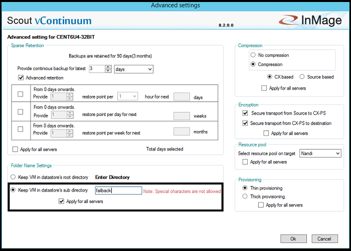

4. Run a Readiness Check to ensure that the virtual machines are ready to be protected back to on-premises. 

	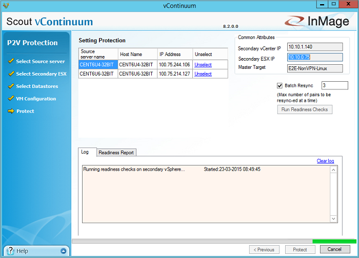

5. Wait for it to complete. If it's successfully on all VMs you can specify a name for the protection plan. Then click **Protect** to begin.

	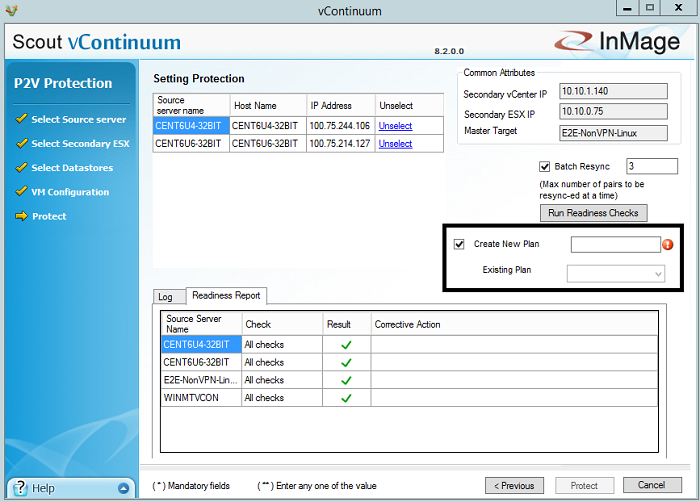

6. You can monitor progress in vContinuum.

	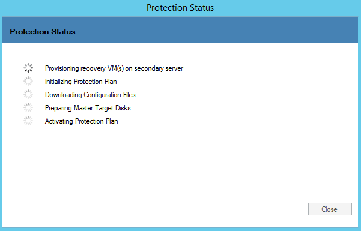

7. After the step **Activating Protection Plan** finishes you can monitor VM protection in the Site Recovery portal.

	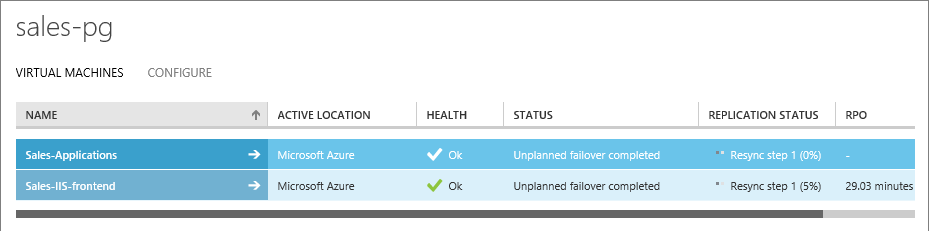

8. You can see the exact status clicking on the VM and monitoring its progress.

	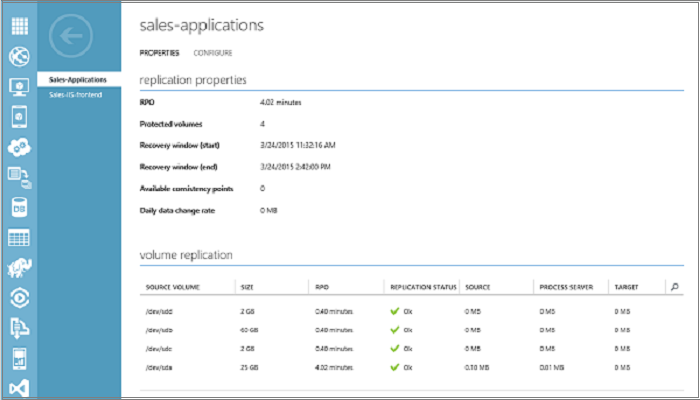

## Prepare the failback plan

You can prepare a failback plan using vContinuum so that the application
can be failed back to the on-premises site at any time. These recovery plans are very similar to the recovery plans in Site Recovery.

1.  Launch vContinuum and select **Manage plans** > **Recover.** You can see of list of all the plans that have been used to fail over VMs. You can use the same plans to recover.

	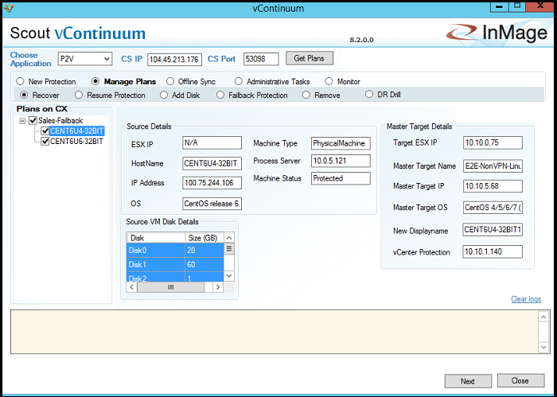

2. Select the protection plan and all of the VMs you want to recover in it. When you select each VM you can see more details including the target ESX server and the source VM disk. Click **Next** to begin the Recover Wizard and select the VMs you want to recover.

	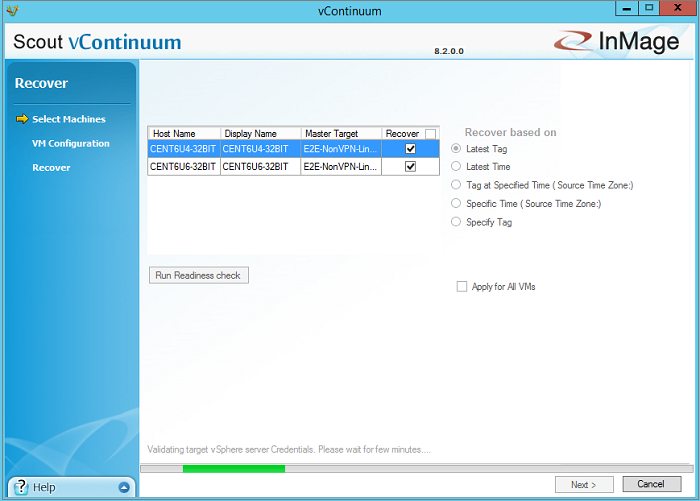

3. You can recover based on multiple options but we recommend you use **Latest Tag** and select **Apply for All VMs** to ensure that the latest data from the virtual machine will be used.
4. Run the **Readiness Check.** This will check if the right parameters are configured to enable VM recovery. Click **Next** if all the checks are successful. If not check the log and resolve the errors.

	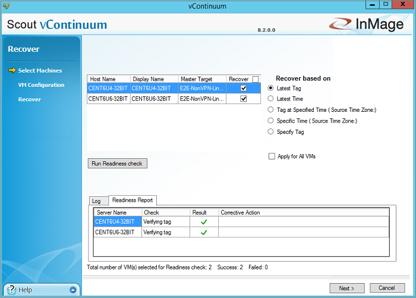

8.  In **VM Configuration** ensure that the recovery settings are correctly set. You can change the VM settings if you need to.

	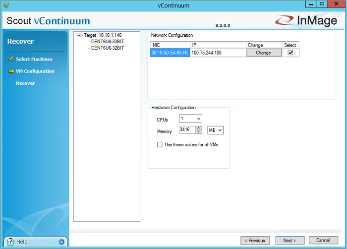

9. Review the list of virtual machines that will be recovered and specify a recovery order. Note that VMs are listed using the computer host name. It
might be difficult to map the computer host name to the virtual machine.
To map the names, go to the virtual machines **Dashboard** in Azure and check the VM host name.

	

10. Specify a plan name and select **Recover later**. We recommend to recover later since the initial protection might not be complete. 
11. Click on **Recover** to save the plan or trigger the recovery if you've selected to recover now and not later. You can check the recovery status to see if the plan's been saved.

	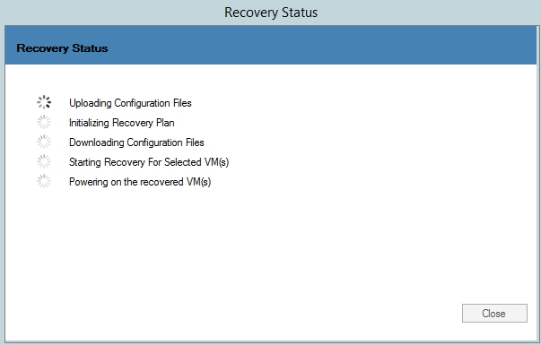

	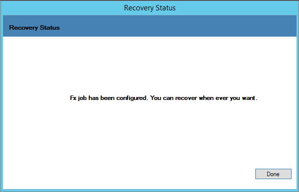

## Recover virtual machines

After the plan's been created, you can recover the virtual machines. Before you do check that the virtual machines have completed synchronization. If replication status shows OK then the protection is completed and the RPO threshold has been met. You can verify health in the VM properties.

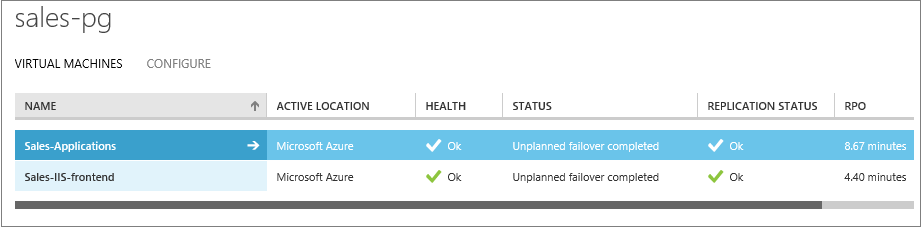

Turn off the Azure virtual machines before you initiate the recovery. This ensures there's no split brain and that users will only access one copy of the application. 

1.  Start the saved plan. In vContinuum select **Monitor** the plans. This lists all the plans that have been run.

	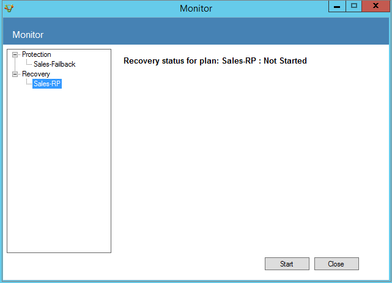

2.  Select the plan in **Recovery** and click **Start**. You can monitor recovery. After VMs have been turned on you can connect to them in vCenter.

	

## Protect to Azure again after failback

After failback has been completed you'll probably want to protect the virtual
machines again. Do this as follows:

1.  Check that the virtual machines on-premises are working and that applications are reachable.
2.  In the Azure Site Recovery portal, select the virtual machines and delete them. Select to disable the protection of the virtual machines. This ensures that the VMs are no more protected.
3.  In Azure delete the failed over Azure virtual machines
4.  Delete the old virtual machine on vSpehere. These are the VMs that you previously failed over to Azure.
5.  In the Site Recovery portal protect the VMs that recently failed over. After they're protected  you can add them to a recovery plan.
 
## Next steps

- [Read about](site-recovery-vmware-to-azure-classic.md) replicating VMware virtual machines and physical servers to Azure using the enhanced deployment.

 
