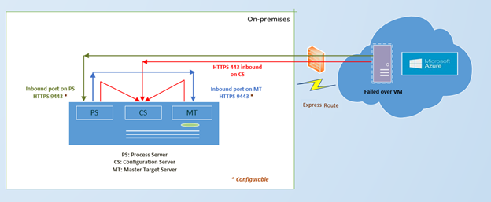
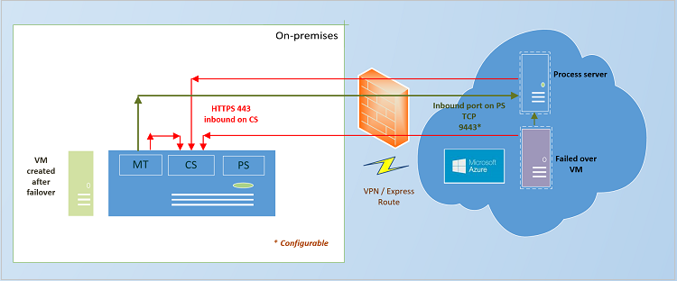
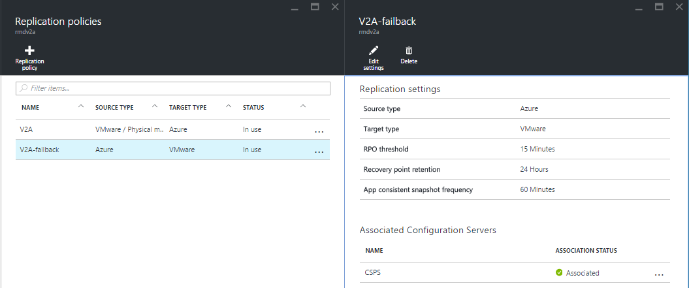
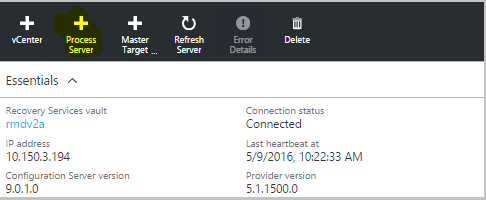
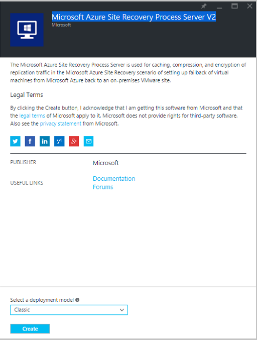
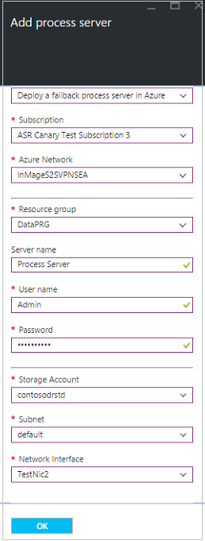
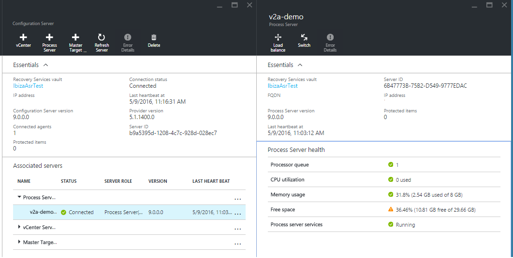
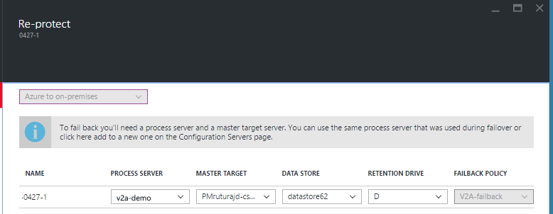

<properties 
   pageTitle="Fail back VMware virtual machines and physical servers to the on-premises site | Microsoft Azure"
   description="Learn about failing back to the on-premises site after failover of VMware VMs and physical servers to Azure." 
   services="site-recovery" 
   documentationCenter="" 
   authors="ruturaj" 
   manager="mkjain" 
   editor=""/>

<tags
   ms.service="site-recovery"
   ms.devlang="na"
   ms.tgt_pltfrm="na"
   ms.topic="article"
   ms.workload="required" 
   ms.date="07/08/2016"
   ms.author="ruturajd"/>

# Fail back VMware virtual machines and physical servers to the on-premises site

> [AZURE.SELECTOR]
- [Azure Portal](site-recovery-failback-azure-to-vmware.md)
- [Azure Classic Portal](site-recovery-failback-azure-to-vmware-classic.md)
- [Azure Classic Portal (Legacy)](site-recovery-failback-azure-to-vmware-classic-legacy.md)

This articles describes how to fail back Azure virtual machines from Azure to the on-premises site. Follow the instructions in this article when you're ready to fail back your VMware virtual machines or Windows/Linux physical servers after they've failed over from the on-premises site to Azure using this [tutorial](site-recovery-vmware-to-azure-classic.md).

## Overview

This diagram shows the failback architecture for this scenario.

Use this architecture when the process server is on-premises and you are using an ExpressRoute.

Use this architecture when the process server is on Azure and you have either a VPN or an ExpressRoute connection.

To see the complete list of ports and the failback architecture diagram refer to the image below

Here’s how failback works:

- After you’ve failed over to Azure, you fail back to your on-premises site in a few stages:
	- **Stage 1**: You reprotect the Azure VMs so that they start replicating back to VMware VMs running in your on-premises site. 
	- **Stage 2**: After your Azure VMs are replicating to your on-premises site, you run a fail over to fail back from Azure.
	- **Stage 3**: After your data has failed back, you reprotect the on-premises VMs that you failed back to, so that they start replicating to Azure.

### Failback to the original or alternate location

If you failed over a VMware VM you can fail back to the same source VM if it still exists on-premises. In this scenario only the delta changes will be failed back. Note that:

- If you failed over physical servers then failback is always to a new VMware VM.
	- Before failing back a Physical machine note that
	- Physical machine protected will come back as a Virtual machine when failed over back from Azure to VMware
	- Ensure that you discover at least one Master Target sever along with the necessary ESX/ESXi hosts to which you need to failback.
- If you fail back to the original VM the following is required:
	- If the VM is managed by a vCenter server then the Master Target's ESX host should have access to the VMs datastore.
	- If the VM is on an ESX host but isn’t managed by vCenter then the hard disk of the VM must be in a datastore accessible by the MT's host.
	- If your VM is on an ESX host and doesn't use vCenter then you should complete discovery of the ESX host of the MT before you reprotect. This applies if you're failing back physical servers too.
	- Another option (if the on-premises VM exists) is to delete it before you do a failback. Then failback will then create a new VM on the same host as the master target ESX host.
	
- When you failback to an alternate location the data will be recovered to the same datastore and the same ESX host as that used by the on-premises master target server. 

## Prerequisites

- You'll need a VMware environment in order to fail back VMware VMs and physical servers. Failing back to a physical server isn’t supported.
- In order to fail back you should have created an Azure network when you initially set up protection. Failback needs a VPN or ExpressRoute connection from the Azure network in which the Azure VMs are located to the on-premises site.
- If the VMs you want to fail back to are managed by a vCenter server you'll need to make sure you have the required permissions for discovery of VMs on vCenter servers. [Read more](site-recovery-vmware-to-azure-classic.md#vmware-permissions-for-vcenter-access).
- If snapshots are present on a VM then reprotection will fail. You can delete the snapshots or the disks. 
- Before you fail back you’ll need to create a number of components:
	- **Create a process server in Azure**. This is an Azure VM that you’ll need to create and keep running during failback. You can delete the machine after failback is complete.
	- **Create a master target server**: The master target server sends and receives failback data. The management server you created on-premises has a master target server installed by default. However, depending on the volume of failed back traffic you might need to create a separate master target server for failback.
	- if you want to create an additional master target server running on Linux, you’ll need to set up the Linux VM before you install the master target server, as described below.
- Configuration server is required on-premises when you do a failback. During failback, the virtual machine must exist in the Configuration server database, failing which failback wont be successful. Hence ensure that you take regular scheduled backup of your server. In case of a disaster, you will need to restore it with the same IP address so that failback will work.
- Ensure that you set the disk.enableUUID=true setting in Configuration Parameters of the Master target VM in VMware. If this row does not exist, add it. This is required to provide a consistent UUID to the VMDK so that it mounts correctly.
- **Master target server cannot be storage vMotioned**. This can cause the failback to fail. The VM will not come up since the disks will not be made available to it.

## Failback policy
To replicate back to on-premises, you will need a failback policy. This policy gets automatically created when you create a forward direction policy. Note that 

1. this policy get auto associated with the configuration server during creation.
2. this policy is not editable.
3. the set values of the policy are (RPO Threshold = 15 Mins, Recovery Point Retention = 24 Hours, App Consistency Snapshot Frequency = 60 Mins)

## Set up the process server in Azure

You need to install a process server in Azure so that the Azure VMs can send the data back to on-premises master target server. 

If you have protected your machines as classic resources (that is the VM recovered in Azure is a classic VM), then you will need a classic process server in Azure. If you have recovered the machines as resources manager as deployment type, you will need a process server of a resource manager deployment type. The type is selected by the Azure virtual network you deploy the process server into.

1.  In the Vault > Settings > Manage Site Recovery Infrastructure > **Configuration Servers** under the For VMware and Physical Machines heading, select the configuration server. Click on + Process server

	

2. Choose to deploy the process server as "Deploy a failback process server in Azure"

3. Select the subscription in which you have recovered the machines. 

4. Next select the Azure network in which you have the recovered machines. Process server needs to be in the same network so that the recovered VMs and the process server can communicate.

5. If you have selected a *classic deployment* network - you will be asked to create a new VM via the Azure gallery and install the process sever in it.

	
	
	1. Name of the image is *Microsoft Azure Site Recovery Process Server V2*. make sure you select *Classic* as the deployment model.
	
		
	
	2. Install the Process server as per the steps [given here](./site-recovery-vmware-to-azure-classicz.md#step-5-install-the-management-server)
	
6. If you select the *Resource Manager* Azure network, you will need to give the following inputs to deploy the server.

    1. Resource Group to which you want to deploy the server
	
	2. Give the server a name
	
	3. Give it a username password so that you can log in
	
	4. Choose the storage account to which you want to deploy the server
	
	5. Choose the specific Subnet and the Network Interface to connect to it. Note - you need to create your own [Network interface](../virtual-network/virtual-networks-multiple-nics.md) (NIC) and select it while deploying.
	
		
	
	6. Click OK. This will trigger a job that will create a Resource Manager deployment type virtual machine with process server setup. You need to run the setup inside the VM to register the server to the configuration server. You can do this by following [these steps](./site-recovery-vmware-to-azure-classic.md#step-5-install-the-management-server).

	7. A job to deploy the process server will be triggered

7. At the end, the process sever should be listed in the configuration servers page, under the associated servers section, in Process Servers tab.
	

		
	>[AZURE.NOTE] The server won't be visible under **VM properties**. It's only visible under the **Servers** tab in the management server to which it's been registered. It can take about 10-15 mins for the process server to appear.

## Set up the master target server on-premises

The master target server receives the failback data. A master target server is automatically installed on the on-premises management server but if you're failing back a lot of data you might need to set up an additional master target server. Do this as follows:

>[AZURE.NOTE] If you want to install a master target server on Linux, follow the instructions in the next procedure.

1. If you're installing the master target server on Windows, open the Quick Start page from the VM on which you're installing the master target server, and download the installation file for the Azure Site Recovery Unified Setup wizard.
2. Run setup and in **Before you begin** select **Add additional process servers to scale out deployment**.
3. Complete the wizard in the same way you did when you [set up the management server](site-recovery-vmware-to-azure-classic.md#step-5-install-the-management-server). On the **Configuration Server Details** page, specify the IP address of this master target server, and a passphrase to access the VM.

### Set up a Linux VM as the master target server
To set up the management server running the master target server as a Linux VM you'll need to install the CentOS 6.6 minimal operating system, retrieve the SCSI IDs for each SCSI hard disk, install some additional packages, and apply some custom changes.

#### Install CentOS 6.6

1.	Install the CentOS 6.6 minimal operating system on the management server VM. Keep the ISO in a DVD drive and boot the system. Skip the media testing, select US English at the language, select **Basic Storage Devices**, check that the hard drive doesn’t have any important data and click **Yes**, discard any data. Enter the host name of the management server and select the server network adapter.  In the **Editing System** dialog select** Connect automatically** and add a static IP address, network, and DNS settings. Specify a time zone, and a root password to access the management server. 
2.	When you asked the type of installation you’d like select **Create Custom Layout** as the partition. After you click **Next** select **Free** and click Create. Create **/**,  **/var/crash** and **/home partitions** with **FS Type:** **ext4**. Create the swap partition as **FS Type: swap**.
3.	If pre-existing devices are found a warning message will appear. Click **Format** to format the drive with the partition settings. Click **Write change to disk** to apply the partition changes.
4.	Select **Install boot loader** > **Next** to install the boot loader on the root partition.
5.	When installation is complete click **Reboot**.

#### Retrieve the SCSI IDs

1. After installation retrieve the SCSI IDs for each SCSI hard disk in the VM. To do this shut down the management server VM, in the VM properties in VMware right-click the VM entry > **Edit Settings** > **Options**.
2. Select **Advanced** > **General item** and click **Configuration Parameters**. This option will be de-active when the machine is running. To make it active the machine must be shut down.
3. If the row **disk.EnableUUID** exists make sure the value is set to **True** (case sensitive). If it already is you can cancel and test the SCSI command inside a guest operating system after it’s booted. 
4.	If the row doesn’t existing click **Add Row** – and add it with the **True** value. Don’t use double-quotes.

#### Install additional packages

You’ll need to download and install some additional packages. 

1.	Make sure the master target server is connected to the internet.
2.	Run this command to download and install 15 packages from the CentOS repository: **# yum install –y xfsprogs perl lsscsi rsync wget kexec-tools**.
3.	If the source machines you’re protecting are running Linux wit Reiser or XFS file system for the root or boot device, then you should download and install additional packages as follows:

	- # cd /usr/local
	- # wget [http://elrepo.org/linux/elrepo/el6/x86_64/RPMS/kmod-reiserfs-0.0-1.el6.elrepo.x86_64.rpm](http://elrepo.org/linux/elrepo/el6/x86_64/RPMS/kmod-reiserfs-0.0-1.el6.elrepo.x86_64.rpm)
	- # wget [http://elrepo.org/linux/elrepo/el6/x86_64/RPMS/reiserfs-utils-3.6.21-1.el6.elrepo.x86_64.rpm](http://elrepo.org/linux/elrepo/el6/x86_64/RPMS/reiserfs-utils-3.6.21-1.el6.elrepo.x86_64.rpm)
	- # rpm –ivh kmod-reiserfs-0.0-1.el6.elrepo.x86_64.rpm reiserfs-utils-3.6.21-1.el6.elrepo.x86_64.rpm
	- # wget [http://mirror.centos.org/centos/6.6/os/x86_64/Packages/xfsprogs-3.1.1-16.el6.x86_65.rpm](http://mirror.centos.org/centos/6.6/os/x86_64/Packages/xfsprogs-3.1.1-16.el6.x86_65.rpm)
	- # rpm –ivh xfsprogs-3.1.1-16.el6.x86_64.rpm

#### Apply custom changes

Do the following to apply custom changes after you’ve complete the post-installation steps and installed the packages:

1.	Copy the RHEL 6-64 Unified Agent binary to the VM. Run this command to untar the binary: **tar –zxvf <file name>**
2.	Run this command to give permissions: **# chmod 755 ./ApplyCustomChanges.sh**
3.	Run the script: **# ./ApplyCustomChanges.sh**. You should only run the script once. Reboot the server after the script runs successfully.

## Run the failback

### Reprotect the Azure VMs

1.	In the Vault > replicated items > select the VM that's been failed over and right click to **Re-Protect**. You can also click the machine and select the reprotect from the command buttons.
2.	In the blade, you can see that the direction of protection "Azure to On-premises" is already selected.
3.  In **Master Target Server** and **Process Server** select the on-premises master target server, and the Azure VM process server.
4.  Select the **Datastore** to which you want to recover the disks on-premises. This option is used when the on-premises VM is deleted and new disks needs to be created. This option is ignored if the disks already exists, but you still need to specify a value. 
5.	Retention Drive is used for stopping the points in time when the VM replicated back to on-premises. Some of the criteria of a retention drive are as below, without which the drive will not be listed for the master target server.
	a. Volume shouldn't be in use for any other purpose(target of replication etc.)
	b. Volume shouldn't be in lock mode.
	c. Volume shouldn't be cache volume. ( MT installation shouldn't exist on that volume. PS+MT custom installation volume is not eligible for retention volume. Here installed PS+MT volume is cache volume of MT. )
	d. The Volume File system type shouldn't be FAT and FAT32.
	e. The volume capacity should be non-zero.
	e. Default retention volume for Windows is R volume. 
	f. Default retention volume for Linux is /mnt/retention.

6.  The failback policy will be auto selected.

7.	After you click **OK** to begin reprotection a job begins to replicate the VM from Azure to the on-premises site. You can track the progress on the **Jobs** tab.

If you want to recover to an alternate location, select the retention drive and datastore configured for the master target server. When you fail back to the on-premises site the VMware VMs in the failback protection plan will use the same datastore as the master target server. If you want to recover the replica Azure VM to the same on-premises VM then the on-premises VM should already be in the same datastore as the master target server. If there's no VM on-premises a new one will be created during reprotection.
	

You can also reprotect at a recovery plan level. If you have a replication group, it can only be reprotected using a recovery plan. While reprotecting via a recovery plan, you will need to give the above values for every protected machine. 

>[AZURE.NOTE] A replication group should be protected back using the same Master target. If they are protected back using different Master target server, a common point in time cannot be taken for it.

### Run a failover to the on-premises site

After reprotection the VM you can initiate a failover from Azure to On-premises. 

1.	In the replicated items page select the virtual machine and right click to select **Unplanned Failover**.
2.	In **Confirm Failover** verify the failover direction (from Azure) and select the recovery point you want to use for the failover (latest, or the latest app consistent). App consistent point would be behind the latest point in time and will cause some data loss.
3.	During failover Site Recovery will shut down the Azure VMs. After you check that failback has completed as expected you can you can check that the Azure VMs have been shut down as expected.

### Reprotect the on-premises site

After failback completes, you will need to commit the virtual machine to ensure the VMs recovered in Azure are deleted.

1. Right click on the protected item and click Commit. A job will trigger that will remove the former recovered virtual machines in Azure.

After commit completes your data will be back on the on-premises site, but won’t be protected. To start replicating to Azure again do the following:

1.	In the Vault > Setting > Replicated items, select the VMs that have failed back and click **Re-Protect**. 
2.  Give the value of Process server that needs to be used to send data back to Azure.
3.	Click OK to begin the re-protect job.

Once the reprotect completes, the VM will be replicating back to Azure and you can do a failover.

### Common Issues in failback

1. If you perform Read-Only User vCenter discovery and protect virtual machines, it succeeds and failover works. At the time of Reprotect, it will fail since the datastores cannot be discovered. As a symptom you will not see the datastores listed while re-protecting. To resolve this, you can update the vCenter credential with appropriate account that has permissions and retry the job. [Read more](site-recovery-vmware-to-azure-classic.md#vmware-permissions-for-vcenter-access)
2. When you failback a Linux VM and run it on-premises, you will see that the Network Manager package is uninstalled from the machine. This is because when the VM is recovered in Azure, the Network Manager package is removed.
3. When a VM is configured with Static IP address and is failed over to Azure, the IP address is acquired via DHCP. When you fail over back to On-prem, the VM continues to use DHCP to acquire the IP address. You will need to manually login into the machine and set the IP address back to Static address if required.
4. If you are using either ESXi 5.5 free edition or vSphere 6 Hypervisor free edition, failover would succeed, but failback will not succeed. You will need to upgrade to either Evaluation License to enable failback.

## Failing back with ExpressRoute

You can fail back over a VPN connection or Azure ExpressRoute. If you want to use ExpressRoute note the following:

- ExpressRoute should be set up on the Azure virtual network to which source machines fail over, and in which Azure VMs are located after the failover occurs.
- Data is replicated to an Azure storage account on a public endpoint. You should set up public peering in ExpressRoute with the target data center for Site Recovery replication to use ExpressRoute.

