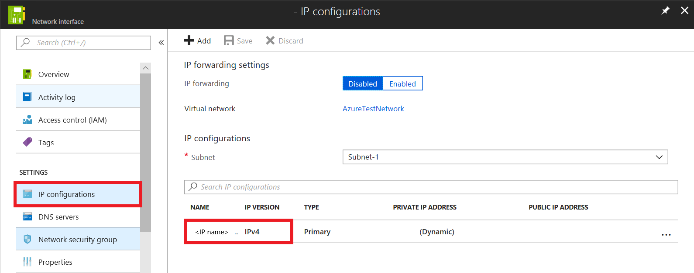

# Troubleshoot errors when failing over a virtual machine to Azure

You may receive one of the following errors while doing failover of a virtual machine to Azure. To troubleshoot, use the described steps for each error condition.

## Failover failed with Error ID 28031

Site Recovery was not able to create a failed over virtual machine in Azure. It could happen because of one of the following reasons:

* There isn't sufficient quota available to create the virtual machine: You can check the available quota by going to Subscription -> Usage + quotas. You can open a [new support request](http://aka.ms/getazuresupport) to increase the quota.

* You are trying to failover virtual machines of different size families in same availability set. Ensure that you choose same size family for all virtual machines in the same availability set. Change size by going to Compute and Network settings of the virtual machine and then retry failover.

* There is a policy on the subscription that prevents creation of a virtual machine. Change the policy to allow creation of a virtual machine and then retry failover.

## Failover failed with Error ID 28092

Site Recovery was not able to create a network interface for the failed over virtual machine. Make sure you have sufficient quota available to create network interfaces in the subscription. You can check the available quota by going to Subscription -> Usage + quotas. You can open a [new support request](http://aka.ms/getazuresupport) to increase the quota. If you have sufficient quota, then this might be an intermittent issue, try the operation again. If the issue persists even after retries, then leave a comment at the end of this document.  

## Failover failed with Error ID 70038

Site Recovery was not able to create a failed over Classic virtual machine in Azure. It could happen because:

* One of the resources such as a virtual network that is required for the virtual machine to be created doesn't exist. Create the virtual network as provided under Compute and Network settings of the virtual machine or modify the setting to a virtual network that already exists and then retry failover.

## Unable to connect/RDP/SSH - VM Connect button grayed out

If the **Connect** button on the failed over VM in Azure is grayed out and you are not connected to Azure via an Express Route or Site-to-Site VPN connection, then,

1. Go to **Virtual machine** > **Networking**, click on the name of required network interface.  
2. Navigate to **Ip Configurations**, then click on the name field of required IP configuration. 
3. To enable Public IP address, click on **Enable**. 
4. Click on **Configure required settings** > **Create new**. 
5. Enter the name of public address, choose the default options for **SKU** and **assignment**, then click **OK**.
6. Now, to save the changes made, click **Save**.
7. Close the panels and navigate to **Overview** section of virtual machine to connect/RDP.

## Unable to connect/RDP/SSH - VM Connect button available

If the **Connect** button on the failed over VM in Azure is available (not grayed out), then check **Boot diagnostics** on your Virtual Machine and check for errors as listed in [this article](../virtual-machines/windows/boot-diagnostics.md).

1. If the virtual machine has not started, try failing over to an older recovery point.
2. If the application inside the virtual machine is not up, try failing over to an app-consistent recovery point.
3. If the virtual machine is domain joined, then ensure that domain controller is functioning accurately. This can be done by following the below given steps:

    a. Create a new virtual machine in the same network.

    b.  Ensure that it is able to join to the same domain on which the failed over virtual machine is expected to come up.

    c. If the domain controller is **not** functioning accurately, then try logging into the failed over virtual machine using a local administrator account.
4. If you are using a custom DNS server, then ensure that it is reachable. This can be done by following the below given steps:

    a. Create a new virtual machine in the same network and

    b. Check if the virtual machine is able to do name resolution using the custom DNS Server

>[!Note]
>Enabling any setting other than Boot Diagnostics would require Azure VM Agent to be installed in the virtual machine before the failover

## Unexpected shutdown message (Event ID 6008)

When booting up a Windows VM post failover, if you receive an unexpected shutdown message on the recovered VM, it indicates that a VM shutdown state was not captured in the recovery point used for failover. This happens when you recover to a point when the VM had not been fully shut down.

This is normally not a cause for concern and can usually be ignored for unplanned failovers. In the case of a planned failover, ensure that the VM is properly shut down prior to failover and provide sufficient time for pending replication data on-premises to be sent to Azure. Then use the **Latest** option on the [Failover screen](site-recovery-failover.md#run-a-failover) so that any pending data on Azure is processed into a recovery point, which is then used for VM failover.

## Retaining drive letter after failover
To retain the drive letter on virtual machines after failover, you can set the **SAN Policy** for the virtual machine on-premises to **OnlineAll**. [Read more](https://support.microsoft.com/help/3031135/how-to-preserve-the-drive-letter-for-protected-virtual-machines-that-are-failed-over-or-migrated-to-azure).

## Next steps
- Troubleshoot [RDP connection to Windows VM](../virtual-machines/windows/troubleshoot-rdp-connection.md)
- Troubleshoot [SSH connection to Linux VM](../virtual-machines/linux/detailed-troubleshoot-ssh-connection.md)

If you need more help, then post your query on [Site Recovery forum](https://social.msdn.microsoft.com/Forums/azure/home?forum=hypervrecovmgr) or leave a comment at the end of this document. We have an active community that should be able to assist you.
