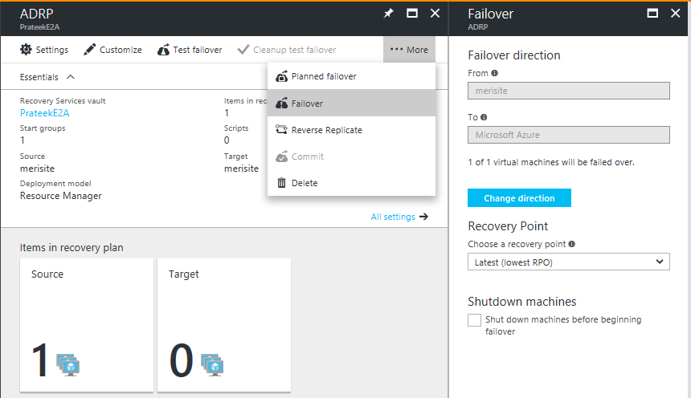
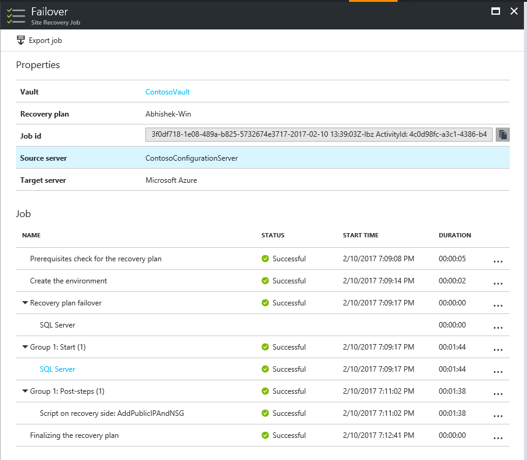

# Run a failover from on-premises to Azure

This article describes how to fail over on-premises machines to Azure in [Azure Site Recovery](site-recovery-overview.md)

## Before you start

- [Learn](failover-failback-overview.md) about the failover process in disaster recovery.
- If you want to fail over multiple machines, [learn](recovery-plan-overview.md) how to gather machines together in a recovery plan.
- Before you do a full failover, run a [disaster recovery drill](site-recovery-test-failover-to-azure.md) to ensure that everything is working as expected.

## Prepare to connect after failover

To make sure you can connect to the Azure VMs that are created after failover, here are a number of things you need to do on-premises before failover.

### Prepare on-premises to connect after failover

If you want to connect to Azure VMs using RDP/SSH after failover, there are a number of things you need to do on-premises before failover.

**After failover** | **Location** | **Actions**
--- | --- | ---
**Azure VM running Windows** | On-premises machine before failover | To access the Azure VM over the internet, enable RDP, and make sure that TCP and UDP rules are added for **Public**, and that RDP is allowed for all profiles in **Windows Firewall** > **Allowed Apps**.   To access the Azure VM over a site-to-site connection, enable RDP on the machine, and ensure that RDP is allowed in the **Windows Firewall** -> **Allowed apps and features**, for **Domain and Private** networks.      Remove any static persistent routes and WinHTTP proxy. Make sure the operating system SAN policy is set to **OnlineAll**. [Learn more](https://support.microsoft.com/kb/3031135).   Make sure there are no Windows updates pending on the VM when you trigger a failover. Windows update might start when you fail over, and you won't be able to log onto the VM until the update completes.
**Azure VM running Linux** | On-premises machine before failover | Ensure that the Secure Shell service on the VM is set to start automatically on system boot.   Check that firewall rules allow an SSH connection to it.

## Run a failover

This procedure describes how to run a failover for a [recovery plan](site-recovery-create-recovery-plans.md). If you want to run a failover for a single VM, follow the instructions for a [VMware VM](vmware-azure-tutorial-failover-failback.md), a [physical server](physical-to-azure-failover-failback.md), or a [Hyper-V VM](hyper-v-azure-failover-failback-tutorial.md).

Run the recovery plan failover as follows:

1. In the Site Recovery vault, select **Recovery Plans** > *recoveryplan_name*.
2. Click **Failover**.

    

3. In **Failover** > **Failover direction**, leave the default if you're replicating to Azure.
4. In **Failover**, select a **Recovery Point** to which to fail over.

    - **Latest**: Use the latest point. This processes all the data that's been sent to Site Recovery service, and creates a recovery point for each machine. This option provides the lowest RPO (Recovery Point Objective) because the VM created after failover has all the data that's been replicated to Site Recovery when the failover was triggered.
    Please note that when the source region goes down, there is no more log processing possible. So, you will have to failover to Latest Processed recovery point. See the next point to understand more.
   - **Latest processed**: Use this option to fail over VMs to the latest recovery point already processed by Site Recovery. You can see the latest processed recovery point in the VM **Latest Recovery Points**. This option provides a low RTO as no time is spent to processing the unprocessed data
   - **Latest app-consistent**: Use this option to fail VMs over to the latest application consistent recovery point that's been processed by Site Recovery.
   - **Latest multi-VM processed**:  With this option VMs that are part of a replication group failover to the latest common multi-VM consistent recovery point. Other virtual machines fail over to their latest processed recovery point. This option is only for recovery plans that have at least one VM with multi-VM consistency enabled.
   - **Latest multi-VM app-consistent**: With this option VMs that are part of a replication group fail over to the latest common multi-VM application-consistent recovery point. Other virtual machines failover to their latest application-consistent recovery point. Only for recovery plans that have at least one VM with multi-VM consistency enabled.
   - **Custom**: Not available for recovery plans. This option is only for failover of individual VMs.

5. Select **Shut-down machine before beginning failover** if you want Site Recovery shut down source VMs before starting the failover. Failover continues even if shutdown fails.  

	> [!NOTE]
	> If you fail over Hyper-V VMs, shutdown tries to synchronize and replicate the on-premises data that hasn't yet been sent to the service, before triggering the failover. 

6. Follow failover progress on the **Jobs** page. Even if errors occurs, the recovery plan runs until it is complete.
7. After the failover, sign into the VM to validate it. 
8. If you want to switch to different recovery point to use for the failover, use **Change recovery point**.
9. When you're ready, you can commit the failover.The **Commit** action deletes all the recovery points available with the service. The **Change recovery point** option will no longer be available.

## Run a planned failover (Hyper-V)

You can run a planned failover for Hyper-V VMs.

- A planned failover is a zero data loss failover option.
- When a planned failover is triggered, first the source virtual machines are shut-down, the latest data is synchronized and then a failover is triggered.
- You run a planned failover using the **Planned failover** option. It runs in a similar way to a regular failover.
 
## Track failovers

There are a number of jobs associated with failover.

- **Prerequisites check**: Ensures that all conditions required for failover are met.
- **Failover**: Processes the data so that an Azure VM can be created from it. If you have chosen **Latest** recovery point, a recovery point is created from the data that's been sent to the service.
- **Start**: Creates an Azure VM using the data processed in the previous step.

> [!WARNING]
> **Don't cancel a failover in progress**: Before failover is started, replication s stopped for the VM. If you cancel an in-progress job, failover stops, but the VM will not start to replicate. Replication can't be started again.

### Extra failover time

In some cases, VM failover requires intermediate step that usually takes around eight to 10 minutes to complete. These are the machines that are affected by this additional step/time:

* VMware virtual machines running a Mobility service version older than 9.8.
* Physical servers, and Hyper-V VMs protected as physical servers.
* VMware Linux VMs.
* VMware  VMs on which these drivers aren't present as boot drivers:
	* storvsc
	* vmbus
	* storflt
	* intelide
	* atapi
* VMware VMs that don't have DHCP enabled, irrespective of whether they're using DHCP or static IP addresses.

## Automate actions during failover

You might want to automate actions during failover. To do this, you can use scripts or Azure automation runbooks in recovery plans.

- [Learn](site-recovery-create-recovery-plans.md) about creating and customizing recovery plans, including adding scripts.
- [Learn](site-recovery-runbook-automation.md) about adding Azure Automation runbooks to recovery plans.

## Configure settings after failover

### Retain drive letters after failover

Site Recovery handles retention of drive letters. If you're excluding disks during VM replication, [review an example](exclude-disks-replication.md#example-1-exclude-the-sql-server-tempdb-disk) of how this works.

### Prepare in Azure to connect after failover

If you want to connect to Azure VMs that are created after failover using RDP or SSH, follow the requirements summarized in the table.

**Failover** | **Location** | **Actions**
--- | --- | ---
**Azure VM running Windows** | Azure VM after failover |  [Add a public IP address](/archive/blogs/srinathv/how-to-add-a-public-ip-address-to-azure-vm-for-vm-failed-over-using-asr) for the VM.   The network security group rules on the failed over VM (and the Azure subnet to which it is connected) need to allow incoming connections to the RDP port.   Check **Boot diagnostics** to verify a screenshot of the VM.   If you can't connect, check that the VM is running, and review these [troubleshooting tips](https://social.technet.microsoft.com/wiki/contents/articles/31666.troubleshooting-remote-desktop-connection-after-failover-using-asr.aspx).
**Azure VM running Linux** | Azure VM after failover | The network security group rules on the failed over VM (and the Azure subnet to which it is connected) need to allow incoming connections to the SSH port.   [Add a public IP address](/archive/blogs/srinathv/how-to-add-a-public-ip-address-to-azure-vm-for-vm-failed-over-using-asr) for the VM.   Check **Boot diagnostics** for a screenshot of the VM.  

Follow the steps described [here](site-recovery-failover-to-azure-troubleshoot.md) to troubleshoot any connectivity issues post failover.

## Set up IP addressing

- **Internal IP addresses**: To set the internal IP address of an Azure VM after failover, you have a couple of options:
	- Retain same IP address: You can use the same IP address on the Azure VM as the one allocated to the on-premises machine.
	- Use different IP address: You can use a different IP address for the Azure VM.
	- [Learn more](concepts-on-premises-to-azure-networking.md#assign-an-internal-address) about setting up internal IP addresses.
- **External IP addresses**: You can retain public IP addresses on failover. Azure VMs created as part of the failover process must be assigned an Azure public IP address available in the Azure region. You can assign a public IP address either manually or by automating the process with a recovery plan. [Learn more](concepts-public-ip-address-with-site-recovery.md).

## Next steps

After you've failed over, you need to reprotect to start replicating the Azure VMs back to the on-premises site. After replication is up and running, you can fail back on-premises when you're ready.

- [Learn more](failover-failback-overview.md#reprotectionfailback) about reprotection and failback.
- [Prepare](vmware-azure-reprotect.md) for VMware reprotection and failback.
- [Fail back](hyper-v-azure-failback.md) Hyper-V VMs.
- [Learn about](physical-to-azure-failover-failback.md) the failover and failback process for physical servers.