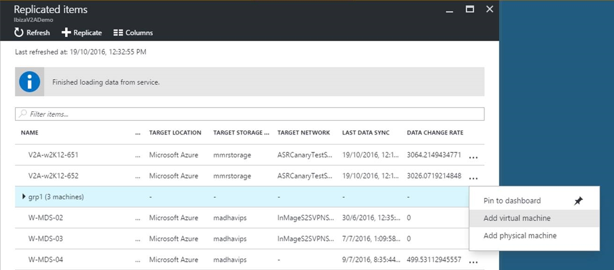

# Azure Site Recovery: frequently asked questions (FAQ)
This article includes frequently asked questions about Azure Site Recovery. If you have questions after reading this article, post them on the [Azure Recovery Services Forum](https://social.msdn.microsoft.com/Forums/azure/home?forum=hypervrecovmgr).

## General
### What does Site Recovery do?
Site Recovery contributes to your business continuity and disaster recovery (BCDR) strategy, by orchestrating and automating replication of Azure VMs between regions, on-premises virtual machines and physical servers to Azure, and on-premises machines to a secondary datacenter. [Learn more](site-recovery-overview.md).

### What can Site Recovery protect?
* **Azure VMs**: Site Recovery can replicate any workload running on a supported Azure VM
* **Hyper-V virtual machines**: Site Recovery can protect any workload running on a Hyper-V VM.
* **Physical servers**: Site Recovery can protect physical servers running Windows or Linux.
* **VMware virtual machines**: Site Recovery can protect any workload running in a VMware VM.

### Can I replicate Azure VMs?
Yes, you can replicate supported Azure VMs between Azure regions. [Learn more](site-recovery-azure-to-azure.md).

### What do I need in Hyper-V to orchestrate replication with Site Recovery?
For the Hyper-V host server what you need depends on the deployment scenario. Check out the Hyper-V prerequisites in:

* [Replicating Hyper-V VMs (without VMM) to Azure](site-recovery-hyper-v-site-to-azure.md)
* [Replicating Hyper-V VMs (with VMM) to Azure](site-recovery-vmm-to-azure.md)
* [Replicating Hyper-V VMs to a secondary datacenter](site-recovery-vmm-to-vmm.md)
* If you're replicating to a secondary datacenter read about [Supported guest operating systems for Hyper-V VMs](https://technet.microsoft.com/library/mt126277.aspx).
* If you're replicating to Azure, Site Recovery supports all the guest operating systems that are [supported by Azure](https://technet.microsoft.com/library/cc794868%28v=ws.10%29.aspx).

### Can I protect VMs when Hyper-V is running on a client operating system?
No, VMs must be located on a Hyper-V host server that's running on a supported Windows server machine. If you need to protect a client computer you could replicate it as a physical machine to [Azure](site-recovery-vmware-to-azure.md) or a [secondary datacenter](site-recovery-vmware-to-vmware.md).

### What workloads can I protect with Site Recovery?
You can use Site Recovery to protect most workloads running on a supported VM or physical server. Site Recovery provides support for application-aware replication, so that apps can be recovered to an intelligent state. It integrates with Microsoft applications such as SharePoint, Exchange, Dynamics, SQL Server and Active Directory, and works closely with leading vendors, including Oracle, SAP, IBM and Red Hat. [Learn more](site-recovery-workload.md) about workload protection.

### Do Hyper-V hosts need to be in VMM clouds?
If you want to replicate to a secondary datacenter, then Hyper-V VMs must be on Hyper-V hosts servers located in a VMM cloud. If you want to replicate to Azure, then you can replicate VMs with or without VMM clouds. [Read more](tutorial-hyper-v-to-azure.md) about Hyper-V replication to Azure.

### Can I deploy Site Recovery with VMM if I only have one VMM server?

Yes. You can either replicate VMs in Hyper-V servers in the VMM cloud to Azure, or you can replicate between VMM clouds on the same server. For on-premises to on-premises replication, we recommend that you have a VMM server in both the primary and secondary sites.  

### What physical servers can I protect?
You can replicate physical servers running Windows and Linux to Azure or to a secondary site. Learn about requirements for [replication to Azure](vmware-physical-azure-support-matrix.md#replicated-machines), and [replication to a secondary site](vmware-physical-secondary-support-matrix.md#replicated-vm-support).

Note that physical servers will run as VMs in Azure if your on-premises server goes down. Failback to an on-premises physical server isn't currently supported. For a machine protected as physical, you can only failback to a VMware virtual machine.

### What VMware VMs can I protect?

To protect VMware VMs you'll need a vSphere hypervisor, and virtual machines running VMware tools. We also recommend that you have a VMware vCenter server to manage the hypervisors. Learn more about requirements for [replication to Azure](vmware-physical-azure-support-matrix.md#replicated-machines), or [replication to a secondary site](vmware-physical-secondary-support-matrix.md#replicated-vm-support).

### Can I manage disaster recovery for my branch offices with Site Recovery?
Yes. When you use Site Recovery to orchestrate replication and failover in your branch offices, you'll get a unified orchestration and view of all your branch office workloads in a central location. You can easily run failovers and administer disaster recovery of all branches from your head office, without visiting the branches.

## Pricing
For pricing related questions, please refer to the FAQ at [Azure Site Recovery pricing](https://azure.microsoft.com/en-in/pricing/details/site-recovery/).

## Security
### Is replication data sent to the Site Recovery service?
No, Site Recovery doesn't intercept replicated data, and doesn't have any information about what's running on your virtual machines or physical servers.
Replication data is exchanged between on-premises Hyper-V hosts, VMware hypervisors, or physical servers and Azure storage or your secondary site. Site Recovery has no ability to intercept that data. Only the metadata needed to orchestrate replication and failover is sent to the Site Recovery service.  

Site Recovery is ISO 27001:2013, 27018, HIPAA, DPA certified, and is in the process of SOC2 and FedRAMP JAB assessments.

### For compliance reasons, even our on-premises metadata must remain within the same geographic region. Can Site Recovery help us?
Yes. When you create a Site Recovery vault in a region, we ensure that all metadata that we need to enable and orchestrate replication and failover remains within that region's geographic boundary.

### Does Site Recovery encrypt replication?
For virtual machines and physical servers, replicating between on-premises sites encryption-in-transit is supported. For virtual machines and physical servers replicating to Azure, both encryption-in-transit and [encryption-at-rest (in Azure)](https://docs.microsoft.com/azure/storage/storage-service-encryption) are supported.

## Replication

### Can I replicate over a site-to-site VPN to Azure?
Azure Site Recovery replicates data to an Azure storage account, over a public endpoint. Replication isn't over a site-to-site VPN. You can create a site-to-site VPN, with an Azure virtual network. This doesn't interfere with Site Recovery replication.

### Can I use ExpressRoute to replicate virtual machines to Azure?
Yes, [ExpressRoute can be used](concepts-expressroute-with-site-recovery.md) to replicate on-premises virtual machines to Azure. Azure Site Recovery replicates data to an Azure Storage Account over a public endpoint. You need to set up [public peering](../expressroute/expressroute-circuit-peerings.md#azure-public-peering) or [Microsoft peering](../expressroute/expressroute-circuit-peerings.md#microsoft-peering) to use ExpressRoute for Site Recovery replication. Microsoft peering is the recommended routing domain for replication. After the virtual machines have been failed over to an Azure virtual network you can access them using the [private peering](../expressroute/expressroute-circuit-peerings.md#azure-private-peering) setup with the Azure virtual network. Replication is not supported over private peering.

### Are there any prerequisites for replicating virtual machines to Azure?
[VMware VMs](vmware-physical-azure-support-matrix.md#replicated-machines) and [Hyper-V VMs](hyper-v-azure-support-matrix.md#replicated-vms) you want to replicate to Azure should comply with Azure requirements.

Your Azure user account needs to have certain [permissions](site-recovery-role-based-linked-access-control.md#permissions-required-to-enable-replication-for-new-virtual-machines) to enable replication of a new virtual machine to Azure.

### Can I replicate Hyper-V generation 2 virtual machines to Azure?
Yes. Site Recovery converts from generation 2 to generation 1 during failover. At failback the machine is converted back to generation 2. [Read more](http://azure.microsoft.com/blog/2015/04/28/disaster-recovery-to-azure-enhanced-and-were-listening/).

### If I replicate to Azure how do I pay for Azure VMs?
During regular replication, data is replicated to geo-redundant Azure storage and you don’t need to pay any Azure IaaS virtual machine charges, providing a significant advantage. When you run a failover to Azure, Site Recovery automatically creates Azure IaaS virtual machines, and after that you'll be billed for the compute resources that you consume in Azure.

### Can I automate Site Recovery scenarios with an SDK?
Yes. You can automate Site Recovery workflows using the Rest API, PowerShell, or the Azure SDK. Currently supported scenarios for deploying Site Recovery using PowerShell:

* [Replicate Hyper-V VMs in VMMs clouds to Azure PowerShell Resource Manager](hyper-v-vmm-powershell-resource-manager.md)
* [Replicate Hyper-V VMs without VMM to Azure PowerShell Resource Manager](hyper-v-azure-powershell-resource-manager.md)
* [Replicate VMware to Azure with PowerShell Resource Manager](vmware-azure-disaster-recovery-powershell.md)

### If I replicate to Azure what kind of storage account do I need?
You need an LRS or GRS storage account. We recommend GRS so that data is resilient if a regional outage occurs, or if the primary region can't be recovered. The account must be in the same region as the Recovery Services vault. Premium storage is supported for VMware VM, Hyper-V VM, and physical server replication, when you deploy Site Recovery in the Azure portal.

### How often can I replicate data?
* **Hyper-V:** Hyper-V VMs can be replicated every 30 seconds (except for premium storage), 5 minutes or 15 minutes. If you've set up SAN replication then replication is synchronous.
* **VMware and physical servers:** A replication frequency isn't relevant here. Replication is continuous.

### Can I extend replication from existing recovery site to another tertiary site?
Extended or chained replication isn't supported. Request this feature in [feedback forum](http://feedback.azure.com/forums/256299-site-recovery/suggestions/6097959-support-for-exisiting-extended-replication).

### Can I do an offline replication the first time I replicate to Azure?
This isn't supported. Request this feature in the [feedback forum](http://feedback.azure.com/forums/256299-site-recovery/suggestions/6227386-support-for-offline-replication-data-transfer-from).

### Can I exclude specific disks from replication?
This is supported when you're replicating VMware VMs and Hyper-V VMs to Azure, using the Azure portal.

### Can I replicate virtual machines with dynamic disks?
Dynamic disks are supported when replicating Hyper-V virtual machines. They are also supported when replicating VMware VMs and physical machines to Azure. The operating system disk must be a basic disk.

### Can I add a new machine to an existing replication group?
Adding new machines to existing replication groups is supported. To do so, select the replication group (from 'Replicated items' blade) and right click/select context menu on the replication group and select the appropriate option.

### Can I throttle bandwidth allotted for Hyper-V replication traffic?
Yes. You can read more about throttling bandwidth in the deployment articles:

* [Capacity planning for replicating VMware VMs and physical servers](site-recovery-plan-capacity-vmware.md)
* [Capacity planning for replicating Hyper-V VMs to Azure](site-recovery-capacity-planning-for-hyper-v-replication.md)

## Failover
### If I'm failing over to Azure, how do I access the Azure virtual machines after failover?
You can access the Azure VMs over a secure Internet connection, over a site-to-site VPN, or over Azure ExpressRoute. You'll need to prepare a number of things in order to connect. [Learn more](site-recovery-test-failover-to-azure.md#prepare-to-connect-to-azure-vms-after-failover)

### If I fail over to Azure how does Azure make sure my data is resilient?
Azure is designed for resilience. Site Recovery is already engineered for failover to a secondary Azure datacenter, in accordance with the Azure SLA if the need arises. If this happens, we make sure your metadata and vaults remain within the same geographic region that you chose for your vault.  

### If I'm replicating between two datacenters what happens if my primary datacenter experiences an unexpected outage?
You can trigger an unplanned failover from the secondary site. Site Recovery doesn't need connectivity from the primary site to perform the failover.

### Is failover automatic?
Failover isn't automatic. You initiate failovers with single click in the portal, or you can use [Site Recovery PowerShell](/powershell/module/azurerm.siterecovery) to trigger a failover. Failing back is a simple action in the Site Recovery portal.

To automate you could use on-premises Orchestrator or Operations Manager to detect a virtual machine failure, and then trigger the failover using the SDK.

* [Read more](site-recovery-create-recovery-plans.md) about recovery plans.
* [Read more](site-recovery-failover.md) about failover.
* [Read more](site-recovery-failback-azure-to-vmware.md) about failing back VMware VMs and physical servers

### If my on-premises host is not responding or crashed, can I failover back to a different host?
Yes, you can use the alternate location recovery to failback to a different host from Azure. Read more about the options in the below links for VMware and Hyper-V virtual machines.

* [For VMware virtual machines](concepts-types-of-failback.md#alternate-location-recovery-alr)
* [For Hyper-V virtual machines](hyper-v-azure-failback.md#perform-failback)

## Service providers
### I'm a service provider. Does Site Recovery work for dedicated and shared infrastructure models?
Yes, Site Recovery supports both dedicated and shared infrastructure models.

### For a service provider, is the identity of my tenant shared with the Site Recovery service?
No. Tenant identity remains anonymous. Your tenants don't need access to the Site Recovery portal. Only the service provider administrator interacts with the portal.

### Will tenant application data ever go to Azure?
When replicating between service provider-owned sites, application data never goes to Azure. Data is encrypted in-transit, and replicated directly between the service provider sites.

If you're replicating to Azure, application data is sent to Azure storage but not to the Site Recovery service. Data is encrypted in-transit, and remains encrypted in Azure.

### Will my tenants receive a bill for any Azure services?
No. Azure's billing relationship is directly with the service provider. Service providers are responsible for generating specific bills for their tenants.

### If I'm replicating to Azure, do we need to run virtual machines in Azure at all times?
No, Data is replicated to an Azure storage account in your subscription. When you perform a test failover (DR drill) or an actual failover, Site Recovery automatically creates virtual machines in your subscription.

### Do you ensure tenant-level isolation when I replicate to Azure?
Yes.

### What platforms do you currently support?
We support Azure Pack, Cloud Platform System, and System Center based (2012 and higher) deployments. [Learn more](https://technet.microsoft.com/library/dn850370.aspx) about Azure Pack and Site Recovery integration.

### Do you support single Azure Pack and single VMM server deployments?
Yes, you can replicate Hyper-V virtual machines to Azure, or between service provider sites.  Note that if you replicate between service provider sites, Azure runbook integration isn't available.

## Next steps
* Read the [Site Recovery overview](site-recovery-overview.md)
* Learn about [Site Recovery architecture](site-recovery-components.md)  
