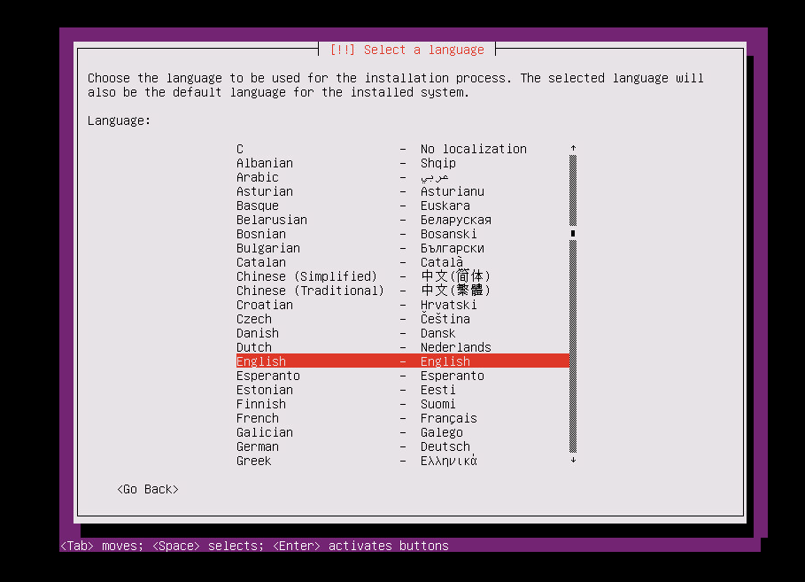
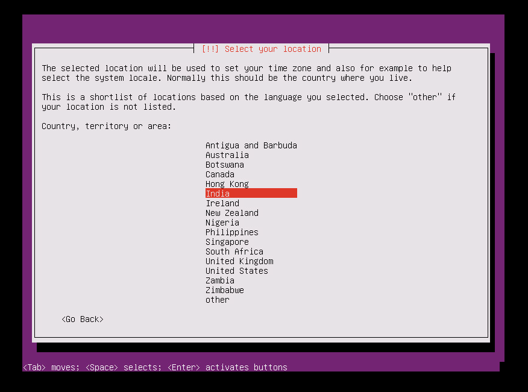
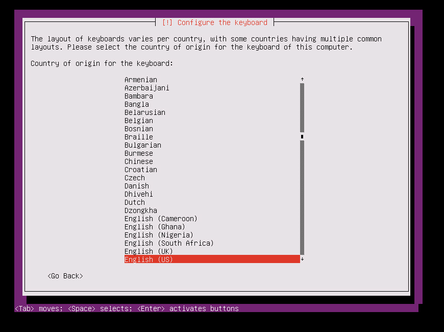
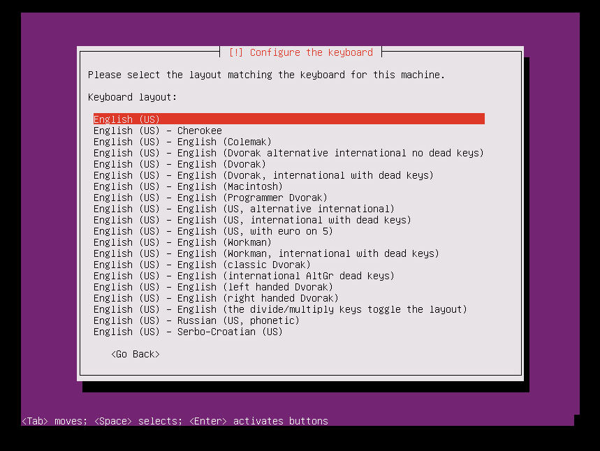
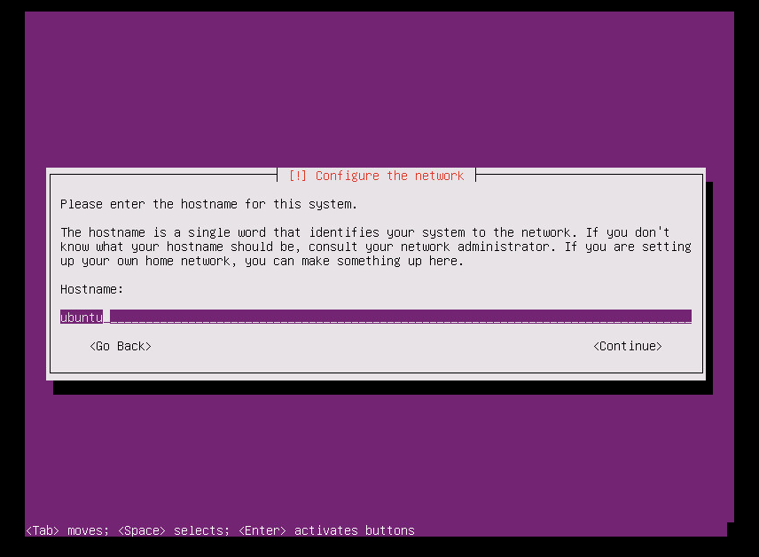
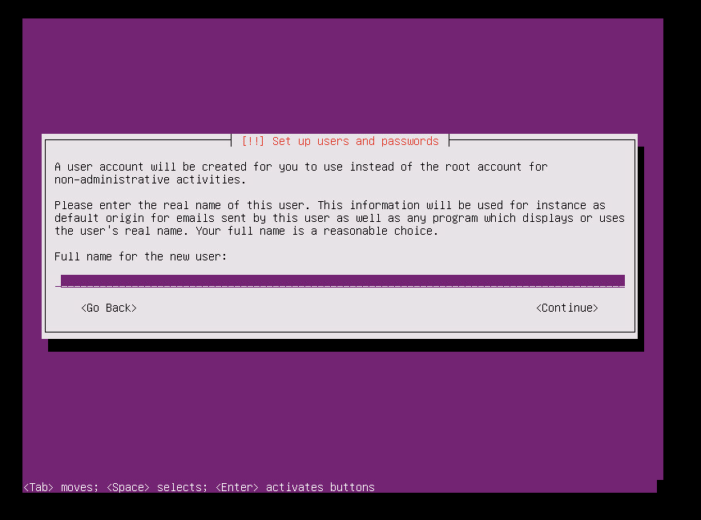
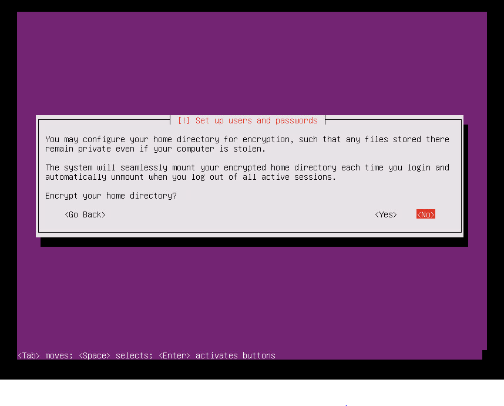

# How to install a Linux master target server
After you fail over your virtual machines, you can fail back the virtual machines to the on-premises site. To fail back, you need to reprotect the virtual machine from Azure to the on-premises site. For this process, you need an on-premises master target server to receive the traffic. If your protected virtual machine is a Windows virtual machine, then you need a Windows master target. For a Linux virtual machine, you need a Linux master target. Read the following steps to learn how to create and install a Linux master target.

> [!IMPORTANT]
> Starting with release of 9.10.0 Master target server, the latest master target server can be only installed on an Ubuntu 16.04 server. New installations will not be allowed on the CentOS6.6 servers. However you can continue to upgrade your old master target servers using the 9.10.0 version.

## Overview
This article provides information and instructions to install a Linux master target.

Post comments or questions at the end of this article or on the [Azure Recovery Services Forum](https://social.msdn.microsoft.com/forums/azure/home?forum=hypervrecovmgr).

## Prerequisites

* To correctly choose the host on which you need to deploy the master target, determine whether the failback is going to be to an existing on-premises virtual machine or to a new virtual machine because the on-premises virtual machine got deleted.
	* For an existing virtual machine, the master target's host should have access to the virtual machine's datastores.
	* If the on-premises virtual machine does not exist, the failback virtual machine is created on the same host as the master target. You can choose any ESXi host to install the master target.
* The master target should be on a network that can communicate with the process server and the configuration server.
* The version of the master target must be equal to or earlier than the versions of the process server and the configuration server. For example, if the version of the configuration server is 9.4, the version of the master target can be 9.4 or 9.3 but not 9.5.
* The master target can only be a VMware virtual machine and not a physical server.

## Master target sizing guideline

The master target needs to be created with the following sizing guideline
	* RAM - 6GB or more
	* OS Disk size - 100GB or more (to install CentOS6.6)
	* Additional disk size for retention drive - 1TB
	* CPU cores - 4 Cores or more


## Steps to deploy the master target server

**Install Ubuntu 16.04.2 Minimal**

Follow the steps as mentioned below to install Ubuntu 16.04.2- 64bit
Operating System.

**Step 1:** From following link choose a nearest mirror to download an Ubuntu 16.04.2 minimal 64-bit ISO

<https://www.ubuntu.com/download/server/thank-you?version=16.04.2&architecture=amd64>

Keep Ubuntu 16.04.2 minimal 64-bit ISO in DVD drive and boot the system.

**Step 2:** Select **English** as your preferred Language and press Enter.


**Step 3:** Select **Install Ubuntu Server** and press Enter


**Step 4:** Select **English** as your preferred Language and press Enter



**Step 5:** Select appropriate option from the **Time Zone** options list and press Enter



**Step 6:** Select default option **NO** and press Enter


**Step 7:** Select **English (US)** as a country of origin for the keyboard and press Enter



**Step 8:** Select **English (US)** as a Keyboard layout and press Enter



**Step 9:** Enter the hostname for your server in **Hostname text box**, Click on **Continue** button



**Step 10:** Enter **User name** to create a user account in the **Textbox**, Click on **Continue** button



**Step 11:** Enter **Password** for the new user account in the **Text box**, Click on **Continue** button


**Step 12:** Confirm **Password** for the new user in the **Text box**, Click on **Continue** button


**Step 13:** Select default option **NO,** press **Enter**



**Step 14:** Select default option **YES** if the displayed time zone is correct and press **Enter.**

You can select **No** option to re-configure your time zone.


**Step 15:** Select “**Guided -** **Use entire disk**” option from the partitioning method options and press **Enter.**


**Step 16:** Select appropriate disk from the **select disk to partition** options and press **Enter.**


**Step 17:** Select **YES** to write changes to disks and press **Enter.**


**Step 18:** Select default option, Select Continue and press Enter.


**Step 19:** Select appropriate option to manager upgrades on your system and press **Enter**


> [!WARNING]
> As the Azure site recovery master target server requires a very specific version of the Ubuntu, you need to ensure that the kernel upgrades are disabled for the virtual machine. If they are enabled, then any regular upgrades will cause the master target server to malfunction. Make sure you select the “No automatic updates” option.


**Step 20:** You can go ahead with default options. If you want openSSH for SSH connect, then select “OpenSSH server” option and Continue.


**Step 21:** Select option **YES** and press **Enter**


**Step 22:** Select appropriate device (Preferably /dev/sda) for boot loader installation and press **Enter.**


**Step 23:** Select **Continue** button and press **Enter** to **finish the installation.**


Once after installation completes. Login to the VM using the new user credentials (Refer **Step 10**).

Follow the steps mentioned in the following screenshot to set ROOT user password and to login as ROOT user for further operations.


### Post-installation steps
Next, prepare the machine to be configured as a master target server.

To get the ID for each SCSI hard disk in a Linux virtual machine,
you should enable the **disk.EnableUUID = TRUE** parameter.

To enable this parameter, use the following steps:

1. Shut down your virtual machine.

2. Right-click the virtual machine’s entry in the left pane, and then select **Edit Settings.**

3. Click the **Options** tab.

4. Select **Advanced &gt; General** in the left pane, and then click the **Configuration Parameters** button on the right.

	

	The **Configuration Parameters** option is not available when the
machine is running. To make this tab active, shut down the virtual machine.

5. See whether a row with **disk.EnableUUID** already exists.

	- If the value exists and is set to **False**, change the value to **True** (The values are not case-sensitive).

	- If the value exists and is set to **True**, click **Cancel**.

	- If the value does not exist, click **Add Row.**

	- Add **disk.EnableUUID** in the **Name** column and set its value as **TRUE**.

	

#### **Disable kernel upgrades**

As the Azure site recovery master target server requires a very specific version of the Ubuntu, you need to ensure that the kernel upgrades are disabled for the virtual machine. If they are enabled, then any regular upgrades will cause the master target server to malfunction. Use the below steps to disable kernel upgrades.
> [!IMPORTANT]
> Need to put the script steps here

#### Download and install additional packages

> [!NOTE]
> Make sure that you have Internet connectivity to download and install additional packages. Without Internet connectivity, you will need to manually find these RPM packages and install them.

```
apt-get install -y multipath-tools lsscsi python-pyasn1 lvm2 kpartx
```

### Get the installer for setup

If your master target has Internet connectivity, you can use the following steps to download the installer. Otherwise, you can copy the installer from the process server and install it.

#### Download the master target installation packages

[Download the latest Linux master target installation bits](https://aka.ms/latestlinuxmobsvc).

To download it by using Linux, type:

```
wget https://aka.ms/latestlinuxmobsvc -O latestlinuxmobsvc.tar.gz
```

Make sure that you download and unzip the installer in your home directory. If you unzip to /usr/Local, then the installation will fail.


#### Access the installer from the process server

1. Go to C:\Program Files (x86)\Microsoft Azure Site Recovery\home\svsystems\pushinstallsvc\repository on the process server.

2. Copy the required installer file from the process server, and save it as latestlinuxmobsvc.tar.gz in your home directory.


### Apply custom configuration changes

To apply custom configuration changes, use the following steps:


1. Run the following command to untar the binary.
	```
	tar -zxvf latestlinuxmobsvc.tar.gz
	```
	

2. Run the following command to give permission.
	```
	chmod 755 ./ApplyCustomChanges.sh
	```

3. Run the following command to run the script.
	```
	./ApplyCustomChanges.sh
	```
> [!NOTE]
> Run the script only once on the server. Shut down the server. Reboot the server after you add a disk as described in the next steps.

### Add a retention disk to the Linux master target virtual machine

Use the following steps to create a retention disk:

1. Attach a new **1-TB** disk to the Linux master target virtual machine, and **boot** the machine.

2. Use the **multipath -ll** command to learn the retention disk's
multipath ID.

	```
	multipath -ll
	```

	

3. Format the drive, and create a file system on the new drive.

	```
	mkfs.ext4 /dev/mapper/<Retention disk's multipath id>
	```
	

4. After you create the file system, mount the retention disk.
	```
	mkdir /mnt/retention
	mount /dev/mapper/<Retention disk's multipath id> /mnt/retention
	```

	

5. Create the **fstab** entry to mount the retention drive during every boot.
	```
	vi /etc/fstab
	```
	Press **Insert** to begin editing the file. Create a new line, and insert the following text. Edit the disk multipath ID based on the highlighted multipath ID from the previous command.

	**/dev/mapper/<Retention disks multipath id> /mnt/retention ext4 rw 0 0**

	Press **Esc**, and type **:wq** (write and quit) to close the editor window.

### Install the master target

> [!IMPORTANT]
> The version of the master target server must be equal to or earlier than the versions of the process server and the configuration server. If this condition is not met, reprotect will succeed, but replication will fail.


> [!NOTE]
> Before you install the master target server, check that the /etc/hosts file on the virtual machine contains entries that map the local hostname to the IP addresses that are associated with all network adapters.

1. Copy the passphrase from C:\ProgramData\Microsoft Azure Site Recovery\private\connection.passphrase on the configuration server, and save it in passphrase.txt in the same local directory by running the following command.

	```
	echo <passphrase> >passphrase.txt
	```
	Example: echo itUx70I47uxDuUVY >passphrase.txt

2. Note the configuration server's IP address. You need it in the next step.

3. Run the following command to install the master target server and register the server with the configuration server.

    ```
    ./install -q -d /usr/local/ASR -r MT -v VmWare
    /usr/local/ASR/Vx/bin/UnifiedAgentConfigurator.sh -i <ConfigurationServer IP Address> -P passphrase.txt
    ```

	Example: Example: /usr/local/ASR/Vx/bin/UnifiedAgentConfigurator.sh -i 104.40.75.37 -P passphrase.txt

	Wait until the script finishes. If the master target is successfully registered, the master target is listed on the Site Recovery Infrastructure page of the portal.


#### Install the master target by using interactive install

1. Run the following command to install the master target. Choose agent role as **Master Target**.

	```
	./install
	```

2. Choose the default location for installation, and press **Enter** to continue.

	

Once the installation completes, you need to register the configuration server using the command line.

1. Note the configuration server's IP address. You need it in the next step.

2. Run the following command to install the master target server and register the server with the configuration server.

    ```
    ./install -q -d /usr/local/ASR -r MT -v VmWare
    /usr/local/ASR/Vx/bin/UnifiedAgentConfigurator.sh -i <ConfigurationServer IP Address> -P passphrase.txt
    ```

	Example: Example: /usr/local/ASR/Vx/bin/UnifiedAgentConfigurator.sh -i 104.40.75.37 -P passphrase.txt

	Wait until the script finishes. If the master target is successfully registered, the master target is listed on the Site Recovery Infrastructure page of the portal.


### Upgrade the master target

Run the installer. It automatically detects that the agent is installed on the master target. Select 'Y' to upgrade. Once the setup completes, you can check the version of the master target installed using the following command.

    ```
        cat /usr/local/.vx_version
    ```

You can see that the VERSION field gives the master target version number.

### Install VMware tools on the master target server

You need to install VMware tools on the master target so that it can discover the datastores. If the tools are not installed, the reprotect screen will not list the datastores. You will need to reboot after installation of the VMware tools.

## Next steps
After the master target has completed installation and registration, you can see the master target appear on the **Master Target** section in **Site Recovery Infrastructure**, under the configuration server overview.

You can now proceed with [reprotection](site-recovery-how-to-reprotect.md), followed by failback.

## Common issues

* Make sure you do not turn on Storage vMotion on any management components such as a master target. If the master target moves after a successful reprotect, the virtual machine disks (VMDKs) cannot be detached, and failback will fail.
* The master target should not have any snapshots on the virtual machine. If there are snapshots, failback will fail.
* Due to some custom NIC configurations at some customers, the network interface is disabled during startup, and the master target agent cannot initialize. Make sure that the following properties are correctly set. Check these properties in the Ethernet card file's /etc/sysconfig/network-scripts/ifcfg-eth*.
	* BOOTPROTO=dhcp
	* ONBOOT=yes
