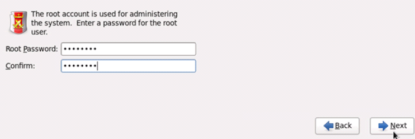
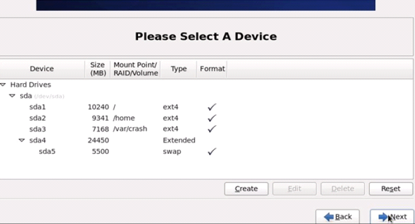
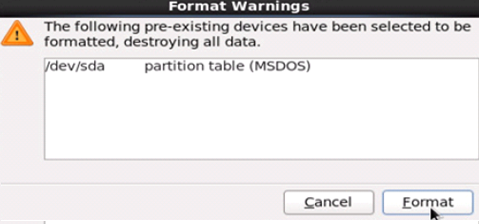
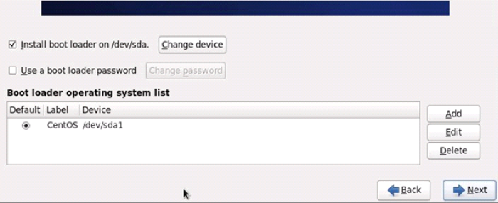
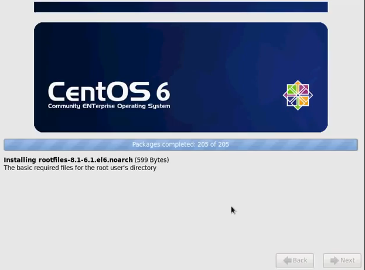
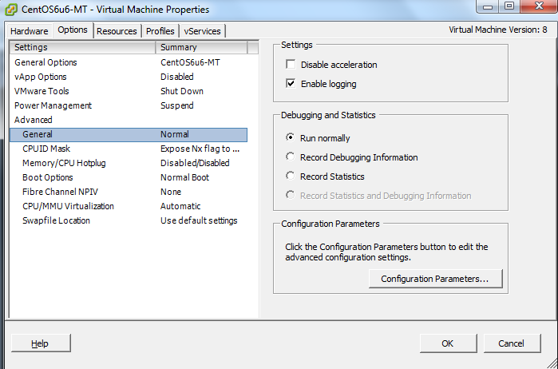
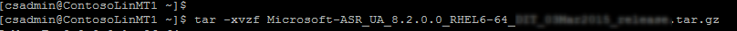
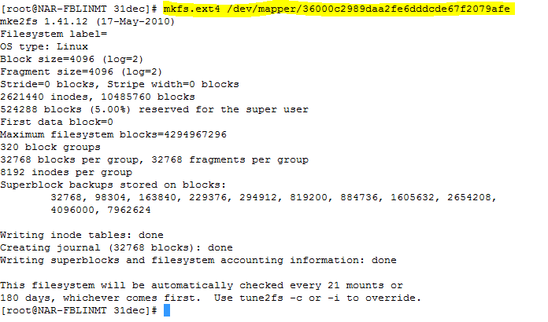
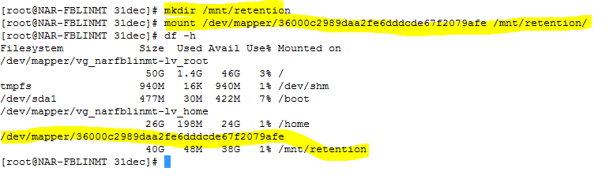
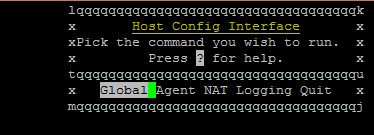

# How to install a Linux master target server
After you fail over your virtual machines, you can fail back the virtual machines to the on-premises site. To fail back, you need to reprotect the virtual machine from Azure to the on-premises site. For this process, you need an on-premises master target server to receive the traffic. If your protected virtual machine is a Windows virtual machine, then you need a Windows master target. For a Linux virtual machine, you need a Linux master target. Read the following steps to learn how to create and install a Linux master target.

## Overview
This article provides information and instructions to install a Linux master target.

Post comments or questions at the end of this article or on the [Azure Recovery Services Forum](https://social.msdn.microsoft.com/forums/azure/home?forum=hypervrecovmgr).

## Prerequisites

* To correctly choose the host on which you need to deploy the master target, determine whether the failback is going to be to an existing on-premises virtual machine or to a new virtual machine because the on-premises virtual machine got deleted.
	* For an existing virtual machine, the master target's host should have access to the virtual machine's datastores.
	* If the on-premises virtual machine does not exist, the failback virtual machine is created on the same host as the master target. You can choose any ESXi host to install the master target.
* The master target should be on a network that can communicate with the process server and the configuration server.
* The version of the master target must be equal to or earlier than the versions of the process server and the configuration server. For example, if the version of the configuration server is 9.4, the version of the master target can be 9.4 or 9.3 but not 9.5.
* The master target can only be a VMware virtual machine and not a physical server.

## Master target sizing guideline

The master target needs to be created with the following sizing guideline
	* RAM - 6GB or more
	* OS Disk size - 100GB or more (to install CentOS6.6)
	* Additional disk size for retention drive - 1TB
	* CPU cores - 4 Cores or more


## Steps to deploy the master target server

### Install CentOS 6.6 minimal

Use the following steps to install the 64-bit CentOS 6.6 operating system:

1. From following links, choose the nearest mirror to download a CentOS 6.6 minimal 64-bit ISO.

	<http://archive.kernel.org/centos-vault/6.6/isos/x86_64/CentOS-6.6-x86_64-minimal.iso>

	<http://mirror.symnds.com/distributions/CentOS-vault/6.6/isos/x86_64/CentOS-6.6-x86_64-minimal.iso>

	<http://bay.uchicago.edu/centos-vault/6.6/isos/x86_64/CentOS-6.6-x86_64-minimal.iso>

	<http://mirror.nsc.liu.se/centos-store/6.6/isos/x86_64/CentOS-6.6-x86_64-minimal.iso>

	Put CentOS 6.6 minimal 64-bit ISO in a DVD drive, and boot the system.

	

2. Click **Skip** to ignore the media testing process.

	

3. On the installation welcome screen, click the **Next** button.

	

4. Select **English** as your preferred language, and then click
**Next**.

	

5. Select **US English** as a keyboard layout, and then click **Next**.

	

6. Select
**Basic storage Devices**, and then click **Next**.

	

7. The warning message that appears indicates that the existing data on the hard drive will be deleted. Make sure the hard drive does not have any important data, and then click **Yes, discard any data**.

	

8. Enter the hostname for your server in the **Hostname** box, and then click **Configure Network**. In the **Network Connection** dialog box, select your network interface, and then click the **Edit** button to configure IPV4Settings.

	

9. In the **Editing System eth0** dialog box, check the **Connect automatically** check box. On the **IPv4 Settings** tab, choose
**Manual** for **Method**, and then click the **Add** button. Provide the **Static IP**, **Netmask**, **Gateway**, and **DNS Server** details. Click **Apply** to save the details.

	

10. Select your time zone, and then click **Next**.

	

11. Enter the **Root Password**, confirm the password, and then click
**Next**.

	

12. Select **Create Custom Layout**, and then click **Next**.

	

13. Select **Free** partition, and then click **Create** to create **/**, **/var/crash**, and **/home** partitions with **ext4** as
the file system type. Create a **Swap partition** with **swap** as the file system type. To allocate partition size, follow the size allocation formula in the following table.

	> [!NOTE]
	> The Linux master target server should not use Logical Volume Manager (LVM) for root or retention storage spaces. The Linux master target is configured to avoid LVM partitions and disk discovery by default.

	

14. After you create the partition, click **Next**.

	

15. If any pre-existing devices are found, a warning message
appears for formatting. Click **Format** to format the hard drive with the latest partition table.

	

16. Click **Write changes to disk** to apply the partition changes to the disk.

	

17. Check the **Install boot loader** option, and then click **Next** to install the boot loader on the root partition.

	


18. The installation process starts. You can monitor progress.

	

19. The following screen displays on successful completion of installation. Click **Reboot**.

	


### Post-installation steps
Next, prepare the machine to be configured as a master target server.

To get the ID for each SCSI hard disk in a Linux virtual machine,
you should enable the **disk.EnableUUID = TRUE** parameter.

To enable this parameter, use the following steps:

1. Shut down your virtual machine.

2. Right-click the virtual machine’s entry in the left pane, and then select **Edit Settings.**

3. Click the **Options** tab.

4. Select **Advanced &gt; General** in the left pane, and then click the **Configuration Parameters** button on the right.

	

	The **Configuration Parameters** option is not available when the
machine is running. To make this tab active, shut down the virtual machine.

5. See whether a row with **disk.EnableUUID** already exists.

	- If the value exists and is set to **False**, change the value to **True** (The values are not case-sensitive).

	- If the value exists and is set to **True**, click **Cancel**.

	- If the value does not exist, click **Add Row.**

	- Add **disk.EnableUUID** in the **Name** column and set its value as **TRUE**.

	

#### Download and install additional packages

> [!NOTE]
> Make sure that you have Internet connectivity to download and install additional packages. Without Internet connectivity, you will need to manually find these RPM packages and install them.

```
yum install -y xfsprogs perl lsscsi rsync wget kexec-tools
```

The previous command will download the following 15 packages from the CentOS 6.6 repository and install them. If you do not have Internet access, you will need to download the following RPM packages:


bc-1.06.95-1.el6.x86\_64.rpm

busybox-1.15.1-20.el6.x86\_64.rpm

elfutils-libs-0.158-3.2.el6.x86\_64.rpm

kexec-tools-2.0.0-280.el6.x86\_64.rpm

lsscsi-0.23-2.el6.x86\_64.rpm

lzo-2.03-3.1.el6\_5.1.x86\_64.rpm

perl-5.10.1-136.el6\_6.1.x86\_64.rpm

perl-Module-Pluggable-3.90-136.el6\_6.1.x86\_64.rpm

perl-Pod-Escapes-1.04-136.el6\_6.1.x86\_64.rpm

perl-Pod-Simple-3.13-136.el6\_6.1.x86\_64.rpm

perl-libs-5.10.1-136.el6\_6.1.x86\_64.rpm

perl-version-0.77-136.el6\_6.1.x86\_64.rpm

rsync-3.0.6-12.el6.x86\_64.rpm

snappy-1.1.0-1.el6.x86\_64.rpm

wget-1.12-5.el6\_6.1.x86\_64.rpm


#### Install additional packages for specific operating systems

> [!NOTE]
> If source-protected machines use ReiserFS or XFS file systems for the root or boot device, you should download and install the following additional packages on the Linux master target prior to protection.


***ReiserFS (If used in Suse11SP3. ReiserFS is not the default filesystem in Suse11SP3)***

```
cd /usr/local

wget
<http://elrepo.org/linux/elrepo/el6/x86_64/RPMS/kmod-reiserfs-0.0-1.el6.elrepo.x86_64.rpm>

wget
<http://elrepo.org/linux/elrepo/el6/x86_64/RPMS/reiserfs-utils-3.6.21-1.el6.elrepo.x86_64.rpm>

rpm -ivh kmod-reiserfs-0.0-1.el6.elrepo.x86\_64.rpm
reiserfs-utils-3.6.21-1.el6.elrepo.x86\_64.rpm
```

***XFS (RHEL, CentOS 7 onward)***

```
cd /usr/local

wget
<http://archive.kernel.org/centos-vault/6.6/os/x86_64/Packages/xfsprogs-3.1.1-16.el6.x86_64.rpm>

rpm -ivh xfsprogs-3.1.1-16.el6.x86\_64.rpm

yum install device-mapper-multipath
```
This is required to enable multipath packages on the master target.

### Get the installer for setup

If your master target has Internet connectivity, you can use the following steps to download the installer. Otherwise, you can copy the installer from the process server and install it.

#### Download the master target installation packages

[Download the latest Linux master target installation bits](https://aka.ms/latestlinuxmobsvc).

To download it by using Linux, type:

```
wget https://aka.ms/latestlinuxmobsvc -O latestlinuxmobsvc.tar.gz
```

Make sure that you download and unzip the installer in your home directory. If you unzip to /usr/Local, then the installation will fail.


#### Access the installer from the process server

1. Go to C:\Program Files (x86)\Microsoft Azure Site Recovery\home\svsystems\pushinstallsvc\repository on the process server.

2. Copy the required installer file from the process server, and save it as latestlinuxmobsvc.tar.gz in your home directory.


### Apply custom configuration changes

To apply custom configuration changes, use the following steps:


1. Run the following command to untar the binary.
	```
	tar -zxvf latestlinuxmobsvc.tar.gz
	```
	

2. Run the following command to give permission.
	```
	chmod 755 ./ApplyCustomChanges.sh
	```

3. Run the following command to run the script.
	```
	./ApplyCustomChanges.sh
	```
> [!NOTE]
> Run the script only once on the server. Shut down the server. Reboot the server after you add a disk as described in the next steps.

### Add a retention disk to the Linux master target virtual machine

Use the following steps to create a retention disk:

1. Attach a new **1-TB** disk to the Linux master target virtual machine, and **boot** the machine.

2. Use the **multipath -ll** command to learn the retention disk's
multipath ID.

	```
	multipath -ll
	```

	

3. Format the drive, and create a file system on the new drive.

	```
	mkfs.ext4 /dev/mapper/<Retention disk's multipath id>
	```
	

4. After you create the file system, mount the retention disk.
	```
	mkdir /mnt/retention
	mount /dev/mapper/<Retention disk's multipath id> /mnt/retention
	```

	

5. Create the **fstab** entry to mount the retention drive during every boot.
	```
	vi /etc/fstab
	```
	Press **Insert** to begin editing the file. Create a new line, and insert the following text. Edit the disk multipath ID based on the highlighted multipath ID from the previous command.

	**/dev/mapper/<Retention disks multipath id> /mnt/retention ext4 rw 0 0**

	Press **Esc**, and type **:wq** (write and quit) to close the editor window.

### Install the master target

> [!IMPORTANT]
> The version of the master target server must be equal to or earlier than the versions of the process server and the configuration server. If this condition is not met, reprotect will succeed, but replication will fail.


> [!NOTE]
> Before you install the master target server, check that the /etc/hosts file on the virtual machine contains entries that map the local hostname to the IP addresses that are associated with all network adapters.

1. Copy the passphrase from C:\ProgramData\Microsoft Azure Site Recovery\private\connection.passphrase on the configuration server, and save it in passphrase.txt in the same local directory by running the following command.

	```
	echo <passphrase> >passphrase.txt
	```
	Example: echo itUx70I47uxDuUVY >passphrase.txt

2. Note the configuration server's IP address. You need it in the next step.

3. Run the following command to install the master target server and register the server with the configuration server.

	```
	./install -t both -a host -R MasterTarget -d /usr/local/ASR -i <Configuration Server IP Address> -p 443 -s y -c https -P passphrase.txt
	```

	Example: ./install -t both -a host -R MasterTarget -d /usr/local/ASR -i 104.40.75.37 -p 443 -s y -c https -P passphrase.txt

	Wait until the script finishes. If the master target is successfully registered, the master target is listed on the Site Recovery Infrastructure page of the portal.

#### Install the master target by using interactive install

1. Run the following command to install the master target. Choose agent role as **Master Target**.

	```
	./install
	```

2. Choose the default location for installation, and press **Enter** to continue.

	


3. Choose the **Global** settings to configure.

	

4. Specify the configuration server's IP addresses.

5. Specify the configuration server's port as 443.

	

6. Copy the configuration server's passphrase from C:\ProgramData\Microsoft Azure Site Recovery\private\connection.passphrase on the configuration server and paste it in the **Passphrase** box. The box will be empty even after you paste the text.

7. Go to **Quit** in the menu.

8. Let the installation and registration finish.

### Install VMware tools on the master target server

You need to install VMware tools on the master target so that it can discover the datastores. If the tools are not installed, the reprotect screen will not list the datastores. You will need to reboot after installation of the VMware tools.

## Next steps
After the master target has completed installation and registration, you can see the master target appear on the **Master Target** section in **Site Recovery Infrastructure**, under the configuration server overview.

You can now proceed with [reprotection](site-recovery-how-to-reprotect.md), followed by failback.

## Common issues

* Make sure you do not turn on Storage vMotion on any management components such as a master target. If the master target moves after a successful reprotect, the virtual machine disks (VMDKs) cannot be detached, and failback will fail.
* The master target should not have any snapshots on the virtual machine. If there are snapshots, failback will fail.
* Due to some custom NIC configurations at some customers, the network interface is disabled during startup, and the master target agent cannot initialize. Make sure that the following properties are correctly set. Check these properties in the Ethernet card file's /etc/sysconfig/network-scripts/ifcfg-eth*.
	* BOOTPROTO=dhcp
	* ONBOOT=yes
