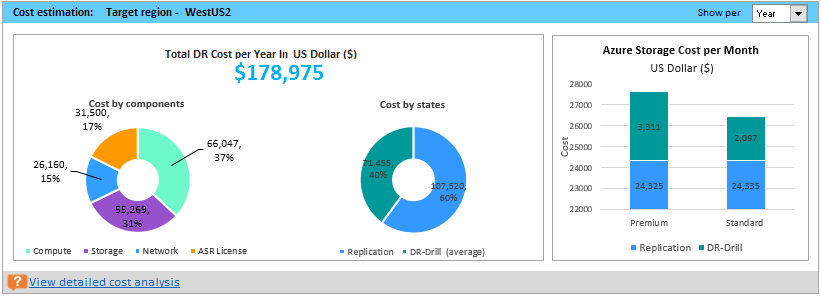
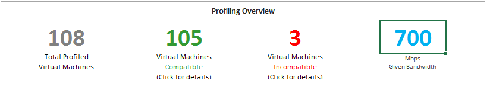
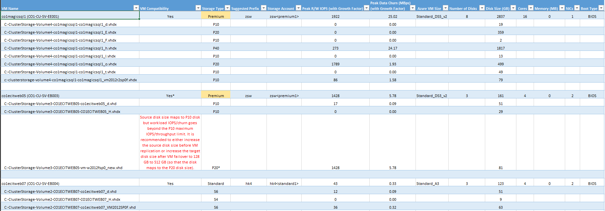
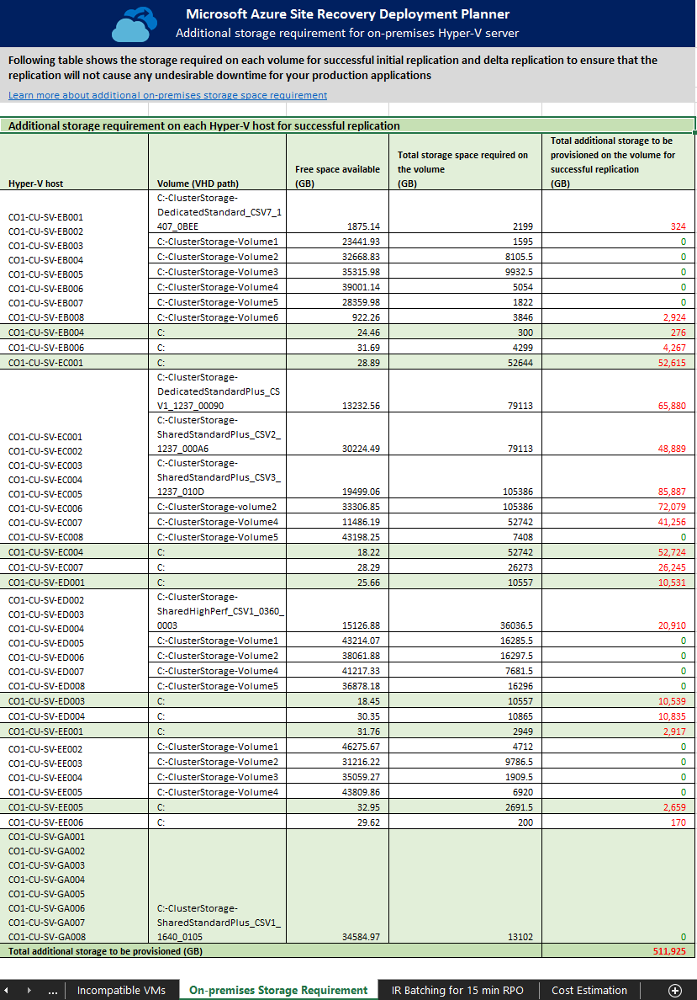
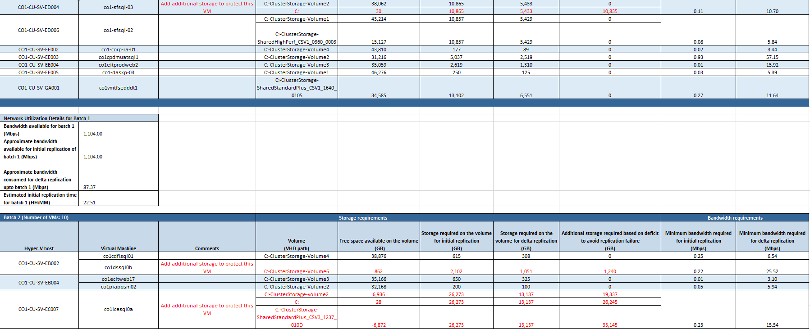

---
title: Azure Site Recovery deployment planner for Hyper-V-to-Azure| Microsoft Docs
description: This article describes analysis of generated report of Azure Site Recovery deployment planner for Hyper-V to Azure scenario.
services: site-recovery
documentationcenter: ''
author: nsoneji
manager: garavd
editor:

ms.assetid:
ms.service: site-recovery
ms.workload: storage-backup-recovery
ms.tgt_pltfrm: na
ms.devlang: na
ms.topic: hero-article
ms.date: 12/02/2017
ms.author: nisoneji

---   
# Analyze the Azure Site Recovery deployment planner report
The generated Microsoft Excel report contains the following sheets:

## On-premises summary
The On-premises summary worksheet provides an overview of the profiled Hyper-V environment

**Start Date** and **End Date**: The start and end dates of the profiling data considered for report generation. By default, the start date is the date when profiling starts, and the end date is the date when profiling stops. This can be the ‘StartDate’ and ‘EndDate’ values if the report is generated with these parameters.

**Total number of profiling days**: The total number of days of profiling between the start and end dates for which the report is generated.

**Number of compatible virtual machines**: The total number of compatible VMs for which the required network bandwidth, required number of storage accounts, Microsoft Azure cores are calculated.

**Total number of disks across all compatible virtual machines**: The total number of disks across all compatible VMs.

**Average number of disks per compatible virtual machine**: The average number of disks calculated across all compatible VMs.

**Average disk size (GB)**: The average disk size calculated across all compatible VMs.

**Desired RPO (minutes)**: Either the default recovery point objective or the value passed for the ‘DesiredRPO’ parameter at the time of report generation to estimate required bandwidth.

**Desired bandwidth (Mbps)**: The value that you have passed for the ‘Bandwidth’ parameter at the time of report generation to estimate achievable RPO.

**Observed typical data churn per day (GB)**: The average data churn observed across all profiling days.

## Recommendations  
The recommendations sheet of the Hyper-V to Azure report has the following details as per the selected desired RPO:

### Profile data

**Profiled data period**: The period during which the profiling was run. By default, the tool includes all profiled data in the calculation. If you have used StartDate and EndDate option in report generation, it generates the report for the specific period. 

**Number of Hyper-V servers profiled**: The number of Hyper-V servers whose VMs’ report is generated. Click on the number to view the name of the Hyper-V servers. It opens the On-premises Storage Requirement sheet where all the servers are listed along with their storage requirement.    

**Desired RPO**: The recovery point objective for your deployment. By default, the required network bandwidth is calculated for RPO values of 15, 30, and 60 minutes. Based on the selection, the affected values are updated on the sheet. If you have used the DesiredRPOinMin parameter while generating the report, that value is shown in the Desired RPO result.

### Profiling overview

**Total Profiled Virtual Machines**: The total number of VMs whose profiled data is available. If the VMListFile has names of any VMs, which were not profiled, those VMs are not considered in the report generation and are excluded from the total profiled VMs count.

**Compatible Virtual Machines**: The number of VMs that can be protected to Azure by using Azure Site Recovery. It is the total number of compatible VMs for which the required network bandwidth, number of storage accounts, number of Azure cores are calculated. The details of every compatible VM are available in the "Compatible VMs" section.

**Incompatible Virtual Machines**: The number of profiled VMs that are incompatible for protection with Azure Site Recovery. The reasons for incompatibility are noted in the "Incompatible VMs" section. If the VMListFile has names of any VMs that were not profiled, those VMs are excluded from the incompatible VMs count. These VMs are listed as "Data not found" at the end of the "Incompatible VMs" section.

**Desired RPO**: Your desired recovery point objective, in minutes. The report is generated for three RPO values: 15 (default), 30, and 60 minutes. The bandwidth recommendation in the report is changed based on your selection in the Desired RPO drop-down list given at the top right of the sheet. If you have generated the report by using the -DesiredRPO parameter with a custom value, this custom value shows as the default in the Desired RPO drop-down list.

### Required network bandwidth (Mbps)

**To meet RPO 100 percent of the time**: The recommended bandwidth in Mbps to be allocated to meet your desired RPO 100 percent of the time. This amount of bandwidth must be dedicated for steady-state delta replication of all your compatible VMs to avoid any RPO violations.

**To meet RPO 90 percent of the time**: Because of broadband pricing or for any other reason, if you cannot set the bandwidth needed to meet your desired RPO 100 percent of the time, you can choose to go with a lower bandwidth setting that can meet your desired RPO 90 percent of the time. To understand the implications of setting this lower bandwidth, the report provides a what-if analysis on the number and duration of RPO violations to expect.

**Achieved Throughput**: The throughput from the server on which you have run the GetThroughput command to the Azure region where the storage account is located. This throughput number indicates the estimated level that you can achieve when you protect the compatible VMs by using Azure Site Recovery, provided that Hyper-V server storage and network characteristics remain the same as that of the server from which you have run the tool.

For all enterprise Azure Site Recovery deployments, we recommend that you use [ExpressRoute](https://aka.ms/expressroute).

### Required storage accounts
The following chart shows the total number of storage accounts (standard and premium) that are required to protect all the compatible VMs. To learn which storage account to use for each VM, see the "VM-storage placement" section.

### Required number of Azure cores
This result is the total number of cores to be set up before failover or test failover of all the compatible VMs. If too few cores are available in the subscription, Azure Site Recovery fails to create VMs at the time of test failover or failover.

### Additional on-premises storage requirement

The total free storage required on Hyper-V servers for successful initial replication and delta replication to ensure that the VM replication will not cause any undesirable downtime for your production applications. Detail of each volume requirement is available in [on-premises storage requirement](#on-premises-storage-requirement). 

To understand why free space is required for the replication, refer to [On-premises storage requirement](#why-do-i-need-free-space-on-the-hyper-v-server-for-the-replication) section.

### Maximum copy frequency
The recommended maximum copy frequency must be set for the replication to achieve the desired RPO. Default is 5 minutes. You can set 30 seconds copy frequency to achieve better RPO.

### What-if analysis

This analysis outlines how many violations could occur during the profiling period when you set a lower bandwidth for the desired RPO to be met only 90%of the time. One or more RPO violations can occur on any given day. The graph shows the peak RPO of the day. Based on this analysis, you can decide if the number of RPO violations across all days and peak RPO hit per day is acceptable with the specified lower bandwidth. If it is acceptable, you can allocate the lower bandwidth for replication, else allocate higher bandwidth as suggested to meet the desired RPO 100 percent of the time. 

### Recommendation for successful initial replication
In this section, we recommend the number of batches in which the VMs to be protected and the minimum bandwidth required to complete initial replication (IR) successfully. 

The VM must be protected in the given batch order. Each batch has specific list of VMs. Batch 1 VMs must be protected before Batch 2. Batch 2 VMs must be protected before Batch 3 VMs and so on. Once initial replication of the Batch 1 VMs is completed, you can enable replication for Batch 2 VMs. Similarly, once initial replication of VMs of Batch 2 is completed, you can enable replication for Batch 3 VMs and so on. If the batch order is not followed, sufficient bandwidth for initial replication may not be available for the VMs, which are protected later. Result is, either VMs will never be able to complete initial replication, or few protected VMs may go into resync mode. IR batching for the selected RPO sheet has the detailed information about which VMs should be included in each batch.

The graph here shows the bandwidth distribution for initial replication and delta replication across batches in the given batch order. When you protect VMs of the first batch, full bandwidth is available for initial replication. Once initial replication is over for the first batch, part of bandwidth will be required for delta replication. The remaining bandwidth will be available for initial replication of VMs of the second batch. The Batch 2 bar shows the required delta replication bandwidth for Batch 1 VMs and the bandwidth available for initial replication for Batch 2 VMs. Similarly, Batch 3 bar shows the bandwidth required for delta replication for previous batches (Batch 1 and Batch 2 VMs) and the bandwidth available for initial replication for Batch 3 and so on.  Once initial replication of all the batches is over, the last bar shows the bandwidth required for delta replication for all the protected VMs. 

**Why do I need initial replication batching?**
The completion time of the initial replication is based on the VM disk size, used disk space, and available network throughput. The detail is available in IR batching for a selected RPO sheet.

### Cost estimation
The graph shows the summary view of the estimated total disaster recovery (DR) cost to Azure of your chosen target region and the currency that you have specified for report generation.

The summary helps you to understand the cost that you need to pay for storage, compute, network, and license when you protect all your compatible VMs to Azure using Azure Site Recovery. The cost is calculated on for compatible VMs and not on all the profiled VMs.  
 
You can view the cost either monthly or yearly. Learn more about [supported target regions](./site-recovery-hyper-v-deployment-planner-cost-estimation.md#supported-target-regions) and [supported currencies](./site-recovery-hyper-v-deployment-planner-cost-estimation.md#supported-currencies).

**Cost by components**
The total DR cost is divided into four components: Compute, Storage, Network, and Azure Site Recovery license cost. The cost is calculated based on the consumption that will be incurred during replication and at DR drill time for compute, storage (premium and standard), ExpressRoute/VPN that is configured between the on-premises site and Azure, and Azure Site Recovery license.

**Cost by states**
The total disaster recovery (DR) cost is categories based on two different states - Replication and DR drill. 

**Replication cost**:  The cost that will be incurred during replication. It covers the cost of storage, network, and Azure Site Recovery license. 

**DR-Drill cost**: The cost that will be incurred during test failovers. Azure Site Recovery spins up VMs during test failover. The DR drill cost covers the running VMs’ compute and storage cost. 

**Azure storage cost per Month/Year**
It shows the total storage cost that will be incurred for premium and standard storage for replication and DR drill.
You can view detailed cost analysis per VM in the [Cost Estimation](site-recovery-hyper-v-deployment-planner-cost-estimation.md) sheet.

### Growth factor and percentile values used
This section at the bottom of the sheet shows the percentile value used for all the performance counters of the profiled VMs (default is 95th percentile), and the growth factor (default is 30 percent) that's used in all the calculations.

## Recommendations with available bandwidth as input

You might have a situation where you know that you cannot set a bandwidth of more than x Mbps for Azure Site Recovery replication. The tool allows you to input available bandwidth (using the -Bandwidth parameter during report generation) and get the achievable RPO in minutes. With this achievable RPO value, you can decide whether you need to provision additional bandwidth or you are OK with having a disaster recovery solution with this RPO.

## VM-Storage placement recommendation 

**Disk Storage Type**: Either a standard or premium storage account, which is used to replicate all the corresponding VMs mentioned in the **VMs to Place** column.

**Suggested Prefix**: The suggested three-character prefix that can be used for naming the storage account. You can use your own prefix, but the tool's suggestion follows the [partition naming convention for storage accounts](https://aka.ms/storage-performance-checklist).

**Suggested Account Name**: The storage-account name after you include the suggested prefix. Replace the name within the angle brackets (< and >) with your custom input.

**Log Storage Account**: All the replication logs are stored in a standard storage account. For VMs that replicate to a premium storage account, set up an additional standard storage account for log storage. A single standard log-storage account can be used by multiple premium replication storage accounts. VMs that are replicated to standard storage accounts use the same storage account for logs.

**Suggested Log Account Name**: Your storage log account name after you include the suggested prefix. Replace the name within the angle brackets (< and >) with your custom input.

**Placement Summary**: A summary of the total VMs' load on the storage account at the time of replication and test failover or failover. It includes the total number of VMs mapped to the storage account, total read/write IOPS across all VMs being placed in this storage account, total write (replication) IOPS, total setup size across all disks, and total number of disks.

**Virtual Machines to Place**: A list of all the VMs that should be placed on the given storage account for optimal performance and use.

## Compatible VMs
The Microsoft Excel report generated by Azure Site Recovery deployment planner provides all compatible VMs details in "Compatible VMs" sheet.

**VM Name**: The VM name that's used in the VMListFile when a report is generated. This column also lists the disks (VHDs) that are attached to the VMs. The names include the Hyper-V host names where the VMs were placed when the tool discovered them during the profiling period.

**VM Compatibility**: Values are **Yes** and **Yes**\*. **Yes**\* is for instances in which the VM is a fit for [Azure Premium Storage](https://aka.ms/premium-storage-workload). Here, the profiled high churn or IOPS disk fits in higher premium disk size than the size mapped to the disk. The storage account decides which premium storage disk type to map a disk to, based on its size. 
* <128 GB is a P10.
* 128 GB to 256 GB is a P15
* 256 GB to 512 GB is a P20.
* 512 GB to 1024 GB is a P30.
* 1025 GB to 2048 GB is a P40.
* 2049 GB to 4095 GB is a P50.

For example, if the workload characteristics of a disk put it in the P20 or P30 category, but the size maps it down to a lower premium storage disk type, the tool marks that VM as **Yes**\*. The tool also recommends that you either change the source disk size to fit into the recommended premium storage disk type or change the target disk type post-failover.

**Storage Type**: Standard or premium.

**Suggested Prefix**: The three-character storage-account prefix.

**Storage Account**: The name that uses the suggested storage-account prefix.

**Peak R/W IOPS (with Growth Factor)**: The peak workload read/write IOPS on the disk (default is 95th percentile), including the future growth factor (default is 30%). Note that the total read/write IOPS of a VM are not always the sum of the VM’s individual disks’ read/write IOPS, because the peak read/write IOPS of the VM are the peak of the sum of its individual disks' read/write IOPS during every minute of the profiling period.

**Peak Data Churn in MBps (with Growth Factor)**: The peak churn rate on the disk (default is 95th percentile), including the future growth factor (default is 30%). Note that the total data churn of the VM is not always the sum of the VM’s individual disks’ data churn, because the peak data churn of the VM is the peak of the sum of its individual disks' churn during every minute of the profiling period.

**Azure VM Size**: The ideal mapped Azure Cloud Services virtual-machine size for this on-premises VM. The mapping is based on the on-premises VM’s memory, number of disks/cores/NICs, and read/write IOPS. The recommendation is always the lowest Azure VM size that matches all the on-premises VM characteristics.

**Number of Disks**: The total number of virtual machine disks (VHDs) on the VM.

**Disk size (GB)**: The total size of all disks of the VM. The tool also shows the disk size for the individual disks in the VM.

**Cores**: The number of CPU cores on the VM.

**Memory (MB)**: The RAM on the VM.

**NICs**: The number of NICs on the VM.

**Boot Type**: Boot type of the VM. It can be either BIOS or EFI.

## Incompatible VMs
The Microsoft Excel report generated by Azure Site Recovery deployment planner provides all incompatible VMs details in "Incompatible VMs" sheet.

**VM Name**: The VM name that's used in the VMListFile when a report is generated. This column also lists the disks (VHDs) that are attached to the VMs. The names include the Hyper-V host names where the VMs were placed when the tool discovered them during the profiling period.

**VM Compatibility**: Indicates why the given VM is incompatible for use with Azure Site Recovery. The reasons are described for each incompatible disk of the VM and, based on published [storage limits](https://aka.ms/azure-storage-scalbility-performance), can be any of the following:

* Disk size is > 4095 GB. Azure Storage currently does not support data disk sizes greater than 4095 GB.

* OS disk is > 2047 GB for Generation 1 (BIOS boot type) VM.  Azure Site Recovery does not support OS disk size greater than 2047 GB for generation 1 VMs.

* OS disk is > 300 GB for Generation 2 (EFI boot type) VM. Azure Site Recovery does not support OS disk size greater than 300 GB for generation 2 VMs.

* VM name contains any of the following characters “” [] ` are not supported.  The tool cannot get profiled data of VMs, which have any of these characters in their names. 

* VHD is shared by two or more VMs. Azure does not support  VMs with shared VHD.

* VM with Virtual Fiber Channel is not supported. Azure Site Recovery does not support  VMs with Virtual Fiber Channel.

* Hyper-V cluster does not contain replication broker. Azure Site Recovery does not support a VM in a Hyper-V cluster if the Hyper-V replica broker is not configured for the cluster.

* VM is not highly available. Azure Site Recovery does not support a VM of Hyper-V cluster node whose VHDs are stored on the local disk instead of on the cluster disk. 

* Total VM size (replication + TFO) exceeds the supported premium storage-account size limit (35 TB). This incompatibility usually occurs when a single disk in the VM has a performance characteristic that exceeds the maximum supported Azure or Azure Site Recovery limits for standard storage. Such an instance pushes the VM into the premium storage zone. However, the maximum supported size of a premium storage account is 35 TB, and a single protected VM cannot be protected across multiple storage accounts. Also note that when a test failover is executed on a protected VM, if unmanaged disk is configured for test failover, it runs in the same storage account, where replication is progressing. In this instance, additional same amount of storage space is required as that of replication. It ensures replication to progress and test failover to succeed in parallel. When managed disk is configured for test failover, no additional space needs to be accounted for the test failover VM.

* Source IOPS exceeds supported storage IOPS limit of 7500 per disk.

* Source IOPS exceeds supported storage IOPS limit of 80,000 per VM.

* Average data churn exceeds supported Azure Site Recovery data churn limit of 10 MBps for average I/O size for the disk.

* Average effective write IOPS exceeds the supported Azure Site Recovery IOPS limit of 840 for disk.

* Calculated snapshot storage exceeds the supported snapshot storage limit of 10 TB.

**Peak R/W IOPS (with Growth Factor)**: The peak workload IOPS on the disk (default is 95th percentile), including the future growth factor (default is 30%). Note that the total read/write IOPS of the VM is not always the sum of the VM’s individual disks’ read/write IOPS, because the peak read/write IOPS of the VM is the peak of the sum of its individual disks' read/write IOPS during every minute of the profiling period.

**Peak Data Churn in MBps (with Growth Factor)**: The peak churn rate on the disk (default is 95th percentile) including the future growth factor (default is 30%). Note that the total data churn of the VM is not always the sum of the VM’s individual disks’ data churn, because the peak data churn of the VM is the peak of the sum of its individual disks' churn during every minute of the profiling period.

**Number of Disks**: The total number of VHDs on the VM.

**Disk size (GB)**: The total setup size of all disks of the VM. The tool also shows the disk size for the individual disks in the VM.

**Cores**: The number of CPU cores on the VM.

**Memory (MB)**: The amount of RAM on the VM.

**NICs**: The number of NICs on the VM.

**Boot Type**: Boot type of the VM. It can be either BIOS or EFI.

## Azure Site Recovery limits
The following table provides the Azure Site Recovery limits. These limits are based on our tests, but they cannot cover all possible application I/O combinations. Actual results can vary based on your application I/O mix. For best results, even after deployment planning, we always recommend that you perform extensive application testing by issuing a test failover to get the true performance picture of the application.
 
**Replication storage target** | **Average source disk I/O size** |**Average source disk data churn** | **Total source disk data churn per day**
---|---|---|---
Standard storage | 8 KB	| 2 MBps | 168 GB per disk
Premium P10 or P15 disk | 8 KB	| 2 MBps | 168 GB per disk
Premium P10 or P15 disk | 16 KB | 4 MBps |	336 GB per disk
Premium P10 or P15 disk | 32 KB or greater | 8 MBps | 672 GB per disk
Premium P20 or P30 or P40 or P50 disk | 8 KB	| 5 MBps | 421 GB per disk
Premium P20 or P30 or P40 or P50 disk | 16 KB or greater |10 MBps | 842 GB per disk

These limits are average numbers assuming a 30 percent I/O overlap. Azure Site Recovery is capable of handling higher throughput based on overlap ratio, larger write sizes, and actual workload I/O behavior. The preceding numbers assume a typical backlog of approximately five minutes. That is, after data is uploaded, it is processed and a recovery point is created within five minutes.

## On-premises storage requirement

The worksheet provides the total free storage space requirement for each volume of the Hyper-V servers (where VHDs reside) for successful initial replication and delta replication. Before enabling replication, add required storage space on the volumes to ensure that the replication will not cause any undesirable downtime of your production applications. 

Azure Site Recovery deployment planner identifies the optimal storage space requirement based on the VHDs size and the network bandwidth used for replication.

### Why do I need free space on the Hyper-V server for the replication?
* When you enable replication of a VM, Azure Site Recovery takes a snapshot of each VHD of the VM for initial replication (IR). While initial replication is going on, new changes are written to the disks by the application. Azure Site Recovery tracks these delta changes in the log files, which require additional storage space.  Till initial replication gets completed, the log files are stored locally. If sufficient space is not available for the log files and snapshot (AVHDX), replication will go into resynchronization mode and replication will never get completed. In the worst case, you need 100% additional free space of the VHD size for initial replication.
* Once initial replication is over, delta replication starts. Azure Site Recovery tracks these delta changes in the log files, which are stored on the volume where the VHDs of the VM reside. These logs files get replicated to Azure at a configured copy frequency. Based on the available network bandwidth, the log files take some time to get replicated to Azure. If sufficient free space is not available to store the log files, replication will be paused, and the replication status of the VM will go into resynchronization required.
* If network bandwidth is not enough to push the logs files into Azure, then logs files get piled up on the volume. In a worst-case scenario, when log files size increased to 50% of the VHD size, the replication of the VM will go into resynchronization required. In the worst case, you need 50% additional free space of the VHD size for delta replication.

**Hyper-V host**: The list of profiled Hyper-V servers. If a server is part of a Hyper-V cluster, all the cluster nodes are grouped together.

**Volume (VHD path)**: Each volume of a Hyper-V host where VHDs/VHDXs are present. 

**Free space available (GB)**: The free space available on the volume.

**Total storage space required on the volume (GB**: The total free storage space required on the volume for successful initial replication and delta replication. 

**Total additional storage to be provisioned on the volume for successful replication**: It recommends the total additional space that must be provisioned on the volume for successful initial replication and delta replication.

## Initial replication batching 

### Why do I need initial replication (IR) batching?
If all the VMs are protected at the same time, the free storage requirement would be much higher and if enough storage is not available, the replication of the VMs will go into resynchronization mode. Also, the network bandwidth requirement would be much higher to complete initial replication of all VMs together successfully. 

### Initial replication batching for a selected RPO
This worksheet provides the detail view of each batch for initial replication (IR). For each RPO, a separate IR batching sheet is created. 

Once you have followed the on-premises storage requirement recommendation for each volume, the main information that you need to replicate is the list of VMs that can be protected in parallel. These VMs are group together in a batch. There can be multiple batches. You must protect the VMs in the given batch order. First protect Batch 1 VMs and once initial replication is completed, protect Batch 2 VMs, and so on. You can get the list of batches and corresponding VMs from this sheet. 

### Each batch provides the following information 
**Hyper-V host**: The Hyper-V host of the VM to be protected.
Virtual machine: The VM to be protected. 

**Comments**: If any action is required for a specific volume of a VM, the comment is provided here.  For example, if sufficient free space is not available on a volume, it says Add additional storage to protect this VM in the comment.

**Volume (VHD path)**:  The volume name where the VM’s VHDs reside. 
Free space available on the volume (GB):  The free disk space available on the volume for the VM. While calculating available free space on the volumes, it considers the disk space used for delta replication by the VMs of the previous batches whose VHDs are on the same volume.  

For example, VM1, VM2 and VM3 reside on a volume say E:\VHDpath. Before replication, free space on the volume is 500 GB. VM1 is part Batch 1, VM2 is part of Batch 2, and VM3 is part of Batch3.  For VM1, the free space available is 500 GB. For VM2, the free space available would be 500 – disk space required for delta replication for VM1.  Say VM1 requires 300 GB space for delta replication, the free space available for VM2 would be 500 GB – 300 GB = 200 GB.  Similarly, VM2 requires 300 GB for delta replication. The free space available for VM3 would be 200 GB - 300 GB = -100 GB.

**Storage required on the volume for initial replication (GB)**: The free storage space required on the volume for the VM for initial replication.

**Storage required on the volume for delta replication (GB)**:  The free storage space required on the volume for the VM for delta replication.

**Additional storage required based on deficit to avoid replication failure (GB)**: The additional storage space required on the volume for the VM.  It is the max of initial replication and delta replication storage space requirement - free space available on the volume.

**Minimum bandwidth required for initial replication (Mbps)**: The minimum bandwidth required for initial replication for the VM.

**Minimum bandwidth required for delta replication (Mbps)**: The minimum bandwidth required for delta replication for the VM

### Network utilization details for each batch 
Each batch table provides a summary of network utilization of the batch.

**Bandwidth available for Batch**: The bandwidth available for the batch after considering the previous batch’s delta replication bandwidth.

**Approximate bandwidth available for initial replication of batch**: The bandwidth available for initial replication of the VMs of the batch. 

**Approximate bandwidth consumed for delta replication of batch**: The bandwidth needed for delta replication of the VMs of the batch. 

**Estimated Initial Replication time for Batch (HH:MM)**: The estimated initial replication time in Hours:Minutes.

## Cost estimation
Learn more about [cost estimation](site-recovery-hyper-v-deployment-planner-cost-estimation.md). 

## Next steps
Learn more about [cost estimation](site-recovery-hyper-v-deployment-planner-cost-estimation.md).