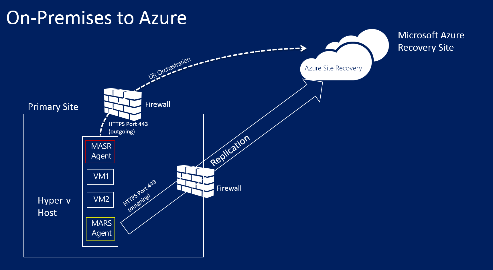
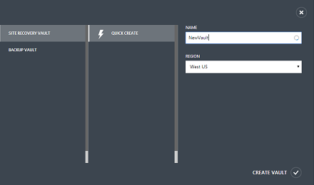
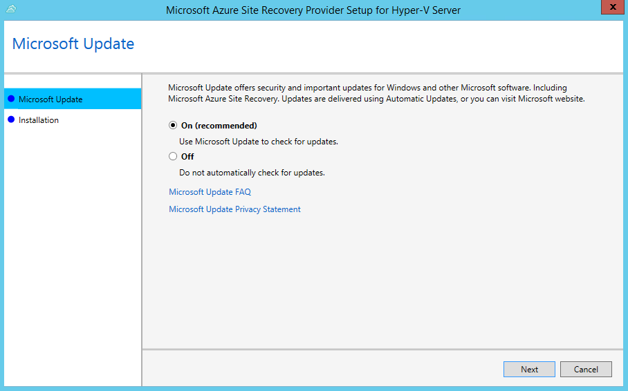
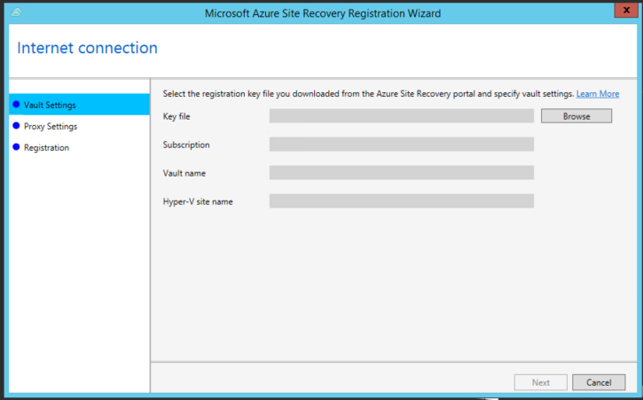
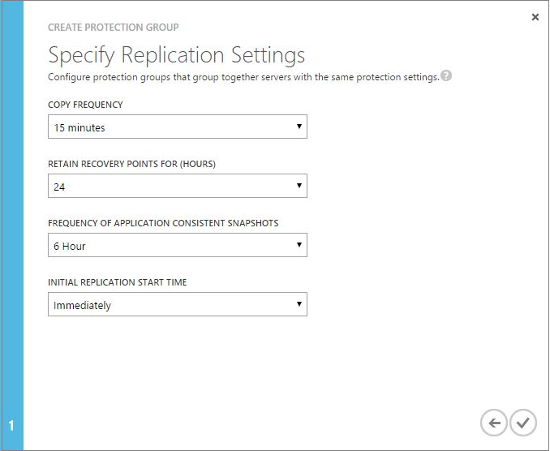
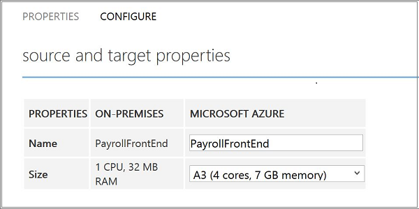
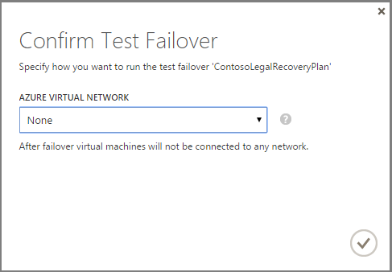

<properties
	pageTitle="Replicate between on-premises Hyper-V virtual machines and Azure (without VMM) with Site Recovery | Microsoft Azure"
	description="This article describes how to replicate Hyper-V virtual machines to Azure with Azure Site Recovery when machines aren't managed in VMM clouds."
	services="site-recovery"
	documentationCenter=""
	authors="rayne-wiselman"
	manager="jwhit"
	editor=""/>

<tags
	ms.service="site-recovery"
	ms.devlang="na"
	ms.topic="article"
	ms.tgt_pltfrm="na"
	ms.workload="storage-backup-recovery"
	ms.date="05/03/2016"
	ms.author="raynew"/>

# Replicate between on-premises Hyper-V virtual machines and Azure (without VMM) with Azure Site Recovery

> [AZURE.SELECTOR]
- [Azure Portal](site-recovery-hyper-v-site-to-azure.md)
- [PowerShell - ARM](site-recovery-deploy-with-powershell-resource-manager.md)
- [Classic Portal](site-recovery-hyper-v-site-to-azure-classic.md)

Read this article to learn about deploying Site Recovery to replicate Hyper-V virtual machines to Azure when Hyper-V hosts aren't managed in System Center Virtual Machine Manager (VMM) clouds. 

The article summarizes the deployment prerequisites, helps you to configure replication settings, and enable protection for virtual machines. It finishes up by testing failover to make sure everything's working as expected.

After reading this article any comments or questions at the bottom, or on the [Azure Recovery Services Forum](https://social.msdn.microsoft.com/forums/azure/home?forum=hypervrecovmgr).

## Overview

Organizations need a business continuity and disaster recovery (BCDR) strategy that a determines how apps, workloads, and data stay running and available during planned and unplanned downtime, and recover to normal working conditions as soon as possible. Your BCDR strategy center's around solutions that keep business data safe and recoverable, and workloads continuously available, when disaster occurs.

Site Recovery is an Azure service that contributes to your BCDR strategy by orchestrating replication of on-premises physical servers and virtual machines to the cloud (Azure) or to a secondary datacenter. When outages occur in your primary location, you fail over to the secondary site to keep apps and workloads available. You fail back to your primary location when it returns to normal operations.

Site Recovery can be used in a number of scenarios and can protect a number of workloads. Learn more in [What is Azure Site Recovery?](site-recovery-overview.md).

## Azure prerequisites

- You'll need a [Microsoft Azure](https://azure.microsoft.com/) account. You can start with a [free trial](pricing/free-trial/).
- You'll need an Azure storage account to store replicated data. The account needs geo-replication enabled. It should be in the same region as the Azure Site Recovery vault and be associated with the same subscription. [Learn more about Azure storage](../storage/storage-introduction.md). Note that we don't support moving storage accounts created using the [new Azure portal](../storage/storage-create-storage-account.md) across resource groups.
- You'll need an Azure virtual network so that Azure virtual machines will be connected to a network when you fail over from your primary site.

## Hyper-V prerequisites

- In the source on-premises site you'll need one or more servers running Windows Server 2012 R2 with the Hyper-V role installed. This server should:
- Contain one or more virtual machines.
- Be connected to the Internet, either directly or via a proxy.
- Be running the fixes described in KB [2961977](https://support.microsoft.com/en-us/kb/2961977 "KB2961977").

## Virtual machine prerequisites

Virtual machines you want to protect should conform with [Azure virtual machine requirements](site-recovery-best-practices.md#azure-virtual-machine-requirements).

## Provider and agent prerequisites

As part of Azure Site Recovery deployment you’ll install the Azure Site Recovery Provider and the Azure Recovery Services Agent on each Hyper-V server. Note that:

- We recommend you always run the latest versions of the Provider and agent. These are available in the Site Recovery portal.
- All Hyper-V servers in a vault should have the same versions of the Provider and agent.
- The Provider running on the server connects to Site Recovery over the internet. You can do this without a proxy, with the proxy settings currently configured on the Hyper-V server, or with custom proxy settings that you configure during Provider installation. You'll need to make sure that the proxy server you want to use can access these the URLs for connecting to Azure:
	- *.hypervrecoverymanager.windowsazure.com
	- *.accesscontrol.windows.net
	- *.backup.windowsazure.com		
	- *.blob.core.windows.net
	- *.store.core.windows.net
	
- In addition allow the IP addresses described in [Azure Datacenter IP Ranges](https://www.microsoft.com/download/details.aspx?id=41653) and HTTPS (443) protocol. You would have to white-list IP ranges of the Azure region that you plan to use and that of West US.

This graphic shows the different communication channels and ports used by Site Recovery for orchestration and replication

## Step 1: Create a vault

1. Sign in to the [Management Portal](https://portal.azure.com).

2. Expand **Data Services** > **Recovery Services** and click **Site Recovery Vault**.

3. Click **Create New** > **Quick Create**.

4. In **Name**, enter a friendly name to identify the vault.

5. In **Region**, select the geographic region for the vault. To check supported regions see Geographic Availability in [Azure Site Recovery Pricing Details](pricing/details/site-recovery/).

6. Click **Create vault**.

	

Check the status bar to confirm that the vault was successfully created. The vault will be listed as **Active** on the main Recovery Services page.

## Step 2: Create a Hyper-V site

1. In the Recovery Services page, click the vault to open the Quick Start page. Quick Start can also be opened at any time using the icon.

	

2. In the dropdown list, select **Between an on-premises Hyper-V site and Azure**.

	

3. In **Create a Hyper-V Site** click **Create Hyper-V site**. Specify a site name and save.

	

## Step 3: Install the Provider and agent
Install the Provider and agent on each Hyper-V server that has VMs you want to protect.

If you're installing on a Hyper-V cluster, performs steps 5-11 on each node in the failover cluster. After all nodes are registered and protection is enabled, virtual machines will be protected even if they migrate across nodes in the cluster.

1. In **Prepare Hyper-V servers**, click **Download a registration key** file.
2. On the **Download Registration Key** page, click **Download** next to the site. Download the key to a safe location that can be easily accessed by the Hyper-V server. The key is valid for 5 days after it's generated.

	

4. Click **Download the Provider** to obtain the latest version.
5. Run the file on each Hyper-V server you want to register in the vault. The file installs two components:
	- **Azure Site Recovery Provider**—Handles communication and orchestration between the Hyper-V server and the Azure Site Recovery portal.
	- **Azure Recovery Services Agent**—Handles data transport between virtual machines running on the source Hyper-V server and Azure storage.
6. In **Microsoft Update** you can opt in for updates. With this setting enabled, Provider and Agent updates will be installed according to your Microsoft Update policy.

	

7. In **Installation** specify where you want to install the Provider and Agent on the Hyper-V server.

	

8. After installation is complete continue setup to register the server in the vault.

9. On the **Vault Settings** page, click **Browse** to select the key file. Specify the Azure Site Recovery subscription, the vault name, and the Hyper-V site to which the Hyper-V server belongs.

	

10. On the **Internet Connection** page you specify how the Provider connects to Azure Site Recovery. Select **Use default system proxy settings** to use the default Internet connection settings configured on the server. If you don't specify a value the default settings will be used.

	

11. Registration starts to register the server in the vault.

	

11. After registration finishes metadata from the Hyper-V server is retrieved by Azure Site Recovery and the server is displayed on the **Hyper-V Sites** tab on the **Servers** page in the vault.

### Install the Provider from the command line

As an alternative you can install the Azure Site Recovery Provider from the command line. You should use this method if you want to install the Provider on a computer running Windows Server Core 2012 R2. Run from the command line as follows:

1. Download the Provider installation file and registration key to a folder. For example C:\ASR.
2. Run a command prompt as an Administrator and type:

    	C:\Windows\System32> CD C:\ASR
    	C:\ASR> AzureSiteRecoveryProvider.exe /x:. /q

3. Then install the Provider by running:

		C:\ASR> setupdr.exe /i

4. Run the following to complete registration:

    	CD C:\Program Files\Microsoft Azure Site Recovery Provider
    	C:\Program Files\Microsoft Azure Site Recovery Provider\> DRConfigurator.exe /r  /Friendlyname <friendly name of the server> /Credentials <path of the credentials file> /EncryptionEnabled <full file name to save the encryption certificate>         

Where parameters include:

- **/Credentials**: Specify the location of the registration key you downloaded.
- **/FriendlyName**: Specify a name to identify the Hyper-V host server. This name will appear in the portal
- **/EncryptionEnabled**: Optional. Specify whether you want to encrypt replica virtual machines in Azure (at rest encryption).
- **/proxyAddress**; **/proxyport**; **/proxyUsername**; **/proxyPassword**: Optional. Specify proxy parameters if you want to use a custom proxy, or your existing proxy requires authentication.

## Step 4: Create an Azure storage account 

1. In **Prepare resources** select **Create Storage Account**  to create an Azure storage account if you don't have one. The account should have geo-replication enabled. It should be in the same region as the Azure Site Recovery vault, and be associated with the same subscription.

	

>[AZURE.NOTE] We do not support the move of Storage accounts created using the [new Azure portal](../storage/storage-create-storage-account.md) across resource groups.

## Step 5: Create and configure protection groups

Protection groups are logical groupings of virtual machines that you want to protect using the same protection settings. You apply protection settings to a protection group, and those settings are applied to all virtual machines that you add to the group.

1. In **Create and configure protection groups** click **Create a protection group**. If any prerequisites aren't in place a message is issued and you can click **View details** for more information.

2. In the **Protection Groups** tab, add a protection group. Specify a name, the source Hyper-V site, the target **Azure**, your Azure Site Recovery subscription name, and the Azure storage account.

	

2. In **Replication settings** set the **Copy frequency** to specify how often the data delta should be synchronized between the source and target. You can set to 30 seconds, 5 minutes, or 15 minutes.
3. In **Retain recovery points** specify how many hours of recovery history should be stored.
4. In **Frequency of application-consistent snapshots** you can specify whether to take snapshots that use Volume Shadow Copy Service (VSS) to ensure that applications are in a consistent state when the snapshot is taken. By default these aren't taken. Make sure this value is set to less than the number of additional recovery points you configure. This is only supported if the virtual machine is running a Windows operating system.
5. In **Initial replication start time** specify when initial replication of virtual machines in the protection group should be sent to Azure.

	

## Step 6: Enable virtual machine protection

Add virtual machines to a protection group to enable protection for them.

>[AZURE.NOTE] Protecting VMs running Linux with a static IP address isn't supported. 

1. On the **Machines** tab for the protection group, click** Add virtual machines to protection groups to enable protection**.
2. On the **Enable Virtual Machine Protection** page select the virtual machines you want to protect.

	

	The Enable Protection jobs begins. You can track progress on the **Jobs** tab. After the Finalize Protection job runs the virtual machine is ready for failover.
3. After protection is set up you can:

	- View virtual machines in **Protected Items** > **Protection Groups** > *protectiongroup_name* > **Virtual Machines** You can drill down to machine details in the **Properties** tab..
	- Configure the failover properties for a virtual machines in **Protected Items** > **Protection Groups** > *protectiongroup_name* > **Virtual Machines** *virtual_machine_name* > **Configure**. You can configure:
		- **Name**: The name of the virtual machine in Azure.
		- **Size**: The target size of the virtual machine that fails over.

		
	- Configure additional virtual machine settings in *Protected Items** > **Protection Groups** > *protectiongroup_name* > **Virtual Machines** *virtual_machine_name* > **Configure**, including:

		- **Network adapters**: The number of network adapters is dictated by the size you specify for the target virtual machine. Check [virtual machine size specs](../virtual-machines/virtual-machines-linux-sizes.md#size-tables) for the number of nics supported by the virtual machine size.

			When you modify the size for a virtual machine and save the settings, the number of network adapter will change when you open **Configure** page the next time. The number of network adapters of target virtual machines is minimum of the number of network adapters on source virtual machine and maximum number of network adapters supported by the size of the virtual machine chosen. It is explained below:

			- If the number of network adapters on the source machine is less than or equal to the number of adapters allowed for the target machine size, then the target will have the same number of adapters as the source.
			- If the number of adapters for the source virtual machine exceeds the number allowed for the target size then the target size maximum will be used.
			- For example if a source machine has two network adapters and the target machine size supports four, the target machine will have two adapters. If the source machine has two adapters but the supported target size only supports one then the target machine will have only one adapter. 	
		- **Azure network**: Specify the network to which the virtual machine should fail over. If the virtual machine has multiple network adapters all adapters should connected to the same Azure network.
		- **Subnet** For each network adapter on the virtual machine, select the subnet in the Azure network to which the machine should connect after failover.
		- **Target IP address**: If the network adapter of source virtual machine is configured to use static a IP address then you can specify the IP address for the target virtual machine to ensure that the machine has the same IP address after failover.  If you don't specify an IP address then any available address will be assigned at the time of failover. If you specify an address that's in use then failover will fail.

		

## Step 7: Create a recovery plan

In order to test the deployment you can run a test failover for a single virtual machine or a recovery plan that contains one or more virtual machines. [Learn more](site-recovery-create-recovery-plans.md) about creating a recovery plan.

## Step 8: Test the deployment

There are two ways to run a test failover to Azure.

- **Test failover without an Azure network**—This type of test failover checks that the virtual machine comes up correctly in Azure. The virtual machine won’t be connected to any Azure network after failover.
- **Test failover with an Azure network**—This type of failover checks that the entire replication environment comes up as expected and that failed over the virtual machines connects to the specified target Azure network. Note that for test failover the subnet of the test virtual machine will be figured out based on the subnet of the replica virtual machine. This is different to regular replication when the subnet of a replica virtual machine is based on the subnet of the source virtual machine.

If you want to run a test failover without specifying an Azure network you don’t need to prepare anything. 

To run a test failover with a target Azure network you’ll need to create a new Azure network that’s isolated from your Azure production network (default behavior when you create a new network in Azure). Read [run a test failover](site-recovery-failover.md#run-a-test-failover) for more details.

To fully test your replication and network deployment you'll need to set up the infrastructure so that the replicated virtual machine to work as expected. One way of doing this to to set up a virtual machine as a domain controller with DNS and replicate it to Azure using Site Recovery to create it in the test network by running a test failover.  [Read more](site-recovery-active-directory.md#considerations-for-test-failover) about test failover considerations for Active Directory.

Run the test failover as follows:

>[AZURE.NOTE] To get the best performance when you do a failover to Azure, ensure that you have installed the Azure Agent in the protected machine. This helps in booting faster and also helps in diagnosis in case of issues. Linux agent can be found [here](https://github.com/Azure/WALinuxAgent) - and Windows agent can be found [here](http://go.microsoft.com/fwlink/?LinkID=394789)

1. On the **Recovery Plans** tab, select the plan and click **Test Failover**.
2. On the **Confirm Test Failover** page select **None** or a specific Azure network.  Note that if you select **None** the test failover will check that the virtual machine replicated correctly to Azure but doesn't check your replication network configuration.

	

3. On the **Jobs** tab you can track failover progress. You should also be able to see the virtual machine test replica in the Azure portal. If you’re set up to access virtual machines from your on-premises network you can initiate a Remote Desktop connection to the virtual machine.
4. When the failover reaches the **Complete testing** phase , click **Complete Test** to finish up the test failover. You can drill down to the **Job** tab to track failover progress and status, and to perform any actions that are needed.
5. After  failover you'll be able to see the virtual machine test replica in the Azure portal. If you’re set up to access virtual machines from your on-premises network you can initiate a Remote Desktop connection to the virtual machine.

	1. Verify that the virtual machines start successfully.
    2. If you want to connect to the virtual machine in Azure using Remote Desktop after the failover, enable Remote Desktop Connection on the virtual machine before you run the test failover. You will also need to add an RDP endpoint on the virtual machine. You can leverage an [Azure automation runbook](site-recovery-runbook-automation.md) to do that.
    3. After failover if you use a public IP address to connect to the virtual machine in Azure using Remote Desktop, ensure you don't have any domain policies that prevent you from connecting to a virtual machine using a public address.

6. After the testing is complete do the following:

	- Click **The test failover is complete**. Clean up the test environment to automatically power off and delete the test virtual machines.
	- Click **Notes** to record and save any observations associated with the test failover.
7. When the failover reaches the **Complete testing** phase finish the verification as follows:
	1. View the replica virtual machine in the Azure portal. Verify that the virtual machine starts successfully.
	2. If you’re set up to access virtual machines from your on-premises network you can initiate a Remote Desktop connection to the virtual machine.
	3. Click **Complete the test** to finish it.
	4. Click **Notes** to record and save any observations associated with the test failover.
	5.  Click **The test failover is complete**. Clean up the test environment to automatically power off and delete the test virtual machine.

## Next steps

After your deployment is set up and running, [learn more](site-recovery-failover.md) about failover.
