# Replicate Hyper-V virtual machines (without VMM) to Azure using Azure Site Recovery with the Azure portal

> [!div class="op_single_selector"]
> * [Azure portal](site-recovery-hyper-v-site-to-azure.md)
> * [Azure classic](site-recovery-hyper-v-site-to-azure-classic.md)
> * [PowerShell - Resource Manager](site-recovery-deploy-with-powershell-resource-manager.md)
>
>

This article describes how to replicate on-premises Hyper-V virtual machines to Azure, using [Azure Site Recovery](site-recovery-overview.md) in the Azure portal. In this deployment Hyper-V VMs aren't managed by System Center Virtual Machine Manager (VMM).

After reading this article, post any comments at the bottom, or ask technical questions on the [Azure Recovery Services Forum](https://social.msdn.microsoft.com/forums/azure/home?forum=hypervrecovmgr).

If you want to migrate machines to Azure (without failback), learn more in [this article](site-recovery-migrate-to-azure.md).

## Deployment steps

Follow the article to complete these deployment steps:

1. [Learn more](site-recovery-components.md#hyper-v-to-azure) about the architecture for this deployment. In addition, [learn about](site-recovery-hyper-v-azure-architecture.md) how Hyper-V replication works in Site Recovery.
2. Verify prerequisites and limitations.
3. Set up Azure network and storage accounts.
4. Prepare Hyper-V hosts.
5. Create a Recovery Services vault. The vault contains configuration settings, and orchestrates replication.
6. Specify source settings. Create a Hyper-V site that contains the Hyper-V hosts, and register the site in the vault. Install the Azure Site Recovery Provider, and the Microsoft Recovery Services agent, on the Hyper-V hosts.
7. Set up target and replication settings.
8. Enable replication for the VMs.
9. Run a test failover to make sure everything's working as expected.

## Prerequisites

**Requirement** | **Details** |
--- | --- |
**Azure** | Learn about [Azure requirements](site-recovery-prereq.md#azure-requirements).
**On-premises servers** | [Learn more](site-recovery-prereq.md#disaster-recovery-of-hyper-v-virtual-machines-to-azure-no-virtual-machine-manager) about requirements for the on-premises Hyper-V hosts.
**On-premises Hyper-V VMs** | VMs you want to replicate should be running a [supported operating system](site-recovery-support-matrix-to-azure.md#support-for-replicated-machine-os-versions), and conform with [Azure prerequisites](site-recovery-support-matrix-to-azure.md#failed-over-azure-vm-requirements).
**Azure URLs** | Hyper-V hosts need access to these URLs:   [!INCLUDE [site-recovery-URLS](../../includes/site-recovery-URLS.md)]   If you have IP address-based firewall rules, ensure they allow communication to Azure.   Allow the [Azure Datacenter IP Ranges](https://www.microsoft.com/download/confirmation.aspx?id=41653), and the HTTPS (443) port.   Allow IP address ranges for the Azure region of your subscription, and for West US (used for Access Control and Identity Management).

## Prepare for deployment

To prepare for deployment you need to:

1. [Set up an Azure network](#set-up-an-azure-network) in which Azure VMs will be located when they're created after failover.
2. [Set up an Azure storage account](#set-up-an-azure-storage-account) for replicated data.
3. [Prepare the Hyper-V hosts](#prepare-the-hyper-v-hosts) to ensure they can access the required URLs.

### Set up an Azure network

Set up an Azure network. You’ll need this so that the Azure VMs created after failover are connected to a network.

* The network should be in the same region as the Recovery Services vault.
* Depending on the resource model you want to use for failed over Azure VMs, you set up the Azure network in [Resource Manager mode](../virtual-network/virtual-networks-create-vnet-arm-pportal.md), or [classic mode](../virtual-network/virtual-networks-create-vnet-classic-pportal.md).
* We recommend you set up a network before you begin. If you don't, you need to do it during Site Recovery deployment.
- Storage accounts used by Site Recovery can't be [moved](../azure-resource-manager/resource-group-move-resources.md) within the same, or across different, subscriptions.

### Set up an Azure storage account

- You need a standard/premium Azure storage account to hold data replicated to Azure.[Premium storage](../storage/storage-premium-storage.md) is typically used for virtual machines that need a consistently high IO performance, and low latency to host IO intensive workloads.
- If you want to use a premium account to store replicated data, you also need a standard storage account to store replication logs that capture ongoing changes to on-premises data.
- Depending on the resource model you want to use for failed over Azure VMs, you set up an account in [Resource Manager mode](../storage/storage-create-storage-account.md), or [classic mode](../storage/storage-create-storage-account-classic-portal.md).
- We recommend that you set up a storage account before you begin. If you don't you need to do it during Site Recovery deployment. The accounts must be in the same region as the Recovery Services vault.
- You can't move storage accounts used by Site Recovery across resource groups within the same subscription, or across different subscriptions.

### Prepare the Hyper-V hosts

* Make sure that the Hyper-V hosts meet the [prerequisites](site-recovery-prereq.md#disaster-recovery-of-hyper-v-virtual-machines-to-azure-no-virtual-machine-manager).
- Make sure that the hosts can access the required URLs.

## Create a Recovery Services vault
1. Sign in to the [Azure portal](https://portal.azure.com).
2. Click **New** > **Monitoring + Management** > **Backup and Site Recovery (OMS)**.  

    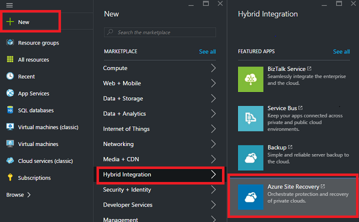

3. In **Name**, specify a friendly name to identify the vault. If you have more than one subscription, select one of them.

4. [Create a new resource group](../azure-resource-manager/resource-group-template-deploy-portal.md) or select an existing one, and specify an Azure region. Machines will be replicated to this region. To check supported regions, see Geographic Availability in [Azure Site Recovery Pricing Details](https://azure.microsoft.com/pricing/details/site-recovery/).

5. If you want to quickly access the vault from the Dashboard, click **Pin to dashboard**, and then click **Create**.

    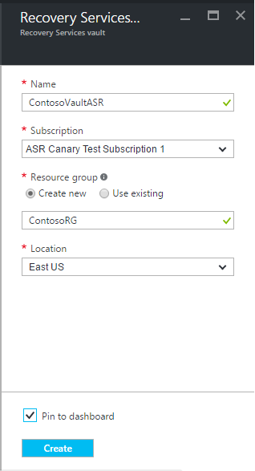

The new vault appears in the **Dashboard** > **All resources** list, and on the main **Recovery Services vaults** blade.

## Select the protection goal

Select what you want to replicate, and where you want to replicate to.

1. In the **Recovery Services vaults**, select the vault.
2. In **Getting Started**, click **Site Recovery** > **Prepare Infrastructure** > **Protection goal**.

    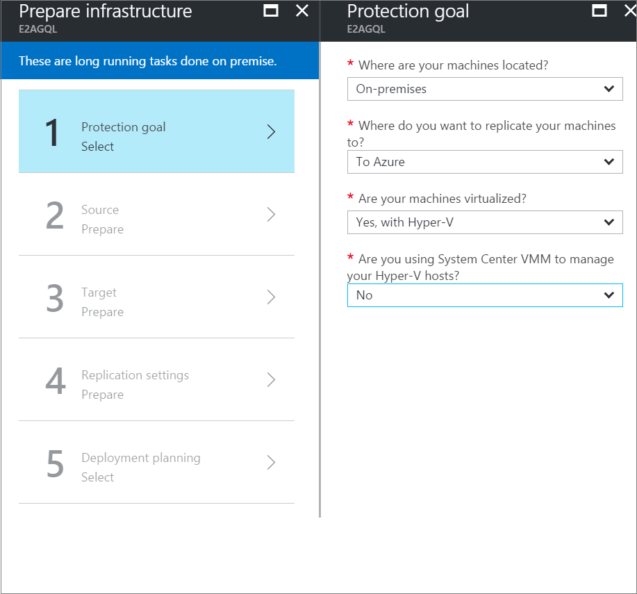
3. In **Protection goal**, select **To Azure**, and select **Yes, with Hyper-V**. Select **No** to confirm you're not using VMM. Then click **OK**.

    

## Set up the source environment

Set up the Hyper-V site, install the Azure Site Recovery Provider and the Azure Recovery Services agent on Hyper-V hosts, and register the site in the vault.

1. In **Prepare Infrastructure**, click **Source**. To add a new Hyper-V site as a container for your Hyper-V hosts or clusters, click **+Hyper-V Site**.

    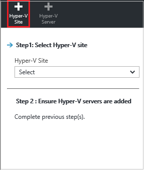
2. In **Create Hyper-V site**, specify a name for the site. Then click **OK**. Now, select the site you created, and click **+Hyper-V Server** to add a server to the site.

    

3. In **Add Server** > **Server type**, check that **Hyper-V server** is displayed.

    - Make sure that the Hyper-V server you want to add complies with the [prerequisites](#on-premises-prerequisites), and is able to access the specified URLs.
    - Download the Azure Site Recovery Provider installation file. You run this file to install the Provider and the Recovery Services agent on each Hyper-V host.

    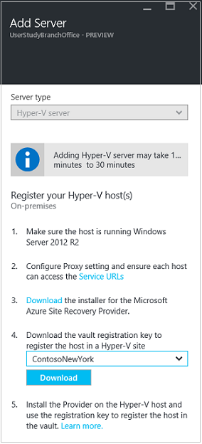

## Install the Provider and agent

1. Run the Provider setup file on each host you added to the Hyper-V site. If you're installing on a Hyper-V cluster, run setup on each cluster node. Installing and registering each Hyper-V cluster node ensures that VMs are protected, even if they migrate across nodes.
2. In **Microsoft Update**, you can opt in for updates so that Provider updates are installed in accordance with your Microsoft Update policy.
3. In **Installation**, accept or modify the default Provider installation location and click **Install**.
4. In **Vault Settings**, click **Browse** to select the vault key file that you downloaded. Specify the Azure Site Recovery subscription, the vault name, and the Hyper-V site to which the Hyper-V server belongs.

    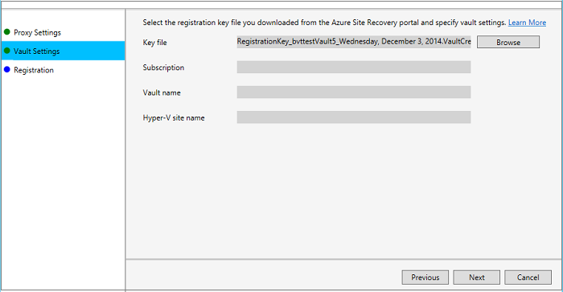

5. In **Proxy Settings**, specify how the Provider running on Hyper-V hosts connects to Azure Site Recovery over the internet.

	* If you want the Provider to connect directly select **Connect directly to Azure Site Recovery without a proxy**.
	* If your existing proxy requires authentication, or you want to use a custom proxy for the Provider connection, select **Connect to Azure Site Recovery using a proxy server**.
	* If you use a proxy:
        - Specify the address, port, and credentials
	    - Make sure the URLs described in the [prerequisites](#prerequisites) are allowed through the proxy.

    

6. After installation finishes, click **Register** to register the server in the vault.

	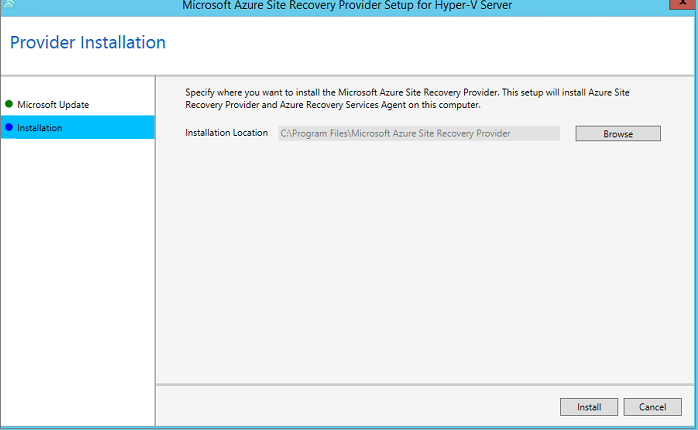

7. After registration finishes, metadata from the Hyper-V server is retrieved by Azure Site Recovery, and the server is displayed in **Site Recovery Infrastructure** > **Hyper-V Hosts**.

## Set up the target environment

Specify the Azure storage account for replication, and the Azure network to which Azure VMs will connect after failover.

1. Click **Prepare infrastructure** > **Target**.
2. Select the subscription and the resource group in which you want to create the Azure VMs after failover. Choose the deployment model that you want to use in Azure (classic or resource management) for the VMs.

3. Site Recovery checks that you have one or more compatible Azure storage accounts and networks.

	- If you don't have a storage account, click **+Storage** to create a Resource Manager-based account inline. Read about [storage requirements](site-recovery-prereq.md#azure-requirements).
	- If you don't have a Azure network, click **+Network** to create a Resource Manager-based network inline.

	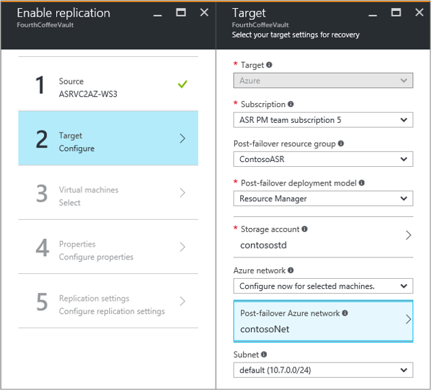

	

## Configure replication settings

1. To create a new replication policy, click **Prepare infrastructure** > **Replication Settings** > **+Create and associate**.

    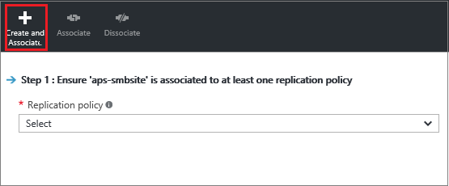
2. In **Create and associate policy**, specify a policy name.
3. In **Copy frequency**, specify how often you want to replicate delta data after the initial replication (every 30 seconds, 5 or 15 minutes).

	> [!NOTE]
	> A 30 second frequency isn't supported when replicating to premium storage. The limitation is determined by the number of snapshots per blob (100) supported by premium storage. [Learn more](../storage/storage-premium-storage.md#snapshots-and-copy-blob).

4. In **Recovery point retention**, specify in hours how long the retention window is for each recovery point. VMs can be recovered to any point within a window.
5. In **App-consistent snapshot frequency**, specify how frequently (1-12 hours) recovery points containing application-consistent snapshots are created.

    - Hyper-V uses two types of snapshots — a standard snapshot that provides an incremental snapshot of the entire virtual machine, and an application-consistent snapshot that takes a point-in-time snapshot of the application data inside the virtual machine.
    - Application-consistent snapshots use Volume Shadow Copy Service (VSS) to ensure that applications are in a consistent state when the snapshot is taken.
    - If you enable application-consistent snapshots, it will affect the performance of applications running on source virtual machines. Ensure that the value you set is less than the number of additional recovery points you configure.

6. In **Initial replication start time**, specify when to start the initial replication. The replication occurs over your internet bandwidth so you might want to schedule it outside your busy hours. Then click **OK**.

    

When you create a new policy, it's automatically associated with the Hyper-V site. You can associate a Hyper-V site (and the VMs in it) with multiple replication policies in **Replication** > policy-name > **Associate Hyper-V Site**.

## Capacity planning

Now that you have your basic infrastructure set up, you can think about capacity planning, and figure out whether you need additional resources.

Site Recovery provides a capacity planner to help you allocate the right resources for compute, networking, and storage. You can run the planner in quick mode for estimations based on an average number of VMs, disks, and storage, or in detailed mode with customized numbers at the workload level. Before you start you need to:

* Gather information about your replication environment, including VMs, disks per VMs, and storage per disk.
* Estimate the daily change (churn) rate for your replicated data. You can use the [Capacity Planner for Hyper-V Replica](https://www.microsoft.com/download/details.aspx?id=39057) to help you do this.

1. Click **Download** to download the tool, and then run it. [Read the article](site-recovery-capacity-planner.md) that accompanies the tool.
2. When you’re done, select **Yes** in **Have you run the Capacity Planner**?

   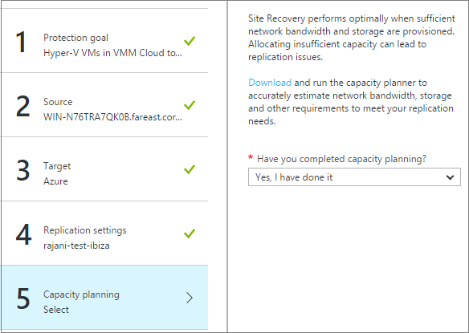

Learn more about [controlling network bandwidth](#network-bandwidth-considerations)

## Enable replication

Enable replication for VMs as follows:          

1. Click **Replicate application** > **Source**. After you've set up replication for the first time, you can click **+Replicate** to enable replication for additional machines.

    
2. In **Source**, select the Hyper-V site. Then click **OK**.
3. In **Target**, select the vault subscription, and the failover model you want to use in Azure (classic or resource management) after failover.
4. Select the storage account you want to use. If you don't have an account you want to use, you can [create one](#set-up-an-azure-storage-account). Then click **OK**.
5. Select the Azure network and subnet to which Azure VMs will connect when they're created failover.

    - To apply the network settings to all machines you enable for replication, select **Configure now for selected machines**.
    - Select **Configure later** to select the Azure network per machine.
    - If you don't have a network you want to use, you can [create one](#set-up-an-azure-network). Select a subnet if applicable. Then click **OK**.

   

6. In **Virtual Machines** > **Select virtual machines**, click and select each machine you want to replicate. You can only select machines for which replication can be enabled. Then click **OK**.

    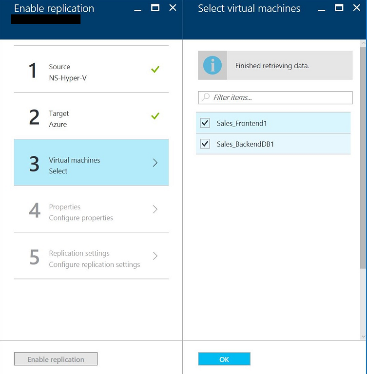

7. In **Properties** > **Configure properties**, select the operating system for the selected VMs, and the OS disk.
8. Verify that the Azure VM name (target name) complies with [Azure virtual machine requirements](site-recovery-support-matrix-to-azure.md#failed-over-azure-vm-requirements).
9. By default all the disks of the VM are selected for replication, but you can clear disks to exclude them.
	- You might want to exclude disks to reduce replication bandwidth. For example, you might not want to replicate disks with temporary data, or data that's refreshed each time a machine or apps restarts (such as pagefile.sys or Microsoft SQL Server tempdb). You can exclude the disk from replication by unselecting the disk.
	- Only basic disks can be exclude. You can't exclude OS disks.
	- We recommend that you don't exclude dynamic disks. Site Recovery can't identify whether a virtual hard disk inside a guest VM is basic or dynamic. If all dependent dynamic volume disks aren't excluded, the protected dynamic disk will show as a failed disk when the VM fails over, and the data on that disk won't be accessible.
        - After replication is enabled, you can't add or remove disks for replication. If you want to add or exclude a disk, you need to disable protection for the VM, and then re-enable it.
        - Disks you create manually in Azure aren't failed back. For example, if you fail over three disks, and create two directly in Azure VM, only the three disks which were failed over will be failed back from Azure to Hyper-V. You can't include disks created manually in failback, or in reverse replication from Hyper-V to Azure.
        - If you exclude a disk that's needed for an application to operate, after failover to Azure you need to create it manually in Azure, so that the replicated application can run. Alternatively, you could integrate Azure automation into a recovery plan, to create the disk during failover of the machine.

10. Click **OK** to save changes. You can set additional properties later.

 	

11. In **Replication settings** > **Configure replication settings**, select the replication policy you want to apply for the protected VMs. Then click **OK**. You can modify the replication policy in **Replication policies** > policy-name > **Edit Settings**. Changes you apply will be used for machines that are already replicating, and new machines.

   

You can track progress of the **Enable Protection** job in **Jobs** > **Site Recovery jobs**. After the **Finalize Protection** job runs the machine is ready for failover.

### View and manage VM properties

We recommend that you verify the properties of the source machine.

1. In **Protected Items**, click **Replicated Items**, and select the machine.

    
2. In **Properties**, you can view replication and failover information for the VM.

    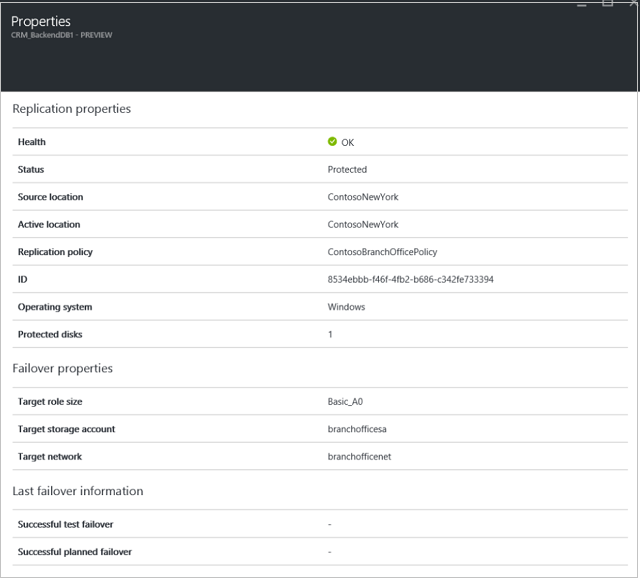
3. In **Compute and Network** > **Compute properties**, you can specify the Azure VM name and target size. Modify the name to comply with Azure requirements if you need to. You can also view and modify information about the target network, subnet, and IP address that will be assigned to the Azure VM. Note the following:

   * You can set the target IP address. If you don't provide an address, the failed over machine will use DHCP. If you set an address that isn't available at failover, the failover will fail. The same target IP address can be used for test failover if the address is available in the test failover network.
   * The number of network adapters is dictated by the size you specify for the target virtual machine, as follows:

     * If the number of network adapters on the source machine is less than or equal to the number of adapters allowed for the target machine size, then the target will have the same number of adapters as the source.
     * If the number of adapters for the source virtual machine exceeds the number allowed for the target size then the target size maximum will be used.
     * For example if a source machine has two network adapters and the target machine size supports four, the target machine will have two adapters. If the source machine has two adapters but the supported target size only supports one then the target machine will have only one adapter.     
     * If the VM has multiple network adapters they will all connect to the same network.
     * If the virtual machine has multiple network adapters then the first one shown in the list becomes the *Default* network adapter in the Azure virtual machine.

     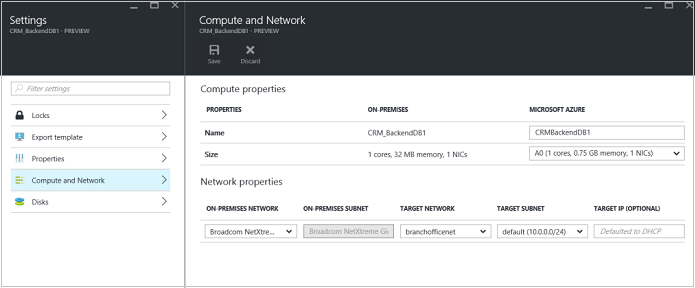

4. In **Disks**, you can see the operating system and data disks on the VM that will be replicated.

## Test the deployment

To test the deployment you can run a test failover for a single virtual machine or a recovery plan that contains one or more virtual machines.

### Before you start

 - If you want to connect to Azure VMs using RDP after failover, learn about [preparing to connect](site-recovery-test-failover-to-azure.md#prepare-to-connect-to-azure-vms-after-failover).
 - To fully test you need to copy of Active Directory and DNS in your test environment. [Learn more](site-recovery-active-directory.md#test-failover-considerations).

### Run a test failover

1. To fail over a single machine, in **Replicated Items**, click the VM > **+Test Failover** icon.
2. To fail over a recovery plan, in **Recovery Plans**, right-click the plan > **Test Failover**. To create a recovery plan, [follow these instructions](site-recovery-create-recovery-plans.md).
3. In **Test Failover**, select the Azure network to which Azure VMs will be connected after failover occurs.
4. Click **OK** to begin the failover. You can track progress by clicking on the VM to open its properties, or on the **Test Failover** job in vault name > **Jobs** > **Site Recovery jobs**.
5. After the failover completes, you should also be able to see the replica Azure machine appear in the Azure portal > **Virtual Machines**. You should make sure that the VM is the appropriate size, that it's connected to the appropriate network, and that it's running.
6. If you prepared for connections after failover, you should be able to connect to the Azure VM.
7. Once you're done, click on **Cleanup test failover** on the recovery plan. In **Notes** record and save any observations associated with the test failover. This will delete the virtual machines that were created during test failover.

For more details, read the [Test failover to Azure](site-recovery-test-failover-to-azure.md) article.

## Monitor the deployment

Monitor the configuration settings, status, and health for your Site Recovery deployment:

1. Click on the vault name to access the **Essentials** dashboard. In this dashboard you can track Site Recovery jobs, replication status, recovery plans, server health, and events.  

    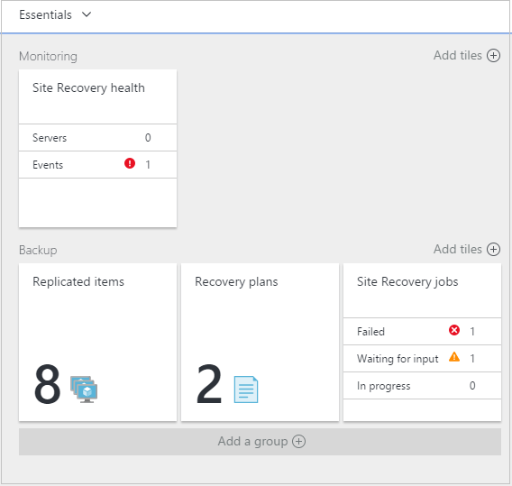
2. In the **Health** tile you can monitor site servers that are experiencing issue, and the events raised by Site Recovery in the last 24 hours. You can customize Essentials to show the tiles and layouts that are most useful to you, including the status of other Site Recovery and Backup vaults.
3. You can manage and monitor replication in the **Replicated Items**, **Recovery Plans**, and **Site Recovery Jobs** tiles. You can drill into jobs for more details in **Jobs** > **Site Recovery Jobs**.

## Command-line Provider and agent installation

The Azure Site Recovery Provider and agent can also be installed using the following command line. This method can be used to install the provider on a Server Core for Windows Server 2012 R2.

1. Download the Provider installation file and registration key to a folder. For example C:\ASR.
2. From an elevated command prompt, run these commands to extract the Provider installer:

            C:\Windows\System32> CD C:\ASR
            C:\ASR> AzureSiteRecoveryProvider.exe /x:. /q
3. Run this command to install the components:

            C:\ASR> setupdr.exe /i
4. Then run these commands to register the server in the vault:

            CD C:\Program Files\Microsoft Azure Site Recovery Provider\
            C:\Program Files\Microsoft Azure Site Recovery Provider\> DRConfigurator.exe /r  /Friendlyname <friendly name of the server> /Credentials <path of the credentials file>

 
Where:

* **/Credentials**: Mandatory parameter that specifies the location in which the registration key file is located  
* **/FriendlyName**: Mandatory parameter for the name of the Hyper-V host server that appears in the Azure Site Recovery portal.
* **/proxyAddress**: Optional parameter that specifies the address of the proxy server.
* **/proxyport** : Optional parameter that specifies the port of the proxy server.
* **/proxyUsername**: Optional parameter that specifies the Proxy user name (if proxy requires authentication).
* **/proxyPassword**: Optional parameter that specifies the Password for authenticating with the proxy server (if proxy requires authentication).

## Network bandwidth considerations
You can use the [Hyper-V capacity planner tool](site-recovery-capacity-planner.md) to calculate the bandwidth you need for replication (initial replication and then delta). To control the amount of bandwidth use for replication you have a few options:

* **Throttle bandwidth**: Hyper-V traffic that replicates to Azure goes through a specific Hyper-V host. You can throttle bandwidth on the host server.
* **Tweak bandwidth**: You can influence the bandwidth used for replication using a couple of registry keys.

### Throttle bandwidth
1. Open the Microsoft Azure Backup MMC snap-in on the Hyper-V host server. By default a shortcut for Microsoft Azure Backup is available on the desktop or in C:\Program Files\Microsoft Azure Recovery Services Agent\bin\wabadmin.
2. In the snap-in click **Change Properties**.
3. On the **Throttling** tab select **Enable internet bandwidth usage throttling for backup operations**, and set the limits for work and non-work hours. Valid ranges are from 512 Kbps to 102 Mbps per second.

    

You can also use the [Set-OBMachineSetting](https://technet.microsoft.com/library/hh770409.aspx) cmdlet to set throttling. Here's a sample:

    $mon = [System.DayOfWeek]::Monday
    $tue = [System.DayOfWeek]::Tuesday
    Set-OBMachineSetting -WorkDay $mon, $tue -StartWorkHour "9:00:00" -EndWorkHour "18:00:00" -WorkHourBandwidth  (512*1024) -NonWorkHourBandwidth (2048*1024)

**Set-OBMachineSetting -NoThrottle** indicates that no throttling is required.

### Influence network bandwidth
1. In the registry navigate to **HKEY_LOCAL_MACHINE\SOFTWARE\Microsoft\Windows Azure Backup\Replication**.
   * To influence the bandwidth traffic on a replicating disk, modify the value the **UploadThreadsPerVM**, or create the key if it doesn't exist.
   * To influence the bandwidth for failback traffic from Azure, modify the value **DownloadThreadsPerVM**.
2. The default value is 4. In an “overprovisioned” network, these registry keys should be changed from the default values. The maximum is 32. Monitor traffic to optimize the value.

## Next steps

After initial replication is complete, and you've tested the deployment, you can invoke failovers as the need arises. [Learn more](site-recovery-failover.md) about different types of failovers and how to run them.
