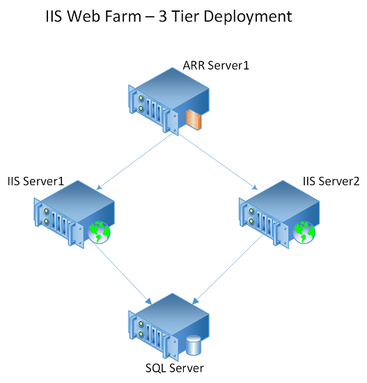
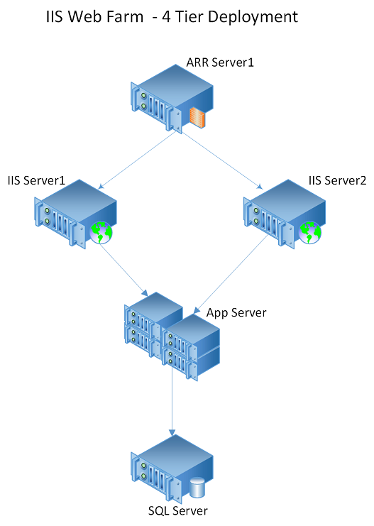
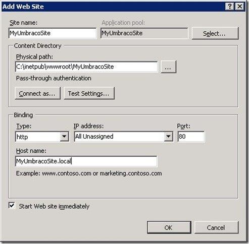

# Set up disaster recovery for a multi-tier IIS-based web application

Application software is the engine of business productivity in an organization. Various web applications can serve different purposes in an organization. Some applications, like applications used for payroll processing, financial applications, and customer-facing websites, might be critical to an organization. To prevent loss of productivity, it's important for the organization to have these applications continuously up and running. More importantly, having these applications consistently available can help prevent damage to the brand or image of the organization.

Critical web applications are typically set up as multi-tier applications: the web, database, and application are on different tiers. In addition to being spread across various tiers, the applications might also use multiple servers in each tier to load balance the traffic. Moreover, the mappings between various tiers and on the web server might be based on static IP addresses. On failover, some of these mappings need to be updated, especially if multiple websites are configured on the web server. If web applications use TLS, you must update certificate bindings.

Traditional recovery methods that aren't based on replication involve backing up various configuration files, registry settings, bindings, custom components (COM or .NET), content, and certificates. Files are recovered through a set of manual steps. The traditional recovery methods of backing up and manually recovering files are cumbersome, error-prone, and not scalable. For example, you might easily forget to back up certificates. After failover, you're left with no choice but to buy new certificates for the server.

A good disaster recovery solution supports modeling recovery plans for complex application architectures. You should also be able to add customized steps to the recovery plan to handle application mappings between tiers. If there is a disaster, application mappings provide a single-click, sure-shot solution that helps lead to a lower RTO.

This article describes how to protect a web application that's based on Internet Information Services (IIS)  by using [Azure Site Recovery](site-recovery-overview.md). The article covers best practices for replicating a three-tier, IIS-based web application to Azure, how to do a disaster recovery drill, and how to fail over the application to Azure.

## Prerequisites

Before you begin, ensure that you know how to do the following tasks:

* [Replicate a virtual machine to Azure](vmware-azure-tutorial.md)
* [Design a recovery network](./concepts-on-premises-to-azure-networking.md)
* [Do a test failover to Azure](site-recovery-test-failover-to-azure.md)
* [Do a failover to Azure](site-recovery-failover.md)
* [Replicate a domain controller](site-recovery-active-directory.md)
* [Replicate SQL Server](site-recovery-sql.md)

## Deployment patterns
An IIS-based web application typically follows one of the following deployment patterns:

**Deployment pattern 1**

An IIS-based web farm with Application Request Routing (ARR), an IIS server, and SQL Server.



**Deployment pattern 2**

An IIS-based web farm with ARR, an IIS server, an application server, and SQL Server.



## Site Recovery support

For the examples in this article, we use VMware virtual machines with IIS 7.5 on Windows Server 2012 R2 Enterprise. Because Site Recovery replication isn't application-specific, the recommendations in this article are expected to apply in the scenarios listed in the following table, and for different versions of IIS.

### Source and target

Scenario | To a secondary site | To Azure
--- | --- | ---
Hyper-V | Yes | Yes
VMware | Yes | Yes
Physical server | No | Yes
Azure|NA|Yes

## Replicate virtual machines

To start replicating all the IIS web farm virtual machines to Azure, follow the guidance in [Test failover to Azure in Site Recovery](site-recovery-test-failover-to-azure.md).

If you are using a static IP address, you can specify the IP address that you want the virtual machine to take. To set the IP address, go to  **Network settings** > **TARGET IP**.


## Create a recovery plan
A recovery plan supports the sequencing of various tiers in a multi-tier application during a failover. Sequencing helps maintain application consistency. When you create a recovery plan for a multi-tier web application, complete the steps described in [Create a recovery plan by using Site Recovery](site-recovery-create-recovery-plans.md).

### Add virtual machines to failover groups
A typical multi-tier IIS web application consists of the following components:
* A database tier that has SQL virtual machines.
* The web tier, which consists of an IIS server and an application tier. 

Add virtual machines to different groups based on the tier:

1. Create a recovery plan. Add the database tier virtual machines under Group 1. This ensures that database tier virtual machines are shut down last and brought up first.
1. Add the application tier virtual machines under Group 2. This ensures that application tier virtual machines are brought up after the database tier has been brought up.
1. Add the web tier virtual machines in Group 3. This ensures that web tier virtual machines are brought up after the application tier has been brought up.
1. Add load balance virtual machines in Group 4. This ensures that load balance virtual machines are brought up after the web tier has been brought up.

For more information, see [Customize the recovery plan](site-recovery-runbook-automation.md#customize-the-recovery-plan).


### Add a script to the recovery plan
For the IIS web farm to function correctly, you might need to do some operations on the Azure virtual machines post-failover or during a test failover. You can automate some post-failover operations. For example, you can update the DNS entry, change a site binding, or change a connection string by adding corresponding scripts to the recovery plan. [Add a VMM script to a recovery plan](./hyper-v-vmm-recovery-script.md) describes how to set up automated tasks by using a script.

#### DNS update
If DNS is configured for dynamic DNS update, virtual machines usually update the DNS with the new IP address when they start. If you want to add an explicit step to update DNS with the new IP addresses of the virtual machines, add a [script to update IP in DNS](https://raw.githubusercontent.com/Azure/azure-quickstart-templates/master/demos/asr-automation-recovery/scripts/ASR-DNS-UpdateIP.ps1) as a post-failover action on recovery plan groups.  

#### Connection string in an application’s web.config
The connection string specifies the database that the website communicates with. If the connection string carries the name of the database virtual machine, no further steps are needed post-failover. The application can automatically communicate with the database. Also, if the IP address for the database virtual machine is retained, it doesn't be need to update the connection string. 

If the connection string refers to the database virtual machine by using an IP address, it needs to be updated post-failover. For example, the following connection string points to the database with the IP address 127.0.1.2:

```xml
<?xml version="1.0" encoding="utf-8"?>
<configuration>
<connectionStrings>
<add name="ConnStringDb1" connectionString="Data Source= 127.0.1.2\SqlExpress; Initial Catalog=TestDB1;Integrated Security=False;" />
</connectionStrings>
</configuration>
```

To update the connection string in the web tier, add an [IIS connection update script](https://gallery.technet.microsoft.com/Update-IIS-connection-2579aadc) after Group 3 in the recovery plan.

#### Site bindings for the application
Every site consists of binding information. The binding information includes the type of binding, the IP address at which the IIS server listens to the requests for the site, the port number, and the host names for the site. During the failover, you might need to update these bindings if there's a change in the IP address that's associated with them.

> [!NOTE]
>
> If you set the site binding to **All unassigned**, you don't need to update this binding post-failover. Also, if the IP address associated with a site isn't changed post-failover, you don't need to update the site binding. (The retention of the IP address depends on the network architecture and subnets assigned to the primary and recovery sites. Updating them might not be feasible for your organization.)



If you associated the IP address with a site, update all site bindings with the new IP address. To change the site bindings, add an [IIS web tier update script](/samples/browse/?redirectedfrom=TechNet-Gallery) after Group 3 in the recovery plan.

#### Update the load balancer IP address
If you have an ARR virtual machine, to update the IP address, add an [IIS ARR  failover script](/samples/browse/?redirectedfrom=TechNet-Gallery) after Group 4.

#### TLS/SSL certificate binding for an HTTPS connection
A website might have an associated TLS/SSL certificate that helps ensure a secure communication between the web server and the user’s browser. If the website has an HTTPS connection, and also has an associated HTTPS site binding to the IP address of the IIS server with a TLS/SSL certificate binding, you must add a new site binding  for the certificate with the IP address of the IIS virtual machine post-failover.

The TLS/SSL certificate can be issued against these components:

* The fully qualified domain name of the website.
* The name of the server.
* A wildcard certificate for the domain name.  
* An IP address. If the TLS/SSL certificate is issued against the IP address of the IIS server, another TLS/SSL certificate needs to be issued against the IP address of the IIS server on the Azure site. An additional TLS binding for this certificate needs to be created. Because of this, we recommend not using a TLS/SSL certificate issued against the IP address. This option is less widely used and will soon be deprecated in accordance with new certificate authority/browser forum changes.

#### Update the dependency between the web tier and the application tier
If you have an application-specific dependency that's based on the IP address of the virtual machines, you must update this dependency post-failover.

## Run a test failover

1. In the Azure portal, select your Recovery Services vault.
2. Select the recovery plan that you created for the IIS web farm.
3. Select **Test Failover**.
4. To start the test failover process, select the recovery point and the Azure virtual network.
5. When the secondary environment is up, you can perform validations.
6. When validations are complete, to clean the test failover environment, select **Validations complete**.

For more information, see [Test failover to Azure in Site Recovery](site-recovery-test-failover-to-azure.md).

## Run a failover

1. In the Azure portal, select your Recovery Services vault.
1. Select the recovery plan that you created for the IIS web farm.
1. Select **Failover**.
1. To start the failover process, select the recovery point.

For more information, see [Failover in Site Recovery](site-recovery-failover.md).

## Next steps
* Learn more about [replicating other applications](site-recovery-workload.md) by using Site Recovery.
