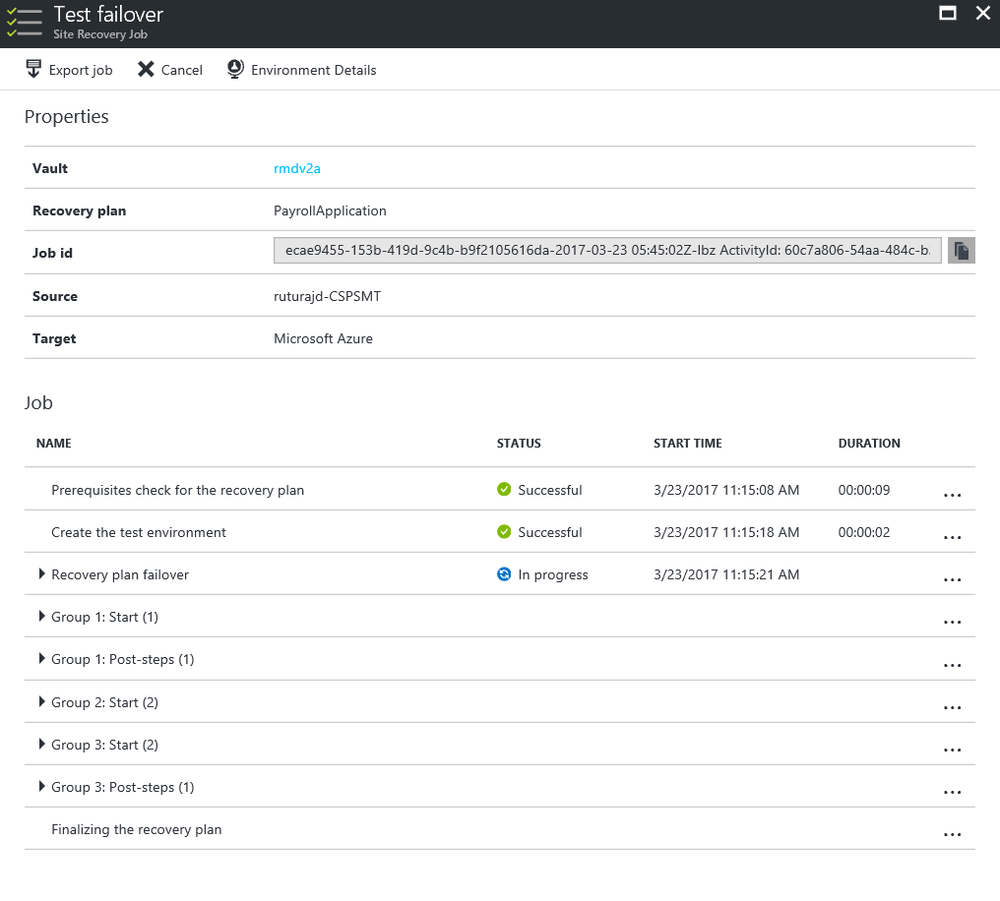

# Replicate a multi-tier IIS based web application using Azure Site Recovery

## Overview

Application software is the engine of business productivity in an organization. Various web applications can serve different purposes in an organization. Some of these like payroll processing, financial applications and customer facing websites can be utmost critical for an organization. It will be important for the organization to have them up and running at all times to prevent loss of productivity and more importantly prevent any damage to the brand image of the organization.

Critical web applications are typically set up as multi-tier applications with the web, database and application on different tiers. Apart from being spread across various tiers, the applications may also be using multiple servers in each tier to load balance the traffic. Moreover, the mappings between various tiers and on the web server may be based on static IP addresses. On failover, some of these mappings will need to be updated, especially, if you have multiple websites configured on the web server. In case of web applications using SSL, certificate bindings will need to be updated.

Traditional non-replication based recovery methods involve backing up of various configuration files, registry settings, bindings, custom components (COM or .NET), content and also certificates and recovering the files through a set of manual steps. These techniques are clearly cumbersome, error prone and not scalable. It is, for example, easily possible for you to forget backing up certificates and be left with no choice but to buy new certificates for the server after failover.

A good disaster recovery solution, should allow modeling of recovery plans around the above complex application architectures and also have the ability to add customized steps to handle application mappings between various tiers hence providing a single-click sure shot solution in the event of a disaster leading to a lower RTO.

This article describes how to protect an IIS based web application using a [Azure Site Recovery](site-recovery-overview.md). This article will cover best practices for replicating a three tier IIS based web application to Azure, how you can do a disaster recovery drill, and how you can failover the application to Azure. 

 
## Prerequisites

Before you start, make sure you understand the following:

1. [Replicating a virtual machine to Azure](site-recovery-vmware-to-azure.md)
1. How to [design a recovery network](site-recovery-network-design.md)
1. [Doing a test failover to Azure](site-recovery-test-failover-azure.md)
1. [Doing a failover to Azure](site-recovery-failover.md)
1. How to [replicate a domain controller](site-recovery-active-directory.md)
1. How to [replicate SQL Server](site-recovery-sql.md)

## Deployment patterns

An IIS based web application typically follows one of the following deployment patterns:

* **Deployment pattern 1**
* **Deployment pattern 2**

## Site Recovery support

For the purpose of creating this article VMware virtual machines with IIS Server version 8.0 on Windows Server 2012 R2 Enterprise were used. As site recovery replication is application agnostic, the recommendations provided here are expected to hold on following scenarios as well. 

### Source and target

**Scenario** | **To a secondary site** | **To Azure**
--- | --- | ---
**Hyper-V** | Yes | Yes
**VMware** | Yes | Yes
**Physical server** | Yes | Yes

### IIS Versions
These IIS Server versions are supported, for the supported scenarios:

* IIS 7.0
* IIS 7.5 
* IIS 8.0

### Things to keep in mind

If you are using a shared disk based cluster as the middle tier in your application then you will not be able to use site recovery replication to replicate those virtual machines. You can use native replication provided by the application and then use a [recovery plan](site-recovery-recovery-plan.md) to failover all tiers. [This section](site-recovery.md#section-link) below covers it in detail.

## Replicating virtual machines

Follow [this guidance](site-recovery-vmware-to-azure.md) to start replicating the virtual machine to Azure. Once the replication is complete, make sure you go to each virtual machine of the front end and [select same availability set](site-recovery-availability-set.md) for each of the virtual machine. 

## Creating a recovery plan

### Adding virtual machines to failover groups

### Adding scripts to the recovery plan

1. If you are using static IP for the virtual machine and you have hard-coded that in your application, you can use this [script](scipt-location.md) to change the site bindings. 

	

1. You can use this [script](scipt-location.md) to update the DNS with the new IPs of the failed over virtual machines.

1. Use this [script](scipt-location.md) to attach a load balance on the failed over virtual machine

## Doing a test failover

Follow [this guidance](site-recovery-test-failover-to-azure.md) to do a test failover. Make sure you do this and that before you start.

## Doing a failover

Follow [this guidance](site-recovery-failover.md) when you are doing a failover. Make sure you do this and that before you start.

## Next steps
You can [learn more](site-recovery-components.md) about replicating a multi-tier IIS based web application in this white paper.
