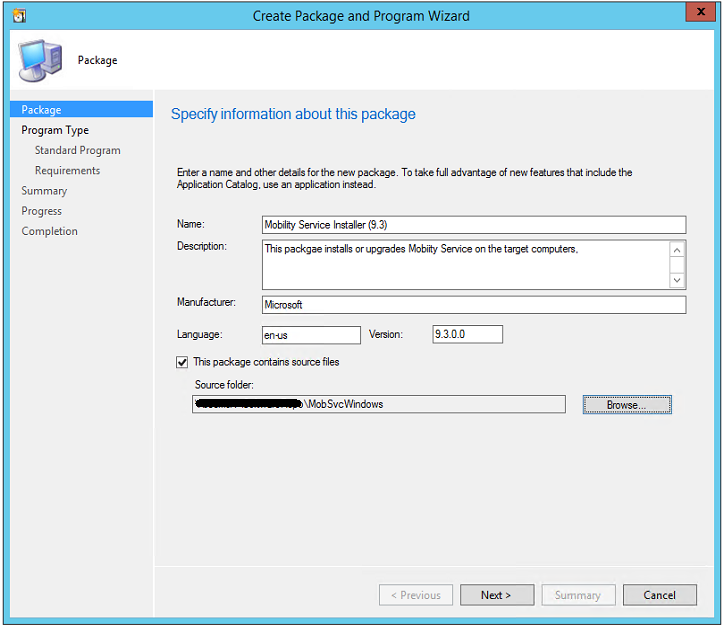
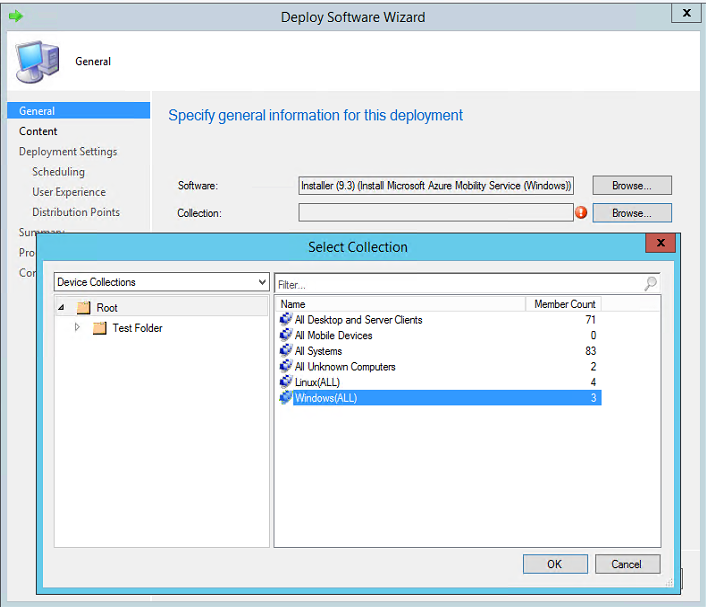

# Automate Mobility Service installation by using software deployment tools

This article provides you an example of how you can use System Center Configuration Manager to deploy the Azure Site Recovery Mobility Service in your datacenter. Using a software deployment tool like Configuration Manager has the following advantages:
* Scheduling deployment of fresh installations and upgrades, during your planned maintenance window for software updates
* Scaling deployment to hundreds of servers simultaneously


> [!NOTE]
> This article uses System Center Configuration Manager 2012 R2 to demonstrate the deployment activity. You could also automate Mobility Service installation by using [Azure Automation and Desired State Configuration](site-recovery-automate-mobility-service-install.md).

## Prerequisites
1. A software deployment tool, like Configuration Manager, that is already deployed in your environment.
  Create two [device collections](https://technet.microsoft.com/library/gg682169.aspx), one for all **Windows servers**, and another for all **Linux servers**, that you want to protect by using Site Recovery.
3. A configuration server that is already registered with Site Recovery.
4. A secure network file share (Server Message Block share) that can be accessed by the Configuration Manager server.

## Deploy Mobility Service on computers running Windows
> [!NOTE]
> This article assumes that the IP address of the configuration server is 192.168.3.121, and that the secure network file share is \\\ContosoSecureFS\MobilityServiceInstallers.

### Step 1: Prepare for deployment
1. Create a folder on the network share, and name it **MobSvcWindows**.
2. Sign in to your configuration server, and open an administrative command prompt.
3. Run the following commands to generate a passphrase file:

    `cd %ProgramData%\ASR\home\svsystems\bin`

    `genpassphrase.exe -v > MobSvc.passphrase`
4. Copy the **MobSvc.passphrase** file into the **MobSvcWindows** folder on your network share.
5. Browse to the installer repository on the configuration server by running the following command:

   `cd %ProgramData%\ASR\home\svsystems\puhsinstallsvc\repository`

6. Copy the **Microsoft-ASR\_UA\_*version*\_Windows\_GA\_*date*\_Release.exe** to the **MobSvcWindows** folder on your network share.
7. Copy the following code, and save it as **install.bat** into the **MobSvcWindows** folder.

   > [!NOTE]
   > Replace the [CSIP] placeholders in this script with the actual values of the IP address of your configuration server.

```
Time /t >> C:\Temp\logfile.log
REM ==================================================
REM ==== Clean up the folders ========================
RMDIR /S /q %temp%\MobSvc
MKDIR %Temp%\MobSvc
REM ==================================================
REM ==== Copy new files ==============================
COPY M*.* %Temp%\MobSvc
CD %Temp%\MobSvc
REN Micro*.exe MobSvcInstaller.exe
REM ==================================================
REM ==== Extract the installer =======================
MobSvcInstaller.exe /q /x:%Temp%\MobSvc\Extracted
REM ==== Wait 10s for extraction to complete =========
TIMEOUT /t 10
REM =================================================
REM ==== Extract the installer ======================
CD %Temp%\MobSvc\Extracted
REM ==================================================
REM ==== Check if Mob Svc is already installed =======
REM ==== If not installed run install command ========
REM ==== Else run upgrade command =====================
REM ==== {275197FC-14FD-4560-A5EB-38217F80CBD1} is ====
REM ==== guid for Mob Svc Installer ====================
whoami >> C:\temp\logfile.log
REM SET PRODKEY=HKEY_LOCAL_MACHINE\SOFTWARE\Microsoft\Windows\CurrentVersion\Uninstall
REM REG QUERY %PRODKEY%\{275197FC-14FD-4560-A5EB-38217F80CBD1} >> C:\Temp\logfile.log 2>&1
REM REG QUERY %PRODKEY%\{275197FC-14FD-4560-A5EB-38217F80CBD1}
REM IF NOT %ERRORLEVEL% EQU 0 (GOTO :INSTALL) ELSE GOTO :UPDATE
NET START | FIND "InMage Scout Application Service"
IF  %ERRORLEVEL% EQU 1 (GOTO :INSTALL) ELSE GOTO :UPDATE
:INSTALL
	echo "Install" >> c:\Temp\logfile.log
 	UnifiedAgent.exe /Role "Agent" /CSEndpoint "10.10.20.168" /PassphraseFilePath %Temp%\MobSvc\MobSvc.passphrase
GOTO :ENDSCRIPT
:UPDATE
	echo "Update" >> C:\Temp\logfile.log
	UnifiedAgent.exe /upgrade
:ENDSCRIPT

```

### Step 2: Create a package

1. Sign in to your Configuration Manager console.
2. Browse to **Software Library** > **Application Management** > **Packages**.
3. Right-click **Packages**, and select **Create Package**.
4. Provide values for the name, description, manufacturer, language, and version.
5. Select the **This package contains source files** check box.
6. Click **Browse**, and select the network share where the installer is stored (\\\ContosoSecureFS\MobilityServiceInstaller\MobSvcWindows).

  

7. On the **Choose the program type that you want to create** page, select **Standard Program**, and click **Next**.

  

8. On the **Specify information about this standard program** page, provide the following inputs, and click **Next**. (The other inputs can use their default values.)
 
  | **Parameter name** | **Value** |
  |--|--|
  | Name | Install Microsoft Azure Mobility Service (Windows) |
  | Command line | install.bat |
  | Program can run | Whether or not a user is logged on |

  

9. On the next page, select the target operating systems. Mobility Service can be installed only on Windows Server 2012 R2, Windows Server 2012, and Windows Server 2008 R2.

   

10. To complete the wizard, click **Next** twice.


> [!NOTE]
> The script supports both new installations of Mobility Service agents and updates to agents that are already installed.

### Step 3: Deploy the package
1. In the Configuration Manager console, right-click your package, and select **Distribute Content**.
  
2. Select the **[distribution points](https://technet.microsoft.com/library/gg712321.aspx#BKMK_PlanForDistributionPoints)** on to which the packages should be copied.
3. Complete the wizard. The package then starts replicating to the specified distribution points.
4. After the package distribution is done, right-click the package, and select **Deploy**.
  
5. Select the Windows Server device collection you created in the prerequisites section as the target collection for deployment.

  

6. On the **Specify the content destination** page, select your **Distribution Points**.
7. On the **Specify settings to control how this software is deployed** page, ensure that the purpose is **Required**.

  

8. On the **Specify the schedule for this deployment** page, specify a schedule. For more information, see [scheduling packages](https://technet.microsoft.com/library/gg682178.aspx).
9. On the **Distribution Points** page, configure the properties according to the needs of your datacenter. Then complete the wizard.

> [!TIP]
> To avoid unnecessary reboots, schedule the package installation during your monthly maintenance window or software updates window.

You can monitor the deployment progress by using the Configuration Manager console. Go to **Monitoring** > **Deployments** > *[your package name]*.

  

## Deploy Mobility Service on computers running Linux
> [!NOTE]
> This article assumes that the IP address of the configuration server is 192.168.3.121, and that the secure network file share is \\\ContosoSecureFS\MobilityServiceInstallers.

### Step 1: Prepare for deployment
1. Create a folder on the network share, and name it as **MobSvcLinux**.
2. Sign in to your configuration server, and open an administrative command prompt.
3. Run the following commands to generate a passphrase file:

    `cd %ProgramData%\ASR\home\svsystems\bin`

    `genpassphrase.exe -v > MobSvc.passphrase`
4. Copy the **MobSvc.passphrase** file into the **MobSvcLinux** folder on your network share.
5. Browse to the installer repository on the configuration server by running the command:

   `cd %ProgramData%\ASR\home\svsystems\puhsinstallsvc\repository`

6. Copy the following files to the **MobSvcLinux** folder on your network share:
   * Microsoft-ASR\_UA\_*version*\_OEL-64\_GA\_*date*\_Release.tar.gz
   * Microsoft-ASR\_UA\_*version*\_RHEL6-64\_GA\_*date*\_Release.tar.gz
   * Microsoft-ASR\_UA\_*version*\_RHEL7-64\_GA\_*date*\_Release.tar.gz
   * Microsoft-ASR\_UA\_*version*\_SLES11-SP3-64\_GA\_*date*\_Release.tar.gz

7. Copy the following code, and save it as **install_linux.sh** into the **MobSvcLinux** folder.
   > [!NOTE]
   > Replace the [CSIP] placeholders in this script with the actual values of the IP address of your configuration server.

```
#!/bin/sh

rm -rf /tmp/MobSvc

mkdir -p /tmp/MobSvc

if [ -f /etc/oracle-release ] && [ -f /etc/redhat-release ]; then
    if grep -q 'Oracle Linux Server release 6.*' /etc/oracle-release; then
        if uname -a | grep -q x86_64; then
            OS="OL6-64"
	    cp *OL6*.tar.gz /tmp/MobSvc
        fi
    fi
elif [ -f /etc/redhat-release ]; then
    if grep -q 'Red Hat Enterprise Linux Server release 6.* (Santiago)' /etc/redhat-release || \
        grep -q 'CentOS Linux release 6.* (Final)' /etc/redhat-release || \
        grep -q 'CentOS release 6.* (Final)' /etc/redhat-release; then
        if uname -a | grep -q x86_64; then
            OS="RHEL6-64"
            cp *RHEL6*.tar.gz /tmp/MobSvc
        fi
    elif grep -q 'Red Hat Enterprise Linux Server release 7.* (Maipo)' /etc/redhat-release || \
        grep -q 'CentOS Linux release 7.* (Core)' /etc/redhat-release; then
        if uname -a | grep -q x86_64; then
            OS="RHEL7-64"
            cp *RHEL7*.tar.gz /tmp/MobSvc
	fi
    fi
elif [ -f /etc/SuSE-release ] && grep -q 'VERSION = 11' /etc/SuSE-release; then
    if grep -q "SUSE Linux Enterprise Server 11" /etc/SuSE-release && grep -q 'PATCHLEVEL = 3' /etc/SuSE-release; then
        if uname -a | grep -q x86_64; then
            OS="SLES11-SP3-64"
	    echo $OS >> /tmp/MobSvc/sccm.log
	    cp *SLES11*.tar.gz /tmp/MobSvc
        fi
    fi
elif [ -f /etc/lsb-release ] ; then
    if grep -q 'DISTRIB_RELEASE=14.04' /etc/lsb-release ; then
       if uname -a | grep -q x86_64; then
           OS="UBUNTU-14.04-64"
	   cp *UBUNTU*.tar.gz /tmp/MobSvc
       fi
    fi
else
	exit 1
fi
if [ "${OS}" ==  "" ]; then
	exit 1
fi
cp MobSvc.passphrase /tmp/MobSvc
cd /tmp/MobSvc

tar -zxvf *.tar.gz


if [ -e /usr/local/.vx_version ];
then
	./install -A u
	echo "Errorcode:$?"
	Error=$?

else
	./install -t both -a host -R Agent -d /usr/local/ASR -i [CS IP] -p 443 -s y -c https -P MobSvc.passphrase >> /tmp/MobSvc/sccm.log 2>&1 && echo "Install Progress"
	Error=$?
fi
cd /tmp
rm -rf /tm/MobSvc
exit ${Error}
```

### Step 2: Create a package

1. Sign in  to your Configuration Manager console.
2. Browse to **Software Library** > **Application Management** > **Packages**.
3. Right-click **Packages**, and select **Create Package**.
4. Provide values for the name, description, manufacturer, language, and version.
5. Select the **This package contains source files** check box.
6. Click **Browse**, and select the network share where the installer is stored (\\\ContosoSecureFS\MobilityServiceInstaller\MobSvcLinux).

  

7. On the **Choose the program type that you want to create** page, select **Standard Program**, and click **Next**.

  

8. On the **Specify information about this standard program** page, provide the following inputs, and click **Next**. (The other inputs can use their default values.)

    | **Parameter name** | **Value** |
  |--|--|
  | Name | Install Microsoft Azure Mobility Service (Linux) |
  | Command line | ./install_linux.sh |
  | Program can run | Whether or not a user is logged on |

  

9. On the next page, select **This program can run on any platform**.
  

10. To complete the wizard, click **Next** twice. 
 
> [!NOTE]
> The script supports both new installations of Mobility Service agents and updates to agents that are already installed.

### Step 3: Deploy the package
1. In the Configuration Manager console, right-click your package, and select **Distribute Content**.
  
2. Select the **[distribution points](https://technet.microsoft.com/library/gg712321.aspx#BKMK_PlanForDistributionPoints)** on to which the packages should be copied.
3. Complete the wizard. The package then starts replicating to the specified distribution points.
4. After the package distribution is done, right-click the package, and select **Deploy**.
  
5. Select the Linux Server device collection you created in the prerequisites section as the target collection for deployment.

  

6. On the **Specify the content destination** page, select your **Distribution Points**.
7. On the **Specify settings to control how this software is deployed** page, ensure that the purpose is **Required**.

  

8. On the **Specify the schedule for this deployment** page, specify a schedule. For more information, see [scheduling packages](https://technet.microsoft.com/library/gg682178.aspx).
9. On the **Distribution Points** page, configure the properties according to the needs of your datacenter. Then complete the wizard.

Mobility Service gets installed on the Linux Server Device Collection, according to the schedule you configured.

## Other methods to install Mobility Service
Here are some other options for installing Mobility Service:
* [Manual Installation using GUI](http://aka.ms/mobsvcmanualinstall)
* [Manual Installation using command-line](http://aka.ms/mobsvcmanualinstallcli)
* [Push Installation using configuration server ](http://aka.ms/pushinstall)
* [Automated Installation using Azure Automation & Desired State Configuration ](http://aka.ms/mobsvcdscinstall)

## Uninstall Mobility Service
You can create Configuration Manager packages to uninstall Mobility Service. Use the following script to do so:

```
Time /t >> C:\logfile.log
REM ==================================================
REM ==== Check if Mob Svc is already installed =======
REM ==== If not installed no operation required ========
REM ==== Else run uninstall command =====================
REM ==== {275197FC-14FD-4560-A5EB-38217F80CBD1} is ====
REM ==== guid for Mob Svc Installer ====================
whoami >> C:\logfile.log
NET START | FIND "InMage Scout Application Service"
IF  %ERRORLEVEL% EQU 1 (GOTO :INSTALL) ELSE GOTO :UNINSTALL
:NOOPERATION
                echo "No Operation Required." >> c:\logfile.log
                GOTO :ENDSCRIPT
:UNINSTALL
                echo "Uninstall" >> C:\logfile.log
                MsiExec.exe /qn /x {275197FC-14FD-4560-A5EB-38217F80CBD1} /L+*V "C:\ProgramData\ASRSetupLogs\UnifiedAgentMSIUninstall.log"
:ENDSCRIPT

```

## Next steps
You are now ready to [enable protection](https://docs.microsoft.com/en-us/azure/site-recovery/site-recovery-vmware-to-azure#step-6-replicate-applications) for your virtual machines.
